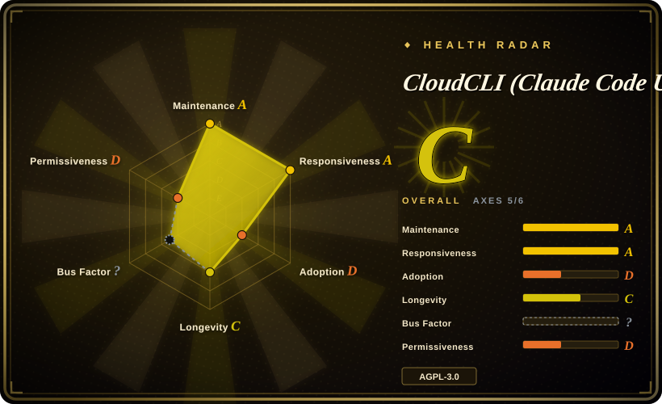

# CloudCLI (Claude Code UI)

An AGPL-licensed self-hosted web + mobile console (npm package `@cloudcli-ai/cloudcli`, formerly branded "Claude Code UI") for driving the CLI coding agents installed on your machine — Claude Code, Codex, and Cursor CLI, with newer provider wiring by ACP — from any device: live sessions, project/file browsing, in-browser editor, terminal, and git diff surfaces.

## When to use

You're an engineer whose main agent is Anthropic's Claude Code (or OpenAI's Codex / Cursor CLI), you run it on a workstation or home server, and you want to check on a long task from your phone, review its pending file changes, or send a follow-up message without returning to that terminal. You reach for CloudCLI because it is *the* maintained open-source web surface for that CLI family: it fronts the locally-installed, locally-authenticated agent processes rather than re-implementing them, so sessions/projects map 1:1 to what the CLI itself stores. Against [Hermes Workspace](hermes-workspace.md) the decision is simply which brain you run — Hermes Workspace's enhanced panes only light up for Nous's hermes-agent gateway/dashboard; against [Agent Orchestrator](agent-orchestrator.md) you'd be choosing a desktop worktree supervisor for *parallel heterogeneous* agents instead of a remote browser console for *your own* agent sessions; against [Open WebUI](../llm-chat-ui/open-webui.md)/[LibreChat](../llm-chat-ui/librechat.md) you're choosing actual coding-agent control (files, terminal, git) over model chat.

A plugin system (custom tabs with frontend + optional Node backend, installed from git repos) and an i18n'd responsive UI round out the case for self-hosting it as your personal agent cockpit.

## When NOT to use

- **Your agent brain is hermes-agent.** Use [Hermes Workspace](hermes-workspace.md) — CloudCLI fronts Claude-family CLIs, not the Hermes gateway API contract.
- **You can't carry AGPL-3.0-or-later.** The README itself spells out the network clause: modify it and run it as a network service → you must offer the modified source to that service's users. For embedding into a proprietary offering, the MIT-licensed [Hermes Workspace](hermes-workspace.md) (or plain APIs) is the safer shape — for self-hosted *personal* use this is a non-issue, which is why it still wins the previous bullet's niche.
- **You want a team chat platform.** Multi-user RBAC is not its product shape (see Caveats); pick [LibreChat](../llm-chat-ui/librechat.md) for shared auth/presets or [Open WebUI](../llm-chat-ui/open-webui.md) for a managed chat frontend.
- **You need supervised parallelism across many agents.** For N heterogeneous coding agents with per-worktree isolation and CI/review feedback routing in a GUI, use [Agent Orchestrator](agent-orchestrator.md); CloudCLI is fundamentally "my sessions, remote".
- **The substrate can be pulled.** Its value is fronting vendor CLIs' local state/auth — changes to Claude Code's session format, ToS stance toward wrappers, or Codex/Cursor CLI internals can break or delegitimize panes with no recourse for you. [推断]
- **Open-core gravity.** The repo fronts a commercial companion (cloudcli.ai hosted service; README carries "CloudCLI Cloud" CTAs) — feature roadmap alignment with the paid cloud is not guaranteed to match self-hosters' interests. [推断] from the hosting CTA, not from a stated policy.
- **Treat internet exposure as an advanced move.** The console brokers a terminal and file editor into your real checkout; how authentication is enforced in remote deployments was not verified here [未验证] — run it loopback/VPN (Tailscale) unless you've read the server code yourself.

## Comparison

| Alternative | In index | Our verdict | Tradeoff |
|---|---|---|---|
| [Hermes Workspace](hermes-workspace.md) | ✅ | When the brain on the box is hermes-agent, pick Hermes Workspace (its panes read Hermes gateway/dashboard APIs); when it's Claude Code / Codex / Cursor CLI, pick CloudCLI. | Same product shape (web console + xterm + files over a CLI agent), opposite backends. Hermes Workspace is MIT and adds tmux swarm dispatch; CloudCLI is AGPL, older, releases monthly, and has a plugin ecosystem plus vendor cloud. |
| [Agent Orchestrator](agent-orchestrator.md) | ✅ | Choose Agent Orchestrator when the job is *supervising many concurrent* coding agents with worktree isolation and automated CI/review feedback, on a desktop. | Desktop app + local Go daemon, 23+ agent adapters, worktree lanes. CloudCLI: browser/mobile-first remote console over an agent's existing sessions, with no worktree supervisor model at all. |
| [Open WebUI](../llm-chat-ui/open-webui.md) | ✅ | Choose Open WebUI when you want a model-chat platform (RAG, users, presets) and no coding-agent surface at all. | Open WebUI renders conversations with models; CloudCLI renders *processes* — sessions, terminals, diffs. Overlap is only the browser tab. |
| [LibreChat](../llm-chat-ui/librechat.md) | ✅ | Choose LibreChat when multi-user auth and provider breadth for chat are requirements of a team. | LibreChat: team-grade chat. CloudCLI: personal coding-agent cockpit; remote viewing is not multi-tenancy. |
| Conductor (Mac app) | not indexed (non-repo) | Only if you want a closed commercial macOS mission-control app and won't self-host. | Proprietary SaaS-shaped product; not a repository — noted for landscape completeness. |

## Tech stack

- **Frontend:** React + Vite + Tailwind; CodeMirror 6 editor (multi-language modes + merge/minimap), xterm.js (+webgl/clipboard addons) for terminals, react-router, i18next.
- **Server:** Node/Express with `node-pty` for real PTYs, `ws` WebSocket data plane, `better-sqlite3` local storage. GitHub's classifier shows ~4.4 MB TypeScript vs 0.3 MB JavaScript — TypeScript-dominant mono-repo (`server/` + client).
- **Agent integration:** fronts locally installed Claude Code / Codex / Cursor CLI sessions and their on-disk state; recent `main` activity adds providers via ACP (Kiro CLI, Antigravity appear in open PRs, 2026-09).
- **Distribution:** npm (`@cloudcli-ai/cloudcli`; v1.37.3 tagged 2026-09-08), plus a `cloudcli-local-server` release train and a companion cloudcli.ai hosted product.

## Dependencies

- **One or more supported CLI agents installed and authenticated on the host** (Claude Code / Codex / Cursor CLI) — CloudCLI drives them, it doesn't bundle model access; your model spend stays on the vendor's login you already have.
- **Node.js + npm** to run the server; `better-sqlite3` native module implies a working toolchain/prebuilt binary on exotic platforms.
- **Nothing else mandatory** — no external database, queue, or gateway; the agent's own local state is the system of record.

## Ops difficulty

**Low on a single trusted machine; medium-and-unknown beyond it.** `npm` install, point the browser at it, done — no model keys to manage because the underlying CLIs are already authenticated. The real ops question is remote security: the product's pitch is "use it locally *or remotely* from your phone," which makes the auth/cookie/TLS story load-bearing; that story was reviewed here only from docs and open issues, not source. Release cadence is fast (~monthly tags plus point releases in 2026-08/09), which is friendly for fixes but means you'll upgrade often.

## Health & viability

- **Maintenance (2026-09).** Created 2025-06-25; last push 2026-09-18; v1.37.3 released 2026-09-08 following v1.37.2 (2026-08-18) — a *regular, fast release train*, the strongest health signal on this page and the sharpest contrast with the same-niche newcomer.
- **Governance / bus factor.** `owner.type` is **Organization** ("siteboon", org account created 2025-01, 3 public repos, 94 followers) with 96 listed contributors; but "organization" here reads like one vendor's company repo, not foundation governance — no GOVERNANCE/CODEOWNERS surfaced in layout. Better-shaped than a User-owned hobby repo, still concentrated. [推断]
- **Backing & funding.** A commercial companion exists (cloudcli.ai hosted service, promoted in the README) — funding path is open-core-ish around a hosted cloud. Track record of the company is ~as old as the repo (brand founded 2025). [未验证] on funding depth.
- **Age × Lindy (2026-09).** ~15 months, actively released — young, but double the age of the six-month entrant in the same niche, with a continuous public release history. Modest Lindy credit, not immunity. [推断]
- **Adoption & ecosystem.** 13,724 stars / 1,949 forks (GitHub API, 2026-09-18), Discord community, a small third-party plugin ecosystem (README lists PRISM, Token Cost Calculator), i18n — genuine pull in the Claude Code tooling wave. The *machine-measured* adoption is weaker than the GitHub surface: the registry package the health scorer resolves (`@siteboon/claude-code-ui`, the pre-rename name) logged 1,521 downloads/month and 0 dependent repos as of 2026-09 (grade D on that axis) — stars vs install traction diverge, and the scorer may be blind to the new `@cloudcli-ai/cloudcli` distribution's own numbers. Whether stars reflect durable usage (vs tooling hype) can't be settled from here. [推断]
- **Risk flags.** AGPL-3.0-or-later (network clause, deliberate); heavy coupling to Anthropic's CLI internals — a vendor format/ToS shift is existential for some panes; brand migration ("Claude Code UI" repo slug vs "CloudCLI" product + npm rename) adds naming churn; 215 open issues against 96 contributors suggests triage load. [推断] for the coupling-existentiality judgment.

## Caveats (unverified)

- [未验证] The authentication/authorization model for remote exposure (password? token? per-session?) was not read from source; open docs were not consulted for this specific claim either way.
- [未验证] Feature surface (file editor, git diff view, terminal, mobile responsiveness, plugin tabs) is taken from README screenshots/sections and issue/PR titles, not exercised.
- [未验证] ACP-based provider support (Kiro CLI, Antigravity) is read from recent PR titles on `main` (2026-09); completeness/stability unknown.
- [推断] "Personal cockpit, not multi-user RBAC" — absence of a multi-user story in README/issue titles, not a verified negative from source.
- [推断] Open-core gravity toward cloudcli.ai is assessed from the hosted-service CTAs alone; no stated policy about feature-gating self-host vs cloud exists in what was checked.
- [推断] Existential coupling to vendor CLI changes mirrors the pattern seen across all Claude Code wrapper tools; specific breakage for CloudCLI has not been documented here.
- [未验证] Star/fork/issue/contributor counts and release dates are API snapshots of 2026-09-18 and will drift.
- [未验证] The adoption-axis grade (D) is measured against the legacy-named package `@siteboon/claude-code-ui` (1,521 npm downloads/month, 0 dependents, 2026-09); the renamed `@cloudcli-ai/cloudcli` distribution's own registry numbers were not independently measured and adoption may be wider than the scorer sees.
- [推断] "Nothing else mandatory" (no external DB/queue/gateway) and the exotic-platform toolchain requirement for `better-sqlite3` are read from the dependency manifest, not exercised across platforms.
