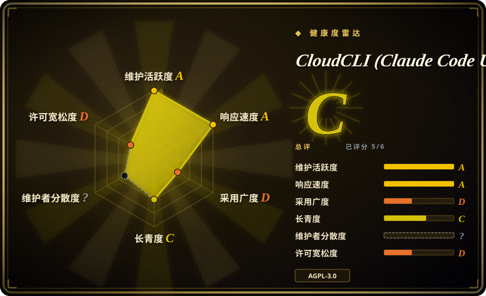

# CloudCLI (Claude Code UI)

AGPL 许可的自托管 Web + 移动驾驶舱（npm 包 `@cloudcli-ai/cloudcli`，前身为「Claude Code UI」品牌），用来从任意设备驾驶装在你机器上的 CLI 编码 agent——Claude Code、Codex 与 Cursor CLI，2026-09 起还有经 ACP 接入的新 provider：实时会话、项目/文件浏览、浏览器内编辑器、终端与 git diff 界面。

## 何时使用

你是主力用 Anthropic Claude Code（或 OpenAI Codex / Cursor CLI）的工程师，agent 跑在工作站或家里服务器上，你想用手机看一眼长任务跑到哪、审一下它挂起的文件改动、或者不回到那台终端就追发一条指令。你选 CloudCLI，因为它是*这个 CLI 家族唯一持续维护的开源 Web 驾驶面*：它前置的是本地安装、本地鉴权好的 agent 进程，而非自己重造 agent，所以会话/项目与 CLI 自己的存储一一对应。对 [Hermes Workspace](hermes-workspace.zh.md) 决策只取决于跑的是哪个大脑——Hermes Workspace 的增强面板只为 Nous 的 hermes-agent gateway/dashboard 亮起；对 [Agent Orchestrator](agent-orchestrator.zh.md) 你选的是「监管*并行异构*多 agent 的桌面 worktree 监工」而不是「远端浏览器里看*自己的* agent 会话」；对 [Open WebUI](../llm-chat-ui/open-webui.zh.md)、[LibreChat](../llm-chat-ui/librechat.zh.md) 你选的是真正的编码 agent 控制面（文件、终端、git），而非模型聊天。

插件系统（自定义标签页，带前端 + 可选 Node 后端，从 git 仓库安装）与 i18n 响应式 UI，补全了把它当个人 agent 座舱自托管的理由。

## 何时不用

- **你的 agent 大脑是 hermes-agent。** 改用 [Hermes Workspace](hermes-workspace.zh.md)——CloudCLI 前置的是 Claude 系 CLI，不是 Hermes 网关 API 约定。
- **你背不动 AGPL-3.0-or-later。** README 自己点明了网络条款：改了它并作为网络服务运行，就要向该服务的用户开放修改后的源码。要嵌进专有产品，MIT 的 [Hermes Workspace](hermes-workspace.zh.md)（或直接裸用 API）形态更安全；纯个人自托管则完全不是问题——这也正是它赢上一条细分的原因。
- **你想要团队聊天平台。** 多用户 RBAC 不是它的产品形态（见存疑）；要共享鉴权/presets 选 [LibreChat](../llm-chat-ui/librechat.zh.md)，要有人管的聊天前端选 [Open WebUI](../llm-chat-ui/open-webui.zh.md)。
- **你需要监管并行多 agent。** N 个异构编码 agent、按 worktree 隔离、自动路由 CI/review 反馈的 GUI 形态，用 [Agent Orchestrator](agent-orchestrator.zh.md)；CloudCLI 本质上是我自己的会话、远程可看。
- **底座可被抽走。** 它的价值在于前置 vendor CLI 的本地状态/鉴权——Claude Code 的会话格式变了、官方对 wrapper 的 ToS 转向、或 Codex/Cursor CLI 内部改道，都可能让部分面板无补救地坏掉。[推断]
- **open-core 引力。** 仓库前面站着商业伴生品（cloudcli.ai 托管服务，README 带「CloudCLI Cloud」CTA）——路线图对自托管者的利益对齐不保证。由托管 CTA 推断，非成文政策，[推断]。
- **裸露公网要当高难度动作看。** 这个驾驶舱把你真实 checkout 里的终端与文件编辑器中介了出去；远程部署下鉴权如何强制，本次未从源码核实 [未验证]——除非你自己读过服务端代码，否则跑在 loopback/VPN（Tailscale）后面。

## 横向对比

| 替代品 | 是否收录 | 我们的评价 | 取舍 |
|---|---|---|---|
| [Hermes Workspace](hermes-workspace.zh.md) | ✅ | 机器上的大脑是 hermes-agent 时选 Hermes Workspace（它读的是别的 agent 不提供的 Hermes gateway/dashboard API）；是 Claude Code / Codex / Cursor CLI 时选 CloudCLI。 | 产品形态相同（Web 控制台 + xterm + 文件前置一个 CLI agent），后端生态相反。Hermes Workspace 是 MIT、外加 tmux swarm 派发；CloudCLI 是 AGPL-3.0-or-later、更年长、月月发版、带插件生态与厂商云。 |
| [Agent Orchestrator](agent-orchestrator.zh.md) | ✅ | 活儿是*监管大量并发*编码 agent、要 worktree 隔离与 CI/review 反馈自动化、且接受桌面应用时，选 Agent Orchestrator。 | 桌面应用 + 本地 Go daemon、23+ agent 适配器、worktree 泳道。CloudCLI：浏览器/移动优先的远程驾驶舱，前置 agent 既有会话，根本没有 worktree 监工模型。 |
| [Open WebUI](../llm-chat-ui/open-webui.zh.md) | ✅ | 你要的是模型聊天平台（RAG、用户、presets）、完全不要编码 agent 界面时，选 Open WebUI。 | Open WebUI 渲染的是与模型的对话；CloudCLI 渲染的是*进程*——会话、终端、diff。重叠的只有浏览器标签页。 |
| [LibreChat](../llm-chat-ui/librechat.zh.md) | ✅ | 团队的硬需求是多用户鉴权与面向聊天的 provider 广度时，选 LibreChat。 | LibreChat：团队级聊天。CloudCLI：个人编码 agent 座舱；远程可看不等于多租户。 |
| Conductor（Mac 应用） | 未收录（非仓库） | 只有当你要闭源商业 macOS 任务驾驶应用、且不打算自托管时才考虑。 | 专有 SaaS 形态产品、不是仓库——列出来只为版图完整。 |

## 技术栈

- **前端：** React + Vite + Tailwind；CodeMirror 6 编辑器（多语言 mode + merge/minimap）、xterm.js（+webgl/clipboard 插件）做终端、react-router、i18next。
- **服务端：** Node/Express，`node-pty` 提供真 PTY，`ws` 做 WebSocket 数据面，`better-sqlite3` 本地存储。GitHub 分类器显示约 4.4 MB TypeScript 对 0.3 MB JavaScript——TypeScript 为主的 `server/` + 客户端仓库。
- **agent 集成：** 前置本地已安装的 Claude Code / Codex / Cursor CLI 会话及其磁盘状态；`main` 近期活动新增经 ACP 的 provider（Kiro CLI、Antigravity 出现在 open PR 中，2026-09）。
- **分发：** npm（`@cloudcli-ai/cloudcli`；v1.37.3 打标 2026-09-08），另有 `cloudcli-local-server` 发布线与伴生云产品 cloudcli.ai。

## 依赖

- **宿主机上装好并完成鉴权的受支持 CLI agent 之一**（Claude Code / Codex / Cursor CLI）——CloudCLI 驱动它们，不打包模型访问；token 花销走你已有的 vendor 登录。
- **Node.js + npm** 跑服务端；`better-sqlite3` 原生模块意味着小众平台要有可用的编译工具链/预编译二进制。
- **无其他强制依赖**——没有外部数据库、队列或网关；agent 自己的本地状态就是记录系统。

## 运维难度

**单机可信环境上低，再往外就中等且存疑。** `npm` 装好、浏览器指过去即可——不需要管模型密钥，底层 CLI 本来就登录好了。真正的运维问题是远程安全：产品卖点就是「本地或远程、从手机用」，这让鉴权/Cookie/TLS 成了承重墙；而这一面本次只核对了文档与 issue 标题、未读源码。发布节奏很快（2026-08/09 月月有 tag 加点发布），对修 bug 友好，代价是你得勤升级。

## 健康度与可持续性

- **维护（2026-09）。** 2025-06-25 创建；最近 push 2026-09-18；v1.37.3 发布于 2026-09-08、上一个 v1.37.2 在 2026-08-18——*规律而快的发布线*，是本页最强健康信号，也是与同细分新来者最锋利的反差。
- **治理/bus factor。** `owner.type` 是 **Organization**（"siteboon"，org 账号 2025-01 注册、3 个公开仓库、94 followers），96 名列出的贡献者；但这里的「organization」读起来像一家公司的仓库而非基金会治理——布局中未见 GOVERNANCE/CODEOWNERS。比 User 个人仓库形态更稳，仍然集中。[推断]
- **背书与资金。** 商业伴生品存在（cloudcli.ai 托管服务，README 中推广）——资金路径是围绕托管云的 open-core 形态。公司履历与仓库同龄（创始于 2025）。资金深度[未验证]。
- **年龄 × Lindy（2026-09）。** 约 15 个月、持续发版——年轻，但比同细分那个六个月的新脸长一倍，且有连续公开发版史。适度的 Lindy 信用，不是豁免权。[推断]
- **采用与生态。** 13,724 stars / 1,949 forks（GitHub API，2026-09-18）、Discord 社区、小型第三方插件生态（README 列了 PRISM、Token Cost Calculator）、i18n——在 Claude Code 工具热潮里是真拉动。但*机器实测*的采用的确弱于 GitHub 门面：health 评分器解析到的注册表包（改名前的 `@siteboon/claude-code-ui`）2026-09 月度下载 1,521、反向依赖 0，该轴评 D——stars 与安装拉动力背离，且改名后的 `@cloudcli-ai/cloudcli` 分发自身的注册表数字可能未被评分器可见。stars 反映的是耐用使用还是话题热度，此处分不清。[推断]
- **风险标记。** AGPL-3.0-or-later（网络条款，刻意为之）；对 Anthropic CLI 内部的重度耦合——vendor 改格式/改 ToS 对部分面板是存亡级；品牌迁移（仓库名 claudecodeui 对「CloudCLI」产品与 npm 改名）带来命名颠簸；215 个 open issues 对 96 贡献者，triage 负载不小。耦合存亡性判断为[推断]。

## 存疑（未验证）

- [未验证] 远程裸露下的鉴权/授权模型（密码？token？按会话？）未从源码读取；相关文档也未为任何一面做专门查证。
- [未验证] 功能面（文件编辑器、git diff 视图、终端、移动端响应式、插件标签页）取自 README 截图/章节与 issue/PR 标题，未实机演练。
- [未验证] 经 ACP 的 provider 支持（Kiro CLI、Antigravity）读自 `main` 近期 PR 标题（2026-09）；完成度与稳定性未知。
- [推断] 「个人座舱、非多用户 RBAC」——依据是 README/issue 标题中多用户叙事的缺席，不是源码级反证。
- [推断] 向 cloudcli.ai 的 open-core 引力只从托管服务 CTA 评估；已核查范围内不存在关于自托管对云功能划界的成文政策。
- [推断] 对 vendor CLI 变更的存亡式耦合，是所有 Claude Code wrapper 工具的共同模式；CloudCLI 尚未记录到具体的此类破坏。
- [未验证] star/fork/issue/贡献者数与发布日期是 2026-09-18 的 API 快照，会漂移。
- [未验证] 采用轴的 D 评级测自改名前的包 `@siteboon/claude-code-ui`（npm 月下载 1,521、反向依赖 0，2026-09）；`@cloudcli-ai/cloudcli` 新分发自身的注册表数字未独立测过，真实采用面可能宽于评分器所见。
- [推断]「无其他强制依赖」（无外部 DB/队列/网关）与 `better-sqlite3` 对小众平台的工具链要求，读自依赖清单，未跨平台实测。
