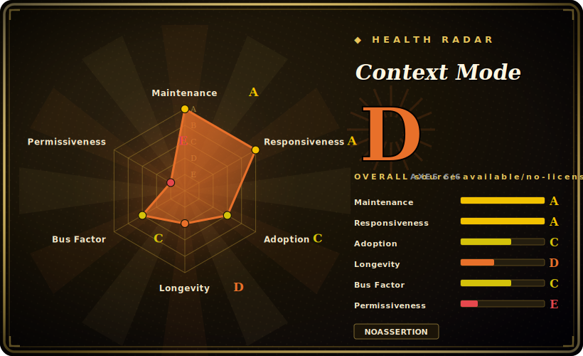

# Context Mode

An MCP server that keeps raw tool output out of an agent's context window — it runs reads/fetches/log-crunching in a sandboxed subprocess (only stdout returns), indexes session events into SQLite FTS5 so the agent survives compaction, and uses hooks to *route* heavy tool calls into the sandbox across ~17 agent platforms.

## When to use

You're driving a coding agent (Claude Code, Codex, Cursor, OpenCode/Kilo, Gemini CLI…) through a long investigation — researching a repo, grepping a 45 KB access log, pulling 20 GitHub issues, taking a Playwright snapshot. Each of those raw payloads lands in the context window verbatim, and half an hour in you've burned 40% of your budget on data the model only needed to *summarize*. Then the conversation compacts and the agent forgets which files it was editing and what you last asked. You're tired of babysitting context.

So you install Context Mode as an MCP server (a `/plugin` install on Claude Code, a config-file edit elsewhere). Now when the agent needs to crunch that log it writes a tiny script and calls `ctx_execute` — the raw 45 KB is processed in an isolated subprocess and only the `console.log`'d result (155 bytes) enters context. Its PreToolUse/PostToolUse hooks nudge heavy Read/Bash/WebFetch calls into the sandbox automatically, and every file edit, git op, task and decision is logged to a per-project SQLite DB. When compaction hits, a ≤2 KB priority-tiered snapshot rehydrates the working state and the agent picks up from your last prompt instead of asking "what were we doing?". You get noticeably longer effective sessions without re-prompting.

## When NOT to use

- **You need an OSI open-source license.** It's **Elastic License 2.0 (source-available)**, not MIT/Apache — you can use, fork and modify it, but you may **not** offer it as a hosted/managed service, and you can't relicense. If your policy requires permissive OSS, this is a hard stop.
- **Your platform has no hook support.** Routing only reaches the advertised "~98% saved" with hooks. On Antigravity IDE and Zed there are no hooks — enforcement is a manually-copied instruction file at ~60% compliance, and one unrouted `curl`/Playwright call can dump 56 KB and wipe a session's savings. Even Cursor/Kiro lack a working SessionStart, so post-compaction *restore* isn't available there yet.
- **You don't want arbitrary code execution in the loop.** The whole model is the agent *writing and running scripts* in `ctx_execute`/`ctx_batch_execute`. Those inherit the process's filesystem access (the project-root guard is defense-in-depth for file *reads* only, not an OS sandbox) — approving an execute tool means approving arbitrary code. Keep host-level sandboxing on.
- **You want zero moving parts.** It needs Node.js ≥ 22.5 (or Bun) and a working SQLite (`node:sqlite` / `bun:sqlite` / `better-sqlite3` native addon); **Linux + Node < 22.5 is unsupported**, and older glibc/Windows can hit native-build friction. It also adds per-tool-call hook overhead and a routing block in your prompt.
- **You want guaranteed, model-agnostic numbers.** The "98% reduction / 30 min → 3 hours" figures are the project's own benchmarks and vary with workload; instruction-file-only platforms land far lower.
- **You only need task/issue tracking or a durable knowledge base.** This optimizes *context* and *session resume*; it is not a dependency-aware task graph ([beads](beads.md)) or a spec/PM workflow ([CCPM](ccpm.md)).

## Comparison

| Alternative | In index | Our verdict | Tradeoff |
|---|---|---|---|
| [beads](beads.md) | ✅ | Use this page for its stated niche; choose beads when you need a dependency-aware, version-controlled task/issue *graph* for agents (Dolt-backed). | A dependency-aware, version-controlled task/issue *graph* for agents (Dolt-backed). Solves "what work is ready & remembered across sessions," not "keep raw tool output out of context." Complementary, not a substitute. |
| [CCPM](ccpm.md) | ✅ | Use this page for its stated niche; choose CCPM when you need a Claude-Code spec→issue PM workflow (GitHub Issues as the backend). | A Claude-Code spec→issue PM workflow (GitHub Issues as the backend). Manages *what to build*; Context Mode manages *how much data hits the window*. Different layer. |
| [Planning with Files](planning-with-files.md) | ✅ | Use this page for its stated niche; choose Planning with Files when you need a file-based planning/state convention (markdown plans on disk). | A file-based planning/state convention (markdown plans on disk). Lightweight and tool-agnostic; no sandboxing, FTS5 retrieval, or hook-enforced routing. |
| Token-Saver-MCP / MCP output-truncation servers | 未收录 | Use this page for its stated niche; choose Token-Saver-MCP / MCP output-truncation servers when you need other MCP servers that shrink tool payloads. | Other MCP servers that shrink tool payloads; narrower (truncate/summarize) and typically single-platform vs Context Mode's execute-sandbox + session-continuity + 17-platform routing. |
| Built-in agent compaction (`/compact`, auto-summarize) | 未收录 | Use this page for its stated niche; choose Built-in agent compaction (/compact, auto-summarize) when you need free and zero-install, but lossy summarization with no structured event ledger, no FTS5 retrieval, a. | Free and zero-install, but lossy summarization with no structured event ledger, no FTS5 retrieval, and no tool-output sandboxing — exactly the gaps Context Mode targets. |
| RAG / vector memory stores (e.g. Mem0, Letta) | 未收录 | Use this page for its stated niche; choose RAG / vector memory stores (e.g. Mem0, Letta) when you need durable cross-session *semantic* memory with embeddings. | Durable cross-session *semantic* memory with embeddings; heavier, server/DB-backed, and aimed at long-term knowledge — Context Mode's FTS5 store is per-project, local-first, and tuned to in-session resume. |

## Tech stack

- **Language:** TypeScript / Node.js (CLI + MCP server, distributed on npm as `context-mode`).
- **Runtime:** Node.js ≥ 22.5 or Bun; 12 sandbox runtimes for `ctx_execute` (JS, TS, Python, Shell, Ruby, Go, Rust, PHP, Perl, R, Elixir, C#).
- **Storage / search:** SQLite with **FTS5** full-text index, **BM25** ranking (+ Porter stemming, trigram substring, reciprocal-rank-fusion reranking); backend auto-selected — `bun:sqlite`, `node:sqlite` (Node ≥ 22.5), else `better-sqlite3`.
- **Integration:** Model Context Protocol (MCP) server exposing 11 `ctx_*` tools; agent **hooks** (PreToolUse/PostToolUse/UserPromptSubmit/PreCompact/SessionStart/Stop) for routing + session capture.
- **Surface:** ~17 platform adapters (Claude Code, Gemini/Qwen/Kimi CLI, VS Code & JetBrains Copilot, Copilot CLI, Cursor, OpenCode, KiloCode, OpenClaw/Pi, Codex CLI, Antigravity IDE+CLI, Kiro, Zed, OMP).

## Dependencies

- **Required:** Node.js ≥ 22.5 (or Bun) and a working SQLite path (built-in `node:sqlite`/`bun:sqlite`, or the `better-sqlite3` native addon ~`^12.6.2`). Linux + Node < 22.5 is explicitly unsupported.
- **Host agent:** an MCP-capable agent; full routing/continuity additionally requires that agent to support hooks (capabilities vary widely by platform — see the README compatibility matrix).
- **Optional:** the hosted "Insight" dashboard (`context-mode.com/insight`) for org analytics — a separate, network-facing service, distinct from the local-only core.
- **No external DB/server** for the core: SQLite DBs live under the home dir (`~/.context-mode/` / `CONTEXT_MODE_DIR`).

## Ops difficulty

**Low-to-medium.** On Claude Code it's a two-line `/plugin` install with automatic hook registration and a `ctx-doctor` that validates runtimes/hooks/FTS5 — genuinely low-friction. Difficulty rises elsewhere: most platforms need hand-edited MCP + multi-event hook config (each with its own quirks — Codex feature flags, OpenCode/Kilo plugin-vs-MCP-duplicate gotcha, Cursor's rejected SessionStart, no-hook fallbacks). The native-SQLite story is mostly self-healing but older glibc/Windows/Alpine can require a C++ toolchain. Day-to-day maintenance is light (local SQLite, `ctx upgrade`), but you own keeping each platform's hook config in sync across version bumps.

## Health & viability

- **Maintenance** — last push 2026-06 with a very rapid 1.0.x cadence (latest v1.0.166, 2026-06-23, as of 2026-06): clearly active, even hyperactive. The flip side is churn — frequent point releases and many open platform-integration issues mean specifics go stale fast. [推断]
- **Governance / bus factor** — `[推断]` single-author (`User`-owned) project; ~18k stars on a one-maintainer repo is a bus-factor flag. There's a hosted "Insight" dashboard at context-mode.com, hinting at a commercial intent behind it, but no foundation or team governance to point to — roadmap is one person's.
- **Age & Lindy** — created 2026-02, so only months old as of 2026-06 despite the v1.0.x label and a #1 Hacker News moment: unproven on Lindy grounds. Treat the stars/HN buzz as attention, not durability.
- **Risk flags** — **relicense/open-core risk is the headline**: it's **Elastic License 2.0 (source-available, not OSI open source)** — you can't offer it as a hosted service or relicense, a hard stop if you need permissive OSS. Also note arbitrary-code-execution by design (`ctx_execute`) and a hosted analytics surface alongside the "nothing leaves your machine" core claim. [未验证]

## Caveats (unverified)

- **Stars / adoption** — `[未验证]` `gh` reported ~18.2k stars (2026-06-26); GitHub stars are unreliable and date-sensitive. The README's "Used across teams at Microsoft/Google/Meta…" badges are logo-only with no cited source — treat as marketing, not verified deployments.
- **License classification** — `[推断]` SPDX `Elastic-2.0`; ELv2 is source-available, **not** an OSI-approved open-source license. The repo's own README calls it "source-available." Confirm against your org's policy before depending on it.
- **Savings / longevity benchmarks** — `[未验证]` the 98% reduction, "315 KB → 5.4 KB," and "~30 min → ~3 hours" figures are the project's own benchmarks; real savings depend on workload and whether hooks are active (instruction-file-only ≈ 60%).
- **"Nothing leaves your machine" claim** — `[未验证]` the README states no telemetry/cloud sync for the core, yet ships a hosted `ctx_insight` org-analytics dashboard at `context-mode.com/insight`; the core's local-only behavior is the project's assertion, not independently audited.
- **Platform capability matrix** — `[未验证]` per-platform hook coverage, "Full/High/Partial" session-continuity ratings, and "~17 platforms" come from the README and shift release-to-release; verify your specific client + version before relying on a given capability.
- **Latest version / dates** — `[未验证]` v1.0.166 (2026-06-23) and pushed 2026-06-25 per `gh` on 2026-06-26; the rapid 1.0.x cadence means specifics go stale fast.
- **Maturity** — `[推断]` despite the v1.0.x label and a #1 Hacker News moment, the project is young and fast-moving (frequent point releases, many open platform-integration issues); treat single-maintainer / churn risk as non-trivial for workflows you can't re-tool.
