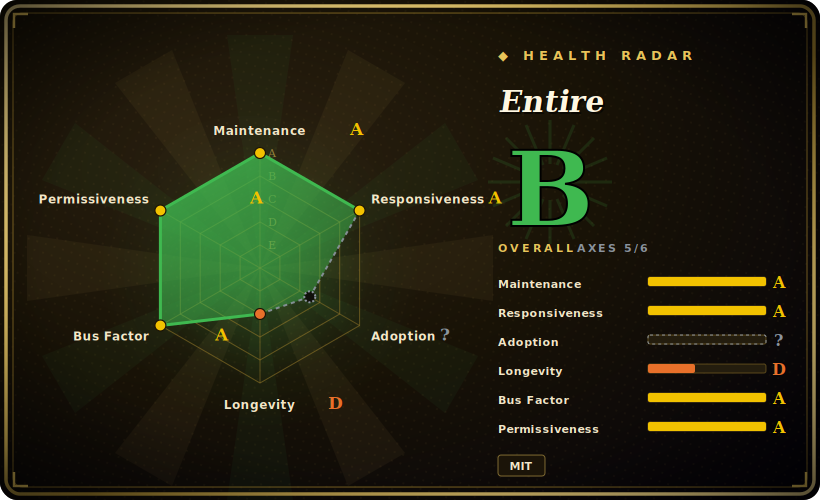

# Entire

A Git-native CLI (`entire`) that hooks into your workflow to capture AI coding-agent sessions — prompts, responses, tool calls, files changed, token usage — and indexes them as checkpoints alongside your commits on a separate `entire/checkpoints/v1` branch, giving you a searchable, rewindable record of *how* code was written. Single Go binary; fully local, no hosted account required for core use.

## When to use

You're a developer (or a small team) running coding agents — Claude Code one day, Codex or Gemini the next — through real feature work in a Git repo. The code lands fine, but three weeks later in review someone asks "why is the retry loop written this way?" and the answer lived in an agent transcript that compacted into oblivion. Worse, an agent occasionally drives a session into the weeds, mangles a few files, and you'd kill for a clean "rewind to before it went sideways" without hand-unwinding a messy working tree. You also don't want any of this AI bookkeeping polluting your actual commit history.

So you `entire enable` in the repo and point it at your agent. Now every session is captured automatically through Git hooks: prompts, responses, tool calls, modified files and timestamps get checkpointed (12-char hex IDs) onto the dedicated `entire/checkpoints/v1` branch — your working branch stays clean, Entire never commits on it. When a session goes bad you `entire session resume <branch>` to restore the latest checkpointed state, and months later the transcript that explains a decision is still indexed next to the commit that shipped it. It works across multiple agents and Git worktrees, so the provenance record is uniform no matter which tool wrote the code.

## When NOT to use

- **Public repos with sensitive prompts** — transcripts live *in your git repository* on the `entire/checkpoints/v1` branch; if the repo is public, that data is visible to anyone. Secret redaction is the project's own "best-effort" only, and temporary shadow branches used mid-session may hold unredacted data and must not be pushed. Treat this as a real data-exposure surface, not set-and-forget.
- **Pre-1.0 maturity** — latest release is v0.7.7 (2026-06); commands and on-disk formats can still shift (the `entire checkpoint rewind` command is already marked deprecated). Not the choice when you need stable, frozen interfaces or formal compatibility guarantees.
- **Rewind on every agent/IDE** — rewind support is uneven: Cursor IDE reportedly doesn't support rewind, Pi lacks subagent capture, and Copilot support is the CLI only (not the VS Code integration). Verify your specific agent before relying on the recovery story.
- **Task/dependency tracking** — Entire is a *capture & provenance* layer, not a task graph. It records what agents did; it does not model which work blocks which or surface "ready" tasks — that's a different tool ([beads](beads.md)).
- **Cross-repo / org-wide audit dashboards** — the record is per-repo, git-branch-local, CLI-driven. No hosted web dashboard, cross-repo search, or team analytics view is implied by the core tool.
- **Non-Git or non-agent workflows** — the entire mechanism is Git hooks + a checkpoints branch; without Git, and without a supported agent emitting sessions, there's nothing to capture.

## Comparison

| Alternative | In index | Tradeoff |
|---|---|---|
| [beads](beads.md) | ✅ | Solves the adjacent problem: a dependency-aware *task graph* / structured agent memory (what to do next, what's blocked), backed by versioned SQL. Entire captures *what already happened* (transcripts/checkpoints) for provenance & rewind — complementary, not substitutes. |
| [CCPM](ccpm.md) | ✅ | A Claude-Code project-management workflow (specs/issues/parallel agents via GitHub Issues). Process/coordination layer, not a session-transcript capture-and-rewind layer. |
| Plain Git + agent's own session logs | 未收录 | Zero extra tooling, but agent logs are scattered per-tool, 未收录 to commits, not uniformly rewindable, and clutter or never reach the repo. Entire is the unifying capture/index layer. |
| Specstory / agent transcript exporters | 未收录 | Other tools also persist agent chat transcripts, but typically as exported files/markdown rather than Git-checkpoint provenance tied to commits with a rewind mechanism. Verify feature parity before substituting. |
| Reflog / `git stash` + manual snapshots | 未收录 | Native recovery primitives you already have, but they capture tree state only — no prompts/responses/tool-call context, no per-session indexing, no agent-aware redaction. |

## Tech stack

- Go (~98–99% per repo language stats) — distributed as a single binary `entire`.
- Git hooks as the capture mechanism; a dedicated `entire/checkpoints/v1` branch as the storage location for session metadata, separate from code commits.
- 12-character hex checkpoint IDs; per-agent hook installation.
- Auto-summarization reportedly invokes the Claude CLI when available.
- Distribution via Homebrew cask (`brew install --cask entire`), an install script (`curl … entire.io/install.sh`), Scoop (Windows), and `go install`.

## Dependencies

- **Git** — mandatory; the whole capture model is Git hooks + a checkpoints branch.
- **A supported agent** — one of claude-code, codex, gemini, opencode, cursor, factoryai-droid, or copilot-cli (per README); Codex additionally needs `codex_hooks = true` in `.codex/config.toml`.
- **Optional** — Claude CLI for auto-summarization; `entire login` device auth exists but isn't required for core functionality. Go + `mise` are listed for development, not runtime.
- No database, server, or hosted backend required for core local use.

## Ops difficulty

**Low.** Install the single binary, run `entire enable`, and capture happens via Git hooks with no service to operate — `entire status` / `entire doctor` cover health, `entire disable` / `entire clean` back it out. The real operational burden isn't infrastructure, it's *governance*: because transcripts land on a branch inside the repo, you must decide branch-push/visibility policy, trust best-effort redaction, and avoid pushing the temporary shadow branches — i.e. the cost is data-handling discipline, not deployment.

## Health & viability

- **Maintenance** — last push 2026-06 with a recent release (v0.7.7, 2026-06-18) as of 2026-06: actively developed. Reportedly ~103 releases, so a real shipping cadence — but pre-1.0, and one command (`entire checkpoint rewind`) is already deprecated, so interfaces and on-disk formats can still shift. [推断]
- **Governance / bus factor** — `Organization`-owned (`entireio`), which is a better signal than a personal repo, but it's a small vendor-led project (there's an `entire.io` install host and `entire login` device auth, hinting at a commercial backer); no foundation or formal governance. ~4.5k stars is modest, so adoption is early. [推断]
- **Age & Lindy** — created 2026-01, so only months old as of 2026-06: too young for a Lindy verdict and still pre-1.0. Judge it on shipping cadence, not track record.
- **Risk flags** — `[未验证]` MIT, no relicense history. The standout risk is **data exposure, not licensing**: transcripts (prompts/responses) live on a branch *inside your git repo*, secret redaction is the project's own "best-effort", and temporary shadow branches may hold unredacted data — a real exposure surface on public repos.

## Caveats (unverified)

- [未验证] Star count ~4.55k as of 2026-06 — GitHub stars are unreliable and date-sensitive; treat as indicative only.
- [未验证] Language split (~98.6% Go) and the "103 releases" figure come from the repo/README at fetch time; not independently re-counted.
- [未验证] Per-agent rewind gaps (Cursor no rewind, Pi no subagent capture, Copilot CLI-only) are from the project's own README; behavior may change across releases — verify against your agent/version.
- [未验证] Secret redaction is the project's own "best-effort" claim; coverage and failure modes are not independently audited. Do not treat it as a guarantee for public repos.
- [推断] Entire and a task-graph tool like beads address different layers (provenance/rewind vs task state); the "complementary, not substitutes" framing is reasoning, not a tested integration.
- [未验证] Comparison rows for non-indexed alternatives (Specstory-style exporters, generic transcript tools) are described from general category knowledge, not a feature-by-feature audit of each.
