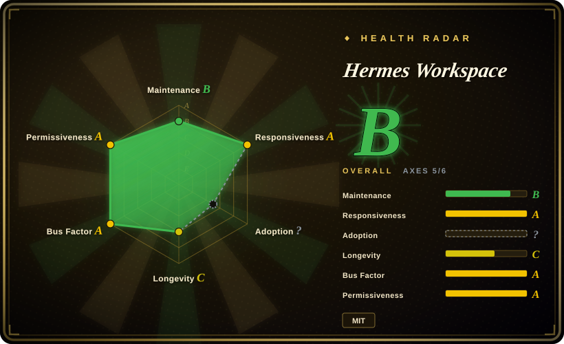

# Hermes Workspace

A self-hosted web workspace and control plane for [hermes-agent](../agent-frameworks/agent-runtimes/hermes-agent.md): chat, sessions, memory, skills, MCP, jobs, a Monaco file browser, a PTY terminal, dashboards — plus a tmux-backed multi-agent "Swarm" mode — all talking to the vanilla upstream agent over its gateway (`:8642`) and dashboard (`:9119`) APIs. Without a Hermes Agent backend it degrades to "portable mode": plain chat against any OpenAI-compatible endpoint.

## When to use

You're the person who runs Nous's hermes-agent on a home server or Mac mini, points it at Ollama or OpenRouter, and now you want to drive it from your phone on the tailnet instead of ssh-ing into a terminal. You reach for Hermes Workspace because the deciding tradeoff is *the agent's own state as the UI substrate*: paired with the gateway + dashboard it shows live sessions, browsable/searchable/editable agent memory, the skills catalog with origin badges, jobs, MCP config, usage/cost dashboards, and an embedded xterm — none of which a generic chat frontend can render, because they live behind the agent's APIs. It is also the only indexed option that pairs a Hermes Agent install with a first-party-shaped web console; against [Open WebUI](../llm-chat-ui/open-webui.md) it's the opposite bet (agent-state console vs model-chat platform), and against [CloudCLI](claudecodeui.md) the choice is almost purely *which agent brain you run*: Hermes Workspace serves hermes-agent, CloudCLI serves the Claude Code / Codex / Cursor CLI family.

On top of the console there is Swarm Mode: persistent tmux workers with role-based dispatch (builder/reviewer/docs/QA lanes), a kanban task board, orchestrator chat, and a reports inbox — pick this when you want one control surface over several *long-lived* agent workers on a single machine, accessed through a browser/PWA, rather than a desktop app managing isolated worktrees per agent (that's [Agent Orchestrator](agent-orchestrator.md)).

## When NOT to use

- **Your agent brain is not hermes-agent.** If it's Claude Code, Codex, or Cursor CLI, use [CloudCLI](claudecodeui.md) instead — Hermes Workspace's enhanced panes are entirely keyed to the Hermes gateway/dashboard endpoint convention; with other backends you keep only chat.
- **You only want to chat with models.** If sessions/memory/skills/terminal are not the point, [Open WebUI](../llm-chat-ui/open-webui.md) or [LibreChat](../llm-chat-ui/librechat.md) are far more mature chat platforms (built-in RAG, model marketplaces, multi-user). Hermes Workspace in portable mode is a thin chat shell next to them.
- **You need a team / multi-user platform.** Workspace is single-operator by shape: the cloud/multi-device/team story is explicitly "Status: Coming Soon" in the README (as of 2026-09). For shared deployments with real user management pick [LibreChat](../llm-chat-ui/librechat.md).
- **Do not expose this to the public internet casually.** Its blast radius is a web app holding a file editor *and* a PTY *and* skill/MCP install surfaces. The fail-closed guard (refuses non-loopback bind without `HERMES_PASSWORD`) and a real auth middleware exist, but security hardening was still landing as of 2026-09: recent commits fix an SSRF bypass in the MCP hub (bracketed IPv6 hosts), production-server COOP/COEP drops, and a missing `frame-ancestors` CSP. Deploy behind Tailscale/VPN, not port-forwarded. The caution is [推断]; the fix activity is dated fact.
- **You need predictable releases.** The latest GitHub release is v2.3.0 from 2026-05-08 while `main` kept moving through 2026-09 — a ~4-month release gap; feature branches like the swarm WS data-plane are live only on trunk or via `ghcr.io/...:latest` rebuilt from `main`. Pin and accept churn.
- **You're allergic to upstream coupling.** v2's "zero-fork" pitch means the UI's capabilities are gated by which endpoints your installed `hermes-agent` exposes (missing endpoints → graceful "portable mode"/capability-gate placeholders). If upstream renames or drops a route, panes go dark; the README's own upgrade guidance says "update hermes-agent to the latest version" as the fix.
- **Migration churn is baked in.** v1 shipped *with a fork of hermes-agent* and Claude-era branding; v2 abandoned the fork and legacy `CLAUDE_*` env names / the `claude-data` volume persist as fallbacks. Six months old with one architectural regime change already behind it — expect more.
- **You want headless scripting.** This is a web UI, not a library or CLI; drive the agent's own HTTP APIs directly or use [Agent Orchestrator](agent-orchestrator.md) for CLI-supervision of many different agents.

## Comparison

| Alternative | In index | Our verdict | Tradeoff |
|---|---|---|---|
| [CloudCLI (Claude Code UI)](claudecodeui.md) | ✅ | Pick CloudCLI when the brain is Claude Code / Codex / Cursor CLI — the web/mobile console for that family; pick Hermes Workspace when the brain is hermes-agent, since its enhanced panes read the gateway/dashboard APIs no other agent serves. | Both are self-hosted React web consoles over a local CLI agent with terminal + files. Hermes Workspace adds tmux Swarm dispatch and is MIT; CloudCLI is AGPL-3.0-or-later, has a steadier release train and its own commercial cloud (cloudcli.ai). |
| [Agent Orchestrator](agent-orchestrator.md) | ✅ | Choose Agent Orchestrator when you supervise N heterogeneous coding agents (23+ adapters) in isolated git worktrees with CI/review feedback routing in a desktop app. | Agent Orchestrator: desktop/Electron, per-agent worktree isolation, feedback-loop automation. Hermes Workspace: browser/PWA surface, deep single-ecosystem state (memory/skills/jobs), swarm workers share one machine via tmux rather than owning branches. |
| [Open WebUI](../llm-chat-ui/open-webui.md) | ✅ | Choose Open WebUI when you want a polished multi-user chat platform with built-in RAG, offline model support, and no agent-terminal surface. | Open WebUI: years-old, huge adoption, chat-platform features; renders no agent session/skill/terminal state. Hermes Workspace: agent-state console, but its chat-only mode is strictly worse than Open WebUI's core. |
| [LibreChat](../llm-chat-ui/librechat.md) | ✅ | Choose LibreChat when multi-user auth, presets, and broad provider/API support for *chat* are the requirement. | LibreChat: team-grade chat platform, mature auth. Hermes Workspace: single-operator agent ops surface; "team collaboration" is roadmap, not product. |
| Conductor (Mac app) | not indexed (non-repo) | Reach for Conductor only if you want a closed-source commercial agent-mission app for macOS and won't self-host. | Proprietary, not a repository — out of this index's inclusion scope by shape; listed so you know the commercial neighbor exists. |

## Tech stack

- **Frontend + server:** a TanStack Start (React SSR) app in TypeScript on Vite — TanStack Router/Query, Tailwind, zustand, zod; xterm + fit/search/web-links addons for the PTY terminal; Monaco editor for files; recharts for dashboards; three.js/react-three for theme flourishes. (GitHub's classifier reports JavaScript as the largest language, ~21.9 MB vs ~7.2 MB TypeScript — the server layer ships as JS (`server-entry.js`, `src/server/`).)
- **App shells / packaging:** Electron desktop app *in development*; PWA manifest; prebuilt Docker images on ghcr (`linux/amd64` + `arm64`), docker-compose (gateway + workspace), devcontainer, Codespaces template, launchd/systemd installer scripts (`scripts/install-dashboard-service.sh`), one-line `install.sh`.
- **Swarm layer:** tmux-persistent worker processes, role-based dispatch, kanban board, and a "byte-verified review gate" for release branches (README-documented).
- **Node 22+ / pnpm** toolchain per the README and package manifest.

## Dependencies

- **For full features:** a stock [hermes-agent](../agent-frameworks/agent-runtimes/hermes-agent.md) install serving *two* services — the gateway on `:8642` (`API_SERVER_ENABLED=true`; add `API_SERVER_KEY`/`HERMES_API_TOKEN` if authenticated) and `hermes dashboard` on `:9119` (sessions/skills/config/jobs/MCP APIs). Running the agent from source needs Python 3.11+.
- **A model backend** reachable by the agent: an API key (OpenAI/OpenRouter/Google/…) or a local server (Ollama, LM Studio, vLLM, llama.cpp, LocalAI). With a plain OpenAI-compatible backend *instead of* the agent, you get portable mode (chat only).
- **tmux** on the host for Swarm workers (POSIX; Windows is handled via a PowerShell + WSL helper script).
- **No database** — state lives behind the agent's own files/services; workspace overrides persist to `~/.hermes/workspace-overrides.json`.

## Ops difficulty

**Low for the loopback Docker path, medium for remote deployments.** `docker compose up` pulls two prebuilt images (agent + workspace) and starts everything on `127.0.0.1`; agent state persists in a named volume. Remote access (Tailscale/LAN) is documented but demands correctly pairing several env vars — `HERMES_PASSWORD` (hard-required off-loopback), `COOKIE_SECURE`, both `HERMES_API_URL` and `HERMES_DASHBOARD_URL` pointed at reachable addresses, matching `API_SERVER_KEY`/`HERMES_API_TOKEN` — and the README's troubleshooting table shows these are where users actually trip (silent login failures, "Offline" UI vs live backend). The standing maintenance tax is *version coupling*: keep `hermes-agent` and `hermes-dashboard` fresh, because capability probes silently downgrade the UI when endpoints drift.

## Health & viability

- **Maintenance (2026-09).** Created 2026-03-16; 2,030 commits and last `pushed_at` 2026-09-10 — main is clearly active. The flip side: latest tagged GitHub release is v2.3.0 (2026-05-08), a ~4-month release gap, with 162 open issues / 102 open PRs at check time — trunk runs ahead of the release process.
- **Governance / bus factor.** `owner.type` is **User** ("Eric", account created 2025-03, 19 public repos). Measured 12-month contribution spread puts the top author at 35% of commits across 69 listed contributors (health scorer, 2026-09) — spread wider than a pure solo repo, but still no foundation and no GOVERNANCE/CODEOWNERS found; SECURITY.md routes reports to the owner's X handle. Single-person roadmap risk is real. [推断]
- **Backing & the upstream bet.** The workspace itself has no institutional backing, but its *substrate* does: [hermes-agent](../agent-frameworks/agent-runtimes/hermes-agent.md) showed 246,668 stars and a same-day push (2026-09-18 via GitHub API) — the workspace's viability is largely a derivative bet on that upstream's endpoint contract and continued momentum. [推断]
- **Age × Lindy (2026-09).** ~6 months old with 6.6k stars: high heat, zero Lindy credit; the v1→v2 zero-fork pivot already broke one deployment model (fork-based installs deprecated). Treat stability claims as unproven. [推断]
- **Adoption & ecosystem.** 1.1k forks, ghcr images, Codespaces/devcontainer, PaaS recipes (Coolify/Easypanel/Unraid) and PWA + Tailscale mobile stories suggest real self-hoster pull; docs are unusually thorough (docs/swarm/, per-feature pages). The "2,000+ skills" browsing claim is not independently verified.
- **Risk flags.** Release gap + big open-PR backlog; security fixes still landing in 2026-09 (SSRF bypass, COOP/COEP, CSP); SECURITY.md speaks of "Security Measures (v3.0.0+)" while the latest release is v2.3.0 — a doc/version drift signal; Electron and cloud hosting are announced-but-unshipped roadmap. MIT license (LICENSE file read directly), no relicense history.

## Caveats (unverified)

- [未验证] "Browse 2,000+ skills", the swarm "byte-verified review gate", and the mission-API/native-swarm fallback behavior come from the README; not independently exercised.
- [未验证] Portable-mode surface ("chat only; sessions/memory/skills show Not Available") is the README's own degradation model — actual behavior with a bare OpenAI-compatible backend was not tested here.
- [推断] The 4-month release gap reading ("trunk ahead of releases; pin `main` or the rolling `:latest` image") is inferred from release vs push dates; the maintainer may cut releases differently off-GitHub.
- [推断] Bus-factor concentration is read from the contributors API page (top author's visible commit count) and owner profile; squash-merge attribution can skew this, and no governance file was found to confirm or deny.
- [推断] "Single-operator by shape / team features are roadmap-only" — from README sections marked "Status: Coming Soon" (as of 2026-09-18); a future release may change this.
- [未验证] SSRF/COOP/COEP/CSP fix activity is read from recent commit/issue titles (2026-09); full remediation quality was not audited.
- [推断] "Migration churn is baked in / expect more" — the v1-forward-v2-zero-fork regime change is dated from the README, but reading it as a forward predictor of instability is judgment.
- [推断] "No database beyond the agent's own state" — inferred from the dependency manifest (no DB libs) and README env docs, not from reading the server source.
- [推断] The version-coupling tax claim (UI downgrades when upstream endpoints move) is grounded in the README's capability-gate language and troubleshooting table, not a reproduced failure.
- [未验证] Frontmatter `language: JavaScript` copies GitHub's classifier output; the "primary language" reading is contested since `src/` is mostly TypeScript.
