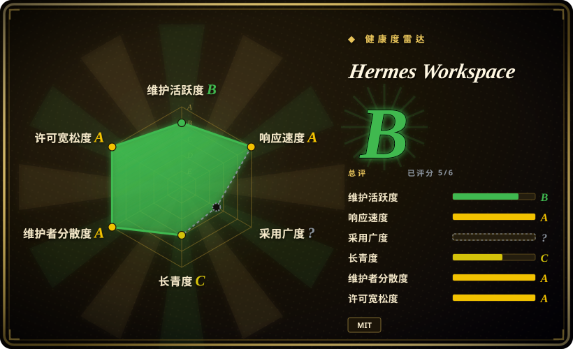

# Hermes Workspace

面向 [hermes-agent](../agent-frameworks/agent-runtimes/hermes-agent.zh.md) 的自托管 Web 工作台与控制面：聊天、会话、memory、skills、MCP、jobs、Monaco 文件浏览器、PTY 终端、仪表盘，外加 tmux 支撑的多 agent「Swarm」模式——全部通过上游原生 agent 的 gateway（`:8642`）与 dashboard（`:9119`）API 对接。接不到 Hermes Agent 后端时自动降级为「portable 模式」：对任意 OpenAI 兼容端点的纯聊天。

## 何时使用

你在家里服务器或 Mac mini 上跑 Nous 的 hermes-agent，模型指向 Ollama 或 OpenRouter，现在想从手机（走 tailnet）驾驶它，而不是 ssh 进终端敲命令。你选 Hermes Workspace，决定性取舍在于*把 agent 自身状态当作 UI 底座*：与 gateway + dashboard 配对后，它渲染实时会话、可浏览/搜索/编辑的 agent memory、带来源徽章的 skills 目录、jobs、MCP 配置、用量/成本仪表盘和内置 xterm——这些状态活在 agent 的 API 后面，通用聊天前端根本渲染不出来。它也是索引里唯一与 Hermes Agent 安装配对的「第一方形态」Web 控制台；对 [Open WebUI](../llm-chat-ui/open-webui.zh.md) 它是相反赌注（agent 状态控制台 vs 模型聊天平台），对 [CloudCLI](claudecodeui.zh.md) 选择几乎只取决于*你跑的是哪个 agent 大脑*：Hermes Workspace 服务 hermes-agent，CloudCLI 服务 Claude Code / Codex / Cursor CLI 家族。

控制台之上还有 Swarm 模式：tmux 常驻 worker、按角色派发（builder/reviewer/docs/QA 泳道）、kanban 任务板、orchestrator 聊天与 reports 收件箱——当你想要*单个机器上若干长期存活 agent worker* 的统一驾驶面、且经浏览器/PWA 访问时选它；要的是按 agent 隔离 worktree 的桌面应用就别选（那是 [Agent Orchestrator](agent-orchestrator.zh.md)）。

## 何时不用

- **你的 agent 大脑不是 hermes-agent。** 是 Claude Code、Codex 或 Cursor CLI 的话，改用 [CloudCLI](claudecodeui.zh.md)——Hermes Workspace 的增强面板完全锚定 Hermes gateway/dashboard 的端点约定，换后端只剩聊天。
- **你只想聊天。** 会话/memory/skills/终端不是重点的话，[Open WebUI](../llm-chat-ui/open-webui.zh.md) 或 [LibreChat](../llm-chat-ui/librechat.zh.md) 是成熟得多的聊天平台（内置 RAG、模型市场、多用户）。Hermes Workspace 的 portable 模式在它们面前只是层薄壳。
- **你需要团队/多用户平台。** Workspace 形态上是单人操作台：云端/多设备/团队协作在 README 里明着标「Status: Coming Soon」（截至 2026-09）。要带真实用户管理的共享部署，选 [LibreChat](../llm-chat-ui/librechat.zh.md)。
- **别随便把它裸露公网。** 它的爆炸半径是一个同时握着文件编辑器*和* PTY *和* 技能/MCP 安装面的 Web 应用。fail-closed 闸门（非 loopback 绑定强制要求 `HERMES_PASSWORD`）与真鉴权中间件确实在，但安全加固到 2026-09 仍在进行中：近期 commit 在修 MCP hub 的 SSRF 绕过（方括号 IPv6）、生产服务器 COOP/COEP 丢失、CSP 缺 `frame-ancestors`。请部署在 Tailscale/VPN 后面，不要端口映射。「这条告诫该多硬」是[推断]，修复活动本身是带日期的事实。
- **你需要可预期的发布节奏。** 最新 GitHub Release 是 2026-05-08 的 v2.3.0，而 `main` 到 2026-09 仍在推进——约 4 个月的发布空窗；swarm WS 数据面这类分支特性只在 trunk 或由 `main` 重建的 `ghcr.io/...:latest` 镜像上。钉版本并接受漂移。
- **你受不住上游耦合。** v2 的「零 fork」卖点意味着 UI 能力由你装的 `hermes-agent` 暴露哪些端点决定（缺端点 → 优雅降级成 portable 模式/能力闸门占位）。上游改名或删路由，面板就黑掉；README 自己的升级指引就把解法写成「把 hermes-agent 更新到最新版」。
- **迁移颠簸已写进履历。** v1 是*带着 hermes-agent 的 fork* 发布的、Claude 时代品牌；v2 弃用 fork，`CLAUDE_*` 环境变量与 `claude-data` 卷名作为遗留兜底仍在。问世六个月已经历一次架构政权更迭——预期还会有。
- **你要的是无头脚本化。** 这是 Web UI，不是库也不是 CLI；直接驱动 agent 自己的 HTTP API，或用 [Agent Orchestrator](agent-orchestrator.zh.md) 做异构多 agent 的命令行监管。

## 横向对比

| 替代品 | 是否收录 | 我们的评价 | 取舍 |
|---|---|---|---|
| [CloudCLI（Claude Code UI）](claudecodeui.zh.md) | ✅ | 大脑是 Claude Code / Codex / Cursor CLI 时选 CloudCLI——那个家族有它的 Web/移动驾驶舱；大脑是 hermes-agent 时选 Hermes Workspace，因为它读的是其他 agent 不提供的 gateway/dashboard API。 | 两者都是架在本地 CLI agent 之上的自托管 React Web 控制台，都带终端 + 文件。Hermes Workspace 多了 tmux Swarm 派发、许可是 MIT；CloudCLI 是 AGPL-3.0-or-later、发布节奏更稳、且自带商业云（cloudcli.ai）。 |
| [Agent Orchestrator](agent-orchestrator.zh.md) | ✅ | 当你要在桌面应用里监管 N 个异构编码 agent（23+ 适配器）、各自隔离在 git worktree 并自动路由 CI/review 反馈时，选 Agent Orchestrator。 | Agent Orchestrator：桌面/Electron、按 agent worktree 隔离、反馈环自动化。Hermes Workspace：浏览器/PWA 界面、深挖单一生态的 agent 状态（memory/skills/jobs），swarm worker 共享一台机器靠 tmux，而非各占一条分支。 |
| [Open WebUI](../llm-chat-ui/open-webui.zh.md) | ✅ | 当你想要成熟的多用户聊天平台——内置 RAG、离线模型支持、不要 agent 终端面——选 Open WebUI。 | Open WebUI：数年积累、海量采用、聊天平台功能齐全，但不渲染任何 agent 会话/技能/终端状态。Hermes Workspace：agent 状态控制台，但其纯聊天模式严格劣于 Open WebUI 的本行。 |
| [LibreChat](../llm-chat-ui/librechat.zh.md) | ✅ | 当硬需求是多用户鉴权、presets 与面向*聊天*的宽 provider/API 覆盖时，选 LibreChat。 | LibreChat：团队级聊天平台、成熟鉴权。Hermes Workspace：单人 agent 运维界面；「团队协作」是路线图不是产品。 |
| Conductor（Mac 应用） | 未收录（非仓库） | 只有当你要的是闭源商业 macOS agent 任务应用、且根本不打算自托管时，才考虑 Conductor。 | 专有软件、不是仓库——按形态就落在本索引收录范围之外；列出来只为让你知道商业近邻存在。 |

## 技术栈

- **前端 + 服务端：** Vite 上的 TypeScript TanStack Start（React SSR）应用——TanStack Router/Query、Tailwind、zustand、zod；PTY 终端用 xterm（+fit/search/web-links 插件）；文件用 Monaco 编辑器；仪表盘用 recharts；three.js/react-three 做主题特效。（GitHub 语言分类里 JavaScript 占比最大，约 21.9 MB 对约 7.2 MB TypeScript——服务层以 JS 出货：`server-entry.js`、`src/server/`。）
- **壳与分发：** Electron 桌面应用*开发中*；PWA manifest；ghcr 预构建镜像（`linux/amd64` + `arm64`）、docker-compose（gateway + workspace 两服务）、devcontainer、Codespaces 模板、launchd/systemd 安装脚本（`scripts/install-dashboard-service.sh`）、单行 `install.sh`。
- **Swarm 层：** tmux 常驻 worker 进程、按角色派发、kanban 板，以及面向 release 分支的「byte-verified 审查门」（README 所述）。
- **Node 22+ / pnpm** 工具链（README 与 package 清单）。

## 依赖

- **完整功能的依赖：** 一个原装 [hermes-agent](../agent-frameworks/agent-runtimes/hermes-agent.zh.md) 安装，且要拉起*两个*服务——`:8642` 上的 gateway（`API_SERVER_ENABLED=true`；启用鉴权时配 `API_SERVER_KEY`/`HERMES_API_TOKEN`）和 `:9119` 上的 `hermes dashboard`（sessions/skills/config/jobs/MCP API）。从源码跑 agent 需要 Python 3.11+。
- **agent 够得着的模型后端：** 某家 API key（OpenAI/OpenRouter/Google/…）或本地服务（Ollama、LM Studio、vLLM、llama.cpp、LocalAI）。用纯 OpenAI 兼容后端*替代* agent 时，只剩 portable 模式（仅聊天）。
- **tmux** 在宿主机上支撑 Swarm worker（POSIX；Windows 走 PowerShell + WSL 辅助脚本）。
- **无数据库**——状态活在 agent 自己的文件/服务后面；workspace 覆写值持久化在 `~/.hermes/workspace-overrides.json`。

## 运维难度

**loopback Docker 路径低，远程部署中等。** `docker compose up` 拉两个预构建镜像（agent + workspace），全部绑 `127.0.0.1`，agent 状态落在命名卷。远程访问（Tailscale/LAN）文档齐全，但要求正确配好一串环境变量——`HERMES_PASSWORD`（非 loopback 硬性要求）、`COOKIE_SECURE`、`HERMES_API_URL` 与 `HERMES_DASHBOARD_URL` 双双指向可达地址、`API_SERVER_KEY`/`HERMES_API_TOKEN` 配对——README 排障表表明用户实际就卡在这里（登录无声失败、后端活着但 UI 显示 Offline）。长期维护税是*版本耦合*：让 `hermes-agent` 与 dashboard 保持新鲜，因为端点漂移时能力探针会无声降级 UI。

## 健康度与可持续性

- **维护（2026-09）。** 2026-03-16 创建；2,030 commits、最近 `pushed_at` 2026-09-10——main 显然活着。反面：最新 GitHub Release 停在 v2.3.0（2026-05-08），约 4 个月发布空窗，检查时点挂着 162 open issues / 102 open PRs——trunk 跑在发布流程前面。
- **治理/bus factor。** `owner.type` 是 **User**（"Eric"，账号 2025-03 注册，19 个公开仓库）。12 个月贡献分布的实测值是头部作者占 35%、共 69 名列出的贡献者（health 评分器，2026-09）——比纯单人仓库分散，但依然无基金会、未发现 GOVERNANCE/CODEOWNERS；SECURITY.md 把漏洞上报引到 owner 的 X 私信。单人路线图风险真实存在。[推断]
- **背书与上游赌注。** workspace 本身无机构背书，但其*底座*有：[hermes-agent](../agent-frameworks/agent-runtimes/hermes-agent.zh.md) 显示 246,668 stars 且当天有 push（2026-09-18，GitHub API 查询）——workspace 的可持续性在很大程度上是对该上游端点约定与持续势头的衍生赌注。[推断]
- **年龄 × Lindy（2026-09）。** 约 6 个月、6.6k stars：高热、零 Lindy 信用；v1→v2 零 fork 转向已击穿一种部署模型（fork 安装被废弃）。稳定性主张视为未证实。[推断]
- **采用与生态。** 1.1k forks、ghcr 镜像、Codespaces/devcontainer、PaaS 配方（Coolify/Easypanel/Unraid）、PWA + Tailscale 移动端叙事，说明自托管人群是真买账；文档异常齐全（docs/swarm/、逐功能页）。「2,000+ skills」浏览主张未独立核实。
- **风险标记。** 发布空窗 + 大 open-PR 积压；安全修复 2026-09 仍在落地（SSRF 绕过、COOP/COEP、CSP）；SECURITY.md 写着「Security Measures (v3.0.0+)」而最新发布是 v2.3.0——文档/版本漂移信号；Electron 与云托管是「已官宣未出货」路线图。MIT 许可（LICENSE 文件直读），无再许可历史。

## 存疑（未验证）

- [未验证] 「浏览 2,000+ skills」、swarm 的「byte-verified 审查门」、mission API/native-swarm 回退行为，均出自 README，未独立演练。
- [未验证] portable 模式的功能面（「仅聊天；sessions/memory/skills 显示 Not Available」）是 README 自己的降级模型——对裸 OpenAI 兼容后端的真实行为未在此实测。
- [推断] 「4 个月发布空窗、trunk 领先于 release、要么钉 main 要么吃滚动 `:latest` 镜像」的读法由 release 与 push 日期推断；维护者在 GitHub 之外可能有别的发版方式。
- [推断] bus factor 集中度读自 contributors API 页（头部作者可见 commit 数）与 owner 档案；squash 合并会扭曲归属，且无治理文件可证实或证伪。
- [推断] 「单人操作形态/团队功能是路线图」——出自 README 标着「Status: Coming Soon」的段落（截至 2026-09-18）；未来版本可能改写。
- [未验证] SSRF/COOP/COEP/CSP 的修复动态读自近期 commit/issue 标题（2026-09）；修复的完整质量未审计。
- [推断]「迁移颠簸写进履历/预期还会有」——v1 带 fork、v2 零 fork 的政权更迭是 README 可溯事实，把它读成未来不稳定性的预测是判断。
- [推断]「除 agent 自身状态外无数据库」——由依赖清单（无 DB 库）与 README 环境变量文档推断，未读服务端源码。
- [推断] 「版本耦合税」（上游端点动了 UI 就降级）扎根于 README 的能力闸门措辞与排障表，未复演实际故障。
- [未验证] frontmatter 的 `language: JavaScript` 照抄 GitHub 分类器输出；由于 `src/` 以 TypeScript 为主，「主语言」的读法存在争议。
