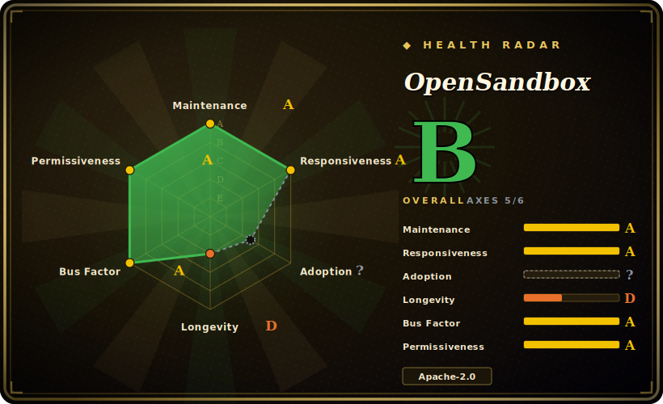

# OpenSandbox

A general-purpose, secure sandbox runtime and platform for AI agents — multi-language SDKs, a unified sandbox protocol, and Docker/Kubernetes backends for running untrusted agent-generated code, GUI/browser automation, and RL/eval workloads in isolated environments.

## When to use

You're building a coding agent (or an agent-evaluation harness) and you've hit the wall every such project hits: the model wants to run shell commands, write files, `pip install`, and execute arbitrary code it just generated — and you cannot let that touch your host or your other tenants. You've been stitching together raw Docker `exec` calls, a homegrown filesystem API, and some scary networking, and it doesn't scale past a laptop. You reach for OpenSandbox: you `pip install opensandbox`, point it at a runtime (local Docker for dev, the Kubernetes runtime for fleet scale), and get a uniform API to create a sandbox, run commands, move files in and out, and run a built-in Code Interpreter — with per-sandbox egress controls and a credential vault so the workload never sees your real secrets. The same SDK call works whether you're on one machine or scheduling thousands of sandboxes on a cluster.

You also reach for it when isolation strength is the requirement, not an afterthought: it can run sandboxes on secure container runtimes (gVisor, Kata Containers, Firecracker microVM) rather than plain containers, and it exposes a unified ingress gateway plus a sandbox protocol you can extend with custom runtimes. If you're comparing against hosted code-execution APIs but want to self-host the runtime — keeping the agent's code execution inside your own infra — this is the kind of platform that targets that gap.

## When NOT to use

- **You just need to run one trusted script locally.** If the code is yours and trusted, a plain Docker container or a subprocess is far less machinery than a full sandbox platform with a server, runtime, and protocol.
- **You can use a hosted code-execution API and don't want to operate infra.** Managed sandbox services (E2B, Daytona, vendor code-interpreter APIs) remove the ops burden entirely; OpenSandbox is something you run and keep running.
- **You need a battle-tested, years-proven dependency today.** The repo was created 2025-12 — it is months old. High stars on a months-old project is a hype signal, not a Lindy/track-record signal; APIs and the sandbox protocol may still churn. [推断]
- **Your isolation requirements demand a specific, audited runtime you must certify yourself.** OpenSandbox can drive gVisor/Kata/Firecracker, but you still own configuring and validating that the isolation meets your threat model — the platform integrating them is not a substitute for that review. [未验证]
- **You don't run Kubernetes or Docker and don't want to.** The runtimes are Docker and Kubernetes; there is no serverless/no-infra mode — the orchestration layer is yours to operate.

## Comparison

| Alternative | In index | Our verdict | Tradeoff |
|---|---|---|---|
| E2B (firecracker sandboxes) | 未收录 | Use this page for its stated niche; choose E2B (firecracker sandboxes) when you need popular hosted+OSS sandbox SDK for agent code execution. | Popular hosted+OSS sandbox SDK for agent code execution; managed cloud is turnkey, but self-hosting and multi-runtime breadth differ — OpenSandbox foregrounds K8s-scale + multiple secure runtimes. |
| Daytona | 未收录 | Use this page for its stated niche; choose Daytona when you need dev-environment/sandbox runtime for agents. | Dev-environment/sandbox runtime for agents; overlapping use case, different orchestration and feature emphasis. |
| gVisor / Kata / Firecracker (alone) | 未收录 | Use this page for its stated niche; choose gVisor / Kata / Firecracker (alone) when you need the isolation primitives themselves. | The isolation primitives themselves — OpenSandbox orchestrates these; using them directly means building the sandbox lifecycle/API/scheduling yourself. |
| Plain Docker / containerd | 未收录 | Use this page for its stated niche; choose Plain Docker / containerd when you need ubiquitous and trusted, but gives you a container, not a sandbox protocol, credential vault, egress. | Ubiquitous and trusted, but gives you a container, not a sandbox protocol, credential vault, egress policy, or multi-language SDK surface. |
| Jupyter Kernel Gateway / nsjail | 未收录 | Use this page for its stated niche; choose Jupyter Kernel Gateway / nsjail when you need narrower, single-purpose code-execution/isolation tools. | Narrower, single-purpose code-execution/isolation tools; less of an agent-oriented platform. |

## Tech stack

- **Languages:** Python is the primary language; the project ships SDKs in Python, Java/Kotlin, JavaScript/TypeScript, C#/.NET, and Go.
- **Runtimes:** Docker (local) and a Kubernetes runtime/controller for distributed scheduling.
- **Isolation:** integrates secure container runtimes — gVisor, Kata Containers, and Firecracker microVM — for stronger host/workload separation.
- **Surface:** a `osb` CLI, an MCP server integration, a unified ingress gateway with per-sandbox egress controls, a credential vault, and a documented sandbox protocol (lifecycle + execution APIs) in `specs/`.
- **Built-ins:** Command, Filesystem, and Code Interpreter environments; examples for Claude Code, Chrome/Playwright browser automation, and VNC/VS Code desktops.

## Dependencies

- **Runtime you must run:** a container runtime — Docker for local use, or a Kubernetes cluster for scale (plus the OpenSandbox lifecycle server/controller). This is the load-bearing dependency.
- **Optional secure runtimes:** gVisor, Kata Containers, or Firecracker if you want stronger-than-container isolation — each adds its own host/kernel setup.
- **SDK install:** `pip install opensandbox` (Python), Maven/Gradle artifacts under `com.alibaba.opensandbox`, `@alibaba-group/opensandbox` (npm), a .NET package, and a Go module. The CLI is `opensandbox-cli`.
- **Network:** the ingress gateway and egress controls assume you provide the surrounding network plumbing.

## Ops difficulty

**Medium-to-high.** The local Docker path is approachable for development. Production is a real platform to operate: a lifecycle server, a Kubernetes controller, an ingress gateway, egress policy, and a credential vault — plus, if you want strong isolation, the host-level setup for gVisor/Kata/Firecracker (kernel features, node configuration). You are running a multi-component distributed system whose whole job is to safely execute untrusted code, so getting isolation, networking, and secret handling right is the hard part, and it's security-critical. The project carries an OpenSSF Best Practices badge and a GOVERNANCE.md, which helps, but the operational surface is inherently larger than a single binary or a hosted API.

## Health & viability

- **Maintenance (2026-06).** Last pushed 2026-06-27; multiple component releases tagged 2026-06-25 (python SDK v0.1.13, java v1.0.15) — **very active** development. Not archived. [推断]
- **Backing & governance (2026-06).** Originated from Alibaba (the repo's own badges/links reference `github.com/alibaba/OpenSandbox`) and now sits under the `opensandbox-group` org with a GOVERNANCE.md, an OpenSSF Best Practices entry, and a CNCF Landscape listing — signals of an intent toward open, multi-maintainer governance backed by a large vendor. [未验证]
- **Age × Lindy (2026-06).** Created 2025-12 — roughly 6 months old. This is a **young project**; Lindy gives it no credit yet. ~11.7k stars on a months-old repo is a strong hype/attention signal but says nothing about longevity. Treat API/protocol stability as unproven. [推断]
- **Adoption & ecosystem.** Broad SDK coverage (5 languages), MCP integration, and CNCF Landscape presence suggest real ecosystem ambition; production-user evidence at this age is thin and unverified. [未验证]
- **Risk flags.** Youth is the main one — API churn and unproven track record. Single large-vendor origin (Alibaba) is a governance consideration despite the multi-maintainer framing; verify how decisions are actually made if you depend on it. [推断]

## Caveats (unverified)

- [未验证] ~11.7k stars and v0.1.13 (python SDK) as of 2026-06 — star and version numbers are date-sensitive and shift release-to-release; treat as indicative only.
- [未验证] The "secure container runtime" support (gVisor/Kata/Firecracker) is claimed in the README; the exact maturity, configuration burden, and isolation guarantees of each were not verified against the source.
- [推断] Alibaba origin is inferred from README badges/links pointing to `github.com/alibaba/OpenSandbox`; the canonical repo is now under `opensandbox-group`. The precise ownership/transfer and governance reality were not confirmed.
- [推断] "Months old + very high stars" is treated as a hype/risk signal per the read-repo methodology, not a verdict on quality; the project may mature, but its Lindy track record does not exist yet.
- [未验证] Comparisons to E2B/Daytona reflect general positioning, not a measured feature-by-feature benchmark.
