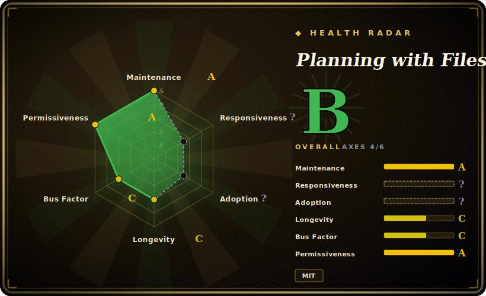

# Planning with Files

A SKILL.md-standard skill that makes a coding agent keep `task_plan.md` / `findings.md` / `progress.md` on disk so it survives `/clear`, compaction, and crashes — Manus-style file-based planning, with an opt-in completion gate, plus per-IDE lifecycle hooks.

## When to use

You're driving a coding agent through a long, multi-step task — a migration, a refactor across a dozen files, a research-then-implement run — and the context window keeps betraying you. The agent fills up, auto-compacts or you hit `/clear`, and it comes back having forgotten the plan: it re-does finished phases, drops the "fix this after the migration lands" note, or declares victory three steps early. You've tried pasting a TODO list back in by hand, but nothing survives the next compaction.

You install Planning with Files (`npx skills add OthmanAdi/planning-with-files --skill planning-with-files -g`). Now the agent writes its phases to `task_plan.md`, its discoveries to `findings.md`, and a running log to `progress.md`, and the shipped lifecycle hooks re-inject the plan at the start of each turn (and, on supported IDEs like Claude Code / Codex / Cursor, before tool use) so state lives on disk instead of only in the window. After a `/clear` the session-catchup hook reconstructs what happened since the files were last touched. For autonomous runs you opt into `--gated` mode, where a Stop-hook completion gate holds the agent until the plan's phases are actually done — and an append-only JSONL run ledger replaces the raw `progress.md` tail with a fixed-shape summary. Because it speaks the SKILL.md/Agent-Skills standard, the same skill drops into Claude Code, Cursor, Codex, Copilot, Gemini CLI, Kiro, OpenCode and 60+ other agents.

## When NOT to use

- **You want a queryable, dependency-aware task graph, not flat markdown.** These are three append-style `.md` files an agent reads/writes — there is no `bd ready`-style unblocked-work query, no dependency edges enforced by a datastore, no merge-safe hash IDs. If you need a real task graph, reach for [beads](beads.md).
- **Your agent / IDE has no lifecycle hooks.** The "survives context loss" magic is hooks (UserPromptSubmit / PreToolUse / PostToolUse / Stop / PreCompact). On a plain Agent-Skills install with no hook support you get the templates and conventions, but not the automatic re-injection or completion gate — the behavior degrades to "the model is told to use the files."
- **You distrust a fast-moving, single-author project for unattended autonomous runs.** Version churn is rapid (v2.x → v3.1.3 in a short window, with multiple hotfixes for broken YAML frontmatter and hook-flag drift). The gated/autonomous modes are new (v3.0+) and the safety claim is "an incomplete plan alone never blocks a stop" — verify that gate behaves as you expect before trusting it to babysit an unattended agent.
- **You need the completion gate as a hard guarantee.** The gate blocks a Stop only when five conditions hold and has a block-count cap and a "ledger must have progressed" check precisely so it can't trap a session — meaning it is advisory by design, not an absolute "won't stop until done" lock.
- **You only ever do short, single-turn tasks.** If your work fits in one context window and never compacts, the plan files and hooks are overhead with little payoff.
- **You want vendor-neutral plumbing with zero Claude/Manus framing.** The skill, docs, and defaults are heavily Claude-Code-first (plugin + slash commands `/plan`, `/plan-goal`, `/plan-loop`); other IDEs are supported but lag in parity release-to-release.

## Comparison

| Alternative | In index | Tradeoff |
|---|---|---|
| [beads](beads.md) | ✅ | Dependency-aware, version-controlled task *graph* (Dolt-backed, `bd` binary) with merge-safe IDs and ready-detection; heavier and a real datastore vs. these three plain markdown files an agent edits. |
| [Context Mode](context-mode.md) | ✅ | Sibling agent-context approach; overlapping "keep the agent oriented" goal, different mechanism — compare the two pages directly for your IDE. |
| [Ralph](ralph-claude-code.md) | ✅ | Long-running autonomous-loop harness for Claude Code; orchestrates the run, whereas Planning with Files supplies the persistent plan/state the loop reads and writes. |
| Plain `task_plan.md` / `TODO.md` you maintain by hand | 未收录 | Zero install and fully yours, but no lifecycle hooks, no auto re-injection after `/clear`, no completion gate, no session catchup — exactly the manual workflow this skill automates. |
| Native agent memory (`CLAUDE.md`, Cursor rules, Codex `AGENTS.md`) | 未收录 | Built-in, always loaded, no extra install — but a static instruction file, not a per-task evolving plan with progress logging and a stop gate. |
| Manus / hosted autonomous-agent products | 未收录 | The commercial pattern this skill imitates ("work like Manus"); managed and richer, but a hosted product, not an open, IDE-local, repo-committable skill. |

## Health & viability

- **Maintenance** — last push 2026-06 with a recent release (v3.1.3, 2026-06-16) as of 2026-06: actively maintained, even fast-moving (v2.x → v3.1.3 in a short window). The cadence is a double-edged sword: multiple hotfixes for broken YAML frontmatter and hook-flag drift mean the surface is volatile, and only ~8 open issues. [推断]
- **Governance / bus factor** — `[推断]` single-author (`User`-owned, `OthmanAdi`); ~24k stars on a one-maintainer skill repo is a bus-factor flag, and the gated/autonomous modes are new (v3.0+). No team or foundation behind the roadmap — verify behavior before trusting it to babysit unattended runs.
- **Age & Lindy** — created 2026-01, so only months old as of 2026-06 despite the v3 version number (which reflects rapid iteration, not maturity): too young for a Lindy verdict. Read the high stars as ecosystem hype, not durability.
- **Risk flags** — `[未验证]` MIT, no relicense history. The real risk is *volatility on an unattended path*: a fast-churning single-author project whose completion gate is advisory-by-design (not a hard "won't stop until done" lock) and whose hook behavior degrades silently on IDEs that don't fire the events.

## Caveats (unverified)

- [未验证] Star count surfaced ~23,968 as of 2026-06; GitHub stars in this ecosystem are unreliable and date-sensitive — treat as indicative only.
- [未验证] The "96.7% pass rate (v2.21.0, sonnet-4-6, 30 assertions)" and "3/3 blind A/B wins" are the project's own evals (`docs/evals.md`), not independently reproduced.
- [未验证] "Installs across 60+ agents / 17+ platforms via SKILL.md" is the project's own framing; the README lists ~17 named IDEs plus a generic Agent-Skills path. Per-IDE hook parity lags release-to-release (the changelog repeatedly backports lagging variants), so a given IDE's behavior should be verified against its own setup doc.
- [推断] Classifying this as a `skill-pack` (markdown templates + hook scripts, no standalone runtime) rather than a `tool` follows from its SKILL.md packaging and `npx skills add` distribution; the repo does ship executable shell/PowerShell/Python hook scripts, so the line is not perfectly clean.
- [未验证] The SHA-256 attestation ("locks `task_plan.md`; hooks block injection on tamper", v2.37+) and the v3 gated/autonomous mode semantics are described from the README/changelog, not independently tested.
- [推断] "Survives crashes / context loss" depends entirely on the host IDE actually firing the relevant lifecycle hooks; on runtimes that don't fire a given event (some hooks are noted as dormant there), that guarantee does not hold.
