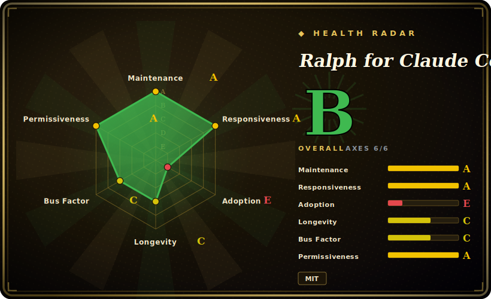

# Ralph for Claude Code

A Bash harness that wraps the Claude Code CLI in an autonomous "Ralph" loop — re-invoking Claude against `.ralph/PROMPT.md` until a dual-condition exit gate fires — with rate limiting, a circuit breaker, and a tmux monitoring dashboard so the loop doesn't run away or burn tokens forever.

## When to use

You're a developer who has a well-scoped backlog — a `fix_plan.md` checklist, or a PRD you can convert into one — and you want Claude Code to grind through it unattended instead of you babysitting one prompt at a time. You've tried naive "just keep saying continue" loops and hit the two failure modes: either Claude declares victory early ("Phase complete!") and stops with work left, or it never stops and you wake up to a depleted API budget and a circuit you wish had tripped. You want the autonomy of Geoffrey Huntley's Ralph technique without hand-rolling the safety rails.

So you `ralph-enable` (or `ralph-import requirements.md`) in your repo, drop your goals into `.ralph/PROMPT.md` and tasks into `.ralph/fix_plan.md`, and run `ralph --monitor`. The harness loops Claude Code, and its exit gate only fires when BOTH heuristic completion indicators AND an explicit `EXIT_SIGNAL: true` agree — so "Phase complete, moving on" with `EXIT_SIGNAL: false` keeps going. Meanwhile the tmux dashboard shows loop count, API calls vs. your hourly cap, and circuit-breaker state; the breaker opens after 3 no-progress loops or 5 identical errors; rate limiting (default 100 calls/hr) and per-loop timeouts keep cost bounded. Git backup branches (`--backup` / `--rollback`) give you an undo, and you can fan it into Docker or E2B sandboxes if you don't want it touching your host.

## When NOT to use

- **Provider lock-in to Claude Code.** This is a wrapper around Anthropic's `claude` CLI specifically; there is no model/provider abstraction shipping today (the README lists multi-provider as a *planned* pre-1.0 item). If you run GPT/Gemini/local agents, this harness doesn't drive them.
- **You don't already have a structured plan.** Ralph executes a `fix_plan.md` checklist; it is a *loop driver*, not a planner or a task graph. Vague goals produce vague autonomous churn. Pair it with a real task store (see [beads](beads.md)) or a planning workflow.
- **Cost-sensitive / supervised-only shops.** By design it makes many unattended Claude API calls; spend scales with loop count and model. The rate limit and circuit breaker bound it, but a runaway-cost-averse team that wants a human in every loop gets little from the automation.
- **Windows-native / no-Bash environments.** It needs Bash 4.0+, `jq`, `git`, GNU coreutils (`gtimeout` on macOS), and tmux for the dashboard. It's a Unix shell harness, not a portable binary.
- **Parallel / high-throughput work.** Queue items are processed one at a time; there is no concurrent multi-agent execution. It's a serial babysitter, not a fleet scheduler.
- **Maturity-sensitive use.** Sub-1.0, single-maintainer-led, no tagged GitHub releases — version comes from in-repo/README text. A v0.10 release already moved all files into `.ralph/` (a breaking layout change needing `ralph-migrate`); expect flags and layout to keep shifting.

## Comparison

| Alternative | In index | Our verdict | Tradeoff |
|---|---|---|---|
| [beads](beads.md) | ✅ | Use this page for its stated niche; choose beads when you need a persistent dependency-aware *task graph* (the *what to do* store). | A persistent dependency-aware *task graph* (the *what to do* store); Ralph is the *loop that does it*. Complementary — Ralph even imports beads tasks — not substitutes. |
| [CCPM](ccpm.md) | ✅ | Use this page for its stated niche; choose CCPM when you need spec/PRD-driven project management on top of Claude Code with GitHub-issue workflows. | Spec/PRD-driven project management on top of Claude Code with GitHub-issue workflows; heavier on planning structure, less on a hardened unattended run-loop with circuit breaker + rate limiting. |
| [Entire](entire-cli.md) | ✅ | Use this page for its stated niche; choose Entire when you need a broader agent-workflow CLI. | A broader agent-workflow CLI; overlaps on driving an agent but with a different orchestration model than Ralph's single-prompt Bash loop. |
| [Context Mode](context-mode.md) | ✅ | Use this page for its stated niche; choose Context Mode when you need focuses on context/memory shaping for the agent rather than an autonomous completion loop with exit. | Focuses on context/memory shaping for the agent rather than an autonomous completion loop with exit detection. |
| Geoffrey Huntley's original Ralph (`while :; claude -p ...`) | 未收录 | Use this page for its stated niche; choose Geoffrey Huntley's original Ralph (while :; claude -p ...) when you need the raw technique is a one-line shell loop. | The raw technique is a one-line shell loop; this project is that idea plus exit gating, rate limits, circuit breaker, monitoring, backups, and sandboxing — i.e. the safety scaffolding the bare loop lacks. |
| Aider `--auto` / OpenHands / SWE-agent | 未收录 | Use this page for its stated niche; choose Aider --auto / OpenHands / SWE-agent when you need general autonomous coding agents with their own models/loops. | General autonomous coding agents with their own models/loops; not Claude-Code-CLI wrappers and not built around the dual-condition `EXIT_SIGNAL` gate. |

## Tech stack

- **Language:** Shell / Bash (4.0+) — the harness is shell scripts (`ralph`, `ralph-monitor`, `ralph-setup`, `ralph-import`, `ralph-queue`, `ralph-enable`, `ralph-migrate`).
- **Drives:** the Claude Code CLI (`claude`), invoked per loop with the project prompt; JSON output format with text fallback.
- **State:** plain files under `.ralph/` — `PROMPT.md`, `fix_plan.md`, `AGENT.md`, `status.json`, `.ralph_session`, `logs/ralph.log` (rotating), `logs/metrics.jsonl`.
- **Tooling:** `jq` (JSON), `git` (backup branches / progress via commit counts), `tmux` (split-pane monitor), GNU coreutils `timeout`/`gtimeout`.
- **Optional execution:** Docker and E2B cloud sandboxes; `gh` CLI for GitHub issue import; BATS for the project's own test suite.

## Dependencies

- **Required runtime:** Bash 4.0+ (with 3.x compatibility shims noted in the README), the Claude Code CLI (`npm i -g @anthropic-ai/claude-code` or npx), `git`, `jq`, GNU coreutils for `timeout` (`brew install coreutils` → `gtimeout` on macOS).
- **Recommended:** `tmux` for the live monitoring dashboard.
- **Optional:** `gh` (GitHub CLI) for issue import/lifecycle; Docker for container sandboxing; E2B SDK (`pip install e2b`) for cloud sandbox runs.
- **An Anthropic account / Claude Code access** with API budget — the loop's whole job is to call it repeatedly.

## Ops difficulty

**Low-to-medium.** Install is a `git clone` + `./install.sh` that drops global commands; per-project it's a `ralph-enable` wizard or a PRD import, and on the happy path you run `ralph --monitor` and watch. Difficulty rises because: you must keep the Unix toolchain present and correct (Bash version, `jq`, coreutils `gtimeout` on macOS, tmux); you own tuning the safety knobs (`--calls`, `--timeout`, circuit-breaker thresholds) for your cost tolerance; the `.ralph/` file layout and CLI flags have churned across versions (a v0.10 breaking move required `ralph-migrate`); and unattended runs still need you to babysit budget, sandbox cost alerts, and the occasional stuck loop. Letting it touch a real repo unsandboxed is the main risk — backup branches and `--rollback` exist precisely because an autonomous loop can make a mess.

## Health & viability

- **Maintenance** — last push 2026-06 (as of 2026-06) on a v0.11.x line, so actively worked, but **no tagged GitHub releases** exist — the version comes from in-repo README text, not published artifacts. A v0.10 release already moved all files into `.ralph/` (a breaking layout change needing `ralph-migrate`), so expect flags/layout to keep shifting. [推断]
- **Governance / bus factor** — `[推断]` single-maintainer, `User`-owned repo (`frankbria`); no releases, no team or foundation. ~9.5k stars on a one-person harness is a bus-factor flag — abandonment and flag/layout drift risk is non-trivial for anything you can't re-tool.
- **Age & Lindy** — created 2025-08, so under a year old as of 2026-06 and still sub-1.0: too young for a Lindy verdict. It packages an established *technique* (Geoffrey Huntley's Ralph loop), but this particular harness is unproven on longevity.
- **Risk flags** — `[未验证]` MIT, no relicense history. The structural risk is **provider lock-in**: it wraps Anthropic's `claude` CLI specifically (multi-provider is a *planned*, not shipped, pre-1.0 item). Operationally it makes many unattended paid API calls, so cost runaway is real — the circuit breaker and rate limit are the only guardrails.

## Caveats (unverified)

- [未验证] **No tagged GitHub releases.** `gh repo view` returns `latestRelease: null` and the Releases page says "There aren't any releases here." The "v0.11.5" / "v0.11.x" version and the entire changelog (784 tests, dual-condition gate fixes, etc.) come from the in-repo README text, not a published release artifact — treat version specifics as repo-self-reported.
- [未验证] **Star count ~9.5k** (gh reported 9,464 as of 2026-06-26). GitHub stars in this ecosystem are unreliable and date-sensitive; indicative only.
- [推断] **Single-maintainer / sub-1.0 churn.** Owner-named repo, no releases, a documented breaking `.ralph/` layout migration, and README notes of bash-3.x and false-positive fixes suggest active-but-unstable surface; abandonment and flag/layout drift risk is non-trivial for anything you can't re-tool.
- [未验证] **Exact safety-gate behavior** — the dual-condition exit (`completion_indicators >= 2` AND `EXIT_SIGNAL: true`), circuit-breaker thresholds (3 no-progress loops / 5 identical errors), 100 calls/hr default, and 5-hour API-limit detection are all from the README; not independently exercised here, and LLM-driven completion heuristics are inherently best-effort, not guaranteed.
- [推断] **Multi-provider support is aspirational.** The README frames provider abstraction as a planned pre-1.0 item; as of this verification it is a Claude-Code-CLI-only wrapper.
- [未验证] **Docker/E2B cost controls** (`--sandbox-max-cost`, `--sandbox-cost-alert`) and the "no parallel processing" limitation are stated in the README, not independently confirmed.
