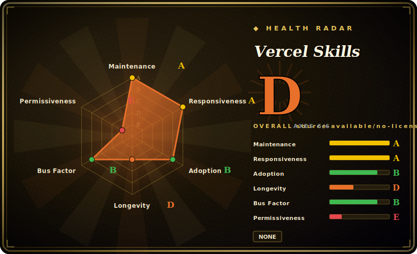

# Vercel Skills

A package-manager-style CLI (`npx skills`) that installs, finds, and updates agent "skills" — `SKILL.md` instruction packs — into 70+ coding agents from GitHub/GitLab/local sources. It is the *installer*, not the skill content.

## When to use

You're a developer who has collected a handful of agent skills — some you wrote, some pulled from `SKILL.md` packs you found on GitHub — and you're sick of the manual ritual: clone the repo, copy the right directory into `.claude/skills` (or `.opencode`, or `.cursor`, depending on which agent you're driving today), repeat for every machine and every project, then have no idea which ones drifted out of date a month later. You want the npm-style affordance for skills: one command to add a pack from `owner/repo`, one to list what's installed, one to update them all.

So you run `npx skills add owner/repo` to drop a skill into the right agent directory, `npx skills find <keyword>` to discover packs through the skills.sh registry, and `npx skills list` / `npx skills update` to keep them current — and because it knows the layout conventions of OpenCode, Claude Code, Codex, Cursor and dozens more, the *same* command lands the skill in the correct place regardless of which agent you happen to use. It's a thin, dependency-light TypeScript binary you invoke through `npx`, so there's nothing to host and nothing to keep running.

## When NOT to use

- **You want the skills themselves, not a way to manage them.** This is the installer/manager. The actual reusable instructions are *content* packs — the [skill-pack] siblings below (Planning with Files, Context Mode, etc.) are the kind of thing it installs. Adding this tool gives you zero new agent capabilities until you point it at content.
- **You only use one agent and rarely change skills.** If you live entirely in Claude Code and hand-copy two skills a year, the value (cross-agent path resolution, bulk update) is marginal over `cp` + a git submodule; you're taking a dependency for ergonomics you won't exercise.
- **You need MCP-server, plugin, or tool-binary management.** Its scope is `SKILL.md` instruction packs only — it does not install or run MCP servers, manage agent binaries, or orchestrate runtime state. For task/state tooling see the comparison row for [beads](beads.md).
- **You need a curated, security-reviewed marketplace.** Sources resolve straight from arbitrary GitHub/GitLab/git URLs; installing a pack means trusting third-party prompt content that goes into your agent's context. There is no vetting gate, so supply-chain / prompt-injection caution is on you.
- **Reproducible, pinned installs across a team.** No lockfile / `skills.json` manifest was found in the docs, so version-pinning and deterministic re-install across machines are not first-class today (verify against the current release before depending on it).
- **Maturity ceiling.** Pre-2.0, single-vendor (`vercel-labs`) project moving fast (frequent point releases); the command surface and the registry it talks to can shift release-to-release.

## Comparison

| Alternative | In index | Tradeoff |
|---|---|---|
| [Planning with Files](planning-with-files.md) | ✅ | A skill-pack (content) — the *kind of thing* Skills installs, not a competitor. Use Skills to deliver packs like this into your agent. |
| [Context Mode](context-mode.md) | ✅ | Also a skill-pack / workflow content, not an installer. Orthogonal: Skills is the delivery mechanism, this is the payload. |
| [beads](beads.md) | ✅ | Different layer: persistent task/memory *state* for agents, not skill distribution. You might install both — they don't overlap. |
| Claude Code plugin marketplaces (`.claude-plugin/marketplace.json`) | 未收录 | Native Claude Code plugin/marketplace mechanism; richer (commands, hooks, MCP) but Claude-Code-only. Skills targets `SKILL.md` packs across 70+ agents instead. |
| git submodule / manual `cp` | 未收录 | Zero new dependency and fully transparent, but no cross-agent path resolution, no discovery registry, no bulk `update` — the manual flow Skills replaces. |
| npm / pnpm packaging a skill dir | 未收录 | Reuses the JS package ecosystem (real versioning + lockfiles), but skills aren't npm-shaped and you'd hand-place files per agent; Skills is purpose-built for the `SKILL.md` layout. |

## Tech stack

- **Language:** TypeScript (~95%), small JS surface; built to an `.mjs` CLI (`bin/cli.mjs`).
- **Runtime:** Node.js, invoked via `npx skills` (also exposed as `add-skill`).
- **Distribution:** published to npm as `skills`; run with `npx` (no global install needed).
- **Discovery:** a skills registry at `skills.sh` backs `npx skills find`.
- **Sources resolved:** GitHub shorthand (`owner/repo`), full GitHub/GitLab/generic git URLs, and local paths.
- **Skill format consumed:** directories containing a `SKILL.md` with YAML frontmatter (`name`, `description`); also recognizes Claude plugin manifests (`.claude-plugin/marketplace.json` / `plugin.json`).

## Dependencies

- **Runtime:** Node.js `>=18` (per `engines`); no separate service, daemon, or datastore.
- **Production deps:** a single declared runtime dependency — `yaml` (frontmatter parsing). The rest of the implementation is first-party; `ThirdPartyNoticeText.txt` covers bundled notices.
- **Network:** reaches GitHub/GitLab/git remotes to fetch packs and the `skills.sh` registry for discovery; offline use is limited to already-fetched / local-path sources.
- **Targets:** writes into per-agent skill directories (`.claude/skills`, OpenCode/Cursor/Codex equivalents, etc.) — no global runtime to manage.

## Ops difficulty

**Low.** It is a stateless `npx` CLI: nothing to deploy, no server, no database, no background process. "Operating" it is running commands on demand; the only moving parts are Node `>=18` and network access to the source remotes / registry. The real operational consideration is governance, not infrastructure — because it installs third-party prompt content directly into agent context, treat *which* packs you add (and from where) as the thing to review, and pin/track them yourself since no lockfile mechanism was found.

## Health & viability

- **Maintenance (2026-06):** [推断] actively maintained — last push 2026-06, latest release v1.5.13 (2026-06-23), not archived, on a frequent point-release cadence. Open-issue count (~805 as of 2026-06) is high for a small CLI; read it as active usage churn rather than neglect, but expect a backlog.
- **Governance & backing:** [推断] `vercel-labs` is Vercel's experimental/labs org, not a core Vercel product line. "Labs" repos carry a real deprecation/abandonment risk — Vercel ships many experiments and not all graduate or get long-term support. Single-vendor roadmap; no foundation neutrality.
- **Age & Lindy:** [推断] created 2026-01, so ~0.5 yr old as of 2026-06 — **young, unproven by Lindy**. The install/update ergonomics are useful now, but a half-year-old pre-2.0 labs tool has no longevity track record; the command surface and `skills.sh` registry it depends on can still shift.
- **Risk flags:** [未验证] no lockfile/manifest for pinned reproducible installs (see Caveats); MIT per `package.json` but no detected SPDX `LICENSE` file; it installs arbitrary third-party prompt content into agent context (supply-chain / prompt-injection surface is on the operator). It is an *installer*, so its own viability is somewhat decoupled from the skill content you actually run.

## Caveats (unverified)

- [未验证] Star count ~23.6k (gh `stargazerCount`, 2026-06-26); GitHub stars are unreliable and date-sensitive — indicative only.
- [未验证] License is **MIT** per the README and `package.json` `license` field, but GitHub's license API returned 404 and no SPDX `LICENSE` file appears in the repo root (only `ThirdPartyNoticeText.txt`); SPDX id is inferred from the declared field, not from a detected license file.
- [未验证] "70+ supported agents" / the specific set (OpenCode, Claude Code, Codex, Cursor, …) is the README's own framing; the exact list and each agent's path mapping shift release-to-release — verify a given agent before relying on it.
- [未验证] Absence of a lockfile / `skills.json` manifest is inferred from the docs not mentioning one; a pinning mechanism may exist or land in a later release.
- [推断] Single declared production dependency (`yaml`) is from `package.json`; transitive/bundled code under `src/` and `scripts/` was not audited, so "dependency-light" describes the declared surface only.
- [推断] v1.5.13 latest release dated 2026-06-23, last push 2026-06-25, not archived (gh metadata, 2026-06-26); cadence and "active" status are point-in-time observations, not a maintenance guarantee.
