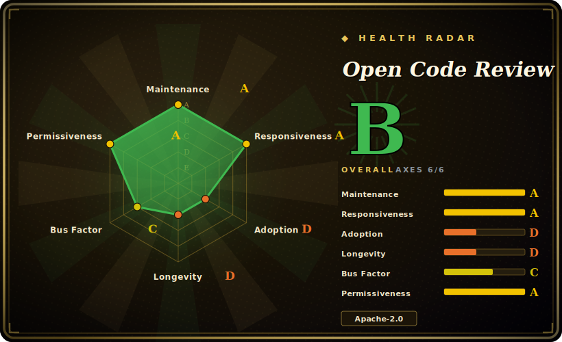

# Open Code Review

A CLI that reads your Git diff, hands changed files to a tool-using LLM agent on top of a deterministic file-selection/rule-matching pipeline, and prints line-level review comments tuned for precision over recall.

## When to use

You're a backend engineer on a Java or Go service and your team's review bottleneck is the boring-but-critical stuff: a missed null check, a non-thread-safe singleton, an unescaped string heading into a SQL query. You want a reviewer that runs in CI on every diff and leaves *specific line-level comments* — not a vibes-based "looks good" — and you'd rather it stay quiet than drown the PR in low-confidence noise. You run `ocr review` against the diff, point it at your OpenAI- or Anthropic-compatible endpoint (or an internal gateway), and it bundles related files, matches its fine-tuned ruleset (NPE, thread-safety, XSS, SQL injection) plus any custom JSON rules, and emits findings with file:line precision. The deterministic layer handles file selection and positioning so comments land on the right line; the agent handles the judgment.

It also fits when you've inherited an unfamiliar codebase and there's no meaningful diff to review. `ocr scan` reviews whole files directly — a pre-migration sweep or an audit of a directory you didn't write — and `--format json` makes either command parseable in a CI script. Because it ships as a single Go binary (or an npm install) and integrates as a Claude Code / Cursor / Codex plugin, you can drop it into an existing agent workflow without standing up a service.

## When NOT to use

- **You want comments auto-posted to the PR/MR.** It outputs to stdout (text or JSON); it does not post to GitHub/GitLab merge requests on its own. You wire that yourself in CI from the JSON. [推断]
- **You need high recall / a "find everything" auditor.** The project explicitly trades recall for precision ("its Recall is lower than general-purpose agents — a deliberate trade-off"). If you want a noisy net that surfaces every possible smell, this is the wrong default.
- **You're chasing security vulnerabilities specifically.** The built-in rules touch a few security classes (XSS, SQL injection) but this is a general review tool, not a dedicated security scanner with taint analysis or a curated CWE catalog — see [claude-code-security-review](claude-code-security-review.md).
- **Your stack is outside the supported language set.** It targets ~10+ languages (Java, Go, Python, JS/TS, Kotlin, Rust, Ruby, XML, shell); exotic or DSL-heavy codebases get weaker rule coverage.
- **You want zero per-token cost or fully offline review.** Every review calls an external (or self-hosted) LLM; there's an API-key and inference-cost dependency on every run.
- **You distrust single-vendor origin / cadence.** It's an Alibaba-originated tool with a fast release train (v1.6.2, many releases); custom-rule format and config surface are coupled to its evolving CLI.

## Comparison

| Alternative | In index | Our verdict | Tradeoff |
|---|---|---|---|
| [claude-code-security-review](claude-code-security-review.md) | 未收录 | Use this page for its stated niche; choose claude-code-security-review when you need anthropic's GitHub Action focused on *security* findings via Claude. | Anthropic's GitHub Action focused on *security* findings via Claude; narrower (security) but PR-native. Open Code Review is broader (general quality + a few security rules) and CLI-first, not auto-posting. |
| [react-doctor](react-doctor.md) | 未收录 | Use this page for its stated niche; choose react-doctor when you need react-specific health/diagnostics for a single framework. | React-specific health/diagnostics for a single framework; Open Code Review is language-agnostic across ~10+ languages, not framework-tuned. |
| CodeRabbit | 未收录 | Use this page for its stated niche; choose CodeRabbit when you need hosted SaaS that auto-comments on PRs with broad recall. | Hosted SaaS that auto-comments on PRs with broad recall; Open Code Review is self-hosted/CLI, precision-biased, and you own the LLM key and posting glue. |
| PR-Agent (Qodo) | 未收录 | Use this page for its stated niche; choose PR-Agent (Qodo) when you need OSS PR assistant that posts to GitHub/GitLab MRs directly and does summaries/Q&A. | OSS PR assistant that posts to GitHub/GitLab MRs directly and does summaries/Q&A; Open Code Review prints structured findings and leans on a deterministic positioning layer rather than MR integration. |
| Semgrep | 未收录 | Use this page for its stated niche; choose Semgrep when you need deterministic rule/AST scanner (no LLM) with a large security ruleset. | Deterministic rule/AST scanner (no LLM) with a large security ruleset; faster and free per run but no agent reasoning or natural-language line comments. |

## Tech stack

- **Language:** Go (~60% of repo) for the core CLI/engine; TypeScript (~23%) for UI/extension/viewer pieces. [未验证] percentages from GitHub language bar.
- **Architecture:** hybrid — a deterministic pipeline (precise file selection, "smart" file bundling with divide-and-conquer, fine-grained rule matching, independent positioning + reflection modules) feeding a tool-using LLM agent with scenario-tuned prompts and toolset.
- **LLM layer:** OpenAI- and Anthropic-compatible protocols; custom/private gateway endpoints supported.
- **Rules:** built-in fine-tuned ruleset (NPE, thread-safety, XSS, SQL injection) plus user-defined JSON rules.
- **Interfaces:** CLI (`ocr review`/`scan`/`config`/`llm`/`rules`/`viewer`), `--format text|json`, `--audience agent`; plugins for Claude Code, Cursor, Codex.

## Dependencies

- **Runtime:** a single self-contained Go binary (Windows/macOS/Linux builds), or install via npm `@alibaba-group/open-code-review`.
- **Required:** Git (it operates on diffs/files) and an LLM API key — an OpenAI- or Anthropic-compatible endpoint, or an internal gateway. No database or server to run.
- **Config:** `~/.opencodereview/config.json` or environment variables (model, endpoint, key, rules).
- **CI:** runs in GitHub Actions / GitLab CI; parse `--format json` output in your pipeline.

## Ops difficulty

**Low.** There's no service, datastore, or daemon to operate — it's a binary you invoke on a diff in CI or locally. The real operational variables are the LLM dependency (endpoint reachability, API-key/secret management, per-PR token cost and latency) and tuning custom JSON rules + config to your repo. Because output goes to stdout, posting findings into PRs/MRs is glue you maintain, not a built-in. No scaling/HA concerns since each invocation is stateless. [推断]

## Health & viability

- **Maintenance (2026-06):** [推断] very actively maintained — last push 2026-06, v1.6.2 released 2026-06-26, on a fast release train (many versions). Low open-issue count (~43) relative to ~9.3k stars suggests issues are being closed, not piling up. Momentum is high *right now*.
- **Governance & backing:** [推断] published under the `alibaba` GitHub org — a large vendor with a long open-source track record (Dubbo, Nacos, Arthas…), which lowers bus-factor risk versus a hobby project. But it's single-vendor, not foundation-governed; the custom-rule format and config surface are coupled to Alibaba's evolving CLI, and vendor-origin tools can be re-prioritized.
- **Age & Lindy:** [未验证] the repo was created ~2026-05 (public OSS history is ~1 month old as of 2026-06) — **very young; no Lindy support yet.** The project claims "two years internal at Alibaba / tens of thousands of developers," which if true gives real maturity behind the public repo, but that framing is the project's own and unverified (see Caveats). Judge the public artifact as new.
- **Risk flags:** [推断] precision-over-recall is a deliberate design choice (it will miss things by design); per-run LLM API cost on every review; Apache-2.0 (permissive, no relicense history found). No CVEs or open-core gating observed.

## Caveats (unverified)

- [未验证] v1.6.2 published 2026-06-26; ~9.3k GitHub stars as of 2026-06 — star counts are unreliable and date-sensitive; treat as indicative only.
- [未验证] Language-mix percentages (Go ~60%, TS ~23%) come from the GitHub language bar and shift with the repo over time.
- [推断] It does not auto-post to GitHub/GitLab MRs — README describes stdout/JSON output and CI parsing, implying you wire posting yourself; verify against the current CLI before relying on it.
- [推断] "Precision over recall" is the project's own stated trade-off; actual false-negative/false-positive rates depend on model, rules, and language — no first-party benchmark numbers were confirmed here.
- [未验证] The "tens of thousands of developers / two years internal at Alibaba" maturity claim is the project's own framing, not independently verified.
- [推断] Supported-language list (~10+) and built-in rule set are README-stated and may change release-to-release; confirm coverage for your stack against the current repo.
