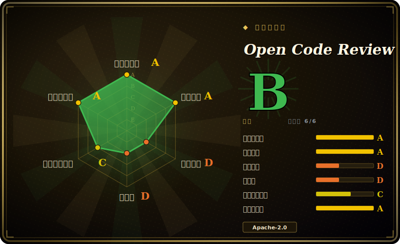

# Open Code Review

一个 CLI：读取你的 Git diff，把改动文件交给一个会用工具的 LLM agent（底层叠着一套确定性的文件选择/规则匹配流水线），输出行级 review 评论，刻意以精确率优先于召回率。

## 何时使用

你是某个 Java 或 Go 服务的后端工程师，团队 review 的瓶颈卡在那些枯燥但要命的点上：漏掉的空指针检查、非线程安全的单例、一段没转义就拼进 SQL 的字符串。你想要一个能在 CI 里对每个 diff 都跑、并留下*具体行级评论*的 reviewer——不是凭感觉的“看着没问题”，而且你宁可它保持安静，也不要用一堆低置信噪声把 PR 淹掉。你对着 diff 跑 `ocr review`，把它指向一个 OpenAI 或 Anthropic 兼容的端点（或内部网关），它就会把相关文件打包、匹配自带的精调规则集（空指针 NPE、线程安全、XSS、SQL 注入）外加你自定义的 JSON 规则，并以 file:line 精度给出发现。确定性层负责文件选择和定位，让评论落在正确的行上；agent 负责判断。

当你接手一个陌生代码库、又没有有意义的 diff 可审时，它同样合适。`ocr scan` 直接 review 整个文件——做迁移前的全量扫一遍，或审一个不是你写的目录——而 `--format json` 让这两条命令的输出都能在 CI 脚本里解析。因为它是单个 Go 二进制（也可用 npm 安装），并能作为 Claude Code / Cursor / Codex 插件接入，你无需起一个服务就能把它塞进现有的 agent 工作流。

## 何时不用

- **你想把评论自动贴回 PR/MR。** 它输出到 stdout（text 或 json），不会自己往 GitHub/GitLab 合并请求里发评论。那部分胶水得你在 CI 里从 JSON 自己接。[推断]
- **你需要高召回 / “全都找出来”式的审计。** 项目明确以精确率换召回率（“它的 Recall 低于通用 agent——一个刻意的取舍”）。如果你想要一张能捞出每一处可疑味道的大网，它的默认行为就不对路。
- **你专门追安全漏洞。** 自带规则触及了几类安全问题（XSS、SQL 注入），但它是通用 review 工具，不是带污点分析或精选 CWE 目录的专职安全扫描器——看 [claude-code-security-review](claude-code-security-review.zh.md)。
- **你的技术栈在受支持语言之外。** 它面向 ~10+ 语言（Java、Go、Python、JS/TS、Kotlin、Rust、Ruby、XML、shell）；冷门或 DSL 重的代码库规则覆盖更弱。
- **你想要零按量成本或完全离线 review。** 每次 review 都会调外部（或自托管）LLM；每跑一次都有 API key 和推理成本的依赖。
- **你不放心单一厂商出身 / 发版节奏。** 这是阿里出身、发版很快的工具（v1.6.2，版本众多）；自定义规则格式和配置面与它持续演进的 CLI 耦合。

## 横向对比

| 替代品 | 是否收录 | 我们的评价 | 取舍 |
|---|---|---|---|
| [claude-code-security-review](claude-code-security-review.zh.md) | 未收录 | 当前页用于它的主场景；如果更看重“Anthropic 的 GitHub Action，聚焦*安全*发现、走 Claude”，再选 claude-code-security-review。 | Anthropic 的 GitHub Action，聚焦*安全*发现、走 Claude；更窄（只安全）但 PR 原生。Open Code Review 更宽（通用质量 + 少量安全规则）、CLI 优先，不自动回贴。 |
| [react-doctor](react-doctor.zh.md) | 未收录 | 当前页用于它的主场景；如果更看重“针对 React 单一框架的健康/诊断”，再选 react-doctor。 | 针对 React 单一框架的健康/诊断；Open Code Review 跨 ~10+ 语言、与语言无关，不为某框架精调。 |
| CodeRabbit | 未收录 | 当前页用于它的主场景；如果更看重“托管 SaaS，在 PR 上自动评论、召回广”，再选 CodeRabbit。 | 托管 SaaS，在 PR 上自动评论、召回广；Open Code Review 自托管/CLI、偏精确率，LLM key 和回贴胶水都你自己掌控。 |
| PR-Agent(Qodo) | 未收录 | 当前页用于它的主场景；如果更看重“OSS 的 PR 助手，直接往 GitHub/GitLab MR 发评论、做摘要和问答”，再选 PR-Agent(Qodo)。 | OSS 的 PR 助手，直接往 GitHub/GitLab MR 发评论、做摘要和问答；Open Code Review 输出结构化发现，靠确定性定位层而非 MR 集成。 |
| Semgrep | 未收录 | 当前页用于它的主场景；如果更看重“确定性规则/AST 扫描器（无 LLM），安全规则库庞大”，再选 Semgrep。 | 确定性规则/AST 扫描器（无 LLM），安全规则库庞大；单次更快、免费但没有 agent 推理或自然语言行级评论。 |

## 技术栈

- **语言：** Go（仓库约 60%）承载核心 CLI/引擎；TypeScript（约 23%）做 UI/扩展/viewer。[未验证] 百分比来自 GitHub 语言条。
- **架构：** 混合式——确定性流水线（精确文件选择、“智能”文件打包配分治处理、细粒度规则匹配、独立的定位 + 反思模块）喂给一个会用工具的 LLM agent，配场景精调的 prompt 和工具集。
- **LLM 层：** OpenAI 与 Anthropic 兼容协议；支持自定义/私有网关端点。
- **规则：** 自带精调规则集（NPE、线程安全、XSS、SQL 注入）外加用户自定义 JSON 规则。
- **接口：** CLI(`ocr review`/`scan`/`config`/`llm`/`rules`/`viewer`)、`--format text|json`、`--audience agent`;Claude Code、Cursor、Codex 插件。

## 依赖

- **运行时：** 单个自包含 Go 二进制（Windows/macOS/Linux 构建），或经 npm `@alibaba-group/open-code-review` 安装。
- **必需：** Git（它对 diff/文件操作）和一个 LLM API key——OpenAI 或 Anthropic 兼容端点，或内部网关。无数据库、无需起服务。
- **配置：** `~/.opencodereview/config.json` 或环境变量（模型、端点、key、规则）。
- **CI:** 在 GitHub Actions / GitLab CI 里跑；在流水线里解析 `--format json` 输出。

## 运维难度

**低。** 没有服务、数据存储或常驻进程要运维——它就是个对着 diff 在 CI 或本地调用的二进制。真正的运维变量在于 LLM 依赖（端点可达性、API key/密钥管理、每个 PR 的 token 成本与延迟）以及把自定义 JSON 规则和配置调到适配你的仓库。因为输出走 stdout，把发现贴进 PR/MR 是你维护的胶水，不是内建能力。每次调用无状态，因此没有扩容/高可用的顾虑。[推断]

## 健康度与可持续性

- **维护（2026-06）：** [推断] 维护非常活跃——最近 push 在 2026-06，v1.6.2 于 2026-06-26 发布，发版很快（版本众多）。未关闭 issue 约 43，相对约 9.3k star 偏低，说明 issue 在被关闭而非堆积。当下势头很强。
- **治理与背书：** [推断] 发布在 `alibaba` GitHub 组织下——一家有长期开源记录的大厂（Dubbo、Nacos、Arthas……），相比业余项目降低了 bus-factor 风险。但它是单一厂商、而非基金会治理；自定义规则格式和配置面与阿里持续演进的 CLI 耦合，厂商出身的工具也可能被重新排定优先级。
- **年龄与 Lindy：** [未验证] 仓库约创建于 2026-05（截至 2026-06，公开开源历史约一个月）——**非常年轻；尚无 Lindy 支撑。** 项目宣称「阿里内部两年 / 服务数万开发者」，若属实则公开仓库背后有真实成熟度，但这一说法是项目自述、未经核实（见存疑）。请按一个全新的公开产物来判断它。
- **风险标记：** [推断] 精确率优先于召回率是刻意的设计选择（它会按设计漏掉一些东西）；每次 review 都有按次 LLM API 成本；Apache-2.0（宽松，未发现 relicense 历史）。未观察到 CVE 或 open-core 功能闸门。

## 存疑（未验证）

- [未验证] v1.6.2 于 2026-06-26 发布；截至 2026-06 约 9.3k GitHub star——star 数不可靠且对时间敏感，仅供参考。
- [未验证] 语言占比（Go 约 60%、TS 约 23%）来自 GitHub 语言条，会随仓库变动。
- [推断] 它不自动回贴 GitHub/GitLab MR——README 描述的是 stdout/JSON 输出与 CI 解析，意味着回贴要你自己接；依赖前请对照当前 CLI 核实。
- [推断] “精确率优先于召回率”是项目自述的取舍；实际漏报/误报率取决于模型、规则和语言——此处未确认任何一方官方跑分。
- [未验证] “服务数万开发者 / 阿里内部两年”这一成熟度说法是项目自己的表述，未经独立验证。
- [推断] 受支持语言清单（~10+）和自带规则集是 README 所述，可能随版本变化；依赖前请对照当前仓库确认你的技术栈覆盖情况。
