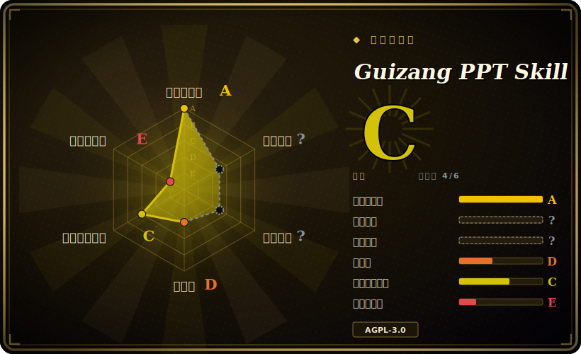

# Guizang PPT Skill

一个 agent 技能：把文章或提纲变成单文件 HTML 横向翻页 PPT，并配套生成 PPT 配图和多平台封面，内置两套锁定的视觉系统（电子杂志风与瑞士国际主义）。

## 何时使用

你是创始人、独立开发者或领域专家，要给线下分享、私享会或产品 demo day 准备一份 PPT，希望它看起来是「设计过的」而不是套模板。你手里有一篇文章或一堆 Markdown 笔记，平时就在 Claude Code 或 Codex 里干活，不想跟 PPT 软件较劲、也不想手动摆每一个色块。你把这个技能装进去，说一句「帮我做一份 7 页左右的瑞士风 PPT，配 2–3 张图」，agent 就会按固定工作流走完——选风格、答 7 问澄清清单、拷贝模板、往具名版式里填内容、可选生成配图、对照 checklist 自检、在浏览器里打开成品。因为产物是一个自包含的 `.html` 文件，你可以直接演示、发送或截图，不用构建、不用服务器。

它最适合你想要把强烈个人审美预先内置好的场景：Style A（电子杂志风 × 电子墨水）偏叙事、有观点；Style B（瑞士国际主义）强制 16 列网格、单一高饱和锚点色、发丝线和 22 个具名版式（`S01`–`S22`），还带一个校验脚本，拦截居中标题、临时发明的页面结构、以及写进 SVG 里的文字。你得到的是一套受约束、agent 可读的设计系统，而不是一块空白画布。

## 何时不用

- **你需要可编辑、可协作的幻灯片。** 产物是静态单文件 HTML，没有 PowerPoint/Google Slides 导出，也无法多人协同编辑。如果同事必须在熟悉的工具里改，这个产物形态就不对。
- **密集数据、表格或培训课件。** README 明确把大段表格和高信息密度课件列为不合适——这套版式是为稀疏、陈述驱动的页面优化的，不是为表格。
- **你不在「文件系统 + 浏览器」的 agent 里。** 它假定 agent 能读写文件、能跑 shell（Claude Code、Codex、Cursor）。没有文件系统和预览的普通 chatbot 很难稳定产出完整 deck。
- **你想要 provider 中立的配图能力。** 可选配图流程是围绕 Codex + GPT-Image / GPT-M 模型描述的；用不了这些就失去集成的配图步骤，得自己找图。[推断]
- **AGPL-3.0 对你是个问题。** 这个技能（含模板/脚本）以 AGPL-3.0 授权；如果你把其中部分嵌进自己对外交付的服务或产品，copyleft 条款会生效——vendoring 前先读条款。
- **你需要长期稳定的契约。** 这是一个年轻、迭代很快的单人维护技能（最新版本 2026-05），版式名、主题预设和澄清流程可能在版本间变动。

## 横向对比

| 替代品 | 是否收录 | 我们的评价 | 取舍 |
|---|---|---|---|
| [guizang-social-card](guizang-social-card.zh.md) | ✅ | 当前页用于它的主场景；如果更看重“同一作者的姊妹技能，但只聚焦单张社交卡片/封面，而非完整多页 deck”，再选 guizang-social-card。 | 同一作者的姊妹技能，但只聚焦单张社交卡片/封面，而非完整多页 deck；视觉规则有重叠，输出更窄。 |
| [html-anything](html-anything.zh.md) | ✅ | 当前页用于它的主场景；如果更看重“通用的 agent 驱动 HTML 产物生成”，再选 html-anything。 | 通用的 agent 驱动 HTML 产物生成；更宽、不带观点，因此没有这个技能内置的锁定 deck 版式、瑞士校验器和封面/配图流程。 |
| [open-design](open-design.zh.md) | ✅ | 当前页用于它的主场景；如果更看重“面向更宽的 UI/设计生成”，再选 open-design。 | 面向更宽的 UI/设计生成；不是带横向翻页运行时和具名版式的演示 deck 专才。 |
| [Impeccable](impeccable.zh.md) | ✅ | 当前页用于它的主场景；如果更看重“偏设计质量导向的生成”，再选 Impeccable。 | 偏设计质量导向的生成；切面不同——不是单文件 HTML deck 工作流。 |
| Slidev | 未收录 | 当前页用于它的主场景；如果更看重“开发者级 Markdown→HTML deck 框架，带构建工具、主题和 dev server”，再选 Slidev。 | 开发者级 Markdown→HTML deck 框架，带构建工具、主题和 dev server；更强、更长期稳定，但不是 agent 驱动，也不对瑞士/杂志审美有观点。 |
| Marp | 未收录 | 当前页用于它的主场景；如果更看重“Markdown→幻灯片（HTML/PDF/PPTX），生态干净、带这个技能缺的导出”，再选 Marp。 | Markdown→幻灯片（HTML/PDF/PPTX），生态干净、带这个技能缺的导出；但单页视觉灵活度远低。 |
| Gamma / Tome | 未收录 | 当前页用于它的主场景；如果更看重“托管式 AI deck SaaS，不是仓库”，再选 Gamma / Tome。 | 托管式 AI deck SaaS，不是仓库——对非 agent 用户更省事，但封闭、无单文件 HTML 产物、无本地 agent 控制权。 |

## 健康度与可持续性

- **维护（2026-06）：** [推断] 活跃——最近 push 在 2026-06-02，最新发布 v1.1.0（2026-05-15），未关闭 issue 约 23，偏低。对一个 prompt/skill 包而言，「维护」主要是作者持续调版式和问询流程；节奏看着健康，但很近期，也可能停下。
- **治理与 bus factor：** [推断] **单人维护、`User` 个人仓库（`op7418`）、约 19k star——典型的 bus-factor 标记。** 一个如此热门却由一人驱动的 skill-pack，继承了这个人的可用性；没有组织或共同维护者兜底。缓解点：产物是你完全拥有的自包含 `.html` 文件，因此上游废弃不会让你已生成的 deck 失效——只是后续更新会停。
- **年龄与 Lindy：** [推断] 创建于 2026-04，截至 2026-06 约 2 个月——**年轻且被热捧（高 star、低年龄）；Lindy 先验基本为零。** 版式名（`S01`–`S22`）、主题预设和问询流程可能随版本变动；别把这套契约当稳定的。
- **风险标记：** [未验证] **AGPL-3.0-only**——若你把模板/脚本 vendoring 进对外交付的产品或网络服务，copyleft 会生效；嵌入前先读条款。可选配图管线绑定特定 Codex/GPT-Image 模型（该步骤有 provider 锁定）。对静态 HTML 生成器而言无相关 CVE。

## 存疑（未验证）

- [未验证] License 依据 GitHub `licenseInfo` API 和 `LICENSE` 文件读为 AGPL-3.0-only（2026-06-26）；依赖 copyleft 范围前请对照仓库核实确切的 SPDX/版本。
- [未验证] 截至 2026-06-26，按 GitHub API：最新版本 v1.1.0（发布于 2026-05-15）、最近 push 于 2026-06-02；star 约 19k——GitHub star 不可靠且对时间敏感，仅供参考。
- [推断] 可选配图步骤在 README 中绑定 Codex + GPT-Image 2.0 / GPT-M 2.0；是否能在其他 agent/provider 上获得等价生成能力未作说明——依赖前请核实。
- [推断] 「22 个具名瑞士版式（S01–S22）」和「Style A 10 种版式」是 README 里项目自己的表述；确切数量和名称可能随版本变动。
- [未验证] 瑞士校验器（`scripts/validate-swiss-deck.mjs`）是个 Node 脚本；其确切规则覆盖范围读自 README 描述，未实际运行验证。
