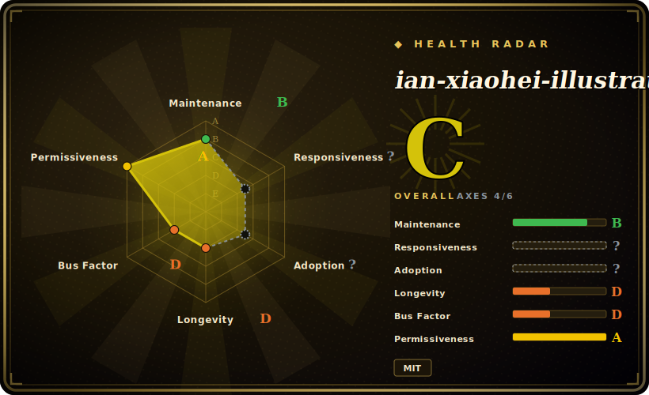

# ian-xiaohei-illustrations

An agent skill that turns a Chinese article into 4–8 hand-drawn 16:9 explanatory illustrations starring the "小黑" (Xiaohei) ink character — your host agent's own image model does the rendering.

## When to use

You're writing a Chinese long-form piece — a 公众号 post, a Notion methodology doc, a blog — and the prose is carrying ideas that *want* a picture: a two-breakpoint judgment, an input→output loop, a before/after, a "one fish, many dishes" reuse. You don't want a stock-photo banner or a tidy corporate infographic; you want something that looks like the author sketched it by hand and is a little weird but lands the point. You drop the article into your coding agent (Codex), invoke this skill, and it first reads the text to find the *cognitive anchors* worth illustrating, proposes a shot list (which paragraph, the core meaning, the structure type, what 小黑 is doing, suggested Chinese annotations), and then — using the agent's built-in `image_gen` — renders each shot as a separate white-background line drawing with sparse red/orange/blue handwritten notes.

Reach for it specifically when consistency of *one* visual voice matters across a whole article and you'd rather steer with a persona ("小黑 pulling the rope", "小黑 stamping the toolbox") than hand-write a fresh prompt per image. The skill is a set of reference docs — style DNA, the IP's action library, composition patterns, a prompt template, a QA checklist — that constrain the model toward a coherent, repeatable look rather than letting each call drift.

## When NOT to use

- **You need editable vector/structured artifacts.** It outputs PNGs only — it explicitly refuses PPTX/PDF/Keynote and SVG/HTML/Canvas editable graphics. If you need an editable deck or a card you can re-template, use [guizang-ppt](guizang-ppt.md) or [guizang-social-card](guizang-social-card.md) / [html-anything](html-anything.md).
- **Your content isn't Chinese (or isn't prose).** The whole skill is tuned for Chinese articles and Chinese handwritten annotations; English decks, data dashboards, or UI mockups are out of scope.
- **You want commercial illustration, cute cartoons, or dense infographics.** The skill deliberately steers *away* from polished commercial art and text-heavy infographics — that's a non-goal, not a limitation to work around.
- **Your host agent has no image-generation tool.** This is a prompt/skill pack, not a renderer: it assumes an agent with a built-in `image_gen` (the repo is packaged as a Codex skill). Without that, you get shot lists but no pictures.
- **You need brand/style lock-in or guaranteed reproducibility.** Output quality and adherence track whatever image model your agent calls; the skill biases the look but cannot pin exact results, and the 小黑 IP is one specific aesthetic you may not want.
- **Maturity:** small single-author skill at v1.0.0; treat longevity and ongoing maintenance as unproven.

## Comparison

| Alternative | In index | Our verdict | Tradeoff |
|---|---|---|---|
| [guizang-social-card](guizang-social-card.md) | ✅ | Use this page for its stated niche; choose guizang-social-card when you need generates polished social/quote cards (often via editable templates), not hand-drawn in-article expl. | Generates polished social/quote cards (often via editable templates), not hand-drawn in-article explanatory sketches; different visual register. |
| [guizang-ppt](guizang-ppt.md) | ✅ | Use this page for its stated niche; choose guizang-ppt when you need builds slide decks (structured, multi-page). | Builds slide decks (structured, multi-page); this skill makes single-concept inline illustrations and refuses decks. |
| [html-anything](html-anything.md) | ✅ | Use this page for its stated niche; choose html-anything when you need produces HTML/CSS artifacts you can edit and host. | Produces HTML/CSS artifacts you can edit and host; this produces flat PNGs in one fixed art style. |
| [open-design](open-design.md) | ✅ | Use this page for its stated niche; choose open-design when you need toward reusable UI/design-system artifacts. | Toward reusable UI/design-system artifacts; orthogonal to a hand-drawn article-illustration persona. |
| [impeccable](impeccable.md) | ✅ | Use this page for its stated niche; choose impeccable when you need different generation target (design artifacts) rather than a fixed-IP Chinese illustration voice. | Different generation target (design artifacts) rather than a fixed-IP Chinese illustration voice. |
| nano-banana / gpt-image prompt packs | 未收录 | Use this page for its stated niche; choose nano-banana / gpt-image prompt packs when you need generic image-prompt collections give you raw model access with no article-analysis, shot-list, or c. | Generic image-prompt collections give you raw model access with no article-analysis, shot-list, or consistent-IP layer this skill adds. |

## Health & viability

- **Maintenance (as of 2026-06):** last pushed 2026-06, not archived — active in absolute terms, but the repo was *created in 2026-05*, so there is barely a month of history to judge cadence on. [推断]
- **Governance & bus factor:** a `User`-owned, single-author skill (helloianneo) at v1.0.0; one person owns the 小黑 IP, the style DNA and the prompt templates. Classic single-maintainer bus-factor risk — if the author stops, nothing carries it. [推断]
- **Age & Lindy verdict:** age < 1 year and ~6k stars on a fresh repo make this **young + lightly-hyped, longevity unproven**; it has not survived long enough for Lindy to say anything. Bet on the *idea* (a consistent illustration persona), not on this repo being here in two years. [未验证]
- **Risk flags:** it is a thin prompt/style layer with no renderer of its own (depends on the host agent's `image_gen`), and the Codex-vs-Claude-Code packaging ambiguity (see Caveats) means host compatibility can shift under you. Low lock-in (MIT, plain markdown) offsets this — you can fork and keep the prompts. [推断]

## Caveats (unverified)

- [未验证] Release v1.0.0 dated 2026-05-27, last pushed 2026-06-03, license MIT — per `gh repo view` on 2026-06-26.
- [未验证] Star count ~6.2k as of 2026-06; GitHub stars are unreliable and date-sensitive — indicative only.
- [推断] The skill is packaged for Codex (install path `${CODEX_HOME:-$HOME/.codex}/skills/`, frontmatter + `agents/openai.yaml`); the README also frames it loosely as a "Claude Code Skill", so the exact set of compatible hosts is ambiguous — verify against your own agent before relying on it.
- [推断] Actual rendering depends on the host agent's built-in `image_gen` tool; the repo ships no model, API key, or rendering code of its own, so output fidelity is model-dependent and not controlled by the skill.
- [未验证] "4–8 illustrations per article" and the refused-output list (PPTX/SVG/etc.) come from SKILL.md's own instructions, not from independent testing.
