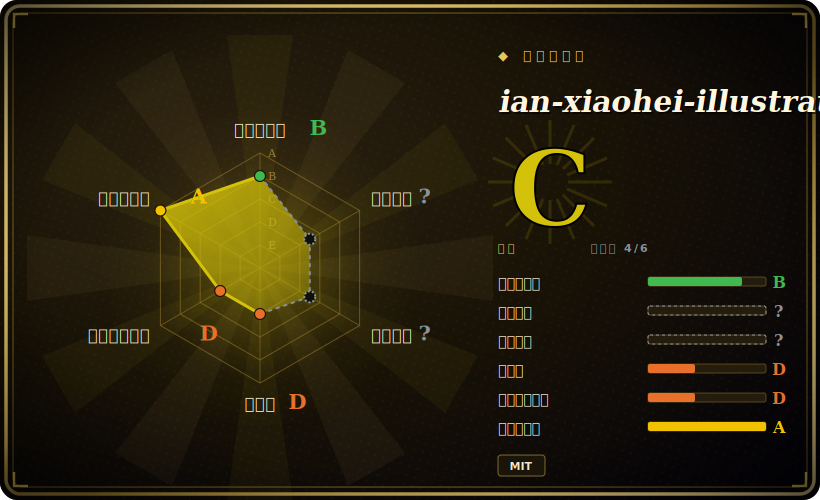

# ian-xiaohei-illustrations

一个 agent skill：把一篇中文文章拆成 4–8 张手绘 16:9 解释图，主角是「小黑」墨点小人——真正出图的是你宿主 agent 自带的图像模型。

## 何时使用

你在写一篇中文长内容——公众号推文、Notion 方法论文档、博客——正文里有些观点天生「想要一张图」：两个断点的判断、输入→输出闭环、前后对比、「一鱼多吃」式复用。你不想要图库 banner，也不想要规整的商业信息图，而是想要一种「像作者亲手画的、有点怪但能戳中要点」的东西。于是你把文章丢进你的 coding agent（Codex），调用这个 skill：它先读正文、找出值得配图的「认知锚点」，给出一份 shot list（放在哪一段、核心意思、结构类型、小黑在做什么、建议的中文手写批注），再用 agent 内置的 `image_gen`，把每张图单独渲染成纯白背景的手绘线稿，配上少量红/橙/蓝手写标注。

当你需要整篇文章保持**同一种视觉嗓音**、并且更愿意用一个人设（「小黑拉线」「小黑盖章工具箱」）来掌舵、而不是逐图手写提示词时，它尤其合适。这个 skill 本质是一组参考文档——风格 DNA、小黑 IP 的动作库、构图模式、提示词模板、QA 检查清单——用来把模型约束到一致、可复用的观感上，而不是让每次调用各自漂移。

## 何时不用

- **你需要可编辑的矢量/结构化产物。** 它只输出 PNG，并明确拒绝 PPTX/PDF/Keynote 和 SVG/HTML/Canvas 可编辑图。要可编辑的 deck 或可改模板的卡片，用 [guizang-ppt](guizang-ppt.zh.md) 或 [guizang-social-card](guizang-social-card.zh.md) / [html-anything](html-anything.zh.md)。
- **你的内容不是中文（或不是散文）。** 整个 skill 是为中文文章和中文手写批注调校的；英文 deck、数据看板、UI 稿都在范围外。
- **你想要商业插画、可爱卡通或密集信息图。** skill 刻意**避开**精修商业画风和文字密集的信息图——这是 non-goal，不是可绕过的限制。
- **你的宿主 agent 没有图像生成工具。** 它是提示词/skill 包，不是渲染器：默认 agent 自带 `image_gen`（仓库按 Codex skill 打包）。没有这个工具，你只能拿到 shot list，没有图。
- **你需要品牌/风格锁定或可复现保证。** 出图质量与贴合度取决于你 agent 调用的图像模型；skill 只能偏置观感、无法钉死结果，而且小黑 IP 是一种特定审美，未必是你想要的。
- **成熟度：** 单作者小 skill，v1.0.0；长期维护与延续性都尚未被证明。

## 横向对比

| 替代品 | 是否收录 | 我们的评价 | 取舍 |
|---|---|---|---|
| [guizang-social-card](guizang-social-card.zh.md) | ✅ | 当前页用于它的主场景；如果更看重“生成精修的社交/金句卡片（常走可编辑模板），不是手绘的正文解释草图”，再选 guizang-social-card。 | 生成精修的社交/金句卡片（常走可编辑模板），不是手绘的正文解释草图；视觉调性不同。 |
| [guizang-ppt](guizang-ppt.zh.md) | ✅ | 当前页用于它的主场景；如果更看重“做幻灯片 deck（结构化、多页）”，再选 guizang-ppt。 | 做幻灯片 deck（结构化、多页）；本 skill 只做单概念正文配图，并拒绝做 deck。 |
| [html-anything](html-anything.zh.md) | ✅ | 当前页用于它的主场景；如果更看重“产出可编辑、可托管的 HTML/CSS 产物”，再选 html-anything。 | 产出可编辑、可托管的 HTML/CSS 产物；本 skill 产出固定画风的扁平 PNG。 |
| [open-design](open-design.zh.md) | ✅ | 当前页用于它的主场景；如果更看重“偏向可复用的 UI/设计系统产物”，再选 open-design。 | 偏向可复用的 UI/设计系统产物；与「固定 IP 的中文配图嗓音」是正交诉求。 |
| [impeccable](impeccable.zh.md) | ✅ | 当前页用于它的主场景；如果更看重“生成目标不同（设计类产物），而非固定 IP 的中文插画风格”，再选 impeccable。 | 生成目标不同（设计类产物），而非固定 IP 的中文插画风格。 |
| nano-banana / gpt-image 提示词包 | 未收录 | 当前页用于它的主场景；如果更看重“通用出图提示词集合给你裸的模型访问，但没有本 skill 的文章分析、shot list、一致 IP 这一层”，再选 nano-banana / gpt-image 提示词包。 | 通用出图提示词集合给你裸的模型访问，但没有本 skill 的文章分析、shot list、一致 IP 这一层。 |

## 健康度与可持续性

- **维护（截至 2026-06）：** 最后 push 在 2026-06，未归档，绝对意义上活跃；但仓库*建于 2026-05*，只有一个多月的历史可供判断节奏。[推断]
- **治理与 bus factor：** `User` 所有、单作者（helloianneo）的 skill，停留在 v1.0.0；小黑 IP、风格 DNA 和提示词模板都由一人掌握。典型的单维护者 bus-factor 风险——作者一旦停手，没人接得住。[推断]
- **年龄与 Lindy 判断：** 年龄不足 1 年、新仓库约 6k star，属于**年轻 + 轻度炒作、延续性未被证明**；它还没活够长到 Lindy 能说什么。押注它背后的*想法*（一致的插画人设），而不是押这个仓库两年后还在。[未验证]
- **风险标记：** 它是一层薄薄的提示词/风格层，自身不带渲染器（依赖宿主 agent 的 `image_gen`），加上 Codex 与 Claude Code 的打包归属含糊（见存疑），宿主兼容性可能在脚下变动。低锁定（MIT、纯 markdown）抵消了部分风险——你可以 fork 把提示词留下。[推断]

## 存疑（未验证）

- [未验证] release v1.0.0 日期 2026-05-27，最后 push 2026-06-03，license MIT——据 2026-06-26 的 `gh repo view`。
- [未验证] star 数约 6.2k（截至 2026-06）；GitHub star 不可靠且对时间敏感，仅供参考。
- [推断] skill 按 Codex 打包（安装路径 `${CODEX_HOME:-$HOME/.codex}/skills/`，有 frontmatter + `agents/openai.yaml`）；但 README 又松散地称其为「Claude Code Skill」，因此兼容宿主的确切集合并不明确——依赖前请对照你自己的 agent 核实。
- [推断] 实际渲染依赖宿主 agent 内置的 `image_gen` 工具；仓库本身不带模型、API key 或渲染代码，因此出图保真度由模型决定、不受 skill 控制。
- [未验证] 「每篇 4–8 张」和被拒绝的输出清单（PPTX/SVG 等）来自 SKILL.md 自身的指令，并非独立测试结论。
