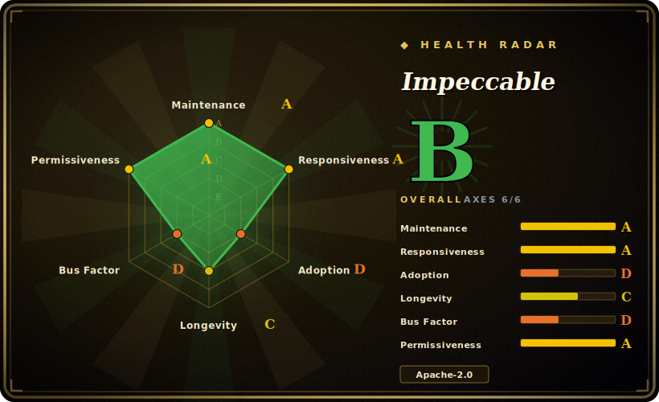

# Impeccable

A design-language layer for AI coding agents: one `/impeccable` skill with ~23 subcommands plus a standalone CLI that runs 44 deterministic detector rules (no LLM, no API key) against AI-generated frontend output.

## When to use

You're a frontend dev or a coding agent operator whose agent keeps shipping the same tells — purple-to-blue gradients, glassmorphism cards, bouncy easing, cramped padding, side-tab borders. The code works, but every screen looks like it came out of the same template, and "make it look better" prompts just produce a different flavor of the same slop. You want a deterministic, repeatable check that flags these patterns in CI and in the editor, plus a shared design vocabulary your agent can act on instead of vibes. You run `npx impeccable detect src/` (or point it at a URL via Puppeteer), get a list of concrete violations with no API key needed, and wire the design hook so detectors fire on every file edit across Cursor, Claude Code, Copilot, Gemini CLI, Codex CLI, OpenCode and friends.

When you want the agent itself to improve the design rather than just lint it, you install the `/impeccable` skill and run subcommands like `audit`, `critique`, `polish`, `bolder`, or `quieter`, after `/impeccable init` distills your audience, brand, voice, colors and typography into `PRODUCT.md` / `DESIGN.md`. The deterministic detectors give you a hard, offline floor; the skill's LLM-driven critique commands give you the judgment layer on top.

## When NOT to use

- **You need a full design system / component library.** Impeccable critiques and detects; it does not give you tokens, components, or a Figma source of truth. Pair it with a real design system, don't replace one.
- **Your stack isn't web frontend.** The 44 rules target HTML/CSS/JS UI artifacts (line length, touch targets, heading order, AI-design patterns). Native mobile, backend, data viz, or non-web UI get little from it.
- **You want provider-neutral guarantees.** Integration is via provider-native skill/hook manifests built per harness (`dist/claude-code/`, `dist/cursor/`, …); a harness it doesn't ship a manifest for needs manual wiring, and the skill's command surface is Impeccable-specific lock-in.
- **You distrust opinionated taste baked into rules.** The deterministic rules encode one team's view of what "AI slop" is (e.g. flagging purple gradients, dark glows). Projects that intentionally use those styles will fight false positives. [推断]
- **You need a frozen, audited rule set.** CLI, Skill and Extension version independently and ship frequently (multiple releases in June 2026); behavior moves under you between versions unless you pin.
- **Headless/offline URL scanning constraints.** URL detection pulls in Puppeteer (a headless Chromium download); in locked-down CI this is extra weight and a network dependency.

## Comparison

| Alternative | In index | Our verdict | Tradeoff |
|---|---|---|---|
| [html-anything](html-anything.md) | ✅ | Use this page for its stated niche; choose html-anything when you need generates HTML artifacts from agents. | Generates HTML artifacts from agents; Impeccable instead critiques/lints what an agent already produced. Complementary, not substitute. |
| [open-design](open-design.md) | ✅ | Use this page for its stated niche; choose open-design when you need a design-language / generation layer in the same category. | A design-language / generation layer in the same category; overlaps on "make agent design better" but differs on whether it lints existing output vs drives generation. Compare the two pages directly. |
| [guizang-ppt](guizang-ppt.md) | ✅ | Use this page for its stated niche; choose guizang-ppt when you need a skill-pack for slide-deck generation. | A skill-pack for slide-deck generation; narrow output type, no deterministic detector or CLI. Impeccable is broader frontend-quality tooling. |
| [guizang-social-card](guizang-social-card.md) | ✅ | Use this page for its stated niche; choose guizang-social-card when you need skill-pack for social-card generation. | Skill-pack for social-card generation; single artifact type vs Impeccable's general UI linting. |
| ESLint + a11y plugins (eslint-plugin-jsx-a11y) | 未收录 | Use this page for its stated niche; choose ESLint + a11y plugins (eslint-plugin-jsx-a11y) when you need mature, AST-based linting for accessibility/code, fully offline. | Mature, AST-based linting for accessibility/code, fully offline; but no notion of "AI-design slop" patterns or aesthetic critique, and no agent-skill layer. |
| Stylelint | 未收录 | Use this page for its stated niche; choose Stylelint when you need deterministic CSS linting with a huge rule ecosystem. | Deterministic CSS linting with a huge rule ecosystem; targets CSS correctness/conventions, not aesthetic AI-pattern detection or agent design coaching. |
| Lighthouse / axe-core | 未收录 | Use this page for its stated niche; choose Lighthouse / axe-core when you need audits performance/accessibility on rendered pages. | Audits performance/accessibility on rendered pages; overlaps on URL scanning but not on AI-design-pattern detection or the skill-driven "polish/bolder/quieter" workflow. |

## Tech stack

- **Language:** JavaScript (~94% per repo), with TypeScript, CSS, Astro, HTML and Svelte present.
- **Distribution:** npm package, run via `npx impeccable`; per-provider build outputs under `dist/<harness>/` (Claude Code, Cursor, etc.).
- **Detector:** 44 deterministic rules that run with no LLM and no API key; covers AI-design patterns (gradients, glows, bounce easing, side-tab borders) and general quality (line length, padding, touch targets, heading order). Exact matching mechanism (regex/AST/heuristic) not documented. [未验证]
- **URL scanning:** Puppeteer (headless Chromium) for `detect <url>`.
- **Skill surface:** one `/impeccable` skill with ~23 subcommands; LLM-driven critique commands layered on top of the offline detectors.
- **Browser extension:** Chrome + Firefox extension running the same deterministic rules on live pages.

## Dependencies

- **Runtime:** Node.js (run via `npx`); a specific minimum Node version is not documented. [未验证]
- **URL detection:** Puppeteer, which downloads a headless Chromium — a heavy, network-fetched dependency only needed for URL scans.
- **LLM:** none required for the detector/CLI/extension (explicitly "no LLM, no API key"); the skill's critique/polish commands run inside your coding agent and use whatever model that harness provides.
- **Install:** `npx impeccable install` (CLI installer), then `/impeccable init` for one-time project setup.

## Ops difficulty

**Low.** The detector path is a single `npx impeccable detect …` with no service to host, no API key, and `--json` output for CI; the heaviest piece is Puppeteer's Chromium download for URL scans. The agent-facing path is the skill/hook install, which is per-harness manifest wiring rather than infrastructure. Ongoing burden is mostly keeping up with frequent CLI/Skill/Extension releases and tuning out false positives on intentional styles.

## Health & viability

- **Maintenance (as of 2026-06):** last pushed 2026-06, not archived, and shipping fast — multiple CLI/Skill/Extension releases in June 2026. Active and clearly under heavy development; the same cadence is also a churn risk (pin versions). [推断]
- **Governance & bus factor:** a `User`-owned repo (pbakaus) carrying ~41k stars — high stars on a single-maintainer project is a **bus-factor flag**: a lot of adoption rides on one person's continued involvement, with no foundation or vendor backstop visible. [推断]
- **Age & Lindy verdict:** created 2025-11, so age < 1 year — **young but already widely starred**. The star count signals real interest, not Lindy-proven durability; treat longevity as unproven and the rule set as still-moving. [未验证]
- **Adoption/ecosystem:** broad harness coverage (Claude Code, Cursor, Copilot, Gemini CLI, Codex CLI, OpenCode, plus a Chrome/Firefox extension) and a no-API-key offline detector lower the bar to try it; that breadth is the main adoption signal. [推断]
- **Risk flags:** permissive Apache-2.0 (low legal/lock-in risk), but the detector encodes one team's aesthetic stance (false positives on intentional styles) and three components version independently — behavior moves between releases unless pinned.

## Caveats (unverified)

- [未验证] Version facts (CLI v3.1.0 released 2026-06-21; Skill v3.8.0; Extension v1.2.1) are from GitHub releases as of 2026-06; the three components version independently and ship frequently, so any pin drifts quickly.
- [未验证] Star count ~41.5k as of 2026-06 — GitHub stars are unreliable and date-sensitive; indicative only.
- [未验证] The internal matching mechanism of the 44 detector rules (regex vs AST vs heuristic) and the exact rule list are not stated in the README surface read; "44 deterministic rules" is the project's own framing.
- [未验证] The precise set of supported harnesses and minimum Node version come from README prose and may change between releases — verify your specific harness/runtime against the current repo.
- [推断] The "AI slop" patterns the detector flags (e.g. purple gradients, dark glows) encode a specific aesthetic stance; whether a given flag is a true defect is project-dependent, so expect false positives on intentional designs.
