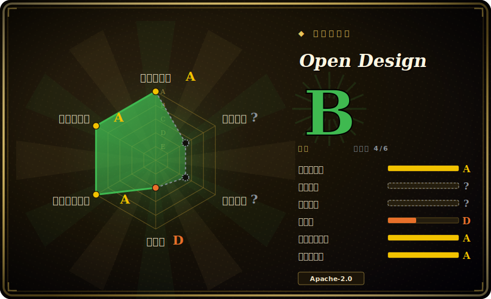

# Open Design

一个 local-first、BYOK 的 Electron 桌面应用，把编码 agent 变成设计工作室——生成沙箱化 HTML 原型、杂志风幻灯片、品牌级图像，以及 HTML→MP4 动态图形，全部由可复用的 Skills 和 `DESIGN.md` 设计系统驱动。

## 何时使用

你是产品工程师或设计师，已经常驻在某个编码 agent 里（Claude Code、Codex、Cursor、Copilot 等），希望它能*产出设计交付物*，而不只是写代码——一个可点击的移动端原型、一份路演 deck、一张品牌社交卡片——而又不想把你的 prompt 和素材都送进别人的云。你在意的是：一切跑在自己机器上、用自己的模型 key、产物是你能留存的纯 HTML/PDF/PPTX/MP4。Open Design 给你一个桌面版 "Studio":agent 读取 `DESIGN.md` 设计系统，在沙箱 iframe 里渲染原型，导出 deck、图像、dashboard 和 HyperFrames(HTML→MP4)——并自带 100+ Skills 与约 150 套品牌设计系统（Linear、Stripe、Apple、Notion 等）作为起点。

当你想要一个能接入*你已有的任何 agent* 的统一设计面时，它同样合适。它不把你锁死在单一助手上，而是通过 MCP server 和 BYOK 代理（任意 OpenAI 兼容端点）对外暴露，因此同一套原型/deck 工作流可被 20+ CLI 调用。你在类浏览器的渲染器里做原型、调 Live Artifact 参数，然后导出文件就走——无需账号，没有按席位计费的 SaaS。

## 何时不用

- **你想要托管、零配置的 SaaS。** 这是一个你需要安装并运行的桌面应用（Electron + 本地 Node daemon）。如果你更想登录一个网站、由厂商打理一切，那么专有的 Claude Design / 类似托管工具更契合——本项目是用这份便利换本地掌控。
- **你需要真正的矢量设计 / 自由画布编辑。** 它生成的是*代码渲染*的产物（HTML/PPTX/MP4），不是可编辑的矢量文档。它定位为“生成侧的 Figma 替代”，但并非协作矢量编辑器——要逐像素手调、实时多人协作或精确矢量工作，Figma/Penpot 仍是该用的工具。
- **早期成熟度 / 频繁变动。** 它仍是 pre-1.0(v0.11.0)，发版快、插件 "Bazaar" 持续扩张；Skills、插件格式和 agent 适配面都还在动。[推断] 锁定风险低（开放格式、Apache-2.0），但 minor 版本之间出现破坏性变更是有可能的。
- **没有 GPU/视频预算却要大量 MP4。** HyperFrames（HTML→MP4）和视频生成依赖本地渲染加上你的 BYOK 模型花费；大批量视频既不免费也不即时。
- **你无法或不愿管理模型 key。** BYOK 就是它的模式——没有内置的免费推理。没有 OpenAI 兼容端点/key，你就生成不了。
- **团队级的生产设计系统治理。** 它是单用户的本地 studio；没有内置多人协作、评审流程或中心化资产治理。

## 横向对比

| 替代品 | 是否收录 | 我们的评价 | 取舍 |
|---|---|---|---|
| [html-anything](html-anything.zh.md) | ✅ | 当前页用于它的主场景；如果更看重“同类目下专注把 prompt 变成独立 HTML 产物的同胞”，再选 html-anything。 | 同类目下专注把 prompt 变成独立 HTML 产物的同胞；Open Design 是围绕这一想法更重的完整桌面 studio（deck/视频/设计系统/导出）。 |
| [Impeccable](impeccable.zh.md) | ✅ | 当前页用于它的主场景；如果更看重“同胞，主打高精度 UI 生成”，再选 Impeccable。 | 同胞，主打高精度 UI 生成；Open Design 覆盖更广（幻灯片、图像、视频、MP4）且以本地应用而非更窄的生成器形态交付。 |
| [guizang-ppt-skill](guizang-ppt.zh.md) | ✅ | 当前页用于它的主场景；如果更看重“单一用途的 deck 生成 Skill”，再选 guizang-ppt-skill。 | 单一用途的 deck 生成 Skill;Open Design 把 deck 生成作为众多产物类型之一，并自带运行时/导出。 |
| [guizang-social-card-skill](guizang-social-card.zh.md) | ✅ | 当前页用于它的主场景；如果更看重“专注社交卡片的 Skill”，再选 guizang-social-card-skill。 | 专注社交卡片的 Skill;Open Design 在一个打包应用里覆盖卡片/图像等多种产物类型。 |
| Claude Design（Anthropic，托管） | 未收录 | 当前页用于它的主场景；如果更看重“本项目克隆的专有托管产品”，再选 Claude Design（Anthropic，托管）。 | 本项目克隆的专有托管产品；托管云 + 打磨度 vs Open Design 的 local-first、BYOK、开放格式立场。 |
| v0(Vercel) | 未收录 | 当前页用于它的主场景；如果更看重“托管的 prompt-to-UI 生成器”，再选 v0(Vercel)。 | 托管的 prompt-to-UI 生成器；云 SaaS、范围更窄（偏 web UI）,vs Open Design 的本地多产物 studio。 |
| Figma / Penpot | 未收录 | 当前页用于它的主场景；如果更看重“真正的矢量设计编辑器，带多人协作”，再选 Figma / Penpot。 | 真正的矢量设计编辑器，带多人协作；Open Design 生成代码渲染产物，而非可编辑矢量文档。 |

## 技术栈

- **语言：** TypeScript（仓库主语言）。
- **前端/Studio:** Next.js 16 App Router + React 18。[未验证] 具体框架版本来自 README，可能随版本变动。
- **本地 daemon:** Node 24 · Express · SSE 流式 · `better-sqlite3` 存储项目/会话。
- **桌面外壳：** Electron + 沙箱 renderer；原型在沙箱 iframe / 仅回环的预览服务里渲染。
- **集成：** MCP server + BYOK 代理，支持任意 OpenAI 兼容端点（发版说明称带 SSRF 防护）。
- **内容：** 约 150 套 `DESIGN.md` 设计系统、100+ Skills、261 个官方插件；deck 模板/主题。
- **导出：** HTML、PDF、PPTX、MP4、ZIP、Markdown。

## 依赖

- **运行时：** 从源码运行需 Node ~24 与 pnpm（README 提到 pnpm 10.33.x）；打包好的桌面版（macOS / Windows / Linux AppImage）自带运行时，无需另装。
- **模型：** 一个 OpenAI 兼容端点的 BYOK key——任何生成都必需；不内置推理。
- **数据存储：** 本地 SQLite(`better-sqlite3`)；核心使用不需要外部数据库/服务。
- **可选：** Docker Desktop（web/Docker 部署）或 Vercel(web)。[未验证] 视频/HyperFrame 导出可能拉取额外的本地渲染依赖——请对照当前文档核实。

## 运维难度

**桌面使用低，源码/web 部署中。** 最快路径是预打包桌面应用：下载、填 BYOK key、生成——几乎零运维，全程本地。从源码运行或自托管 web 构建则是**中**：你要管理 Node 24 / pnpm 版本、本地 daemon，以及 Docker/Vercel 部署，再加上跨 OS 的 Electron 构建摩擦。因为它 local-first 且单用户，没有服务器集群要维护，但你确实要自己负责模型 key 管理、跟上快速 minor 发版的更新，以及本机上的视频/导出工具链。

## 健康度与可持续性

- **维护（截至 2026-06）：** 最后 push 在 2026-06，未归档，pre-1.0 发版很快（v0.11.0）。明显**活跃**，但一个年轻仓库上有约 457 个未关闭 issue，既说明用得多，也说明这是个快速变动、尚未稳定的产物面。[推断]
- **治理与 bus factor：** 由 `Organization`（nexu-io）持有而非单个维护者，相对个人仓库是 bus-factor 上的轻微改善；但这是一个小而未经验证的组织，不是基金会或成熟厂商——路线图归属与资金模式均未核实。[未验证]
- **年龄与 Lindy 判断：** 建于 2026-04，年龄不足 1 年——**非常年轻且被大力炒作**（几个月大的仓库约 72k star）。这里的 star 反映的是发布热潮而非耐久；它是 Lindy 安全押注的反面，按「有前景但未被证明」来权衡。[未验证]
- **风险标记/锁定：** 好处是锁定确实低——Apache-2.0、local-first、BYOK，加上开放的导出格式（HTML/PDF/PPTX/MP4），意味着即便项目停摆你也留得住产物。主要风险是在插件/Skill 格式稳定前，minor 版本之间出现破坏性变更。[推断]

## 存疑（未验证）

- [未验证] v0.11.0（"The Bazaar"）发布于 2026-06-17；仓库最后 push 于 2026-06-26——版本与日期取自 GitHub API/README，考虑到发版很快可能很快变动。
- [未验证] star 数约 71.3k（截至 2026-06）——GitHub star 不可靠且对时间敏感，仅供参考。
- [未验证] 文中引用的数量（100+ Skills、约 150 套设计系统、261 个插件、22+ agent、56 个 deck）是项目自己 README/发版说明的表述，会随版本变动；依赖某个具体数字前请核实当前值。
- [未验证] 框架/运行时版本（Next.js 16、React 18、Node 24、Electron、pnpm 10.33.x）取自 README，未对照 lockfile 独立确认。
- [推断] HyperFrames 被描述为构建在外部框架上的 HTML→MP4 动态图形；其确切渲染管线及系统要求此处未完全核实。
- [推断] “Figma 替代” / “Claude Design 替代” 是项目的定位说法，而非功能对等的保证。
