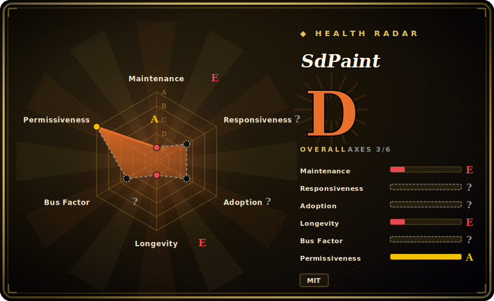

# SdPaint

A real-time sketch-to-image painting app: you draw on a pygame canvas and each stroke is sent to a running Stable Diffusion (AUTOMATIC1111 + ControlNet) backend, so a rough scribble becomes a generated image live as you draw.

## When to use

You're an artist or hobbyist who already runs **AUTOMATIC1111's Stable Diffusion WebUI with the ControlNet extension** locally, and you want a faster, more tactile loop than typing prompts and clicking Generate. You launch SdPaint, it opens a pygame window, and as you sketch (scribble or lineart), it streams each stroke to the WebUI's API with a ControlNet model so the generated picture updates in near-real-time — optionally accelerated with an LCM LoRA for fewer steps. You set a prompt and preset, doodle the composition, and watch SD fill it in, iterating by drawing rather than re-prompting.

You reach for it specifically when you want **interactive scribble-driven generation on your own machine**, you've already paid the cost of a working A1111 + ControlNet setup, and you'd rather paint than prompt. It's a thin, local front-end over that backend, not a hosted creative suite.

## When NOT to use

- **You don't already run AUTOMATIC1111 + ControlNet.** SdPaint is a *client* — it has no model and no inference of its own. The hard part (a working A1111 install, ControlNet extension, the right ControlNet v1.1 models, a capable GPU) is a prerequisite, not something it provides.
- **You want a polished, supported product.** It's a small enthusiast app, last touched 2024-04 (see Health); expect rough edges and no responsive upstream. [未验证]
- **You're not on a supported platform / have weak hardware.** Windows and macOS have install docs; **Linux is listed "To Do."** Real-time generation needs a GPU strong enough to keep up stroke-by-stroke; on weak hardware the "real-time" loop falls apart. [未验证]
- **You want managed cloud generation or a modern node UI.** For hosted or graph-based workflows, ComfyUI/Krita-AI/cloud SD services fit better than a local pygame client tied to A1111's API.
- **You need long-term reliability.** It's pinned to A1111's API and ControlNet behavior of its era; as those evolve, an unmaintained client can drift out of compatibility. [推断]

## Comparison

| Alternative | In index | Tradeoff |
|---|---|---|
| Krita + AI Diffusion plugin | 未收录 | Full painting app with an SD plugin and live generation inside a real art tool; far richer canvas, heavier setup, more actively developed. |
| ComfyUI | 未收录 | Node-graph SD front-end with huge flexibility and an active ecosystem; powerful but not a draw-and-watch scribble loop. |
| AUTOMATIC1111 WebUI (img2img / sketch tab) | 未收录 | The backend SdPaint sits on; can do sketch→image in-browser, but the click-Generate loop is less immediate than live stroke streaming. |
| ControlNet scribble in any SD UI | 未收录 | The underlying technique SdPaint wraps; available everywhere, but without SdPaint's real-time painting front-end. |

## Tech stack

- **Language:** Python.
- **UI:** pygame canvas for drawing and live preview (plus an alternative web interface launcher).
- **Generation backend (external):** AUTOMATIC1111 Stable Diffusion WebUI in API mode, with the **ControlNet** extension (scribble / lineart models), optional **LCM LoRA** for fast low-step rendering.
- **Models:** ControlNet v1.1 models (fetched from Hugging Face) loaded into the A1111 backend, not bundled.

## Dependencies

- **The A1111 backend** — a running Stable Diffusion WebUI with API enabled, the ControlNet extension, and the ControlNet v1.1 models. This is the heavy dependency; SdPaint talks to its HTTP API.
- **GPU** — a CUDA/Metal-capable GPU strong enough for near-real-time SD inference; CPU-only is impractical for the live loop.
- **Python + pygame** and the client's own requirements; optional LCM LoRA model files.
- **Platform:** documented for Windows and macOS; Linux "To Do."

## Ops difficulty

**Medium-to-high — almost entirely in the backend.** SdPaint itself is just a Python client (`pip install` deps, run the script). The operational weight is standing up and tuning AUTOMATIC1111 + ControlNet: GPU drivers, the WebUI install, enabling its API, downloading the correct ControlNet/LCM models, and getting inference fast enough to feel "real-time." If you already operate A1111, adding SdPaint is trivial; if you don't, that backend is the whole job. Because the client is unmaintained, you may also hit API-compatibility friction against newer A1111/ControlNet versions.

## Health & viability

- **Maintenance (2026-06).** **Stalled.** Last release v1.2a (2024-04), last push 2024-04 — roughly two years quiet. Not archived, but no recent activity; treat as coasting/likely-abandoned. [推断]
- **Governance / bus factor.** Owner is a **User** account (houseofsecrets); a top contributor (Danamir) authored most commits — effectively a one-to-two-person hobby project, weak bus factor. [推断]
- **Age & Lindy.** Created 2023-04; ~3 years old **but inactive for ~2 of them** ⇒ Lindy does **not** apply — it's a young project that stopped, not a durable one. The fast-moving SD ecosystem makes a stale client especially prone to drift. [推断]
- **Adoption.** ~1.6k stars reflect a burst of interest during the 2023 ControlNet wave; current usage is unverified and the ecosystem has moved toward ComfyUI/Krita-AI. [未验证]
- **Risk flags.** Hard external dependency on a specific-era A1111 + ControlNet API; unmaintained client risks compatibility breakage; permissive MIT, no relicense concerns. [推断]

## Caveats (unverified)

- [未验证] ~1.6k GitHub stars as of 2026-06; star counts are date-sensitive and reflect 2023-era interest, not necessarily current use.
- [推断] "Stalled / likely abandoned" is inferred from last release and last push both 2024-04 — GitHub does not mark it archived.
- [未验证] The dependency stack (A1111 API mode, ControlNet extension/models, LCM LoRA, pygame UI) and platform support (Windows/macOS, Linux "To Do") come from the README and are not re-tested against current A1111/ControlNet versions here.
- [推断] GPU requirement and "real-time needs a capable GPU" are inferred from the live-generation design, not a benchmarked spec.
- [推断] Compatibility with newer AUTOMATIC1111/ControlNet releases is an inference from the project being unmaintained; not verified against a current install.
