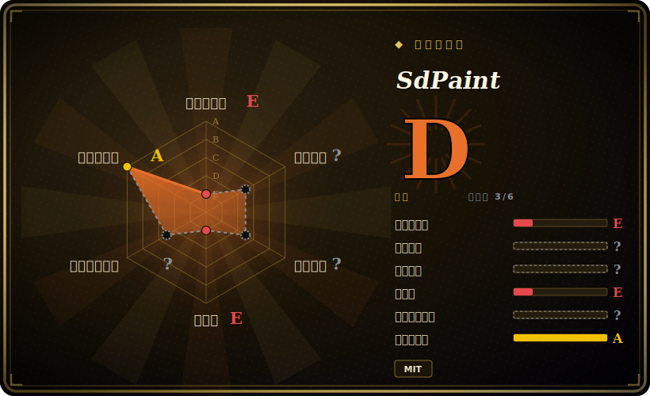

# SdPaint

一个实时草图转图像的绘画应用：你在 pygame 画布上作画，每一笔都被发往一个运行中的 Stable Diffusion（AUTOMATIC1111 ＋ ControlNet）后端，于是一团粗略涂鸦在你下笔的同时被实时生成成图像。

## 何时使用

你是一名艺术家或爱好者，本机已经在跑**带 ControlNet 扩展的 AUTOMATIC1111 Stable Diffusion WebUI**，并且想要一种比敲 prompt、点 Generate 更快、更有手感的循环。你启动 SdPaint，它打开一个 pygame 窗口，你一边画（scribble 或 lineart），它就把每一笔连同一个 ControlNet 模型流式发往 WebUI 的 API，于是生成的画面近乎实时更新——还可选用 LCM LoRA 加速、减少步数。你设好 prompt 与预设，涂出构图，看着 SD 把它填满，靠*画*而不是*重写 prompt* 来迭代。

当你想要**在自己机器上做交互式、由涂鸦驱动的生成**、且已经付出了搭好 A1111 ＋ ControlNet 的成本、宁愿画也不愿不停写 prompt 时，你会专门选它。它是那个后端之上一层很薄的本地前端，而非托管的创作套件。

## 何时不用

- **你本来就没在跑 AUTOMATIC1111 ＋ ControlNet。** SdPaint 是个*客户端*——它没有模型、自己也不做推理。难的部分（一套能用的 A1111 安装、ControlNet 扩展、对应的 ControlNet v1.1 模型、一块够力的 GPU）是前置条件，而非它提供的东西。
- **你想要打磨好、有支持的产品。** 它是个小众爱好者应用，最近一次改动在 2024-04（见健康度）；预期会有粗糙处且上游不响应。[未验证]
- **你不在受支持平台上 / 硬件偏弱。** Windows 与 macOS 有安装文档；**Linux 标着「To Do」。** 实时生成需要一块够力的 GPU 才能逐笔跟上；硬件弱时，「实时」循环会垮掉。[未验证]
- **你想要托管的云端生成或现代节点 UI。** 要托管或图式工作流，ComfyUI/Krita-AI/云端 SD 服务比一个绑死 A1111 API 的本地 pygame 客户端更合适。
- **你需要长期可靠性。** 它绑定于其年代的 A1111 API 与 ControlNet 行为；随着这些演进，一个无人维护的客户端可能漂出兼容范围。[推断]

## 横向对比

| 替代品 | 是否收录 | 我们的评价 | 取舍 |
|---|---|---|---|
| Krita ＋ AI Diffusion 插件 | 未收录 | 当前页用于它的主场景；如果更看重“完整绘画应用，配 SD 插件，在真正的美术工具里实时生成”，再选 Krita ＋ AI Diffusion 插件。 | 完整绘画应用，配 SD 插件，在真正的美术工具里实时生成；画布丰富得多、安装更重、开发更活跃。 |
| ComfyUI | 未收录 | 当前页用于它的主场景；如果更看重“节点图式 SD 前端，灵活度极高、生态活跃”，再选 ComfyUI。 | 节点图式 SD 前端，灵活度极高、生态活跃；强大但不是「边画边看」的涂鸦循环。 |
| AUTOMATIC1111 WebUI（img2img / sketch 标签） | 未收录 | 当前页用于它的主场景；如果更看重“SdPaint 所依托的后端”，再选 AUTOMATIC1111 WebUI（img2img / sketch 标签）。 | SdPaint 所依托的后端；浏览器内也能做草图→图像，但点 Generate 的循环不如逐笔流式那样即时。 |
| 任意 SD UI 里的 ControlNet scribble | 未收录 | 当前页用于它的主场景；如果更看重“SdPaint 封装的底层技术”，再选 任意 SD UI 里的 ControlNet scribble。 | SdPaint 封装的底层技术；到处都有，但没有 SdPaint 的实时绘画前端。 |

## 技术栈

- **语言：** Python。
- **UI：** 用于作画与实时预览的 pygame 画布（外加一个可选的 web 界面启动器）。
- **生成后端（外部）：** API 模式下的 AUTOMATIC1111 Stable Diffusion WebUI，配 **ControlNet** 扩展（scribble / lineart 模型），可选 **LCM LoRA** 做快速低步数渲染。
- **模型：** ControlNet v1.1 模型（从 Hugging Face 拉取）加载进 A1111 后端，不随包附带。

## 依赖

- **A1111 后端**——一个开启了 API 的 Stable Diffusion WebUI，加 ControlNet 扩展与 ControlNet v1.1 模型。这是重依赖；SdPaint 与它的 HTTP API 通信。
- **GPU**——一块支持 CUDA/Metal、足以做近实时 SD 推理的 GPU；纯 CPU 对实时循环不现实。
- **Python ＋ pygame** 及客户端自身的依赖；可选的 LCM LoRA 模型文件。
- **平台：** 有 Windows 与 macOS 文档；Linux 为「To Do」。

## 运维难度

**中到高——几乎全在后端。** SdPaint 本身只是个 Python 客户端（`pip install` 依赖、跑脚本）。运维重量在于搭起并调好 AUTOMATIC1111 ＋ ControlNet：GPU 驱动、WebUI 安装、开启其 API、下载正确的 ControlNet/LCM 模型，并把推理跑到足够快、有「实时」感。如果你已经在运维 A1111，加上 SdPaint 微不足道；如果没有，那个后端才是全部工作量。又因为客户端无人维护，你还可能在更新版 A1111/ControlNet 上撞到 API 兼容摩擦。

## 健康度与可持续性

- **维护（2026-06）。** **停滞。** 最近一次发布 v1.2a（2024-04），最后 push 在 2024-04——大约两年没动静。未归档，但近期无活动；视作吃老本/很可能已废弃。[推断]
- **治理 / bus factor。** owner 是 **User** 账号（houseofsecrets）；头部贡献者（Danamir）写了大部分提交——实质上是一两人的爱好项目，bus factor 弱。[推断]
- **年龄与 Lindy。** 2023-04 创建，约 3 岁**但其中约 2 年不活跃**⇒ Lindy **不适用**——它是个停下来了的年轻项目，而非耐久项目。快速演进的 SD 生态让一个停更客户端尤其容易漂移。[推断]
- **采用度。** 约 1.6k star 反映的是 2023 年 ControlNet 浪潮中的一阵兴趣；当前使用未经核实，生态已转向 ComfyUI/Krita-AI。[未验证]
- **风险标记。** 对特定年代 A1111 ＋ ControlNet API 的硬外部依赖；无人维护的客户端有兼容性破裂风险；宽松 MIT，无 relicense 顾虑。[推断]

## 存疑（未验证）

- [未验证] 截至 2026-06 约 1.6k GitHub star；star 数对时间敏感，反映的是 2023 年的兴趣，未必是当前使用。
- [推断]「停滞 / 很可能废弃」是从最近发布与最后 push 均为 2024-04 推断——GitHub 并未将其标为 archived。
- [未验证] 依赖栈（A1111 API 模式、ControlNet 扩展/模型、LCM LoRA、pygame UI）与平台支持（Windows/macOS、Linux「To Do」）来自 README，未对照当前 A1111/ControlNet 版本重新测试。
- [推断] GPU 需求与「实时需要够力 GPU」是从实时生成的设计推断，而非跑分得出的规格。
- [推断] 与更新版 AUTOMATIC1111/ControlNet 的兼容性是从项目无人维护推断，未对照当前安装核实。
