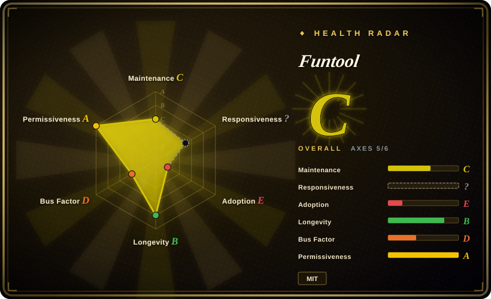

# Funtool

A Windows-only Claude Code proxy for NVIDIA-hosted models, despite the repository name `wechat-bot`; the current proxy artifacts are opaque executables rather than auditable source.

## When to use

You're a Windows developer who wants to point Claude Code at the NVIDIA model route documented by Funtool and values a prepackaged executable over assembling a proxy stack yourself. You can dedicate a disposable or low-trust workstation to the tool, you accept that the current implementation cannot be reviewed from source, and the external WeChat Official Account documentation matches the workflow you need.

You choose Funtool over LiteLLM or claude-code-router only when this exact Windows + Claude Code + NVIDIA path is the deciding constraint. If auditability, cross-platform deployment, team administration, or provider breadth matters more than a turnkey binary, one of the alternatives below is the safer selection.

## When NOT to use

- **You must audit the proxy, pin dependencies, or rebuild it from source.** Use LiteLLM instead; Funtool's current core is an opaque EXE, so the repository does not expose the implementation you would need for code review or reproducible builds.
- **You need a cross-platform Claude Code routing layer controlled by text configuration.** Use claude-code-router instead; Funtool is tied to a Windows binary and an externally documented workflow.
- **You need to expose or normalize several CLI credentials behind an OpenAI-compatible API.** Use CLIProxyAPI instead; Funtool is focused on the documented Claude Code and NVIDIA route rather than a general CLI-account gateway.
- **You need multi-user administration, quotas, channel management, or a shared web control plane.** Use New API instead; Funtool is a local binary workflow, not a governed team gateway.
- **You only need to switch coding-agent providers and credentials from a desktop UI.** Use [CC Switch](../agent-frameworks/coding-agents/orchestration-and-review/cc-switch.md) instead; it manages agent configurations, while Funtool inserts a model-proxy executable into the request path.

## Comparison

| Alternative | In index | Our verdict | Tradeoff |
|---|---|---|---|
| LiteLLM | not indexed | For a reviewable, provider-agnostic team proxy, choose LiteLLM; choose Funtool only when its packaged Windows route to NVIDIA models is more important than source access. | LiteLLM adds Python deployment and configuration work but exposes the gateway logic and supports a much broader provider surface; Funtool reduces setup for its narrow path at the cost of binary trust. |
| claude-code-router | not indexed | For cross-platform, configuration-driven Claude Code routing, choose claude-code-router; choose Funtool only for the exact Windows binary workflow described by its external documentation. | claude-code-router is easier to inspect and automate, while Funtool packages more of the target workflow but cannot be independently rebuilt from the published repository. |
| CLIProxyAPI | not indexed | For turning multiple CLI accounts into a reusable API facade, choose CLIProxyAPI; choose Funtool when the task is specifically Claude Code access to the supported NVIDIA route. | CLIProxyAPI covers a broader account-to-API problem and carries more server configuration; Funtool is narrower and desktop-oriented. |
| New API | not indexed | For a shared gateway with users, quotas, channels, and administrative controls, choose New API; choose Funtool only for a single-machine Windows setup that does not need governance. | New API has a larger service and database operations surface but supports team controls; Funtool has less visible infrastructure and far less operational transparency. |
| [CC Switch](../agent-frameworks/coding-agents/orchestration-and-review/cc-switch.md) | ✅ | For visually switching coding-agent providers and credentials, choose CC Switch; choose Funtool only when traffic must pass through its NVIDIA proxy path. | CC Switch is a configuration manager rather than an API gateway; Funtool changes request routing but introduces an opaque executable into the trust boundary. |

## Tech stack

- **Repository metadata:** GitHub identifies JavaScript as the primary language, but the current functional release is distributed as an executable rather than corresponding reviewable source.
- **Current product surface:** a Windows tool for routing Claude Code requests to the documented NVIDIA model path; it is not currently a WeChat bot despite the repository name.
- **Distribution:** GitHub reports the repository at roughly 932 MiB, largely reflecting accumulated binary history. The two current NVIDIA proxy executables in `funtool/` are about 4.9 MiB and 8.3 MiB; their implementation cannot be inspected from this repository.
- **Documentation:** operational instructions live outside the repository in WeChat Official Account content, separating the executable, documentation, and version history across different surfaces.

## Dependencies

- A supported Windows environment capable of running the distributed EXE.
- Claude Code and access credentials or account configuration for the targeted NVIDIA model service.
- Network access to the model endpoint and to the external documentation needed to configure the tool.
- Trust in the prebuilt release artifact; the repository does not provide the current core source needed to replace that artifact with a locally reviewed build.

## Ops difficulty

**Low to launch, high to assure.** A packaged Windows executable can reduce initial setup, but the operational burden moves into artifact provenance, endpoint and credential handling, version matching with external documentation, and incident diagnosis without source. The roughly 932 MiB repository history also makes cloning and archival heavier than a small source-based proxy, although the current proxy executables themselves are much smaller. Treat it as a workstation tool behind a narrow trust boundary, not as transparent shared infrastructure.

## Health & viability

- **Artifact posture, as of 2026-07:** GitHub exposes no Releases for this repository; usable proxy artifacts are committed directly to the default branch. Continued operation therefore depends on upstream publishing compatible Windows binaries rather than on users rebuilding or maintaining the code themselves.
- **Adoption signal:** about 2.5k GitHub stars as of 2026-07 show attention, but stars do not resolve the auditability, licensing, or release-provenance questions.
- **License risk:** GitHub recognizes the root repository license as MIT. Whether that grant was intended to cover the current opaque executables is not established by source, build metadata, or a separate binary notice.
- **Lindy and governance:** project age, release continuity, and maintainer redundancy are not established by the supplied release surface. [推断] The binary-only distribution is therefore a weak durability bet for long-lived shared infrastructure even if the current workflow is convenient.

## Caveats (unverified)

- [未验证] The repository's MIT text may not cover the current opaque executables; obtain explicit upstream clarification before redistribution or commercial reliance.
- [未验证] The source corresponding to the current EXE is not available for auditing, so its embedded dependencies, credential handling, telemetry, and update behavior cannot be independently verified from the repository.
- [未验证] The external WeChat Official Account documentation is maintained separately from the committed binary artifacts; exact version alignment between instructions and the current EXE is not established here.
- [推断] A roughly 932 MiB repository with accumulated opaque binaries creates more cloning, supply-chain, and incident-response burden than a small source-built proxy, but this page did not perform binary analysis.
