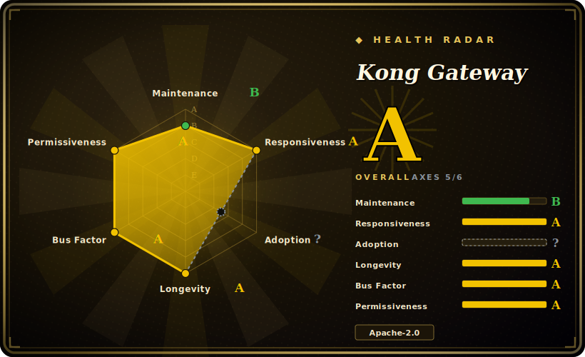

# Kong Gateway

An OpenResty/Nginx-based API gateway whose plugin layer turns one reverse-proxy into a programmable edge for REST/microservice traffic and, since the 3.x line, LLM and MCP traffic via its AI Gateway plugins.

## When to use

You're a platform engineer at a company running dozens of internal microservices behind a sprawl of per-team auth, rate-limiting, and logging code copied between services. You want to pull those cross-cutting concerns out of the apps and into one configurable edge. You stand up Kong in front of your services, declare each upstream as a Service + Route, and switch on plugins — `key-auth` or `jwt` for authentication, `rate-limiting`, `prometheus` for metrics, `request-transformer` to reshape payloads — without redeploying any backend. Config lives either in PostgreSQL (Admin API / Kong Manager) or as a single declarative YAML in DB-less mode that you commit to git and roll out with decK, so the gateway's behavior is reviewable and reproducible.

The newer reason to reach for Kong is the AI Gateway path. Your teams are calling OpenAI, Anthropic, Bedrock, and Gemini directly from app code, and you have no central place to enforce keys, rate limits, cost controls, prompt logging, or semantic caching. The `ai-proxy` family of plugins gives you one OpenAI-compatible endpoint that fans out to multiple LLM providers, plus MCP traffic governance — letting you put the same kind of policy edge in front of LLM/agent traffic that Kong already gave you for HTTP APIs, reusing the plugin and observability machinery you already run.

## When NOT to use

- **You want a single self-contained binary with no moving parts.** Kong's traditional mode needs PostgreSQL; even DB-less mode runs the full OpenResty stack. A Go gateway (Tyk, Traefik) or a config-file-only proxy is lighter to operate if you don't need Kong's plugin breadth.
- **You need the richest plugin set or hot config reload in the open-source tier.** Kong's OSS edition ships a smaller built-in plugin set than its enterprise edition; the Developer Portal, RBAC, and many advanced plugins are enterprise-only. [推断] Apache APISIX's OSS edition bundles more plugins and offers dynamic plugin reload via etcd.
- **You're committed to a service mesh / xDS data plane.** If you've standardized on Envoy + a control plane (Istio, Gateway API), bolting Kong alongside it duplicates the proxy layer.
- **You want to write proxy logic in mainstream languages first-class.** Core plugins are Lua on LuaJIT; Go/JS plugins run out-of-process via the PDK with extra overhead and operational moving parts.
- **You only have a handful of routes and no policy needs.** A gateway is undifferentiated heavy lifting here — a reverse proxy (Nginx, Caddy, Traefik) or your framework's router is enough.
- **You assumed Cassandra is still an option.** Cassandra as a config store was removed in the 3.4 line; today it's PostgreSQL or DB-less only.

## Comparison

| Alternative | In index | Our verdict | Tradeoff |
|---|---|---|---|
| Apache APISIX | 未收录 | Use this page for its stated niche; choose Apache APISIX when you need also OpenResty/Lua but configures via etcd (stateless nodes, fast dynamic reload) and bundles more p. | Also OpenResty/Lua but configures via etcd (stateless nodes, fast dynamic reload) and bundles more plugins in OSS; smaller commercial/portal ecosystem than Kong. |
| Tyk | 未收录 | Use this page for its stated niche; choose Tyk when you need go-based, ships a dashboard + developer portal + multi-tenancy in its open-source stack. | Go-based, ships a dashboard + developer portal + multi-tenancy in its open-source stack; narrower raw-proxy throughput and plugin count than Kong. |
| Envoy | 未收录 | Use this page for its stated niche; choose Envoy when you need CNCF-graduated C++ L4/L7 proxy and the de-facto service-mesh data plane (xDS). | CNCF-graduated C++ L4/L7 proxy and the de-facto service-mesh data plane (xDS); far lower-level — you bring a control plane, not turnkey API-management plugins. |
| Traefik | 未收录 | Use this page for its stated niche; choose Traefik when you need go reverse proxy with strong container/Kubernetes auto-discovery and a file/CRD config model. | Go reverse proxy with strong container/Kubernetes auto-discovery and a file/CRD config model; lighter to run but a thinner policy/AI-gateway plugin story. |
| KrakenD | 未收录 | Use this page for its stated niche; choose KrakenD when you need stateless Go gateway focused on API aggregation/composition declared in one config file. | Stateless Go gateway focused on API aggregation/composition declared in one config file; no database, but not a plugin-rich programmable edge. |
| LiteLLM / portkey-style LLM proxy | 未收录 | Use this page for its stated niche; choose LiteLLM / portkey-style LLM proxy when you need purpose-built LLM routers focused only on multi-provider LLM traffic. | Purpose-built LLM routers focused only on multi-provider LLM traffic; narrower than Kong's combined HTTP + AI gateway, but lighter if LLM routing is all you need. |

## Tech stack

- **Core:** OpenResty (Nginx + LuaJIT); proxy and plugin runtime are Lua.
- **Plugins:** Lua plugins in-process; Go and JS/TS plugins out-of-process via the Plugin Development Kit (PDK).
- **Config store:** PostgreSQL (traditional/hybrid mode) **or** DB-less declarative YAML/JSON (in-memory).
- **Control surfaces:** RESTful Admin API, Kong Manager web UI, and decK for declarative GitOps-style config.
- **AI Gateway:** `ai-proxy` / `ai-*` plugins providing an OpenAI-compatible facade over multiple LLM providers (OpenAI, Anthropic, Bedrock, Gemini, Azure, Mistral, etc.) plus MCP traffic handling.
- **Deployment modes:** traditional (DB-backed), hybrid (split control plane / data plane), DB-less, and the Kong Ingress Controller for Kubernetes.

## Dependencies

- **Runtime:** the OpenResty/Nginx + LuaJIT stack (bundled in official packages/images).
- **Datastore:** PostgreSQL for traditional/hybrid mode; **none** for DB-less mode (declarative file only).
- **Default ports:** 8000 (proxy), 8001 (Admin API), 8002 (Kong Manager UI). [未验证] exact default port set can vary by version/config.
- **Tooling:** `decK` for declarative config management; the Kong Ingress Controller (separate repo) for Kubernetes.
- **Install:** official Docker images, Linux packages (deb/rpm), Helm chart, or build from source.

## Ops difficulty

**Medium.** DB-less mode plus a Docker image is an easy single-node start and the declarative file is git-friendly. Difficulty rises with a PostgreSQL-backed cluster (DB HA, migrations on upgrade), hybrid control-plane/data-plane topologies, plugin version/compatibility management across upgrades, and tuning the OpenResty/Nginx layer under load. The Kong Ingress Controller adds Kubernetes CRD and lifecycle concerns. Running Lua-based custom plugins in production is its own skill set.

## Health & viability

- **Maintenance (as of 2026-06):** last pushed 2026-06, not archived, latest release 3.9.x — a continuously released, actively maintained gateway, not a coasting one. [推断]
- **Governance & backing:** `Organization`-owned and **vendor-backed** (Kong Inc., a funded commercial company), not a foundation project. That means a real roadmap and support exist, but the **open-core** model is the governance reality: the OSS gateway is one tier and the vendor controls what stays open vs. moves to Enterprise (Developer Portal, RBAC, advanced AI plugins). Roadmap is the vendor's, not a neutral foundation's. [推断]
- **Age & Lindy verdict:** created 2014-11, so ~12 years old **and still active** — a strong **Lindy** signal: it has survived multiple architecture shifts (it even removed Cassandra as a config store in the 3.4 line) and is among the longest-lived OSS API gateways. Old + active ⇒ a safe durability bet for the core proxy. [推断]
- **Adoption/ecosystem:** broad production adoption, a large plugin ecosystem, a Kubernetes Ingress Controller, decK for GitOps config, and mature docs — the ecosystem depth is itself a viability signal.
- **Risk flags:** the watch item is **open-core feature-gating**, not a license rug-pull — the OSS core stays Apache-2.0, but advanced features may be enterprise-only and that split shifts release-to-release. Verify a specific plugin's OSS availability before depending on it. [推断]

## Caveats (unverified)

- [未验证] Latest release observed as 3.9.3 (published 2026-06-17) with repo activity to 2026-06-17; star count ~43.7k as of 2026-06 — GitHub stars are unreliable and date-sensitive, treat as indicative only.
- [未验证] Throughput/latency figures cited in third-party comparisons (e.g. Kong ~16k RPS/node, APISIX ~23k QPS/core, APISIX ~200% faster with plugins) come from external benchmark blogs and vary heavily by version, config, and hardware; no first-party guarantee.
- [推断] The exact split between open-source and enterprise plugins (Developer Portal, RBAC, advanced AI features) shifts release-to-release; verify a specific plugin's OSS availability against the current repo/docs before relying on it.
- [未验证] The precise list of LLM providers and MCP features supported by the AI Gateway plugins changes per release; the provider list here reflects README framing, not a per-version audit.
- [未验证] Cassandra was reported removed in the 3.4 line (deprecated since 2.7); confirm against UPGRADE.md for the exact version if migrating.
