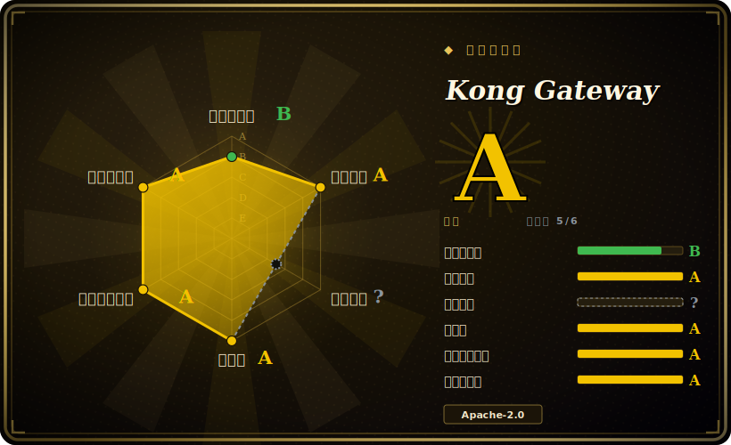

# Kong Gateway

基于 OpenResty/Nginx 的 API 网关，靠插件层把一个反向代理变成可编程的流量边界：既管 REST/微服务流量，也从 3.x 起通过 AI Gateway 插件管 LLM 与 MCP 流量。

## 何时使用

你是某公司的平台工程师，手里跑着几十个内部微服务，每个团队各写一套鉴权、限流、日志代码，互相复制粘贴，散落到处都是。你想把这些横切关注点从应用里抽出来，集中到一个可配置的边界上。于是你在服务前面架起 Kong，把每个上游声明为 Service + Route，再按需打开插件——`key-auth` 或 `jwt` 做鉴权、`rate-limiting` 限流、`prometheus` 出指标、`request-transformer` 改写报文——全程不用重新部署任何后端。配置要么放在 PostgreSQL（走 Admin API / Kong Manager），要么以一份声明式 YAML 存在 DB-less 模式里、提交进 git、用 decK 下发，于是网关行为可评审、可复现。

更新的理由是 AI Gateway 这条路。你的团队正从应用代码里直接调 OpenAI、Anthropic、Bedrock、Gemini，却没有一个集中处去管 key、限流、成本、prompt 日志或语义缓存。`ai-proxy` 系列插件给你一个 OpenAI 兼容的端点，向后扇出到多家 LLM 供应商，再加上 MCP 流量治理——让你能把当年给 HTTP API 装的那套策略边界，照样装到 LLM/agent 流量前面，复用你已经在跑的插件和可观测性机制。

## 何时不用

- **你想要一个无外部依赖的自包含单二进制。** Kong 传统模式需要 PostgreSQL；就算 DB-less 模式也要跑整套 OpenResty。如果你不需要 Kong 的插件广度，Go 系网关（Tyk、Traefik）或纯配置文件代理运维起来更轻。
- **你要在开源版里拿到最全插件集或热加载配置。** Kong OSS 版内置插件比企业版少；Developer Portal、RBAC 和不少高级插件是企业版专属。[推断] Apache APISIX 的 OSS 版自带更多插件，并借 etcd 做动态插件热加载。
- **你已经押注 service mesh / xDS 数据面。** 如果你已统一到 Envoy + 控制面（Istio、Gateway API），再在旁边塞一个 Kong 等于重复了代理层。
- **你想用主流语言一等公民地写代理逻辑。** 核心插件是跑在 LuaJIT 上的 Lua；Go/JS 插件通过 PDK 在进程外运行，带额外开销和运维零件。
- **你只有寥寥几条路由、没有策略需求。** 此时网关纯属无差别的重活——一个反向代理（Nginx、Caddy、Traefik）或你框架自带的路由就够了。
- **你以为 Cassandra 还是个选项。** 作为配置存储的 Cassandra 已在 3.4 这条线移除；如今只有 PostgreSQL 或 DB-less。

## 横向对比

| 替代品 | 是否收录 | 取舍 |
|---|---|---|
| Apache APISIX | 未收录 | 同样是 OpenResty/Lua，但用 etcd 配置（节点无状态、动态热加载快），OSS 自带插件更多；商业/门户生态不如 Kong。 |
| Tyk | 未收录 | Go 实现，开源栈自带 dashboard + 开发者门户 + 多租户；原始代理吞吐和插件数量比 Kong 窄。 |
| Envoy | 未收录 | CNCF 毕业的 C++ L4/L7 代理，是事实上的 service mesh 数据面（xDS）；层级低得多——你得自带控制面，而非开箱即用的 API 管理插件。 |
| Traefik | 未收录 | Go 反向代理，容器/Kubernetes 自动发现强、配置走文件/CRD；跑起来更轻，但策略/AI 网关插件叙事更薄。 |
| KrakenD | 未收录 | 无状态 Go 网关，聚焦单配置文件声明的 API 聚合/编排；无数据库，但不是插件丰富的可编程边界。 |
| LiteLLM / portkey 式 LLM 代理 | 未收录 | 专门做 LLM 流量的多供应商路由器，只覆盖 LLM 这一段；比 Kong 的 HTTP+AI 双网关窄，但若你只要 LLM 路由则更轻。 |

## 技术栈

- **核心：** OpenResty（Nginx + LuaJIT）；代理与插件运行时是 Lua。
- **插件：** Lua 插件进程内运行；Go 与 JS/TS 插件通过 Plugin Development Kit（PDK）进程外运行。
- **配置存储：** PostgreSQL（传统/混合模式）**或** DB-less 声明式 YAML/JSON（内存态）。
- **控制面：** RESTful Admin API、Kong Manager Web UI，以及做声明式 GitOps 式配置的 decK。
- **AI Gateway：** `ai-proxy` / `ai-*` 插件，在多家 LLM 供应商（OpenAI、Anthropic、Bedrock、Gemini、Azure、Mistral 等）之上提供 OpenAI 兼容门面，并处理 MCP 流量。
- **部署模式：** 传统（带库）、混合（控制面/数据面分离）、DB-less，以及面向 Kubernetes 的 Kong Ingress Controller。

## 依赖

- **运行时：** OpenResty/Nginx + LuaJIT 栈（官方包/镜像已打包）。
- **数据存储：** 传统/混合模式需 PostgreSQL；DB-less 模式**无**（仅声明式文件）。
- **默认端口：** 8000（代理）、8001（Admin API）、8002（Kong Manager UI）。[未验证] 默认端口集合随版本/配置可能不同。
- **工具：** 声明式配置管理用 `decK`；Kubernetes 用 Kong Ingress Controller（独立仓库）。
- **安装：** 官方 Docker 镜像、Linux 包（deb/rpm）、Helm chart，或从源码构建。

## 运维难度

**中等。** DB-less 模式加 Docker 镜像是很容易的单节点起步，声明式文件也对 git 友好。难度随以下情况上升：PostgreSQL 集群（库的高可用、升级时的迁移）、混合控制面/数据面拓扑、跨版本升级的插件版本/兼容性管理，以及高负载下对 OpenResty/Nginx 层的调优。Kong Ingress Controller 又引入 Kubernetes CRD 与生命周期的关注点。在生产里跑 Lua 自定义插件本身就是一项专门技能。

## 健康度与可持续性

- **维护（截至 2026-06）：** 最后 push 在 2026-06，未归档，最新版本 3.9.x——一个持续发版、积极维护的网关，而非在吃老本。[推断]
- **治理与背书：** 由 `Organization` 持有且**厂商背书**（Kong Inc.，一家拿过融资的商业公司），不是基金会项目。这意味着有真实的路线图和支持，但**开源核心（open-core）**模式才是治理现实：OSS 网关只是一档，厂商掌控什么留在开源、什么挪进 Enterprise（Developer Portal、RBAC、高级 AI 插件）。路线图归厂商，而非中立基金会。[推断]
- **年龄与 Lindy 判断：** 建于 2014-11，约 12 年**且仍然活跃**——很强的 **Lindy** 信号：它熬过了多次架构变迁（甚至在 3.4 这条线移除了作为配置存储的 Cassandra），是寿命最长的 OSS API 网关之一。老 + 活跃 ⇒ 核心代理是安全的耐久押注。[推断]
- **采用/生态：** 广泛的生产采用、庞大的插件生态、一个 Kubernetes Ingress Controller、做 GitOps 配置的 decK，以及成熟文档——生态深度本身就是可持续性信号。
- **风险标记：** 真正要盯的是**开源核心的功能闸门**，而非 license 反水——OSS 核心仍是 Apache-2.0，但高级特性可能仅限企业版，且这条划分随版本变动。依赖某个具体插件前请先核实其 OSS 可用性。[推断]

## 存疑（未验证）

- [未验证] 观察到的最新版本为 3.9.3（2026-06-17 发布），仓库活动到 2026-06-17；star 数约 43.7k（截至 2026-06）——GitHub star 不可靠且对日期敏感，仅作参考。
- [未验证] 第三方对比里引用的吞吐/延迟数字（如 Kong 约 16k RPS/节点、APISIX 约 23k QPS/核、开插件后 APISIX 快约 200%）来自外部基准测试博客，随版本、配置、硬件差异巨大，无第一方保证。
- [推断] 开源版与企业版之间的插件划分（Developer Portal、RBAC、高级 AI 特性）随版本变动；依赖某个具体插件前，请对照当前仓库/文档核实其 OSS 可用性。
- [未验证] AI Gateway 插件支持的 LLM 供应商与 MCP 特性的确切清单随版本变化；此处的供应商列表反映 README 的表述，并非逐版本审计。
- [未验证] 据称 Cassandra 已在 3.4 这条线移除（自 2.7 起弃用）；如要迁移，请对照 UPGRADE.md 确认确切版本。
