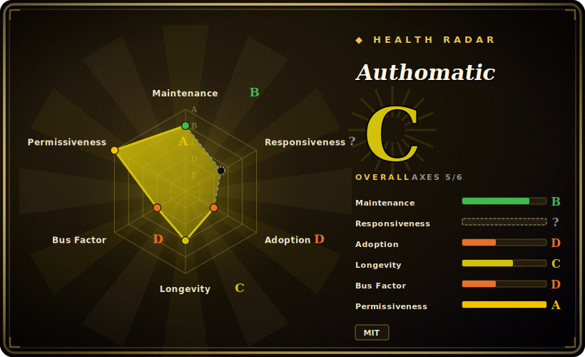

# Authomatic

A Python library for federated login / "sign in with X" — a framework-agnostic OAuth 1.0a, OAuth 2.0 and OpenID client that handles the provider handshake and hands you the authenticated user plus an API-call helper.

## When to use

You're building a Python web app (Flask, Django, WebOb, a WSGI app — Authomatic is deliberately framework-agnostic) and you need "log in with Google / GitHub / Facebook / Twitter" without hand-rolling each provider's OAuth dance. You configure a dict of providers and credentials, drop Authomatic's `login()` call into a single endpoint, and it runs the redirect/callback handshake for whichever provider the user picked, then returns a normalized `user` (id, name, email where available) and a session you can use to make further authorized API requests to that provider. It abstracts OAuth 1.0a *and* OAuth 2.0 *and* OpenID behind one interface, so adding a new provider is mostly a config entry, not a new integration.

You reach for it when you want a *thin, embeddable* social-login client that doesn't impose a framework or a user model — it gives you the authenticated identity and gets out of the way, leaving session/user persistence to your app. It's well-suited to small-to-medium apps and to glue code where a full identity platform would be overkill.

## When NOT to use

- **You want a full auth/identity platform (sessions, RBAC, MFA, admin).** Authomatic is a *login client*, not an IdP or auth server — for hosted identity, SSO, SAML, MFA and user management you want Keycloak, Auth0/Okta, or Django's own auth + allauth.
- **You're on Django and want batteries included.** `django-allauth` integrates social + local accounts with Django's user/session model out of the box; Authomatic leaves persistence to you, which is more work on Django specifically.
- **You need SAML / enterprise SSO.** Authomatic targets OAuth/OpenID consumer login; for SAML2 enterprise federation use a SAML library (python3-saml) or an IdP.
- **You need an actively, rapidly-maintained dependency.** Activity is low and release cadence slow; OAuth provider quirks and security fixes may lag — verify recent commits and provider support before betting on it. [推断]
- **You're a confident OAuth implementer with one provider.** For a single OAuth2 provider, a focused client (`authlib`, `requests-oauthlib`) or the provider SDK may be simpler than a multi-protocol abstraction.

## Comparison

| Alternative | In index | Tradeoff |
|---|---|---|
| Authlib | 未收录 | Comprehensive, actively-maintained Python OAuth1/OAuth2/OIDC + JWT library (client *and* server); broader and more current, but a larger API to learn. |
| django-allauth | 未收录 | Django-specific social + local auth integrated with Django's user/session model; batteries-included on Django, not framework-agnostic. |
| requests-oauthlib / oauthlib | 未收录 | Lower-level OAuth client building blocks; you wire the flow yourself — more control, less convenience than Authomatic's provider presets. |
| python-social-auth | 未收录 | Multi-framework social-auth with many backends; broader provider list, heavier and framework-coupling per integration. |
| Keycloak / Auth0 (IdP) | 未收录 | Full identity providers (hosted or self-run) — SSO, MFA, admin, SAML; a platform, not a client library — different scope entirely. |

## Tech stack

- **Language:** Python; framework-agnostic (works with Flask/Django/WebOb/WSGI via adapters). [未验证]
- **Protocols:** OAuth 1.0a, OAuth 2.0, and OpenID consumer flows behind a single client interface, with a catalog of preconfigured providers.
- **Surface:** a `login()` entry that runs the handshake, returns a normalized `User`, and exposes a session for authorized provider API calls.
- **Distribution:** PyPI (`pip install authomatic`); docs on the project's GitHub Pages site.

## Dependencies

- **Runtime:** Python plus a small set of pip dependencies (HTTP, crypto/signing for OAuth1); exact list is in the packaging metadata. [未验证]
- **Provider credentials:** you must register your app with each OAuth provider and supply client id/secret and redirect URIs.
- **Your web framework + session store:** Authomatic does the handshake; persisting the user/session is your app's responsibility (cookies/DB/etc.).
- **No bundled service or datastore** — it's an in-process client library.

## Ops difficulty

**Low-to-medium.** As code it's just a library — `pip install` and configure. The operational burden is the OAuth lifecycle around it: registering apps per provider, managing client secrets safely, configuring redirect URIs across environments, and keeping up when a provider changes its endpoints or deprecates a flow. Because it leaves user/session persistence to you, you also own that storage. No service of its own to run; the moving parts are the external providers and your secrets handling.

## Health & viability

- **Maintenance (2026-06).** Last pushed 2025-12; there is recent activity but cadence is slow and the issue count is non-trivial. Reads as **maintained but low-velocity**, not abandoned. Not archived. [推断]
- **Governance / bus factor.** Hosted under the `authomatic` GitHub **organization** with multiple contributors over time, though clearly led by a small core. Org ownership is a mild positive over a personal account. [推断]
- **Age & Lindy verdict.** ~13 years old (created 2013-02) and still receiving occasional updates ⇒ a **reasonable Lindy** signal: long-lived and stable, tempered by low recent velocity. [推断]
- **Adoption.** ~1k stars; an established but niche choice, now competing with the more active Authlib and (on Django) allauth. [未验证]
- **Risk flags.** Auth libraries carry security-sensitivity, so slow fix cadence matters: confirm provider support and recent security commits before depending on it. MIT-licensed, no relicense history found. [推断]

## Caveats (unverified)

- [未验证] ~1k stars and a 2025-12 last-push as of 2026-06; star counts and dates drift — indicative only.
- [未验证] Exact Python version floor, supported framework adapters, and the runtime dependency list are governed by current packaging metadata and change across releases.
- [未验证] The set of preconfigured OAuth providers and their current working status depend on third-party endpoints that change; verify the specific provider you need against the current repo.
- [推断] "Maintained but low-velocity" is inferred from the 2025-12 last-push and slow tag cadence, not a measured release-interval figure.
- [推断] The security-cadence caution is a general property of auth libraries plus the observed low velocity, not a finding of a specific unpatched vulnerability.
