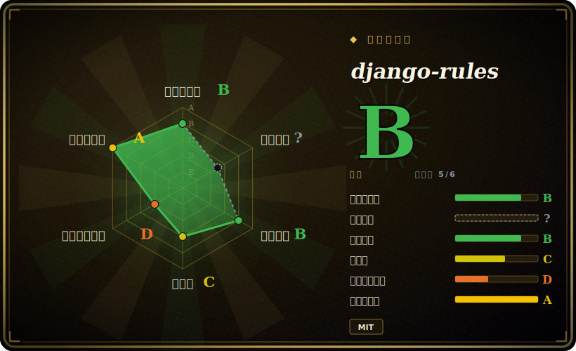

# django-rules

一个极小的 Django 应用，提供**不依赖数据库的对象级权限**——你把授权表达为可组合的谓词函数（"rules"），再接进 Django 的权限系统、视图、模板和 DRF。

## 何时使用

你在做一个 Django 应用，“这个用户能不能做这件事”取决于*对象*而非仅仅一个全局角色——作者能编辑自己的帖子、项目成员能看到项目、经理能批自己团队的请求。Django 内置权限是模型级、靠数据库的；逐对象检查通常要么是散落在视图里的临时 `if` 逻辑，要么是 `django-guardian` 这类重型的逐行数据库权限系统。用 django-rules，你改为写小谓词函数（`is_author`、`is_project_member`），用 `&`、`|`、`~` 组合成 rules，再注册到权限名上。这样 `user.has_perm('posts.change_post', post)` 就即时求值你的逻辑，没有要存或同步的权限行，而同一套 rules 还能驱动 `@permission_required` 装饰器、`` 模板标签和 DRF 权限类。

当你的授权是*逻辑*而非*数据*时你会选它——规则源自关系和对象状态，而非管理员勾选的行。它也能在 Django 之外当独立规则引擎用，因为谓词内核不依赖框架。它的长处在于让授权保持声明式、可测试，并把它从视图体里拿出去。

## 何时不用

- **管理员要在运行时逐对象授予/撤销权限（数据驱动）。** 如果权限是被*分配*的（有个 UI 让人勾选“用户 X 可编辑对象 Y”），你需要存储的行——用 `django-guardian`；django-rules 从逻辑计算权限，不存储授予。
- **你需要在数据库和 Django 后台里管理的组/角色行。** Django 原生权限 + 组（或 guardian）才是靠数据库的模型；django-rules 刻意避开数据库。
- **你想要跨多服务的集中式 policy-as-code。** 跨服务、语言无关的策略请用 OPA/Rego 或专门的授权服务（OpenFGA/Zanzibar 风格）；django-rules 是进程内且贴着 Django 的。
- **你的规则每次请求求值代价高。** 谓词在每次检查时运行；若某规则打数据库或外部服务，逐对象循环可能很贵——请缓存或反范式化。[推断]
- **你不在 Django 上、却想要完整框架集成。** 谓词内核可独立用，但装饰器/模板标签/DRF 胶水是 Django 专属——Django 之外你能拿到的价值更少。

## 横向对比

| 替代品 | 是否收录 | 我们的评价 | 取舍 |
|---|---|---|---|
| django-guardian | 未收录 | 当前页用于它的主场景；如果更看重“把逐对象权限存为数据库行（可通过后台/API 分配）”，再选 django-guardian。 | 把逐对象权限存为数据库行（可通过后台/API 分配）；当授予是*数据*时是对的工具，但加表、加查询、加同步——比“规则即逻辑”更重。 |
| Django 内置权限 | 未收录 | 当前页用于它的主场景；如果更看重“模型级、靠数据库、后台管理”，再选 Django 内置权限。 | 模型级、靠数据库、后台管理；不额外做事就没有逐对象粒度——django-rules 正好补这个缺口。 |
| Casbin（pycasbin） | 未收录 | 当前页用于它的主场景；如果更看重“策略引擎，支持多种模型（RBAC/ABAC）和外部策略存储”，再选 Casbin（pycasbin）。 | 策略引擎，支持多种模型（RBAC/ABAC）和外部策略存储；更通用、框架无关，但比谓词函数要更多搭建。 |
| OPA / OpenFGA | 未收录 | 当前页用于它的主场景；如果更看重“外部、语言无关的策略/授权服务（Rego / Zanzibar 风格关系）”，再选 OPA / OpenFGA。 | 外部、语言无关的策略/授权服务（Rego / Zanzibar 风格关系）；规模化和跨服务很强，但比进程内 Django 库重得多。 |
| 临时 `if` 检查 | 未收录 | 当前页用于它的主场景；如果更看重“django-rules 要取代的现状”，再选 临时 if 检查。 | django-rules 要取代的现状——无依赖，但散落、无测试、容易出微妙错误。 |

## 技术栈

- **语言：** Python；一个 Django 应用加一个框架无关的谓词内核（`rules`）。
- **模型：** 谓词函数用布尔运算符（`&`、`|`、`~`）组合成具名 rules，注册进一个 rule set，并经 Django 权限后端暴露。
- **集成：** Django auth 后端（`has_perm`）、`@permission_required`/`@objectpermission_required` 装饰器、一个 `` 模板标签，以及 Django REST Framework 权限类。
- **分发：** 在 PyPI 上名为 `rules`（`pip install rules`）；不新增数据库表。

## 依赖

- **运行时：** Python 和 Django（用于 Django 集成）；谓词内核只用 Python 就能独立使用。支持的 Django/Python 版本由当前 release 的元数据决定。[未验证]
- **数据库：** **无需**——这是卖点；它不加 model/migration。你的规则要查的东西（如检查对象关系）用的是你应用已有的数据库。
- **DRF（可选）：** 仅当你用所提供的 DRF 权限类时。
- **自身无外部服务或数据存储。**

## 运维难度

**低。** 它是纯库，**没有 migration、表或服务**要运维——`pip install rules`、加进 `INSTALLED_APPS`、注册谓词即可。基础设施层面没有要部署或维护的东西。唯一的真实成本在设计期和运行时正确性：仔细编写和测试谓词（授权 bug 就是安全 bug），并在谓词触及数据库或外部系统时留意每次请求的求值开销。

## 健康度与可持续性

- **维护（2026-06）。** 最后 push 于 2025-10，有 v3.x 发布线（最新 tag v3.4/v3.5）；发布稳定（虽不急），跟随 Django 版本——处于**活跃**而非废弃。未归档。[推断]
- **治理 / bus factor。** 由原作者（dfunckt）在个人账号下主导，外加一条常驻贡献者尾巴；小团队但长期持续。单一主导的 bus-factor 考量，被该库小而稳定的面所缓解。[推断]
- **年龄与 Lindy 判断。** 约 12 年（2014-03 创建）且**仍在发布**⇒ **强 Lindy** 信号：一个成熟、范围窄、早已定型的库。[推断]
- **采用度。** 约 2k star；Django 对象级权限里一个知名、常被推荐的答案，文档和测试覆盖良好。[未验证]
- **风险标记。** MIT 许可，未发现 relicense 历史；主要考量是跟随 Django 版本的节奏（它必须跟上 Django 发布）和单一主导治理。[推断]

## 存疑（未验证）

- [未验证] 截至 2026-06 约 2k star、v3.x 发布线（最新约 v3.5）；star 数和版本号会漂移，仅供参考。
- [未验证] 确切支持的 Django 与 Python 版本范围由当前 release 元数据决定且随时间变化，这里不断言具体数字。
- [推断] 规则查数据库/外部服务时每次请求的谓词求值开销是固有的设计属性，而非实测的性能数字。
- [推断] “活跃”是从 2025-10 最后 push 和 tag 历史推断，而非精确的发布间隔测量。
- [推断] 单一主导/bus-factor 的判断是从贡献者分布和个人账号归属推断，而非来自治理文档。
