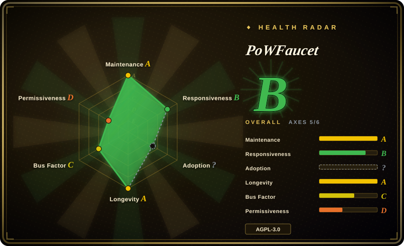

# PoWFaucet

A self-hosted EVM testnet faucet that distributes operator-funded native coins or ERC-20 tokens and protects the wallet with modular proof-of-work, CAPTCHA, identity, rate, and balance controls.

## When to use

You're operating a public or community EVM testnet whose users need small amounts of native currency or an ERC-20 token, but a simple address form is drained by bots. You are prepared to fund and secure a faucet hot wallet, connect reliable RPC endpoints, and run a persistent web service. PoWFaucet gives you a complete distribution service with transaction queues, wallet and outflow controls, SQLite or MySQL persistence, and optional protection modules for browser proof-of-work, CAPTCHA, IP reputation, recurring limits, GitHub identity, mainnet-wallet checks, Gitcoin Passport, Zupass, ENS, vouchers, and whitelists.

You choose it over a small faucet script when abuse resistance and configurable reward policy justify the larger operational surface. Proof-of-work is one optional protection module, not a coin generator: every distributed asset must already exist and be transferred into the faucet wallet or refill vault by the operator.

## When NOT to use

- **You only need local development accounts with test balances.** Use Foundry Anvil or Hardhat Network; both can pre-fund accounts without exposing a public service, RPC dependency, or hot wallet.
- **You do not want to custody keys or replenish funds.** Use the target network's established public faucet or a trusted managed faucet; PoWFaucet requires an operator-funded wallet and incident ownership.
- **The chain is not EVM-compatible.** Use that chain's native faucet implementation and SDK; PoWFaucet's transaction, RPC, address, and token assumptions are Ethereum-oriented.
- **You are distributing valuable mainnet assets, an airdrop, or user entitlements.** Use an audited Merkle-claim or allowlist contract backed by a multisig treasury; a testnet faucet is not a high-value distribution control plane.
- **You only need generic proof-of-work or CAPTCHA protection for a web form.** Use Cap, ALTCHA, or an application-level rate limiter; PoWFaucet couples anti-abuse controls to wallet sessions and token payouts.
- **AGPL network-service obligations are incompatible with your deployment.** Evaluate MIT-licensed Ethereum-Faucet or Apache-2.0 Nethereum.Faucet, then add only the protection controls you can maintain.

## Comparison

| Alternative | In index | Our verdict | Tradeoff |
|---|---|---|---|
| FaucETH | not indexed | Choose FaucETH when a conventional EVM faucet is sufficient; choose PoWFaucet when modular abuse controls and proof-of-work reward sessions are the deciding requirements. | FaucETH is smaller and simpler, while PoWFaucet provides a much broader protection and fund-policy surface. |
| Ethereum-Faucet | not indexed | Choose Ethereum-Faucet when MIT licensing and a compact modern implementation matter more than PoWFaucet's mature module set. | Lower adoption and fewer controls reduce complexity, but leave more abuse controls and operations to the adopter. |
| Nethereum.Faucet | not indexed | Choose Nethereum.Faucet for a .NET and Nethereum stack; choose PoWFaucet for a TypeScript service with browser proof-of-work and richer identity modules. | Nethereum.Faucet fits C# teams and has Apache-2.0 licensing, but is not a feature-equivalent modular platform. |
| Foundry Anvil | not indexed | Choose Anvil for local or ephemeral integration tests; choose PoWFaucet only when independent users need assets on a shared EVM network. | Anvil is deterministic and nearly zero-ops, but it does not distribute assets on an existing public testnet. |

## Tech stack

- **Server:** TypeScript on Node.js, HTTP and WebSocket APIs, `web3` and Ethereum transaction libraries.
- **Client:** React 19, React Router, Bootstrap, Webpack, and Web Workers for proof-of-work algorithms.
- **Persistence:** SQLite by default or MySQL for higher-traffic and separated database deployments.
- **Proof-of-work:** bundled WASM implementations for Argon2, scrypt, CryptoNight, and the optional `nickminer` mode.
- **Packaging:** release archives and standalone binaries, plus a multi-stage Docker image combining Node.js with unprivileged Nginx.

## Dependencies

- An EVM execution-layer RPC endpoint, chain ID, funded hot-wallet private key, and enough native coins or ERC-20 tokens to distribute.
- Persistent SQLite storage or MySQL, plus disk for configuration, logs, session state, and optional passport caches.
- Node.js `>=18` for packaged releases, Node.js `>=22` for source builds, or the published Docker image.
- A reverse proxy and TLS for public production deployment; the Docker image includes Nginx for static files and API/WebSocket proxying.
- Optional external credentials for hCaptcha, reCAPTCHA, Turnstile, GitHub OAuth, Gitcoin Passport, identity providers, and third-party IP information.

## Ops difficulty

**High.** The service holds a transaction-signing key, sends real on-chain transfers, persists user and session state, depends on RPC health, and exposes public HTTP and WebSocket surfaces. Operators must manage wallet funding, gas limits, pending transaction queues, database backups and migrations, rate and outflow policy, secrets, TLS, monitoring, abuse response, and upgrades. The optional vault contract can limit hot-wallet exposure, but adds contract configuration and on-chain failure modes rather than removing custody risk.

## Health & viability

- **Maintenance (2026-07):** the repository is not archived, published v2.5.0 in 2026-05, and continued dependency and branch activity into 2026-07. Its CI runs server tests before building binaries.
- **Governance:** the repository is User-owned and human contribution is overwhelmingly concentrated in `pk910`; community patches exist, but roadmap and incident response have a low bus factor.
- **Age and Lindy:** created in 2022 and still active after roughly four years, with public Sepolia, Hoodi, and Ephemery instances named in the README. This is a useful but not long-established infrastructure track record.
- **Adoption:** roughly 5.6k stars and several operated instances indicate meaningful interest; neither signal proves security, capacity, or resistance to coordinated abuse.
- **Risk flags:** AGPL network obligations, hot-wallet custody, many optional secrets and identity integrations, privacy-sensitive IP and wallet data, external RPC dependencies, and public abuse economics.

## Caveats (unverified)

- [未验证] No independent security audit of the server, proof-of-work validation, session protocol, wallet handling, or refill vault contract was found in this research pass.
- [未验证] Capacity under hundreds or thousands of concurrent mining sessions, RPC failures, and coordinated malicious verifiers was not independently load-tested.
- [未验证] The effectiveness and fairness of CAPTCHA, IP, GitHub, Passport, Zupass, and proof-of-work modules depend on operator configuration and external services.
- [未验证] The public instances listed in the README may run configurations or patches that differ from the default branch.
- [推断] The primary category is blockchain development infrastructure because token distribution is the service's purpose; CAPTCHA and proof-of-work are optional anti-abuse modules.
- [推断] The low bus factor raises long-term maintenance risk despite active releases and a substantial test suite.
