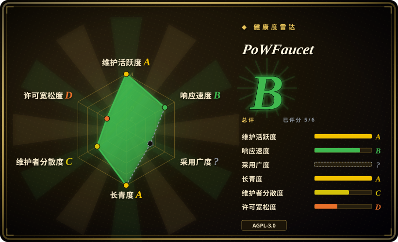

# PoWFaucet

一个自托管 EVM 测试网 faucet，用于分发运营方预先注入的原生币或 ERC-20 token，并通过可组合的工作量证明、验证码、身份、频率和余额控制保护钱包。

## 何时使用

你正在运营一个公共或社区 EVM 测试网。用户需要少量原生币或 ERC-20 token，但简单的地址输入框会被 bot 迅速抽干。你愿意为 faucet 热钱包注资并保护密钥，接入可靠的 RPC endpoint，并持续运行一个 Web 服务。PoWFaucet 提供完整的分发服务，包括交易队列、钱包与出流控制、SQLite 或 MySQL 持久化，以及可选的浏览器工作量证明、验证码、IP 信誉、周期限制、GitHub 身份、主网钱包条件、Gitcoin Passport、Zupass、ENS、voucher 和 whitelist 模块。

当防滥用和可配置奖励策略值得承担更大的运维面时，选它而不是一个小型 faucet 脚本。工作量证明只是可选保护模块，不会生成新币；所有分发资产都必须已经存在，并由运营方转入 faucet 钱包或 refill vault。

## 何时不用

- **你只需要本地开发账户和测试余额。** 用 Foundry Anvil 或 Hardhat Network；它们可以预置余额，不需要公开服务、外部 RPC 或热钱包。
- **你不想托管私钥或持续补充资金。** 使用目标网络已有的公共 faucet，或可信托管 faucet；PoWFaucet 要求运营方为钱包注资并承担事故责任。
- **目标链不兼容 EVM。** 使用该链原生的 faucet 实现和 SDK；PoWFaucet 的交易、RPC、地址与 token 假设都围绕 Ethereum。
- **你要分发高价值主网资产、空投或用户权益。** 使用经过审计的 Merkle claim 或 allowlist 合约，并由 multisig treasury 管理；测试网 faucet 不是高价值分发控制面。
- **你只想给普通 Web 表单增加工作量证明或验证码。** 使用 Cap、ALTCHA 或应用层 rate limiter；PoWFaucet 会把防滥用控制和钱包 session、token payout 绑在一起。
- **AGPL 网络服务义务与你的部署模式冲突。** 评估 MIT 的 Ethereum-Faucet 或 Apache-2.0 的 Nethereum.Faucet，再只补充你能维护的保护控制。

## 横向对比

| 替代品 | 是否收录 | 我们的评价 | 取舍 |
|---|---|---|---|
| FaucETH | 未收录 | 普通 EVM faucet 已经够用时选 FaucETH；只有模块化防滥用和工作量证明奖励 session 是硬需求时，才选 PoWFaucet。 | FaucETH 更小、更简单；PoWFaucet 的保护和资金策略面宽得多。 |
| Ethereum-Faucet | 未收录 | MIT 许可和紧凑的现代实现，比 PoWFaucet 的成熟模块集更重要时，选 Ethereum-Faucet。 | 采用度和控制能力较少，降低了复杂度，但更多防滥用与运维工作要由使用方承担。 |
| Nethereum.Faucet | 未收录 | 使用 .NET 和 Nethereum 技术栈时选 Nethereum.Faucet；需要 TypeScript 服务、浏览器工作量证明和更丰富身份模块时，选 PoWFaucet。 | Nethereum.Faucet 适合 C# 团队，采用 Apache-2.0，但不是能力完全对等的模块化平台。 |
| Foundry Anvil | 未收录 | 本地或临时集成测试选 Anvil；只有独立用户需要在共享 EVM 网络领取资产时，才选 PoWFaucet。 | Anvil 确定性强且几乎无运维，但不能向既有公共测试网分发资产。 |

## 技术栈

- **服务端：** Node.js 上的 TypeScript，提供 HTTP 与 WebSocket API，并使用 `web3` 和 Ethereum 交易库。
- **客户端：** React 19、React Router、Bootstrap、Webpack，以及执行工作量证明算法的 Web Workers。
- **持久化：** 默认 SQLite；高流量或数据库独立部署可用 MySQL。
- **工作量证明：** 随附 Argon2、scrypt、CryptoNight 和可选 `nickminer` 模式的 WASM 实现。
- **打包：** release archive、独立二进制，以及把 Node.js 和非 root Nginx 合在一起的多阶段 Docker image。

## 依赖

- EVM execution-layer RPC endpoint、chain ID、已注资的热钱包私钥，以及足够分发的原生币或 ERC-20 token。
- 持久化 SQLite 或 MySQL，并为配置、日志、session 状态和可选 passport cache 提供磁盘。
- 使用打包 release 时需要 Node.js `>=18`，源码构建需要 Node.js `>=22`，也可以使用发布的 Docker image。
- 公网生产部署需要 reverse proxy 和 TLS；Docker image 已包含用于静态文件与 API、WebSocket 代理的 Nginx。
- hCaptcha、reCAPTCHA、Turnstile、GitHub OAuth、Gitcoin Passport、身份提供方和第三方 IP 信息等可选外部凭据。

## 运维难度

**高。** 服务持有交易签名私钥，发起真实链上转账，持久化用户和 session 状态，依赖 RPC 健康，并暴露公共 HTTP 与 WebSocket 接口。运营方需要管理钱包注资、gas 限制、pending transaction queue、数据库备份和迁移、频率与出流策略、secret、TLS、监控、滥用响应和升级。可选 vault contract 能限制热钱包暴露面，但它增加的是合约配置和链上失败模式，并不会消除托管风险。

## 健康度与可持续性

- **维护情况（2026-07）：** 仓库未归档，2026-05 发布 v2.5.0，2026-07 仍有依赖和分支活动。CI 会先运行服务端测试，再构建二进制。
- **治理：** 仓库属于个人账号，真人贡献高度集中在 `pk910`；虽然有社区 patch，但路线和事故响应的 bus factor 仍低。
- **年龄与 Lindy：** 项目创建于 2022 年，约四年后仍活跃；README 列出了 Sepolia、Hoodi 和 Ephemery 公共实例。这是有用但还不算长期的基础设施记录。
- **采用信号：** 约 5.6k star 和多个运行实例说明它有实际关注度；两者都不能证明安全性、容量或抵御协同滥用的效果。
- **风险标记：** AGPL 网络义务、热钱包托管、多组可选 secret 与身份集成、涉及隐私的 IP 和钱包数据、外部 RPC 依赖，以及公开服务的滥用经济问题。

## 存疑（未验证）

- [未验证] 本轮没有找到对服务端、工作量证明验证、session 协议、钱包处理或 refill vault contract 的独立安全审计。
- [未验证] 没有独立压测数百或数千并发 mining session、RPC 故障和协同恶意 verifier 下的容量与行为。
- [未验证] 验证码、IP、GitHub、Passport、Zupass 和工作量证明模块的效果与公平性取决于运营方配置和外部服务。
- [未验证] README 列出的公共实例可能运行与默认分支不同的配置或 patch。
- [推断] 主分类应是区块链开发基础设施，因为 token 分发才是服务目的；验证码和工作量证明只是可选防滥用模块。
- [推断] 尽管发布活跃且测试较多，低 bus factor 仍提高了长期维护风险。
