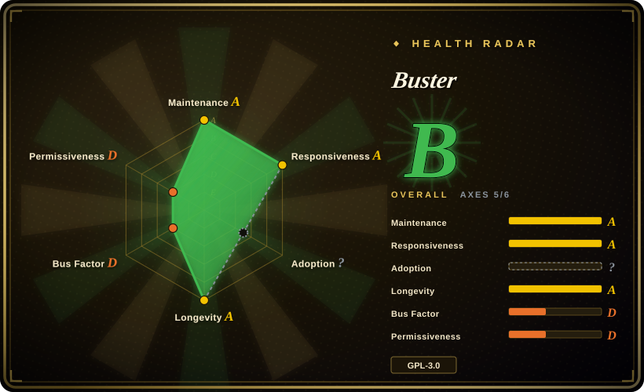

# Buster

An open-source browser extension that helps a person complete reCAPTCHA audio challenges through speech recognition; use it for accessibility or explicitly authorized testing, not to evade third-party access controls.

## When to use

You're a user who is repeatedly blocked by difficult visual reCAPTCHA challenges, or a tester validating an accessibility journey on a system you own or have permission to test. You want a button inside the reCAPTCHA widget that switches to the audio challenge, transcribes it, and fills the response, while keeping the extension source available for review. Buster can use browser-local speech models or configured remote speech services, and an optional native client can simulate operating-system mouse and keyboard input.

You choose Buster over NopeCHA when a human-triggered, reCAPTCHA-specific accessibility workflow and source auditability matter more than unattended automation or broad CAPTCHA-family coverage. It assists with one challenge path; it does not confer authorization, and no recognition success level should be assumed.

## When NOT to use

- **You lack authorization for automated access to a third-party system.** Do not turn Buster, NopeCHA, or another solver into a bulk-access bypass; use the site's official API, provider test keys, or an owner-approved test environment.
- **You need unattended multi-family CAPTCHA solving.** In an explicitly authorized environment, evaluate NopeCHA; use hcaptcha-challenger only when the target is specifically hCaptcha. Buster is centered on a person clicking its button for reCAPTCHA audio.
- **You need deterministic end-to-end tests.** Use Playwright with reCAPTCHA test keys or mocked verification responses; live audio challenges and speech models make Buster unsuitable as a stable CI oracle.
- **Audio must never reach a remote service.** Configure and verify Buster's local model path, or use manual accessibility testing; do not leave managed remote recognition enabled without reviewing the data boundary.
- **You cannot install a browser extension or optional native input client.** Use a dedicated test browser with Playwright fixtures, or test the server-side verification contract directly.
- **GPL-3.0-only is incompatible with your redistribution model.** Use provider test configurations plus Apache-2.0 Playwright rather than embedding or redistributing Buster in a proprietary bundle.

## Comparison

| Alternative | In index | Our verdict | Tradeoff |
|---|---|---|---|
| [NopeCHA](nopecha-extension.md) | ✅ | Choose Buster for human-triggered, auditable reCAPTCHA audio assistance; choose NopeCHA only for authorized unattended coverage across several CAPTCHA families. | Buster is narrower and open source; NopeCHA is broader but its maintained implementation is closed and service-dependent. |
| hcaptcha-challenger | not indexed | Choose hcaptcha-challenger when the authorized target is hCaptcha and a programmatic local pipeline is the core need. | It does not provide Buster's reCAPTCHA accessibility interaction, while Buster does not cover hCaptcha's visual challenge families. |
| 2captcha-python | not indexed | Choose 2captcha-python when a backend script needs a solving-service API; choose Buster when the user should explicitly trigger assistance in the browser. | The API client suits automation but adds external service and billing dependencies; Buster stays in the browser and can use local recognition. |
| [Text_select_captcha](text-select-captcha.md) | ✅ | Choose Text_select_captcha for authorized Chinese click-to-select recognition; choose Buster for reCAPTCHA audio accessibility. | They solve different challenge modalities; Text_select_captcha also lacks a license grant. |

## Tech stack

- **Extension:** modern JavaScript ES modules using WebExtension APIs for Chrome, Edge, Firefox, and Opera.
- **Interface:** Vue 3 and Vuetify for setup, contribution, and options surfaces.
- **Recognition:** `@huggingface/transformers` and `onnxruntime-web` for browser-local models, with optional Wit.ai, Google, IBM, and Microsoft speech APIs.
- **Build:** Node.js, npm, Gulp, Webpack, Babel, PostCSS, and per-browser manifests.
- **Optional native integration:** Buster Client receives native-messaging commands to simulate mouse and keyboard input.

## Dependencies

- A supported desktop browser and the extension from its browser store or a built release archive.
- A speech-recognition route: the managed local model, a configured remote service, or user-supplied speech API credentials.
- The optional Buster Client on Windows, Linux, or macOS when operating-system-level input simulation is enabled.
- Building from source currently uses the Node version pinned in `.nvmrc` (`24.16.0`) and `npm ci`.

## Ops difficulty

**Low for personal use, medium for managed deployment.** Installing from a browser store is straightforward. A managed rollout must decide whether recognition is local or remote, review extension permissions and native messaging, control updates, and validate accessibility behavior after reCAPTCHA changes. Keep it in a dedicated browser profile for testing, and do not make a passing Buster solve the acceptance criterion for CI.

## Health & viability

- **Maintenance (2026-07):** the project is not archived, was pushed in 2026-06, and released v3.1.4 through v3.4.0 during June 2026. The release line is active and responsive to browser and recognition changes.
- **Governance:** the repository is User-owned and contributor history is dominated by `dessant`, so maintenance and security response depend heavily on one person.
- **Age and Lindy:** created in 2018 and still releasing in 2026, Buster has a strong age-plus-activity signal for a browser extension in a fast-changing domain.
- **Adoption:** roughly 9.2k stars and distribution through several browser stores show sustained interest, but do not measure accessibility quality or solve rate.
- **Risk flags:** low bus factor, live dependence on reCAPTCHA behavior, optional remote audio processing, optional native input control, and GPL-3.0-only redistribution obligations.

## Caveats (unverified)

- [未验证] Recognition success varies with reCAPTCHA, language, browser, IP reputation, and the selected local or remote speech model; no independently verified success rate was found.
- [未验证] The separate Buster Client repository, binary update path, and native-messaging security model were not fully audited in this entry.
- [未验证] Managed-service defaults and audio data destinations can change; verify the installed version's options and network behavior before handling sensitive sessions.
- [未验证] The GitHub Actions workflow builds browser artifacts but does not show automated behavioral tests against real or simulated reCAPTCHA flows.
- [推断] The dominant-maintainer contribution pattern creates a bus-factor risk even though the project is old and actively released.
- [推断] Authorization and accessibility legitimacy depend on the target, terms, and jurisdiction; this page does not provide legal approval for automated access.
