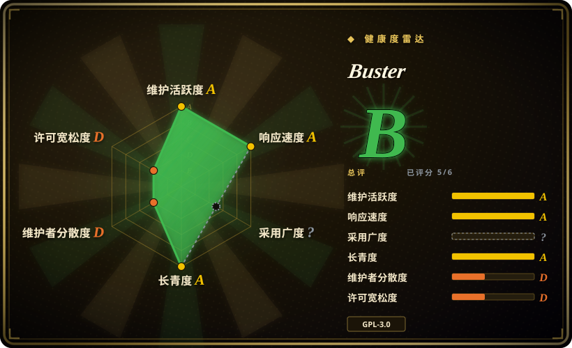

# Buster

一个通过语音识别帮助真人完成 reCAPTCHA 音频挑战的开源浏览器扩展；只应用于无障碍辅助或明确授权的测试，不能拿来规避第三方访问控制。

## 何时使用

你是经常被高难度图像 reCAPTCHA 挡住的用户，或正在验证自有系统无障碍旅程的测试人员，并且已经取得测试授权。你希望 reCAPTCHA 组件里出现一个按钮，点击后切换到音频挑战，转写内容并填入答案，同时又能审查扩展源码。Buster 可以使用浏览器内本地语音模型，也可以接配置好的远端语音服务；可选的 native client 还能模拟操作系统级鼠标和键盘输入。

当真人主动触发、reCAPTCHA 专用的无障碍流程和源码可审计性，比无人值守自动化或多类验证码覆盖更重要时，选 Buster 而不是 NopeCHA。它只辅助一条挑战路径，不会替你取得访问授权，也不保证识别成功。

## 何时不用

- **你没有第三方系统的自动化访问授权。** 不要把 Buster、NopeCHA 或其他 solver 变成批量访问绕过工具；改用站点官方 API、提供方测试密钥，或所有者批准的测试环境。
- **你需要无人值守地处理多类验证码。** 在明确授权的环境中评估 NopeCHA；只有目标明确是 hCaptcha 时才使用 hcaptcha-challenger。Buster 的核心流程是由真人点击按钮处理 reCAPTCHA 音频。
- **你需要确定性的端到端测试。** 用 Playwright 配合 reCAPTCHA 测试密钥或 mock 验证响应；实时音频挑战和语音模型不适合作为稳定 CI 判定器。
- **音频绝不能发送到远端服务。** 明确配置并验证 Buster 的本地模型路径，或改用人工无障碍测试；没有审查数据边界前，不要启用托管远端识别。
- **你不能安装浏览器扩展或可选的 native input client。** 用专用测试浏览器配合 Playwright fixture，或直接测试服务端验证契约。
- **GPL-3.0-only 与你的再分发模式冲突。** 使用验证码提供方测试配置加 Apache-2.0 的 Playwright，不要把 Buster 嵌入或再分发进闭源产品包。

## 横向对比

| 替代品 | 是否收录 | 我们的评价 | 取舍 |
|---|---|---|---|
| [NopeCHA](nopecha-extension.zh.md) | 已收录 | 需要真人触发、源码可审计的 reCAPTCHA 音频辅助时选 Buster；只有在已授权且要无人值守覆盖多类验证码时，才选 NopeCHA。 | Buster 更窄且开源；NopeCHA 更广，但持续维护的实现闭源并依赖托管服务。 |
| hcaptcha-challenger | 未收录 | 已授权目标是 hCaptcha，并且需要程序化本地管线时，选 hcaptcha-challenger。 | 它不提供 Buster 的 reCAPTCHA 无障碍交互；Buster 也不覆盖 hCaptcha 的图像挑战族。 |
| 2captcha-python | 未收录 | 后端脚本需要识别服务 API 时，选 2captcha-python；应由用户在浏览器中明确触发辅助时，选 Buster。 | API 客户端适合自动化，但增加外部服务和计费依赖；Buster 留在浏览器内，也可以使用本地识别。 |
| [Text_select_captcha](text-select-captcha.zh.md) | 已收录 | 已授权场景需要中文点选文字识别时，选 Text_select_captcha；需要 reCAPTCHA 音频无障碍辅助时，选 Buster。 | 两者处理不同挑战形态；Text_select_captcha 还缺少许可授权。 |

## 技术栈

- **扩展：** 使用现代 JavaScript ES modules 和 WebExtension API，面向 Chrome、Edge、Firefox 与 Opera。
- **界面：** 设置、贡献与选项页面使用 Vue 3 和 Vuetify。
- **识别：** 用 `@huggingface/transformers` 与 `onnxruntime-web` 跑浏览器本地模型，也可选 Wit.ai、Google、IBM 和 Microsoft 语音 API。
- **构建：** Node.js、npm、Gulp、Webpack、Babel、PostCSS，以及各浏览器 manifest。
- **可选原生集成：** Buster Client 通过 native messaging 接收命令，模拟鼠标和键盘输入。

## 依赖

- 受支持的桌面浏览器，以及来自浏览器商店或 release 构建包的扩展。
- 一条语音识别路径，包括托管本地模型、配置好的远端服务，或用户提供的语音 API 凭据。
- 启用操作系统级输入模拟时，需要在 Windows、Linux 或 macOS 安装可选 Buster Client。
- 从源码构建时，当前使用 `.nvmrc` 固定的 Node `24.16.0` 和 `npm ci`。

## 运维难度

**个人使用低，受管部署中等。** 从浏览器商店安装很直接。集中部署时需要决定识别走本地还是远端，审查扩展权限和 native messaging，控制更新，并在 reCAPTCHA 变化后重新验证无障碍行为。测试时应放进专用浏览器 profile，也不要把 Buster 解题成功当成 CI 的验收条件。

## 健康度与可持续性

- **维护情况（2026-07）：** 项目未归档，2026-06 仍有 push，并在 2026 年 6 月发布了 v3.1.4 至 v3.4.0。发布线活跃，也持续应对浏览器和识别变化。
- **治理：** 仓库属于个人账号，贡献历史高度集中在 `dessant`，因此维护和安全响应很依赖单人。
- **年龄与 Lindy：** 项目创建于 2018 年，2026 年仍在发版；对一个处于快速变化领域的浏览器扩展来说，年龄与活跃度组合形成较强信号。
- **采用信号：** 约 9.2k star，并在多个浏览器商店分发，说明它长期有人关注，但不能证明无障碍质量或识别成功率。
- **风险标记：** bus factor 低、依赖 reCAPTCHA 实时行为、可选远端音频处理、可选原生输入控制，以及 GPL-3.0-only 的再分发义务。

## 存疑（未验证）

- [未验证] 识别效果会随 reCAPTCHA、语言、浏览器、IP 信誉，以及选用的本地或远端语音模型变化；不保证任何成功率。
- [未验证] 本条目没有完整审计独立的 Buster Client 仓库、二进制更新路径和 native messaging 安全模型。
- [未验证] 托管服务默认值和音频数据去向可能变化；处理敏感会话前，应检查实际安装版本的选项与网络行为。
- [未验证] GitHub Actions workflow 会构建浏览器产物，但没有看到针对真实或模拟 reCAPTCHA 流程的自动行为测试。
- [推断] 尽管项目历史较长且持续发版，贡献高度集中仍构成 bus-factor 风险。
- [推断] 授权和无障碍使用的合法性取决于目标、条款和司法辖区；本页不为自动化访问提供法律许可。
