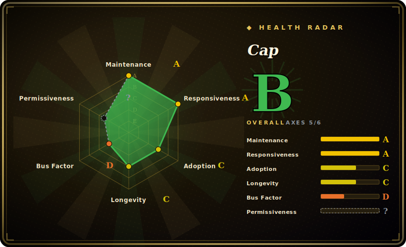

# Cap

A lightweight, self-hosted CAPTCHA alternative to reCAPTCHA/hCaptcha/Turnstile: it gates an action with an invisible proof-of-work challenge (SHA-256 nonce search, solved in a Rust→WASM worker) plus optional JavaScript instrumentation checks, issuing a redeemable token your server verifies — no images, no third-party network calls when self-hosted.

## When to use

You're a backend or full-stack engineer running a signup form, a contact endpoint, or a public API route that bots keep hammering — fake accounts, spam submissions, credential-stuffing. You don't want to embed reCAPTCHA or Turnstile because that ships user data and a script to Google/Cloudflare, and you'd rather not make humans squint at traffic-light grids. You want the abuse cost to land on the *machine* (CPU spent solving a puzzle), not on your users' patience or privacy.

Cap fits here. You drop the `<cap-widget>` on the protected form (or call it programmatically / as an invisible floating mode), and on the server you wire `capjs-core` — a *stateless, bring-your-own-storage* generator/verifier — into your Node or Bun handler. The widget pulls a challenge, burns a few hundred milliseconds of the visitor's CPU solving SHA-256 prefixes in parallel WASM workers, and submits the solution; your server regenerates the same challenges, verifies, and hands back a token you check with `validateToken()` before processing the request. If you don't want to touch the library at all, you run the **Standalone** Docker image (`tiago2/cap:latest`), point your app at its reCAPTCHA-compatible `/siteverify` endpoint, and manage site keys from a built-in dashboard.

## When NOT to use

- **You need to stop a determined, well-funded attacker or CAPTCHA-farm.** Proof-of-work raises the *cost* of abuse; it does not *defeat* a solver willing to spend CPU or pay humans. It is friction, not a wall — high-value targets still need rate limits, fraud scoring, and server-side checks.
- **You want a site-wide / reverse-proxy bot wall.** Cap guards *specific actions* (forms, endpoints) and lets normal browsing through. To gate an entire site against scrapers at the proxy layer, Anubis (`未收录`) is the shaped tool; Cap is per-action.
- **Proof-of-work is a dealbreaker for your users' devices.** PoW spends client CPU/battery; on low-end phones or with high difficulty it adds latency and drains battery. If you can't accept any client compute, an invisible behavioral/risk-scoring service (Turnstile) is a different trade.
- **You need a fully managed, SLA-backed, zero-ops service.** Self-hosting means *you* run the server (or the Standalone container + Redis), rotate keys, and own uptime. There is no vendor to page.
- **You want CAPTCHA as a legal/compliance accessibility checkbox with audited support.** This is a young open-source project (`capjs-core` v0.1.1), not an enterprise vendor with a support contract.
- **You expect strong out-of-the-box bot *classification*.** Cap's instrumentation layer adds signals, but it is not an ML risk engine; it won't score "how human" a visitor is the way commercial services claim to.

## Comparison

| Alternative | In index | Our verdict | Tradeoff |
|---|---|---|---|
| reCAPTCHA (Google) | 未收录 | Use this page for its stated niche; choose reCAPTCHA (Google) when you need managed, free, strong risk scoring. | Managed, free, strong risk scoring — but sends user data to Google, ships visual puzzles, and is a third-party dependency. Cap is self-hosted and privacy-first; you operate it and get no Google-scale risk model. |
| hCaptcha | 未收录 | Use this page for its stated niche; choose hCaptcha when you need managed alternative to reCAPTCHA, can pay publishers. | Managed alternative to reCAPTCHA, can pay publishers; still third-party and image-based. Cap is ~250x smaller widget and fully self-hostable, with no external calls. |
| Cloudflare Turnstile | 未收录 | Use this page for its stated niche; choose Cloudflare Turnstile when you need managed, invisible, no PoW on the client, strong behavioral signals via Cloudflare's network. | Managed, invisible, no PoW on the client, strong behavioral signals via Cloudflare's network — but it's a hosted dependency on Cloudflare. Cap keeps everything on your infra at the cost of running it yourself. |
| Altcha | 未收录 | Use this page for its stated niche; choose Altcha when you need closest in spirit: open-source client-side proof-of-work, no fingerprinting, MIT widget. | Closest in spirit: open-source client-side proof-of-work, no fingerprinting, MIT widget. Altcha's OSS is PoW-only (ML detection is a paid Sentinel product) and leaves server/dashboard wiring to you; Cap bundles instrumentation + a Standalone server with dashboard, Apache-2.0. |
| mCaptcha | 未收录 | Use this page for its stated niche; choose mCaptcha when you need self-hosted Rust proof-of-work CAPTCHA with its own rate-limited difficulty model. | Self-hosted Rust proof-of-work CAPTCHA with its own rate-limited difficulty model; overlapping goal, different stack and ergonomics. |
| FriendlyCaptcha | 未收录 | Use this page for its stated niche; choose FriendlyCaptcha when you need privacy-focused PoW CAPTCHA, but the maintained product is a hosted commercial service. | Privacy-focused PoW CAPTCHA, but the maintained product is a hosted commercial service; Cap is fully open-source and self-hosted. |
| Anubis | 未收录 | Use this page for its stated niche; choose Anubis when you need reverse-proxy / site-wide PoW gate against scrapers and AI crawlers. | Reverse-proxy / site-wide PoW gate against scrapers and AI crawlers — different scope (entry gate vs per-action). The two are complementary, not substitutes. |

## Tech stack

- **Widget:** JavaScript web component (`<cap-widget>`), ~20 KB gzipped with zero runtime dependencies; supports normal, floating (invisible), and programmatic modes.
- **Solver:** challenges are solved client-side by repeatedly hashing salt+nonce with **SHA-256** until the hash hits a target prefix; the hot loop is **Rust compiled to WebAssembly** (`@cap.js/wasm`) and run across **Web Workers** in parallel.
- **Server library (`capjs-core`):** a stateless TypeScript/ESM module for Node.js and Bun that generates challenges, redeems solutions (`redeemChallenge()`), and validates tokens (`validateToken()`). It defines *pluggable storage interfaces* for challenges and tokens (`store/read/delete/deleteExpired`) — you bring Postgres, an in-memory `state` object, or anything else.
- **Standalone server:** built on **Bun** + **Elysia**, ships a dashboard, a reCAPTCHA-compatible `/siteverify` endpoint, multi-site-key support, optional MaxMind GeoIP and headless-browser detection.
- **Instrumentation challenges:** optional, decompressed and executed in a sandboxed iframe alongside the PoW for a second verification layer.

## Dependencies

- **Library path (`capjs-core`):** Node.js or Bun runtime. *No built-in storage / filesystem* — you supply a storage backend (e.g. Postgres) or use the in-memory `state` object. Build-time dep is `esbuild` (optional `javascript-obfuscator`).
- **Standalone path:** Docker (image `tiago2/cap:latest`) and a **Redis-compatible store** (the official `docker compose` uses **Valkey** via `REDIS_URL`). Config via env: `ADMIN_KEY` (dashboard login, 32+ chars recommended), `REDIS_URL`; default port `3000`.
- **Client:** a modern browser with WebAssembly + Web Workers support (i.e. effectively all current browsers).

## Ops difficulty

**Low for the library path, low-to-medium for Standalone.** Using `capjs-core` inside an existing Node/Bun service is mostly a wiring exercise: implement (or reuse) a storage adapter, add a verify call before your handler runs, embed the widget. There's no separate service to babysit. The **Standalone** route adds a container plus a Redis/Valkey instance to run and back up, an `ADMIN_KEY` secret to manage, and key rotation across sites — standard small-service ops, but more than "drop in a script tag." The real operational judgment is *tuning difficulty*: too low and PoW barely deters bots; too high and you tax legitimate users' devices. Expect to tune per-endpoint and watch abuse metrics rather than set-and-forget.

## Health & viability

- **Maintenance (as of 2026-06):** last pushed 2026-06, not archived — active. The standalone server is at a mature-looking v3.1.5 while the library (`capjs-core`) is still v0.1.x, so the *library* API surface is the less-settled half. [推断]
- **Governance & bus factor:** `User`-owned (tiagozip), single-maintainer. At ~7k stars the bus-factor exposure is real but more contained than a 40k-star one-person project — still, there is no foundation or vendor behind it, so continuity rides on one author. [推断]
- **Age & Lindy verdict:** created 2025-01, so ~1.5 years old — **young; Lindy not yet established**. It is past the first-month vapor stage but not proven across years; the pre-1.0 `capjs-core` reinforces "expect API churn, pin versions." [推断]
- **Risk flags:** Apache-2.0 but GitHub's API reports `NOASSERTION` on the LICENSE header (see Caveats), which an automated SPDX scanner may flag — a cosmetic licensing wrinkle, not a relicense. Security-wise this is friction (proof-of-work), not a hardened anti-abuse engine, and self-hosting means you own uptime and difficulty tuning. [推断]

## Caveats (unverified)

- [未验证] Repo activity and reported popularity (~7k GitHub stars as of 2026-06) — GitHub stars are unreliable and date-sensitive; treat as indicative only.
- [未验证] The "~20 KB / 250x smaller than hCaptcha" and bundle-size comparisons (e.g. vs Altcha's ~34 KB) are the project's own marketing figures from its README/docs; not independently benchmarked here.
- [未验证] The Cap-vs-Altcha / vs-Anubis / vs-Turnstile framing in the Comparison table draws on Cap's own documentation positioning; the competing projects' current capabilities (e.g. Altcha Sentinel, Turnstile internals) were not independently re-verified.
- [推断] License is Apache-2.0: the repo's LICENSE file is verbatim Apache 2.0 text, but GitHub's API reports `NOASSERTION` (a non-standard header on the file), so an automated SPDX detector may flag it.
- [未验证] Effectiveness against real-world CAPTCHA-solving services / farms is not measured here; proof-of-work raises cost but is defeatable by sufficient compute or paid human solvers.
- [推断] `capjs-core` at v0.1.x signals a young, pre-1.0 library surface; APIs (storage interface, `validateToken` options) may change between releases — pin versions.
- [未验证] MaxMind GeoIP and headless-browser detection in Standalone are described in docs as optional features; their exact behavior/accuracy was not exercised.
