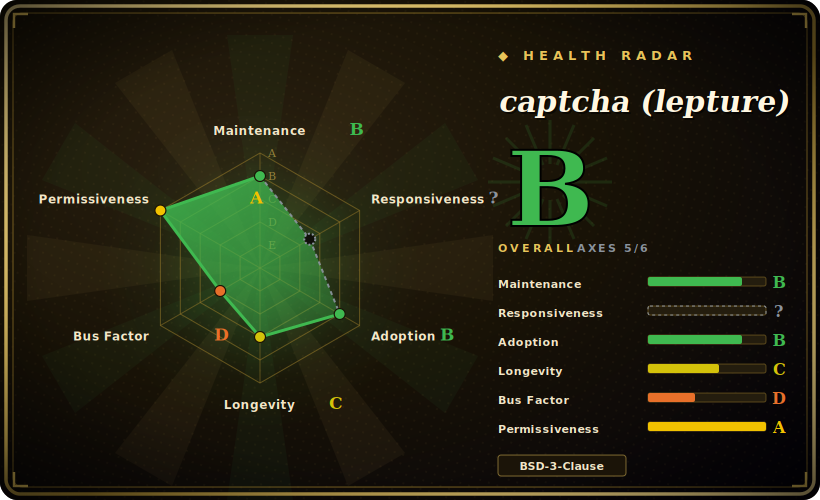

# captcha (lepture)

A small Python library that renders distorted image CAPTCHAs and synthesizes audio CAPTCHAs from a string you supply — you own the challenge text, storage, and verification; it only draws and speaks.

## When to use

You're building a Django or Flask form — a signup page, a comment box, a password-reset flow — and you want a self-hosted, no-third-party-call CAPTCHA so bots don't pound the endpoint. You don't want to wire in reCAPTCHA (sends user data to Google, needs a network round-trip) or stand up a service; you just want to generate a random 4–6 character string server-side, render it as a noisy PNG, stash the answer in the session, and check what the user typed. You `pip install captcha`, do `ImageCaptcha().generate('A3K9')`, hand the image bytes to your template, and compare on submit. For visually impaired users you also call `AudioCaptcha().generate(...)` to produce a spoken-digits WAV from the same code. It depends only on Pillow, so it drops into any Python web stack without extra infrastructure.

You reach for it specifically when you want full control of the challenge lifecycle in your own process — the library is deliberately just the *renderer*. The text generation, the session/store binding, the expiry, and the equality check are yours to write, which is exactly what you want when you're avoiding any external CAPTCHA dependency.

## When NOT to use

- **You need real bot resistance against modern solvers.** Distorted-text image CAPTCHAs are broken by cheap OCR and commercial solving services; this library does not claim adversarial robustness and offers none. For serious abuse prevention use proof-of-work / behavioral challenges (e.g. [Cap](capjs.md)) or a managed anti-bot service. [推断]
- **You want a turnkey CAPTCHA with verification built in.** This is render-only — no challenge store, no expiry, no verify endpoint. If you want "drop in and it just works", a framework plugin (django-simple-captcha) or hosted widget fits better.
- **Accessibility-first or i18n challenges.** Audio is spoken digits/characters from bundled voice data; it is not a full accessible-CAPTCHA solution and the built-in voice/font data is meant to be replaced with your own.
- **High request volume on a hot path.** Each image/audio is rendered on the fly (Pillow rasterization, audio synthesis); under heavy traffic you'll want caching or a pre-generated pool, not per-request generation.
- **You assumed it tracks state.** It generates bytes and nothing else; forgetting to bind+expire the answer server-side is the usual security mistake.

## Comparison

| Alternative | In index | Tradeoff |
|---|---|---|
| [Cap](capjs.md) | ✅ | Proof-of-work / invisible challenge, privacy-preserving, actually aimed at bot resistance; a different paradigm (no text to read) and JS-first, not a Python image renderer. |
| Google reCAPTCHA / hCaptcha | 未收录 | Managed, much stronger bot signals; but third-party network call, privacy/data-sharing concerns, and not self-hosted. |
| django-simple-captcha | 未收录 | Django-integrated CAPTCHA field with storage + verification wired in; less flexible outside Django, heavier than a pure renderer. |
| Pillow (hand-rolled) | 未收录 | You can draw text+noise yourself with raw Pillow; this library is essentially that, pre-packaged with audio support and sensible defaults. |

## Tech stack

- **Language:** Python (>= 3.9 per `pyproject.toml`), packaged with setuptools, typed (`py.typed`).
- **Rendering:** Pillow for image rasterization (noise curves, dots, font distortion); modules split into `captcha.image` and `captcha.audio`.
- **Audio:** synthesized from bundled per-character voice WAV data (replaceable via `voicedir`).
- **Distribution:** published on PyPI as `captcha`.

## Dependencies

- **Runtime:** Pillow only — that's the entire dependency surface for image generation.
- **Fonts/voices:** ships with built-in font and voice data; the README recommends supplying your own (`fonts=[...]`, `voicedir=...`) for both quality and to avoid predictable assets.
- **Yours to provide:** challenge-text generation, a session/cache store for the answer, expiry, and the verification check — none of these are in the library.
- **Install:** `pip install captcha`; no system services or datastore required.

## Ops difficulty

**Low.** It is a pure library with a single dependency — there is nothing to deploy or operate beyond your own app. The only real operational considerations are application-level: caching or pre-generating images so per-request Pillow rendering doesn't become a CPU hot spot, and correctly binding the generated answer to a session with an expiry server-side. No datastore, no service, no background process.

## Health & viability

- **Maintenance (2026-06).** Last pushed 2025-10; latest tag v0.7.1. Low commit volume but not dead — small fixes land and dependencies (Pillow) get tracked. **Maintained, low-velocity** — appropriate for a stable, narrow-scope library. [推断]
- **Governance / bus factor.** Personal project by a single prolific maintainer (lepture, also author of Authlib/mistune); contributor list is dominated by the owner. Bus-factor risk is real but mitigated by the tiny surface area — the library is "done" more than it is "active". [推断]
- **Age & Lindy verdict.** Created 2014-11 (~11 years old) and still receiving occasional updates ⇒ a solid Lindy signal for a small utility; it has long outlived most CAPTCHA libraries. [推断]
- **Adoption.** ~1.1k stars, ~189 forks, used as a lightweight self-hosted CAPTCHA generator across Python web projects. Modest but steady. [未验证]
- **Risk flags.** The decisive risk is **not maintenance but fitness**: text-image CAPTCHA is weak against modern automated solvers, independent of how healthy this repo is. Treat it as a UX speed-bump, not a security control. [推断]

## Caveats (unverified)

- [未验证] ~1.1k stars / ~189 forks as of 2026-06; star/fork counts are date-sensitive and indicative only.
- [未验证] v0.7.1 is the latest tag observed; exact release date not confirmed here (no GitHub Releases entries returned by the API — tags only).
- [推断] "Broken by modern OCR/solving services" is the general state of distorted-text CAPTCHA, not a measured claim about this specific renderer's outputs.
- [推断] "Maintained, low-velocity" is inferred from commit recency + a single dominant contributor, not from a stated maintenance policy.
