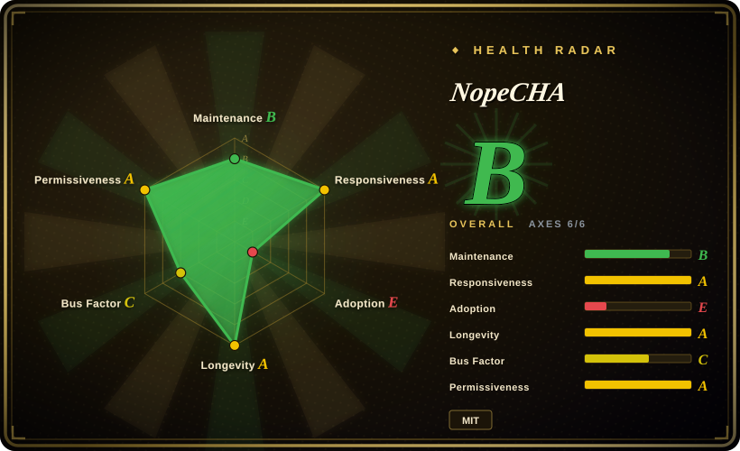

# NopeCHA

A browser extension that submits CAPTCHA challenges to the hosted NopeCHA service for automated solving; use it only on systems you own or are explicitly authorized to test, and do not assume any challenge will be recognized or solved.

## When to use

You're an automation engineer testing your own application or an explicitly authorized staging environment, and the test journey includes several CAPTCHA families that cannot be represented adequately by a static fixture. You want one extension that can be loaded into Chrome, Firefox, Selenium, Puppeteer, or another Chromium automation setup, rather than integrating a different solver for every challenge type. NopeCHA detects supported challenges in the browser and sends solving work to the hosted NopeCHA API.

You choose it over Buster when unattended multi-family automation matters more than local auditability or human-triggered accessibility. That choice is valid only when the system owner has authorized the test, external API processing is acceptable, and your test plan tolerates changing success rates, quotas, and service availability.

## When NOT to use

- **You do not own the target and lack explicit authorization.** Do not use NopeCHA or another solver to evade a third party's access control; use the site's official API, provider test keys, or an owner-provided test environment instead.
- **You need the current implementation to be open source and auditable.** Use Buster for human-triggered reCAPTCHA audio assistance, or build an authorized test fixture with Playwright; NopeCHA's maintained 0.6.x extension source is not present on the default branch.
- **Challenge data cannot leave your environment.** Use provider test keys, local mocks, or a self-hosted model such as hcaptcha-challenger in an authorized lab; the current product depends on the hosted NopeCHA API.
- **You need deterministic CI rather than live challenge solving.** Use Playwright with mocked verification responses or official CAPTCHA test keys; no solver can promise stable recognition against changing challenges.
- **You only need human accessibility assistance for reCAPTCHA audio.** Use Buster, whose interaction model is a user-triggered audio challenge flow rather than a broad unattended solving service.
- **You need a source-level library integration instead of a browser-wide extension.** Use a provider SDK such as 2captcha-python only within the same authorization boundary, and accept its separate service, privacy, and billing tradeoffs.

## Comparison

| Alternative | In index | Our verdict | Tradeoff |
|---|---|---|---|
| [Buster](buster.md) | ✅ | Choose Buster for a human-triggered, source-auditable reCAPTCHA audio aid; choose NopeCHA only for authorized unattended coverage across several CAPTCHA families. | Buster is narrower and may use local or remote speech recognition, while NopeCHA offers broader automation through a closed hosted service. |
| hcaptcha-challenger | not indexed | Choose hcaptcha-challenger when an authorized workflow is specifically about hCaptcha and source auditability matters more than broad provider coverage. | It is narrower and self-managed; NopeCHA reduces integration work but adds service dependency and closed-current-source risk. |
| 2captcha-python | not indexed | Choose 2captcha-python when a Python program needs an explicit API client rather than a browser extension; choose NopeCHA when browser-side detection and interaction are the deciding needs. | Both depend on external solving services; the integration surface, pricing, data handling, and supported challenges differ. |
| [Text_select_captcha](text-select-captcha.md) | ✅ | Choose Text_select_captcha for an authorized, local Chinese click-to-select pipeline; choose NopeCHA when several browser CAPTCHA families must be handled by one service. | Text_select_captcha is local and specialized but has no license grant; NopeCHA is broader but its current implementation is closed. |

## Tech stack

- **Current distribution:** prebuilt Chromium and Firefox extension archives published as GitHub release assets and through browser stores.
- **Hosted backend:** the browser extension calls the NopeCHA API for multimodal CAPTCHA solving; the current server and model implementation are not in this repository.
- **Legacy open-source branch:** `legacy-oss` contains JavaScript WebExtension content scripts for reCAPTCHA, hCaptcha, FunCaptcha, AWS WAF, and text challenges, plus a Python build script.
- **Browser permissions:** the legacy Manifest V3 build requests broad host access and injects content scripts into challenge frames; current 0.6.x permissions must be checked from the distributed package.

## Dependencies

- Chrome, Chromium, or Firefox, with the extension installed from a store or release archive.
- Network access to the hosted NopeCHA API; higher quotas and some features require a NopeCHA account and API key.
- Selenium, Puppeteer, or Playwright is optional and supplied by the surrounding automation workflow, not by this repository.
- The target's owner authorization, test credentials, and provider-approved test configuration remain operational prerequisites.

## Ops difficulty

**Low to install, medium to depend on.** Loading the extension is simple, but production test reliability depends on a third-party API, changing CAPTCHA implementations, quotas, extension-store or release updates, and browser permissions. Pin the extension artifact, isolate it in a test browser profile, restrict target hosts where possible, and keep a deterministic mock path for CI. Treat solve failures as an expected branch rather than proof that the target is unavailable.

## Health & viability

- **Maintenance (2026-07):** the repository is not archived, was pushed in 2026-06, and published releases 0.5.4 through 0.6.1 between 2025-12 and 2026-06. The distributed product is active even though its current source is closed.
- **Governance:** the repository is User-owned and the service roadmap is controlled by NopeCHA; users cannot independently maintain the current extension implementation from the default branch.
- **Age and Lindy:** the repository is about three years old and still releasing, which is a modest positive signal, but the 2023 closed-source transition weakens the open-source durability case.
- **Adoption:** roughly 10.5k GitHub stars indicate attention, not accuracy, authorization, or long-term service continuity.
- **Risk flags:** closed current source, hosted-service dependency, broad browser access, uncertain current-binary license boundary, and an adversarial domain where challenge support can regress without notice.

## Caveats (unverified)

- [未验证] **Primary caveat:** current 0.6.x extension source is not available on the default branch; only release binaries are published, so the maintained implementation cannot be audited or reproducibly built from this repository.
- [未验证] The repository's MIT LICENSE was read, but its applicability to current closed-source 0.6.x binaries and hosted service components is unclear; obtain maintainer clarification before redistribution or embedding.
- [未验证] Supported challenge lists, free quotas, pricing, retention, and data-processing behavior can change outside this repository.
- [未验证] Recognition, solving success, and resistance to challenge changes have no independently verified service level; the README's performance claims were not independently benchmarked.
- [推断] `language: JavaScript` describes the legacy open-source extension; GitHub reports no primary language for the current default branch because it contains no maintained implementation source.
- [推断] Legal use depends on target ownership, explicit authorization, provider terms, and local law; this page is selection guidance, not legal advice.
