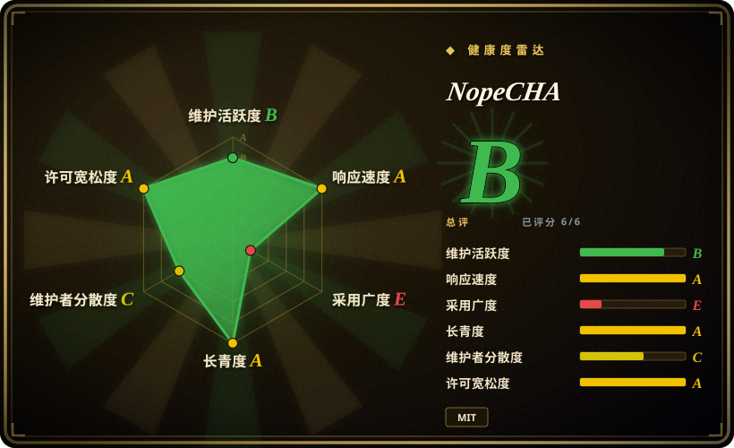

# NopeCHA

一个把验证码提交给 NopeCHA 托管服务并自动处理的浏览器扩展；只能用于自有系统或明确授权的测试环境，也不能假设它一定能识别或解出任何挑战。

## 何时使用

你是自动化工程师，正在测试自己的应用，或测试一个已获得明确授权的预发布环境。测试旅程里出现多类验证码，静态 fixture 又不足以覆盖真实交互。你想给 Chrome、Firefox、Selenium、Puppeteer 或其他 Chromium 自动化环境装一个扩展，而不是为每类挑战分别接 solver。NopeCHA 会在浏览器中检测支持的挑战，并把识别工作提交给托管的 NopeCHA API。

当你需要无人值守地覆盖多类验证码，并愿意用本地可审计性和人工触发式无障碍体验来换取更广的自动化覆盖时，可以在 Buster 与 NopeCHA 之间选择后者。这个选择只有在系统所有者已授权测试、允许外部 API 处理数据，并且测试计划能容忍成功率、额度和服务可用性变化时才成立。

## 何时不用

- **你不拥有目标系统，也没有明确授权。** 不要用 NopeCHA 或其他 solver 规避第三方访问控制；改用站点官方 API、验证码提供方的测试密钥，或所有者提供的测试环境。
- **你需要审计当前实现的完整源码。** 人工触发的 reCAPTCHA 音频辅助可用 Buster；授权测试也可用 Playwright 配合测试 fixture。NopeCHA 持续维护的 0.6.x 扩展源码不在默认分支中。
- **挑战数据不能离开你的环境。** 改用提供方测试密钥、本地 mock，或在授权实验室中使用 hcaptcha-challenger 这类自托管模型；当前产品依赖托管的 NopeCHA API。
- **你需要确定性的 CI，而不是真实验证码识别。** 用 Playwright mock 验证响应，或使用官方验证码测试密钥；没有 solver 能承诺面对持续变化的挑战仍稳定识别。
- **你只需要帮助真人处理 reCAPTCHA 音频挑战。** 用 Buster；它是用户主动触发的音频辅助流程，不是广覆盖的无人值守识别服务。
- **你需要源码级库接口，而不是装一个全浏览器扩展。** 可在同一授权边界内评估 2captcha-python 这类服务 SDK，同时接受它单独带来的服务、隐私和计费取舍。

## 横向对比

| 替代品 | 是否收录 | 我们的评价 | 取舍 |
|---|---|---|---|
| [Buster](buster.zh.md) | 已收录 | 需要真人触发、源码可审计的 reCAPTCHA 音频辅助时选 Buster；只有在已授权且要无人值守覆盖多类验证码时，才选 NopeCHA。 | Buster 更窄，可走本地或远端语音识别；NopeCHA 覆盖更广，但当前实现闭源并依赖托管服务。 |
| hcaptcha-challenger | 未收录 | 已授权流程只处理 hCaptcha，且源码审计比广覆盖更重要时，选 hcaptcha-challenger。 | 它更专用且要自行维护；NopeCHA 减少集成工作，但增加服务依赖和闭源风险。 |
| 2captcha-python | 未收录 | Python 程序需要明确的 API 客户端，而不是浏览器扩展时，选 2captcha-python；需要浏览器侧检测与交互时再选 NopeCHA。 | 两者都依赖外部识别服务，但接口、价格、数据处理和支持范围不同。 |
| [Text_select_captcha](text-select-captcha.zh.md) | 已收录 | 已授权场景需要本地中文点选文字管线时，选 Text_select_captcha；需要一个服务覆盖多类浏览器验证码时，选 NopeCHA。 | Text_select_captcha 本地且专用，但没有许可授权；NopeCHA 更广，却不公开当前实现。 |

## 技术栈

- **当前分发：** GitHub release 和浏览器商店提供预构建的 Chromium、Firefox 扩展包。
- **托管后端：** 浏览器扩展调用 NopeCHA API 做多模态验证码识别；当前服务端与模型实现不在本仓库中。
- **历史开源分支：** `legacy-oss` 包含处理 reCAPTCHA、hCaptcha、FunCaptcha、AWS WAF 和文字验证码的 JavaScript WebExtension content scripts，以及 Python 构建脚本。
- **浏览器权限：** 历史 Manifest V3 构建申请广泛的 host 权限，并向挑战 frame 注入脚本；当前 0.6.x 的权限应从实际分发包重新检查。

## 依赖

- Chrome、Chromium 或 Firefox，并从商店或 release 安装扩展。
- 能访问托管的 NopeCHA API；更高额度和部分能力需要 NopeCHA 账号与 API key。
- Selenium、Puppeteer 或 Playwright 由外围自动化流程提供，不属于本仓库的运行依赖。
- 目标所有者授权、测试凭据和验证码提供方认可的测试配置仍是运行前提。

## 运维难度

**安装低，长期依赖中等。** 装扩展很简单，但测试可靠性取决于第三方 API、持续变化的验证码实现、额度、商店或 release 更新，以及浏览器权限。应固定扩展产物，在隔离测试 profile 中运行，尽可能限制目标 host，并为 CI 保留确定性的 mock 路径。识别失败应作为预期分支处理，不能据此断言目标系统不可用。

## 健康度与可持续性

- **维护情况（2026-07）：** 仓库未归档，2026-06 仍有 push，并在 2025-12 至 2026-06 发布了 0.5.4 至 0.6.1。分发产品仍活跃，但当前源码已经关闭。
- **治理：** 仓库属于个人账号，服务路线由 NopeCHA 控制；用户无法只依靠默认分支独立维护当前扩展实现。
- **年龄与 Lindy：** 仓库约三年，并且仍在发版，这是有限的正向信号；但 2023 年的闭源转向削弱了它作为开源依赖的耐久性。
- **采用信号：** 约 10.5k GitHub star 只代表关注度，不代表准确率、授权状态或服务能长期持续。
- **风险标记：** 当前源码闭源、依赖托管服务、浏览器访问面广、当前二进制许可边界不清，以及验证码对抗环境可能随时造成能力回退。

## 存疑（未验证）

- [未验证] **首要存疑：** 当前 0.6.x 扩展源码不在默认分支中，只发布 release 二进制，因此无法从本仓库审计或复现构建持续维护的实现。
- [未验证] 已实读仓库 MIT LICENSE，但它是否覆盖当前闭源的 0.6.x 二进制和托管服务组件并不清楚；再分发或内置前应取得维护者说明。
- [未验证] 支持的挑战类型、免费额度、价格、保留策略和数据处理行为都可能在仓库外变化。
- [未验证] 不保证识别、解题成功或持续适配挑战变化；README 中的效果描述没有经过独立基准验证。
- [推断] `language: JavaScript` 描述的是历史开源扩展；当前默认分支没有持续维护的实现源码，因此 GitHub 未报告主要语言。
- [推断] 合法使用取决于目标所有权、明确授权、提供方条款和当地法律；本页是选型信息，不是法律意见。
