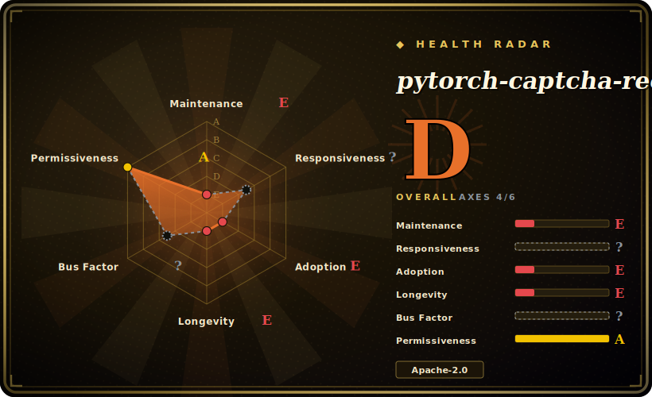

# pytorch-captcha-recognition

A small PyTorch example that trains an "end-to-end" CNN to read **fixed-length image CAPTCHAs** (e.g. 4-character digit/alphanumeric codes), classifying all characters at once — a learning/reference project, last updated 2020.

## When to use

You're learning how CAPTCHA recognition works, or you need a minimal, readable baseline for the simplest case: a **fixed-length** text-in-image CAPTCHA — say a 4-digit or 4-char alphanumeric code on a plain background. Rather than wiring up CTC or a sequence model, you want the dead-simple approach: a CNN with one classification head per character position, trained end-to-end on synthetically generated captchas. This repo is exactly that — it generates training images, defines a small CNN, trains it, and predicts, with the README claiming ~99.99% on pure digits and ~96% on digits+letters. It's a clean teaching scaffold you can read top to bottom and adapt, and the multi-head fixed-length design is a useful pattern to learn before reaching for heavier sequence models.

You reach for it as a **study reference or a starting template**, not as a maintained dependency — copy the idea (or the code) into your own project and modernize it.

## When NOT to use

- **Anything modern or production.** Last push 2020-01 with no releases — it predates current PyTorch versions and best practices; treat it as a frozen tutorial, not a live library. Expect to update APIs to run it today. [推断]
- **Variable-length or hard CAPTCHAs.** The fixed-position multi-head design assumes a known character count and plain layout; for variable length you need CTC or seq2seq, and for distorted/overlapping/click-select CAPTCHAs this approach won't hold.
- **You want a packaged solver.** This is example/training code, not a `pip install`-able library with a stable API — there's integration work to use it, and no support.
- **Legality / ToS.** As with any CAPTCHA solver, using it against a site you don't control may violate terms or law; the project is for learning.
- **You need the headline accuracy on real captchas.** The "99.99%/96%" numbers are on the repo's *own synthetic* captchas; on a real target's font/noise, accuracy will differ — don't quote them as your expected result.

## Comparison

| Alternative | In index | Tradeoff |
|---|---|---|
| [Cap](capjs.md) | ✅ | A CAPTCHA *generator/challenge* system, not a solver — the opposite side; included only to disambiguate "captcha" tooling. |
| [Text_select_captcha](text-select-captcha.md) | ✅ | Solves *click/text-select* CAPTCHAs (YOLO + Siamese), a harder interactive family; this repo only does fixed-length text-in-image classification. |
| ddddocr | 未收录 | Maintained, ready-to-use OCR/CAPTCHA library covering many types; far more practical today than a 2020 tutorial — prefer it for real work. |
| CRNN + CTC implementations | 未收录 | The standard for *variable-length* text recognition; more capable but more to learn/build than this multi-head fixed-length toy. |
| Your own modern PyTorch baseline | 未收录 | Same approach on current PyTorch; cleaner than reviving abandoned code, but you write it from scratch (this repo is the reference). |

## Tech stack

- **Framework:** PyTorch — a small convolutional network with **one classification head per character position** (fixed-length multi-output), trained end-to-end. [推断]
- **Data:** synthetically generated CAPTCHA images for training/validation (the repo includes generation), rather than a real-site dataset.
- **Pipeline:** scripts to generate data, train the model, and run prediction — a minimal train/eval/predict loop, not a service.

## Dependencies

- **Runtime:** Python + PyTorch (a 2020-era version), plus a captcha-image generation library and the usual NumPy/Pillow imaging stack. Exact pins are dated and likely need updating.
- **Hardware:** trainable on CPU for the tiny digit case; a GPU speeds training but isn't required for such a small model.
- **Data:** generated in-repo; no external dataset or service needed.

## Ops difficulty

**Low, but it's not "ops" — it's revival.** There's nothing to deploy: you run training and prediction scripts locally. The real cost is **modernization** — being a 2020 codebase with no releases, it likely needs dependency/API updates to run on current PyTorch, and you'll adapt the fixed-length head count and data generation to your specific captcha. Once running it's a self-contained training script with no datastore or service to operate. Budget for "get an old tutorial running again", not for production operations. [推断]

## Health & viability

- **Maintenance (2026-06).** Last push 2020-01, **no tagged releases** — effectively **abandoned/frozen**. Not archived, but ~6 years without a commit means treat it as a static reference, not a maintained project. [推断]
- **Governance / bus factor.** A **single-author** tutorial repo (`dee1024`, ~1.2k stars) on a personal account, with only a couple of contributors — maximal bus-factor risk, and the author has moved on. [推断]
- **Age & Lindy verdict.** Created 2018-03 (~8 years) but **inactive since 2020** ⇒ Lindy **fails on the "still-active" half**: age here signals *staleness*, not durability — the value is purely as a learning artifact. [推断]
- **Adoption.** ~1.2k stars reflect its popularity as a Chinese-language teaching example, not current production use; the README's accuracy claims drove early interest. [未验证]
- **Risk flags.** Apache-2.0 (permissive, no licensing problem) — the flags are staleness, abandonment, synthetic-only benchmarks, and the narrow fixed-length scope. [推断]

## Caveats (unverified)

- [未验证] ~1.2k stars and last push 2020-01 as of 2026-06; no GitHub Releases, so no version number is asserted.
- [未验证] "99.99% on digits / 96% on digits+letters" are the README's claims on the repo's *own synthetic* captchas — not independently verified and not representative of real-site accuracy.
- [推断] The architecture (CNN with one classification head per fixed character position, end-to-end) is inferred from the project description; not re-verified line-by-line against the source.
- [推断] Running it on current PyTorch likely requires dependency/API updates; "needs modernization" is an inference from the 2020 last-push date, not a tested result.
- [推断] "Abandoned/frozen" is inferred from ~6 years without commits; the repo is not GitHub-archived, so a maintainer could in principle return (none implied).
