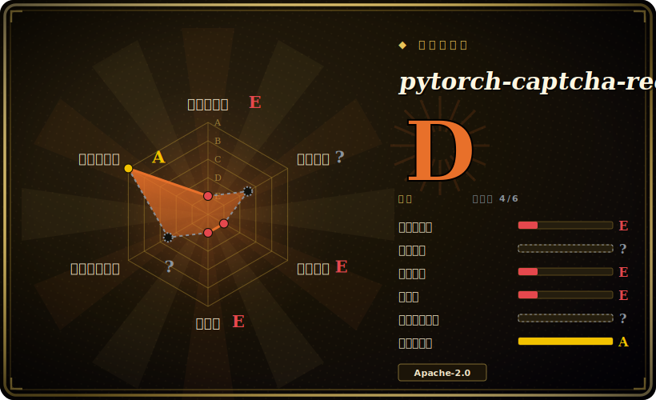

# pytorch-captcha-recognition

一个小巧的 PyTorch 示例，训练一个“端到端”CNN 来识别**定长图片验证码**（如 4 位数字/字母数字码），一次性把所有字符分类——一个学习/参考项目，最后更新于 2020 年。

## 何时使用

你在学验证码识别是怎么回事，或者你需要为最简单的情形找一个极小、可读的基线：**定长**图中文字验证码——比如纯背景上的 4 位数字或 4 位字母数字码。你不想搭 CTC 或序列模型，只想要最朴素的做法：一个 CNN，每个字符位置一个分类头，在合成生成的验证码上端到端训练。这个仓库正是如此——它生成训练图、定义一个小 CNN、训练并预测，README 称纯数字约 99.99%、数字+字母约 96%。它是一份干净的教学脚手架，你能从头读到尾并改用，而这种定长多头设计是一种值得在动用更重的序列模型之前先学会的模式。

你把它当作**研习参考或起步模板**，而非在维护的依赖——把思路（或代码）拷进你自己的项目并现代化它。

## 何时不用

- **任何现代或生产用途。** 最后 push 2020-01 且无发布——它早于当前 PyTorch 版本和最佳实践；当作冻结的教程，而非活的库。今天要跑它，得准备更新 API。[推断]
- **变长或困难验证码。** 定位多头设计假设字符数已知且布局简单；变长需要 CTC 或 seq2seq，而对扭曲/重叠/点选式验证码，这套方法撑不住。
- **你想要打包好的 solver。** 这是示例/训练代码，不是可 `pip install`、带稳定 API 的库——用起来要做集成工作，且无支持。
- **合法性 / ToS。** 与任何验证码 solver 一样，针对你不掌控的站点使用它可能违反条款或法律；本项目用于学习。
- **你需要头条准确率落到真实验证码上。** “99.99%/96%”是在仓库*自己的合成*验证码上得到的；在真实目标的字体/噪声上，准确率会不同——别把它们当作你的预期结果引用。

## 横向对比

| 替代品 | 是否收录 | 我们的评价 | 取舍 |
|---|---|---|---|
| [Cap](capjs.zh.md) | ✅ | 当前页用于它的主场景；如果更看重“一个验证码*生成/挑战*系统，不是 solver”，再选 Cap。 | 一个验证码*生成/挑战*系统，不是 solver——问题的另一面；列入只为消歧“captcha”工具。 |
| [Text_select_captcha](text-select-captcha.zh.md) | ✅ | 当前页用于它的主场景；如果更看重“解*点选/文字点选*验证码（YOLO + Siamese），是更难的交互式族”，再选 Textselectcaptcha。 | 解*点选/文字点选*验证码（YOLO + Siamese），是更难的交互式族；本仓库只做定长图中文字分类。 |
| ddddocr | 未收录 | 当前页用于它的主场景；如果更看重“有人维护、开箱即用的 OCR/验证码库，覆盖多种类型”，再选 ddddocr。 | 有人维护、开箱即用的 OCR/验证码库，覆盖多种类型；今天远比一份 2020 教程实用——真实工作优先它。 |
| CRNN + CTC 实现 | 未收录 | 当前页用于它的主场景；如果更看重“*变长*文字识别的标准做法”，再选 CRNN + CTC 实现。 | *变长*文字识别的标准做法；能力更强但比这个定长多头玩具更费学/费搭。 |
| 你自己的现代 PyTorch 基线 | 未收录 | 当前页用于它的主场景；如果更看重“同样的方法用当前 PyTorch 写”，再选 你自己的现代 PyTorch 基线。 | 同样的方法用当前 PyTorch 写；比复活弃用代码更干净，但要从零写（本仓库作参考）。 |

## 技术栈

- **框架：** PyTorch——一个小卷积网络，**每个字符位置一个分类头**（定长多输出），端到端训练。[推断]
- **数据：** 用合成生成的验证码图做训练/验证（仓库含生成），而非真实站点数据集。
- **管线：** 生成数据、训练模型、运行预测的脚本——一个极小的训练/评估/预测循环，不是服务。

## 依赖

- **运行时：** Python + PyTorch（2020 时代的版本），加上一个验证码图生成库和常见的 NumPy/Pillow 图像栈。确切版本固定已过时，多半需要更新。
- **硬件：** 小小的数字情形可在 CPU 上训练；GPU 加速训练但对这么小的模型并非必需。
- **数据：** 仓库内生成；无需外部数据集或服务。

## 运维难度

**低，但这不是“运维”——是复活。** 没有要部署的东西：你在本地跑训练和预测脚本。真正的成本在**现代化**——作为一个无发布的 2020 代码库，它多半需要更新依赖/API 才能在当前 PyTorch 上跑，而且你要把定长头数和数据生成改到适配你具体的验证码。一旦跑起来，它是一个自包含的训练脚本，没有要运维的数据存储或服务。预算应放在“让一份旧教程重新跑起来”，而非生产运维。[推断]

## 健康度与可持续性

- **维护（2026-06）。** 最后 push 2020-01，**无 tag 发布**——实质上**已废弃/冻结**。未归档，但约 6 年无提交意味着把它当静态参考，而非在维护的项目。[推断]
- **治理 / bus factor。** 个人账号下的**单作者**教程仓库（`dee1024`，约 1.2k star），仅有寥寥几名贡献者——最大化的 bus-factor 风险，作者已转身离开。[推断]
- **年龄与 Lindy 判断。** 2018-03 创建（约 8 年）但**自 2020 不活跃**⇒ Lindy 在“仍活跃”那一半**不成立**：这里的年龄信号是*陈旧*而非耐久——价值纯粹在于它是一份学习材料。[推断]
- **采用度。** 约 1.2k star 反映它作为中文教学示例的流行度，而非当前生产使用；README 的准确率说法驱动了早期关注。[未验证]
- **风险标记。** Apache-2.0（宽松，无许可问题）——标记在于陈旧、废弃、仅合成基准，以及狭窄的定长范围。[推断]

## 存疑（未验证）

- [未验证] 截至 2026-06 约 1.2k star，最后 push 2020-01；无 GitHub Releases，故不断言版本号。
- [未验证] “纯数字 99.99% / 数字+字母 96%”是 README 在仓库*自己的合成*验证码上的说法——未经独立验证，也不代表真实站点准确率。
- [推断] 架构（CNN、每个定长字符位置一个分类头、端到端）由项目描述推断，未对源码逐行重新核实。
- [推断] 在当前 PyTorch 上跑它多半需要更新依赖/API；“需要现代化”是由 2020 的最后 push 日期推断，而非实测结果。
- [推断] “废弃/冻结”由约 6 年无提交推断；仓库未被 GitHub 归档，故原则上维护者可能回归（并不暗示会）。
