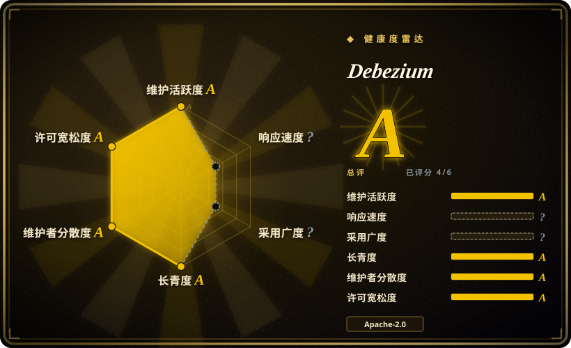

# Debezium

Change data capture for a variety of databases. Please log issues at https://github.com/debezium/dbz/issues.

## 何时使用

你正在为一个落在 `databases` 分类里的任务选择开源基础设施，需要评估一个真实仓库，而不是只在对比表里看到一个名字。当 Debezium 的上游描述贴合任务，并且采用现成项目比从零写胶水代码更划算时，你把它列入候选。

这个首版页面存在，是因为 Debezium 在 atlas backlog 里反复作为对比候选出现。请把它当作有 intake 依据的起点：先核验上游 README 和许可证，再和下方已收录的邻近页面对照，然后再决定是否引入依赖。

## 何时不用

- **你今天就需要一篇已经深度审过的 atlas 页面。** 在本页完成上游文档语义复核前，优先使用横向对比表里更成熟的已收录页面。
- **GitHub 元数据暴露了你的硬约束。** 如果许可证、归档状态或维护节奏是关键约束，优先选择本分类里核验更充分的替代品，而不是直接依赖 Debezium。
- **你的任务需要更窄、更专门的替代品。** 如果某个现有页面的“何时不用”已经点名你的约束，应优先按那个页面选型；本页只是较宽的首版入口。
- **你承受不了上游变动或运维未知数。** 请选择 Lindy 记录更长、运维画像更清楚的已收录项目。

## 横向对比

| 替代品 | 是否收录 | 我们的评价 | 取舍 |
|---|---|---|---|
| [ClickHouse](clickhouse.zh.md) | ✅ | 当你需要本分类里已经收录、约束更明确的方案时，先用它和 Debezium 对照。 | Debezium 是从 intake backlog 新增的首版页面；现有页面的“不用场景”如果更贴近任务，应优先按现有页面选择。 |
| [DBeaver](dbeaver.zh.md) | ✅ | 当你需要本分类里已经收录、约束更明确的方案时，先用它和 Debezium 对照。 | Debezium 是从 intake backlog 新增的首版页面；现有页面的“不用场景”如果更贴近任务，应优先按现有页面选择。 |
| [DuckDB](duckdb.zh.md) | ✅ | 当你需要本分类里已经收录、约束更明确的方案时，先用它和 Debezium 对照。 | Debezium 是从 intake backlog 新增的首版页面；现有页面的“不用场景”如果更贴近任务，应优先按现有页面选择。 |
| [elasticsearch-dsl-py](elasticsearch-dsl-py.zh.md) | ✅ | 当你需要本分类里已经收录、约束更明确的方案时，先用它和 Debezium 对照。 | Debezium 是从 intake backlog 新增的首版页面；现有页面的“不用场景”如果更贴近任务，应优先按现有页面选择。 |
| 自写集成 | 未收录 | 只有需求很小、维护成本明确低于引入 Debezium 时，才自写。 | 自写能少一个依赖，但会失去上游项目、生态和本页记录的选型取舍。 |

## 技术栈

- **主要语言：** GitHub 元数据返回为 Java。
- **仓库：** `debezium/debezium`。
- **项目形态：** atlas 路由暂归为 `service`；把它当稳定 API 契约前，请复核上游架构。
- **上游状态：** 默认分支 `main`，最后 push `2026-07-03T12:43:44Z`，archived 为 `false`。

## 依赖

- **运行时依赖：** 本次 intake 未穷尽核验；生产使用前请检查上游依赖清单。
- **外部服务：** 本次 intake 未穷尽核验；请确认是否需要数据库、队列、云 API、浏览器运行时、GPU 或模型供应商凭据。
- **运维输入：** 至少依赖该 GitHub 仓库及其发布和更新流程。

## 运维难度

**在重读上游文档前，按未知到中等处理。** library 形态的项目可能很容易试用，但仍需要 pin 版本并审查升级。app、service、framework 形态可能隐藏数据库、worker、存储、认证、浏览器、GPU 或云厂商要求，因此请把这个首版页面当成 intake 标记，而不是完整运维手册。

## 健康度与可持续性

- **维护快照：** 截至 2026-07-06，GitHub 返回 `archived=false`，`pushed_at=2026-07-03T12:43:44Z`。
- **采用快照：** 2026-07 约 12,876 个 GitHub stars；stars 只是有噪声的采用信号。
- **许可证快照：** GitHub API 返回 `Apache-2.0`；许可证关键时必须检查仓库内许可证文件。
- **Lindy 与治理：** 本次 intake 未完整复核。长期采用前，请继续检查组织归属、项目年龄、发布节奏和 bus factor。
- **风险信号：** 本页是从 backlog 元数据生成的首版页面。

## 存疑（未验证）

- [未验证] 这是依据 GitHub 元数据和 2026-07-06 backlog 生成的首版 intake 页面；高风险选型前，请重新阅读上游 README、文档、许可证文件和 release notes。
- [推断] 横向对比表先使用同分类已收录页面作为起点；后续语义复核应把泛化邻居替换成最接近的真实替代品。
