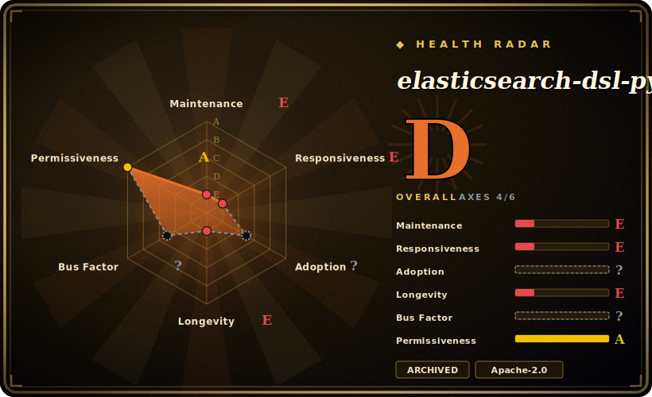

# elasticsearch-dsl-py

A high-level, Pythonic DSL over the low-level Elasticsearch client — query objects, a Document ORM-style mapping layer, and chainable search builders instead of hand-writing query JSON. **Archived: as of v8.18.0 it lives inside the official `elasticsearch` Python client as `elasticsearch.dsl`.**

## When to use

You're a Python engineer building search features against Elasticsearch and you're tired of assembling nested query dictionaries by hand — the raw client makes you write deeply-nested JSON for every bool/filter/aggregation, and refactoring a query means editing dict literals with no help from your editor. With elasticsearch-dsl you write `Search().query("match", title="python").filter("term", published=True)`, define your documents as Python classes with typed fields, and let the library serialize to the right request body — closer to an ORM/query-builder experience than raw JSON.

But for new code in 2026 you should **not install this package** — you install the official `elasticsearch` client (≥8.18) and `import elasticsearch.dsl`, which is the same code now maintained in-tree. You'd only read this standalone repo if you maintain a legacy codebase pinned to `elasticsearch-dsl` 8.17 or older and need to understand or migrate it.

## When NOT to use

- **Any new project.** The package is **archived and merged** — install `elasticsearch>=8.18` and use `elasticsearch.dsl`. Installing the standalone `elasticsearch-dsl` package today only gets you a redirect shim. Migrating is a find-replace of `elasticsearch_dsl` → `elasticsearch.dsl`.
- **You're on OpenSearch, not Elasticsearch.** After the fork, OpenSearch has its own clients; this DSL targets Elastic's server and version-matches it. Use `opensearch-py` instead. [未验证]
- **You want a thin, version-agnostic client.** The DSL pins to Elasticsearch major versions (8.x DSL ↔ 8.x server); if you need to span server versions or want minimal abstraction, the raw client (or plain HTTP) is more portable.
- **Very dynamic / generated queries.** When you're programmatically building arbitrary query shapes, the dict-based raw client is sometimes more direct than fighting the object model.
- **You expect independent feature development here.** This repo is frozen; new features land in `elasticsearch-py`, not on this archived tree.

## Comparison

| Alternative | In index | Our verdict | Tradeoff |
|---|---|---|---|
| `elasticsearch` (elasticsearch-py) | 未收录 | Use this page for its stated niche; choose elasticsearch (elasticsearch-py) when you need the official low-level client. | The official low-level client — and now the **home of this DSL** (`elasticsearch.dsl`). For new code this *is* the answer; the standalone repo is its archived ancestor. |
| `opensearch-py` / opensearch-dsl-py | 未收录 | Use this page for its stated niche; choose opensearch-py / opensearch-dsl-py when you need the OpenSearch fork's clients. | The OpenSearch fork's clients; use these if you run OpenSearch rather than Elastic's distribution. |
| Raw query dicts (no DSL) | 未收录 | Use this page for its stated niche; choose Raw query dicts (no DSL) when you need zero abstraction, fully version-agnostic, but verbose and refactor-hostile for complex queries. | Zero abstraction, fully version-agnostic, but verbose and refactor-hostile for complex queries — the pain the DSL exists to remove. |
| Haystack / django-elasticsearch-dsl | 未收录 | Use this page for its stated niche; choose Haystack / django-elasticsearch-dsl when you need higher-level search framework / Django integration layered on top. | Higher-level search framework / Django integration layered on top; more opinionated, narrower than the raw DSL. |

## Tech stack

- **Language:** Python.
- **Built on:** the low-level `elasticsearch` Python client (it wraps, not replaces, the transport/client).
- **Surface:** a `Search` query/aggregation builder, a `Document` persistence/mapping layer (ORM-like), faceted search, and a `UpdateByQuery` helper.
- **Versioning:** version-matched to Elasticsearch majors (the 8.x line tracks ES 8.x).

## Dependencies

- **Runtime:** the `elasticsearch` Python client (and through it, an HTTP transport). A running Elasticsearch cluster to talk to — the library is a client, it stores nothing itself.
- **Python:** a supported CPython version per the package metadata of the version you pin. [未验证]
- **For new code:** none of the above as a *separate* install — `elasticsearch>=8.18` brings the DSL in-tree.

## Ops difficulty

**Low (it's a client library).** There is nothing to operate for the library itself — no service, no datastore. The operational burden is entirely your **Elasticsearch cluster** (provisioning, sharding, upgrades, version-matching the client). The one library-specific gotcha is **version alignment**: keep the DSL/client major in step with your server major, and for new work prefer the merged `elasticsearch.dsl` so you're not pinned to an archived package.

## Health & viability

- **Maintenance (2026-06).** **Archived** — last push 2025-04, final release v8.18.0 (2025-04). Development has **moved into `elasticsearch-py`**; this repo is intentionally frozen, not abandoned-by-neglect. [推断]
- **Governance / backing.** Backed by **Elastic** (the vendor), Apache-2.0, with experienced maintainers (honzakral, miguelgrinberg, pquentin). Vendor-owned but the code continues under active maintenance in the merged client. [推断]
- **Age & Lindy verdict.** Created 2014-03 (~12 years); long-lived and well-proven, but the *standalone* tree is now end-of-line — Lindy applies to the **lineage**, which continues inside `elasticsearch-py`, not to this frozen repo. [推断]
- **Adoption.** 3.9k stars, 791 forks, broad historical use in the Python+Elasticsearch ecosystem; the migration path is explicit and low-friction. [未验证]
- **Risk flags.** The only real risk is using the **wrong (archived) package** for new code; there's no relicense trap (Apache-2.0). Note the broader Elasticsearch/OpenSearch licensing split is a *server*-side concern, not this client's. [推断]

## Caveats (unverified)

- [未验证] Stars ~3.9k, forks ~791, 45 open issues as of 2026-06 — indicative, volatile.
- [未验证] Whether the merged `elasticsearch.dsl` is byte-for-byte the same API as the last standalone release was not diffed; the deprecation notice claims import-compatibility, treat as the project's own statement.
- [未验证] OpenSearch client recommendation is general knowledge, not verified against this repo's docs.
- [未验证] Exact supported Python versions depend on the pinned release's metadata, not asserted here.
