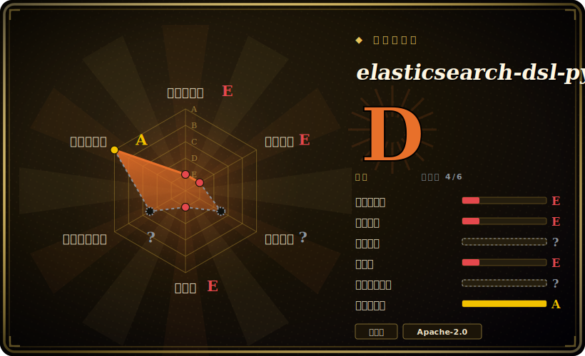

# elasticsearch-dsl-py

一层架在底层 Elasticsearch 客户端之上的高层、Pythonic DSL——用查询对象、类 ORM 的 Document 映射层和可链式的搜索构建器，取代手写查询 JSON。**已归档：自 v8.18.0 起，它已并入官方 `elasticsearch` Python 客户端，作为 `elasticsearch.dsl`。**

## 何时使用

你是 Python 工程师，在 Elasticsearch 上做搜索功能，已经厌倦了手工拼嵌套查询字典——原始客户端逼你为每个 bool/filter/aggregation 写深层嵌套的 JSON，改一个查询就得编辑 dict 字面量、编辑器还帮不上忙。用 elasticsearch-dsl，你写 `Search().query("match", title="python").filter("term", published=True)`，把文档定义成带类型字段的 Python 类，让库序列化成正确的请求体——比起裸 JSON，更接近 ORM／查询构建器的体验。

但在 2026 年的新代码里你**不应安装这个包**——你应安装官方 `elasticsearch` 客户端（≥8.18）并 `import elasticsearch.dsl`，那是如今在主仓内维护的同一份代码。你只有在维护一份锁死在 `elasticsearch-dsl` 8.17 或更老的遗留代码库、需要理解或迁移它时，才会去读这个独立仓库。

## 何时不用

- **任何新项目。** 这个包**已归档并已合并**——请安装 `elasticsearch>=8.18` 并用 `elasticsearch.dsl`。今天装独立的 `elasticsearch-dsl` 包只会拿到一个重定向 shim。迁移就是把 `elasticsearch_dsl` → `elasticsearch.dsl` 做一次查找替换。
- **你用的是 OpenSearch 而非 Elasticsearch。** 分叉之后，OpenSearch 有自己的客户端；这个 DSL 瞄准 Elastic 的服务端并与之版本对齐。请改用 `opensearch-py`。[未验证]
- **你想要一个轻薄、版本无关的客户端。** 这个 DSL 锁定 Elasticsearch 大版本（8.x DSL ↔ 8.x 服务端）；若你需要跨服务端版本或想要最小抽象，原始客户端（或纯 HTTP）更可移植。
- **高度动态／生成式查询。** 当你以编程方式构建任意查询形状时，基于 dict 的原始客户端有时比跟对象模型较劲更直接。
- **你指望这里有独立的功能开发。** 这个仓库已冻结；新功能落在 `elasticsearch-py`，而非这棵已归档的树上。

## 横向对比

| 替代品 | 是否收录 | 我们的评价 | 取舍 |
|---|---|---|---|
| `elasticsearch`（elasticsearch-py） | 未收录 | 当前页用于它的主场景；如果更看重“官方底层客户端”，再选 elasticsearch（elasticsearch-py）。 | 官方底层客户端——如今也是**这个 DSL 的归宿**（`elasticsearch.dsl`）。对新代码这*就是*答案；独立仓库是它已归档的祖先。 |
| `opensearch-py` / opensearch-dsl-py | 未收录 | 当前页用于它的主场景；如果更看重“OpenSearch 分叉的客户端”，再选 opensearch-py / opensearch-dsl-py。 | OpenSearch 分叉的客户端；若你跑 OpenSearch 而非 Elastic 发行版，请用这些。 |
| 裸查询 dict（无 DSL） | 未收录 | 当前页用于它的主场景；如果更看重“零抽象、完全版本无关，但对复杂查询冗长且抗重构”，再选 裸查询 dict（无 DSL）。 | 零抽象、完全版本无关，但对复杂查询冗长且抗重构——正是 DSL 存在要消除的痛点。 |
| Haystack / django-elasticsearch-dsl | 未收录 | 当前页用于它的主场景；如果更看重“架在其上的更高层搜索框架／Django 集成”，再选 Haystack / django-elasticsearch-dsl。 | 架在其上的更高层搜索框架／Django 集成；更有主张、比裸 DSL 更窄。 |

## 技术栈

- **语言：** Python。
- **构建于：** 底层 `elasticsearch` Python 客户端之上（它封装而非替代 transport／client）。
- **表面：** 一个 `Search` 查询／聚合构建器、一个 `Document` 持久化／映射层（类 ORM）、faceted search，以及一个 `UpdateByQuery` 辅助器。
- **版本：** 与 Elasticsearch 大版本对齐（8.x 线跟随 ES 8.x）。

## 依赖

- **运行时：** `elasticsearch` Python 客户端（并经它依赖一个 HTTP transport）。需要一个运行中的 Elasticsearch 集群来对话——库是客户端，自身不存储任何东西。
- **Python：** 按你锁定版本的包元数据支持的某个 CPython 版本。[未验证]
- **对新代码：** 上述都不需要*单独*安装——`elasticsearch>=8.18` 已把 DSL 带进主仓。

## 运维难度

**低（它是客户端库）。** 库本身没有任何要运维的东西——没有服务、没有数据存储。运维负担全在你的 **Elasticsearch 集群**（部署、分片、升级、客户端版本对齐）。唯一与库相关的坑是**版本对齐**：让 DSL／客户端大版本与服务端大版本同步，新工作优先用已合并的 `elasticsearch.dsl`，免得被锁在一个已归档的包上。

## 健康度与可持续性

- **维护（2026-06）。** **已归档**——最后 push 于 2025-04，末版 v8.18.0（2025-04）。开发已**迁入 `elasticsearch-py`**；这个仓库是有意冻结，并非疏于维护而废弃。[推断]
- **治理／背书。** 由 **Elastic**（厂商）背书，Apache-2.0，维护者经验丰富（honzakral、miguelgrinberg、pquentin）。厂商所有，但代码在合并后的客户端里继续被积极维护。[推断]
- **年龄与 Lindy 判断。** 2014-03 创建（约 12 年）；长寿且久经验证，但*独立*这棵树如今已到末端——Lindy 适用于其**血缘**（在 `elasticsearch-py` 内延续），而非这个冻结的仓库。[推断]
- **采用度。** 3.9k star、791 fork，在 Python+Elasticsearch 生态里历史使用广泛；迁移路径明确、摩擦低。[未验证]
- **风险标记。** 唯一真实风险是新代码用了**错误的（已归档）包**；不存在 relicense 陷阱（Apache-2.0）。注意更广的 Elasticsearch／OpenSearch 许可分裂是*服务端*的事，与这个客户端无关。[推断]

## 存疑（未验证）

- [未验证] 截至 2026-06 约 3.9k star、约 791 fork、45 个 open issue——指示性、易变。
- [未验证] 合并后的 `elasticsearch.dsl` 是否与最后独立版逐字节同一 API 并未对比；弃用通知声称导入兼容，按项目自述对待。
- [未验证] OpenSearch 客户端建议是常识，未对照本仓库文档验证。
- [未验证] 确切支持的 Python 版本取决于所锁定发行版的元数据，这里不作断言。
