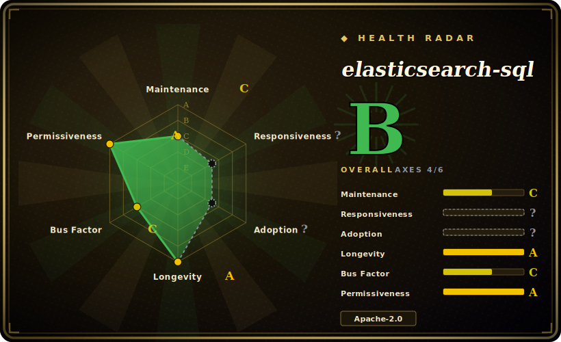

# elasticsearch-sql

Query Elasticsearch with SQL instead of its native JSON Query DSL — a community plugin (and library) that parses SQL and translates it into ES queries/aggregations, with version-matched releases tracking the ES major you run.

## When to use

You're an analyst or backend engineer whose team already speaks SQL, and you've inherited an Elasticsearch cluster as the data store. The native Query DSL is a wall of nested JSON, and onboarding people onto it is slow — but everyone can write `SELECT age, COUNT(*) FROM bank GROUP BY age ORDER BY age` in their sleep. You install elasticsearch-sql, point it at your cluster, and now SQL strings get translated into the equivalent ES query/aggregation under the hood — so dashboards, ad-hoc exploration, and people coming from a relational background can hit ES without learning DSL first.

You reach for it specifically as a **translation/convenience layer**: SELECT/WHERE/GROUP BY/aggregations expressed in familiar SQL, often exposed through a small web UI or used as an embeddable Java library that turns a SQL string into an ES request. It shines when the friction is *people knowing DSL*, not raw query power.

## When NOT to use

- **Elastic's own X-Pack SQL covers you.** Modern Elasticsearch ships a first-party SQL/ES|QL capability (`_sql` endpoint, JDBC/ODBC). If that supports your queries, prefer the vendor feature — it's maintained in lockstep with the engine and avoids a third-party plugin. [未验证]
- **You need full SQL semantics.** This translates a *subset* of SQL to ES; complex JOINs (ES isn't relational), correlated subqueries, window functions, and exact SQL-standard semantics are where the abstraction leaks. Verify your specific queries translate correctly. [未验证]
- **Version-matching is a burden you can't carry.** The plugin version-tracks the ES major (the v9.x line ↔ ES 9.x); upgrading ES means finding/upgrading a matching plugin build, and a lagging plugin can block an ES upgrade.
- **OpenSearch, not Elasticsearch.** Post-fork compatibility with OpenSearch is not guaranteed; check before relying on it there.
- **Performance-critical hot paths.** SQL→DSL translation hides what query actually runs; for tuned, latency-sensitive queries, writing DSL directly gives you control the translation layer abstracts away.

## Comparison

| Alternative | In index | Tradeoff |
|---|---|---|
| Elasticsearch SQL / ES\|QL (X-Pack) | 未收录 | Elastic's first-party SQL and the newer ES\|QL pipe language, with JDBC/ODBC; maintained with the engine — prefer it when it covers your needs. This plugin predates and overlaps it. |
| OpenSearch SQL plugin | 未收录 | The OpenSearch fork's own SQL/PPL plugin; the analogous answer if you run OpenSearch instead of Elastic. |
| Native Query DSL | 未收录 | Maximum power and control, version-native, but verbose JSON with a steep learning curve — the friction this project removes. |
| Presto/Trino + ES connector | 未收录 | Full ANSI-SQL engine that can federate ES with other sources; far heavier to operate, but real SQL semantics and JOINs across stores. |

## Tech stack

- **Language:** Java.
- **SQL parsing:** historically built on Alibaba **Druid**'s SQL parser to turn SQL into an AST before translating to ES queries.
- **Form factors:** an Elasticsearch site/plugin with a small web UI, plus use as an embeddable Java library / JDBC-style integration.
- **Versioning:** releases version-matched to the Elasticsearch major (v9.3.x tracks ES 9.x).

## Dependencies

- **Elasticsearch cluster:** a running ES of the matching major version — the plugin is meaningless without it.
- **Java runtime:** a JVM compatible with both the plugin and your ES version. [未验证]
- **Version-matched build:** you must install the plugin build that corresponds to your ES major; mismatches won't load.
- **No separate datastore** — it queries your existing ES indices.

## Ops difficulty

**Medium.** The translation library itself is light, but the operational reality is **version-coupling to Elasticsearch**: every ES major upgrade requires a matching plugin build, so the plugin sits on your upgrade critical path. As a cluster-installed plugin it shares ES's lifecycle (restart on install, compatibility testing). Embedding it as a Java library sidesteps the plugin-install/restart dance but ties you to its API. The harder questions are correctness (does my SQL translate to the query I expect?) and keeping plugin builds in sync across ES upgrades — not running a separate service.

## Health & viability

- **Maintenance (2026-06).** Last push 2026-05-04, multiple v9.3.x releases dated the same day — **active** and tracking current ES majors, not abandoned. Not archived. [推断]
- **Governance / backing.** A **community project** under the NLPchina org (contributors incl. ansjsun, shi-yuan); no single corporate vendor behind it — bus-factor rests on a small active maintainer set, a real consideration vs Elastic's first-party SQL. [推断]
- **Age & Lindy verdict.** Created 2014-08 (~12 years) and **still shipping** version-matched releases ⇒ a **strong Lindy** signal; it has survived many ES majors, which is itself evidence of durable maintenance discipline. [推断]
- **Adoption.** 7.0k stars, 1.5k forks — heavy historical adoption, especially in the Chinese ES community where it long predated first-party SQL. The ~330 open issues reflect a large, long-lived user base and the churn of tracking ES versions. [未验证]
- **Risk flags.** Overlap with Elastic's now-native SQL/ES\|QL is the strategic risk — a community translation layer competes with a vendor feature maintained in-engine; weigh long-term reliance accordingly. [推断]

## Caveats (unverified)

- [未验证] Stars ~7.0k, forks ~1.53k, ~330 open issues as of 2026-06 — volatile, indicative only.
- [未验证] That it's built on Druid's SQL parser is from general project history; not re-confirmed against the current source tree.
- [未验证] The exact subset of SQL supported (which JOINs/subqueries/functions translate) shifts release-to-release — verify your queries against the version you install.
- [未验证] Compatibility with OpenSearch and the precise ES version-matching matrix were not confirmed from the repo for this entry.
- [未验证] Whether Elastic's first-party SQL/ES\|QL covers a given workload depends on the ES version and feature tier; not verified here.
