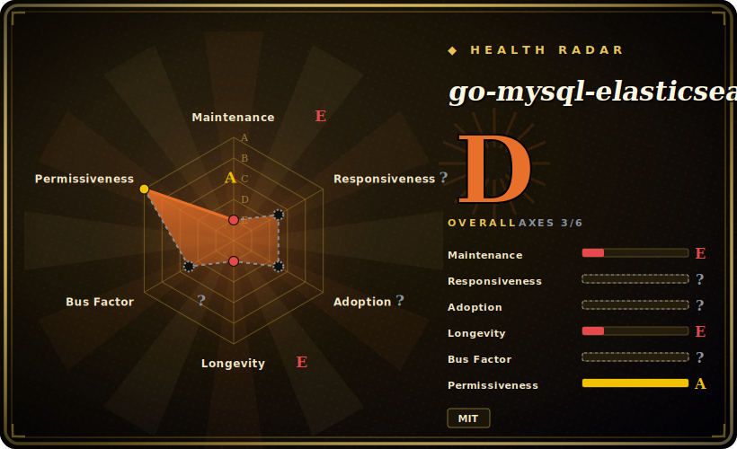

# go-mysql-elasticsearch

A small Go service that syncs MySQL into Elasticsearch in real time: it does an initial dump, then tails the MySQL binlog as a fake replica and applies inserts/updates/deletes to ES indices per a mapping rule file.

## When to use

You run a MySQL-backed app and you need full-text or analytical search over that data in Elasticsearch — but you don't want your application to write to two stores and keep them consistent by hand. You want ES to *follow* MySQL automatically. You configure go-mysql-elasticsearch with your MySQL connection, your ES endpoint, and a set of rules mapping tables → indices/types with field mappings. On start it dumps the existing rows into ES, then registers as a replication client and **tails the binlog**, so every subsequent INSERT/UPDATE/DELETE in MySQL is streamed into the matching ES document — a lightweight CDC pipeline in one binary, no Kafka, no Debezium cluster.

You reach for it when the job is specifically **MySQL→ES, one direction, modest scale**, and you'd rather run a single Go process than stand up a full streaming platform. It's the minimal "keep my search index in sync with my database" tool.

## When NOT to use

- **It's effectively unmaintained.** Last commit 2023-10, **no tagged releases**, an old `go.mod` (Go 1.12-era deps). For a new production pipeline in 2026 this is a real risk — bugs and ES/MySQL-version drift won't get fixed upstream. Treat it as "fork-and-own" territory. [推断]
- **You need many sources/sinks or transformations.** This is point-to-point MySQL→ES only. If you need Postgres, multiple sinks, schema-change handling, or rich transforms, a real CDC platform (Debezium/Kafka Connect, Flink CDC) is the right tool.
- **DDL / schema evolution matters.** Binlog-tailing tools handle row events well; online schema changes, new columns, and table renames are where lightweight syncers break or silently drift. Verify behavior for your migration patterns.
- **You need exactly-once / strong delivery guarantees.** A single-process binlog tailer's failure/restart and checkpoint semantics are simpler than a platform with offsets and a durable log; validate recovery and dedup for your durability needs.
- **Modern Elasticsearch with removed "types".** Older tools assume mapping types (`_type`); ES 7+/8+ removed them. Confirm the tool's ES-version assumptions match your cluster before relying on it.

## Comparison

| Alternative | In index | Our verdict | Tradeoff |
|---|---|---|---|
| Debezium (+ Kafka Connect) | 未收录 | Use this page for its stated niche; choose Debezium (+ Kafka Connect) when you need the industrial-strength CDC standard. | The industrial-strength CDC standard; durable, multi-source, exactly-once-ish via Kafka — but it's a whole platform to run vs one Go binary. |
| Logstash JDBC input | 未收录 | Use this page for its stated niche; choose Logstash JDBC input when you need polling-based (not binlog CDC), simpler to start, but query-polling misses deletes and adds DB load. | Polling-based (not binlog CDC), simpler to start, but query-polling misses deletes and adds DB load; coarser than true CDC. |
| Flink CDC | 未收录 | Use this page for its stated niche; choose Flink CDC when you need full stream-processing CDC with transforms and many connectors. | Full stream-processing CDC with transforms and many connectors; powerful and maintained, far heavier operationally. |
| Canal (Alibaba) | 未收录 | Use this page for its stated niche; choose Canal (Alibaba) when you need mature MySQL binlog CDC server (Java). | Mature MySQL binlog CDC server (Java); more robust and active, but a server to operate rather than a single-binary syncer. |
| go-mysql (library) | 未收录 | Use this page for its stated niche; choose go-mysql (library) when you need the underlying binlog/replication library this tool is built on. | The underlying binlog/replication library this tool is built on; use it directly if you want to build a custom syncer rather than this canned one. |

## Tech stack

- **Language:** Go (single binary).
- **Built on:** the `go-mysql` library (binlog parsing / fake-replica replication protocol) by the same org/author (siddontang).
- **Mechanism:** initial `mysqldump`-style load, then a binlog replication client streaming row events to ES.
- **Config:** a rule/config file mapping MySQL tables to ES indices/types with field mappings; Prometheus client present for metrics.

## Dependencies

- **MySQL:** with binary logging enabled in **ROW** format and replication privileges for the tool to act as a replica.
- **Elasticsearch:** a reachable ES cluster as the sink (version compatibility is your responsibility — see "removed types" above).
- **Build:** a Go toolchain (the repo's `go.mod` targets Go 1.12; building on a modern toolchain may need attention).
- **No message broker** — it's direct MySQL→ES, no Kafka in the path.

## Ops difficulty

**Medium, and rising with neglect.** The happy path is light: one binary, one config, point it at MySQL + ES. But operating it for real means owning the unglamorous parts: enabling ROW-format binlog and replica privileges, handling the initial-dump-then-stream cutover, checkpoint/resume after restarts, and watching for drift when MySQL schemas change. The **maintenance gap is the dominant ops cost** — with no upstream releases since 2023 you may have to patch ES-client or Go-version issues yourself, so budget for forking and self-maintenance rather than relying on upstream fixes. [推断]

## Health & viability

- **Maintenance (2026-06).** **Stale.** Last push 2023-10, **no tagged releases at all**, `go.mod` pinned to ~2019-era deps (Go 1.12). Not archived, but development has clearly stopped — coasting toward abandoned. [推断]
- **Governance / bus factor.** Authored by siddontang (also behind the `go-mysql` library and PingCAP-adjacent tooling); now under the `go-mysql-org` org. Effective bus factor is low given the inactivity. [推断]
- **Age & Lindy verdict.** Created 2015-01 (~11 years old) **but no longer active** ⇒ Lindy **does not** apply — age without ongoing maintenance is a stale-repo risk, not a durability signal. [推断]
- **Adoption.** 4.2k stars, ~796 forks — strong historical popularity (it was a go-to MySQL→ES syncer); the 219 open issues against a dormant repo signal accumulated unaddressed problems. [未验证]
- **Risk flags.** Inactivity + modern-ES "types" removal + old deps = the headline risks. MIT license is clean (no relicense concern), but bet on this only if you're prepared to maintain a fork. [推断]

## Caveats (unverified)

- [未验证] Stars ~4.2k, forks ~796, 219 open issues as of 2026-06 — volatile, indicative only.
- [未验证] "No releases" is from the GitHub releases API returning empty; the project may still be used at HEAD, but there is no versioned, tagged artifact.
- [未验证] Exact MySQL binlog requirements (ROW format, privileges) and ES version compatibility (mapping `_type` removal in ES 7+/8+) are inferred from how binlog-CDC tools generally work, not re-confirmed from this repo's current code/docs.
- [未验证] Presence/shape of Prometheus metrics is from the `go.mod` dependency, not verified in the running tool.
- [推断] "Budget for forking" reflects the maintenance gap, an inference from cadence, not a statement that the tool is broken today.
