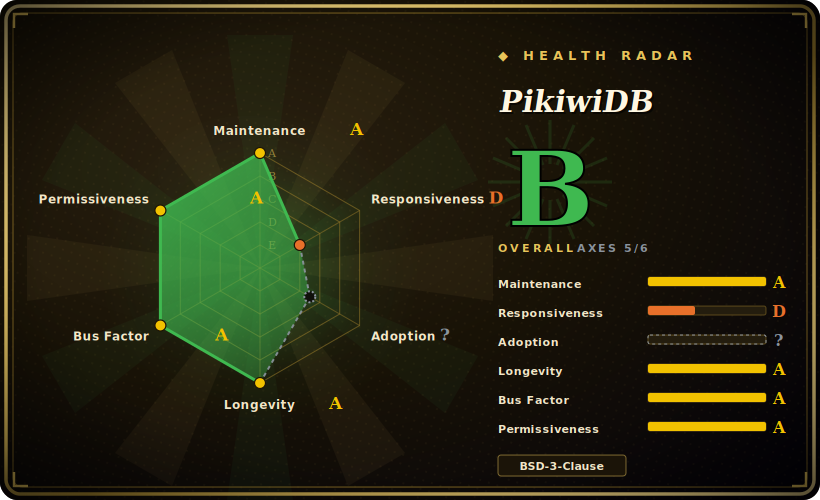

# PikiwiDB

A Redis-protocol-compatible, disk-backed KV store (RocksDB engine) built by Qihoo360's infra team — keeps hot data in memory and persists the full dataset to disk so a single node can hold hundreds of GB the way Redis can't. (This repo is the home of the project historically known as **Pika**.)

## When to use

You run a large Redis deployment and you've hit the wall: a single instance is pushing past 16–64 GB, memory is your dominant hardware cost, failover after an OOM takes minutes to reload the dataset, and your masters keep filling replication buffers. You don't want to rewrite your application — every client speaks the Redis protocol and you lean on `string`/`hash`/`list`/`zset`/`set` plus pub/sub. You stand up PikiwiDB, point your existing Redis clients at it unchanged, and now the working set stays in memory while the full dataset lives on RocksDB on local SSD — so one node holds hundreds of GB instead of tens, the cost-per-GB drops, and restarts don't have to re-warm everything from RAM.

You reach for it specifically when the dataset is **big and cost-sensitive** rather than latency-critical at every key: analytics-adjacent caches, large hash/zset structures, or a Redis tier whose memory bill has gotten painful. You can run it single-node with `slaveof` master-slave replication, or scale horizontally under the bundled Codis proxy for sharding, and migrate from Redis with the project's tools without touching application code.

## When NOT to use

- **Your dataset already fits comfortably in RAM.** If you're under Redis's memory ceiling, plain Redis (or KeyDB/Dragonfly) gives lower and more predictable latency; a disk-backed store adds I/O variance you don't need.
- **You need pure in-memory microsecond latency on every op.** RocksDB reads can hit disk; p99 is governed by your SSD and LSM compaction, not RAM. PikiwiDB trades latency for capacity — that's the whole point, and the wrong trade if latency is sacred.
- **You depend on the newest or most exotic Redis commands/modules.** Compatibility targets *commonly used* data structures and commands; Redis modules (RedisJSON, RediSearch, Redis Functions) and the latest command additions are not the same surface. Verify your exact command set. [未验证]
- **You want a turnkey managed service.** This is server software you operate yourself — RocksDB tuning, compaction, backups, and the Codis topology are your responsibility.
- **You're uneasy about a renamed/forked lineage.** The project carries the Pika history and a dual release line (a v3.x and a v4.x stream); pin a version and read its docs rather than assuming the two lines are interchangeable. [未验证]

## Comparison

| Alternative | In index | Our verdict | Tradeoff |
|---|---|---|---|
| Redis | 未收录 | Use this page for its stated niche; choose Redis when you need in-memory original. | In-memory original; lowest latency and richest command/module ecosystem, but bounded by RAM and expensive per-GB at large scale. PikiwiDB is the disk-backed capacity play, not a latency upgrade. |
| KeyDB | 未收录 | Use this page for its stated niche; choose KeyDB when you need multithreaded Redis fork, still memory-resident. | Multithreaded Redis fork, still memory-resident; helps throughput, not the capacity-vs-RAM-cost problem PikiwiDB targets. |
| Dragonfly | 未收录 | Use this page for its stated niche; choose Dragonfly when you need modern multithreaded Redis-compatible store. | Modern multithreaded Redis-compatible store; very high throughput but in-memory-first, BSL-licensed — different licensing and capacity model. |
| SSDB | 未收录 | Use this page for its stated niche; choose SSDB when you need older LevelDB-backed Redis-ish disk store. | Older LevelDB-backed Redis-ish disk store; similar idea, smaller/aging community and weaker protocol fidelity than PikiwiDB. |
| Kvrocks (Apache) | 未收录 | Use this page for its stated niche; choose Kvrocks (Apache) when you need rocksDB-backed, Redis-protocol, now an Apache project. | RocksDB-backed, Redis-protocol, now an Apache project; the closest direct competitor — weigh Apache governance vs PikiwiDB's OpenAtom/Qihoo backing. |

## Tech stack

- **Language:** C++ (multi-threaded model).
- **Storage engine:** RocksDB (LSM tree on local disk); each data structure backed by its own RocksDB instance.
- **Replication:** binlog-based asynchronous master-slave (`slaveof`).
- **Clustering:** Codis proxy architecture (groups of master-slave sets) for sharding/elastic scaling.
- **Protocol:** Redis RESP wire protocol; supports string/hash/list/zset/set/geo/hyperloglog/pubsub/bitmap/stream/ACL per the README.

## Dependencies

- **OS:** Linux (CentOS, Ubuntu, Rocky) and macOS per the README; local disk (SSD strongly advised for an LSM store).
- **Build:** a C++ toolchain and the project's build system to compile from source.
- **Cluster mode:** the bundled Codis proxy components if you shard; otherwise a single binary + config for master-slave.
- **No external datastore** — RocksDB is embedded; the persistence is local to each node.

## Ops difficulty

**Medium-to-high.** Single-node master-slave is approachable — a binary, a config, `slaveof`. The burden is real once you scale or care about tail latency: RocksDB means you inherit LSM operational concerns (compaction tuning, write amplification, disk sizing, snapshot/backup), and the Codis cluster mode adds a proxy topology with its own dashboard, groups, and migration mechanics to operate. Capacity planning shifts from "how much RAM" to "how much SSD plus compaction headroom." Expect to invest in monitoring disk I/O and compaction, not just memory. Migrating from Redis is documented and tool-assisted, but validating command compatibility for your workload is on you.

## Health & viability

- **Maintenance (2026-06).** Last push 2026-06-18; two active release lines shipping (v3.5.7 and v4.0.3 both dated 2026-06) — **active**, not coasting. Not archived. [推断]
- **Governance / backing.** Hosted under the **OpenAtom Foundation** with origins in **Qihoo360**'s infrastructure team — foundation backing plus a corporate origin is a healthier bus-factor signal than a lone maintainer, though the core contributor set is concentrated (KernelMaker, Axlgrep, et al.). [推断]
- **Age & Lindy verdict.** Repo created 2014-11 (~11 years, inherited from the Pika lineage) and **still actively shipping** ⇒ a **strong Lindy** signal — a long-proven Redis-on-disk implementation, not a hyped newcomer. [推断]
- **Adoption.** 6.1k stars, 1.1k forks; widely cited in the Chinese internet infrastructure community as the large-capacity Redis alternative. The 73 open issues are modest for a database of this age. [未验证]
- **Risk flags.** The Pika→PikiwiDB rename and parallel v3/v4 lines are the main confusion risk; BSD-3-Clause is permissive with no relicense history found. Documentation skews Chinese-first. [推断]

## Caveats (unverified)

- [未验证] Stars ~6.1k, forks ~1.17k, 73 open issues as of 2026-06 — volatile, indicative only.
- [未验证] The exact Redis command/data-structure compatibility surface (and gaps vs Redis modules / newest commands) is the README's framing; verify against your workload's command set.
- [未验证] The relationship and compatibility between the v3.x and v4.x release lines, and which is recommended for new deployments, is not asserted here — read the repo's current release notes.
- [推断] "SSD strongly advised" and the LSM operational concerns are inferred from the RocksDB engine, not a measured benchmark in this repo.
- [未验证] Build toolchain/minimum compiler requirements were not confirmed from the build files.
