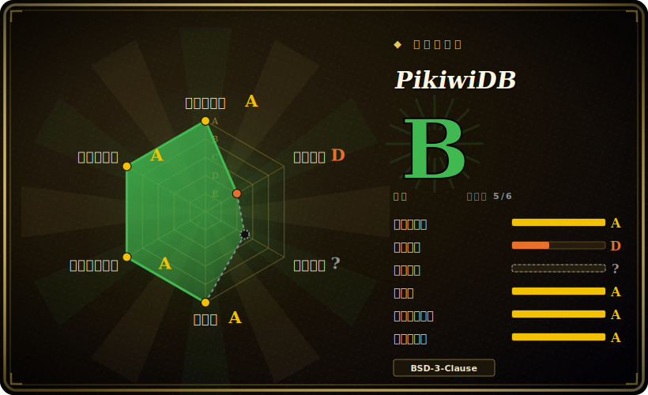

# PikiwiDB

一个兼容 Redis 协议、落盘的 KV 存储（RocksDB 引擎），由 Qihoo360 基础架构团队打造——热数据留在内存，全量数据持久化到磁盘，于是单节点能装下 Redis 装不下的几百 GB。（本仓库就是历史上称为 **Pika** 的项目所在地。）

## 何时使用

你跑着一套庞大的 Redis，撞上了墙：单实例已经压过 16~64 GB，内存成了你最大的硬件成本，OOM 后的故障切换要花几分钟重新加载数据集，主库还老把复制缓冲区填满。你不想重写应用——每个客户端都说 Redis 协议，你靠的是 `string`／`hash`／`list`／`zset`／`set` 加 pub/sub。你架起 PikiwiDB，把现有 Redis 客户端原封不动指过去，于是工作集留在内存，全量数据落在本地 SSD 上的 RocksDB——单节点装下几百 GB 而非几十 GB，每 GB 成本下降，重启也不必把一切从内存重新预热。

当数据集**又大又对成本敏感**（而非每个键都极致追求延迟）时，你尤其会选它：偏分析的缓存、大型 hash/zset 结构，或一个内存账单已经令人肉疼的 Redis 层。你可以单节点跑 `slaveof` 主从复制，或在自带的 Codis 代理下做分片横向扩展，并用项目提供的工具从 Redis 平滑迁移、无需改动应用代码。

## 何时不用

- **你的数据集本就能舒服地装进内存。** 如果你还在 Redis 的内存上限之内，原生 Redis（或 KeyDB／Dragonfly）延迟更低更可预测；落盘存储只会引入你并不需要的 I/O 抖动。
- **你需要每次操作都是纯内存级微秒延迟。** RocksDB 读取可能命中磁盘；p99 由你的 SSD 和 LSM compaction 决定，而非 RAM。PikiwiDB 拿延迟换容量——这正是它的本意，若延迟神圣不可侵犯，这就是错的取舍。
- **你依赖最新或最冷门的 Redis 命令／模块。** 兼容性瞄准的是*常用*数据结构与命令；Redis 模块（RedisJSON、RediSearch、Redis Functions）和最新命令并不在同一张表面上。请核实你确切的命令集。[未验证]
- **你想要开箱即用的托管服务。** 这是你自己运维的服务端软件——RocksDB 调优、compaction、备份和 Codis 拓扑都归你管。
- **你对改名／分叉的血缘心存不安。** 项目带着 Pika 的历史和双发布线（一条 v3.x、一条 v4.x）；请锁定某个版本读它的文档，别假设两条线可以互换。[未验证]

## 横向对比

| 替代品 | 是否收录 | 我们的评价 | 取舍 |
|---|---|---|---|
| Redis | 未收录 | 当前页用于它的主场景；如果更看重“内存原版”，再选 Redis。 | 内存原版；延迟最低、命令与模块生态最丰富，但受限于 RAM、大规模下每 GB 昂贵。PikiwiDB 是落盘的容量方案，不是延迟升级。 |
| KeyDB | 未收录 | 当前页用于它的主场景；如果更看重“多线程 Redis 分叉，仍常驻内存”，再选 KeyDB。 | 多线程 Redis 分叉，仍常驻内存；提升吞吐而非 PikiwiDB 瞄准的容量对 RAM 成本问题。 |
| Dragonfly | 未收录 | 当前页用于它的主场景；如果更看重“现代多线程 Redis 兼容存储”，再选 Dragonfly。 | 现代多线程 Redis 兼容存储；吞吐很高但内存优先、BSL 许可——许可与容量模型都不同。 |
| SSDB | 未收录 | 当前页用于它的主场景；如果更看重“老牌 LevelDB 落盘的类 Redis 存储”，再选 SSDB。 | 老牌 LevelDB 落盘的类 Redis 存储；思路相似，但社区更小更老、协议保真度弱于 PikiwiDB。 |
| Kvrocks（Apache） | 未收录 | 当前页用于它的主场景；如果更看重“RocksDB 落盘、Redis 协议，现为 Apache 项目”，再选 Kvrocks（Apache）。 | RocksDB 落盘、Redis 协议，现为 Apache 项目；最直接的竞品——权衡 Apache 治理 vs PikiwiDB 的 OpenAtom／Qihoo 背书。 |

## 技术栈

- **语言：** C++（多线程模型）。
- **存储引擎：** RocksDB（本地磁盘上的 LSM 树）；每种数据结构由各自独立的 RocksDB 实例承载。
- **复制：** 基于 binlog 的异步主从（`slaveof`）。
- **集群：** Codis 代理架构（多个主从组）实现分片／弹性扩展。
- **协议：** Redis RESP 线协议；按 README 支持 string/hash/list/zset/set/geo/hyperloglog/pubsub/bitmap/stream/ACL。

## 依赖

- **操作系统：** 按 README 支持 Linux（CentOS、Ubuntu、Rocky）与 macOS；本地磁盘（LSM 存储强烈建议 SSD）。
- **构建：** 从源码编译需 C++ 工具链与项目的构建系统。
- **集群模式：** 分片时需自带的 Codis 代理组件；否则单二进制 + 配置即可跑主从。
- **无外部数据存储**——RocksDB 内嵌；持久化对每个节点都是本地的。

## 运维难度

**中到高。** 单节点主从还算友好——一个二进制、一份配置、`slaveof`。一旦扩展或在意尾延迟，负担就真实了：用了 RocksDB 就继承了 LSM 的运维关切（compaction 调优、写放大、磁盘容量规划、快照／备份），而 Codis 集群模式又加上一套带 dashboard、分组和迁移机制的代理拓扑要运维。容量规划从「要多少 RAM」转为「要多少 SSD 加 compaction 余量」。预期要在监控磁盘 I/O 和 compaction 上投入，而不只是内存。从 Redis 迁移有文档和工具辅助，但为你的负载验证命令兼容性还得靠你自己。

## 健康度与可持续性

- **维护（2026-06）。** 最后 push 于 2026-06-18；两条发布线在更（v3.5.7 与 v4.0.3 均为 2026-06）——**活跃**而非吃老本。未归档。[推断]
- **治理／背书。** 托管于 **OpenAtom 基金会**，源自 **Qihoo360** 基础架构团队——基金会背书加企业出身，比孤身维护者的 bus-factor 信号更健康，尽管核心贡献者集中（KernelMaker、Axlgrep 等）。[推断]
- **年龄与 Lindy 判断。** 仓库 2014-11 创建（约 11 年，承自 Pika 血缘）且**仍在活跃发布**⇒ **强 Lindy** 信号——一个久经验证的 Redis-落盘实现，而非被炒作的新秀。[推断]
- **采用度。** 6.1k star、1.1k fork；在中文互联网基础设施圈被广泛当作大容量 Redis 替代品引用。73 个 open issue 对这个年纪的数据库而言不算多。[未验证]
- **风险标记。** Pika→PikiwiDB 改名与并行的 v3／v4 双线是主要的混淆风险；BSD-3-Clause 宽松且未发现 relicense 历史。文档偏中文优先。[推断]

## 存疑（未验证）

- [未验证] 截至 2026-06 约 6.1k star、约 1.17k fork、73 个 open issue——易变，仅供参考。
- [未验证] 确切的 Redis 命令／数据结构兼容面（以及相对 Redis 模块／最新命令的缺口）是 README 的表述；请对照你负载的命令集核实。
- [未验证] v3.x 与 v4.x 发布线之间的关系与兼容性、以及新部署应选哪条线，这里不作断言——请读仓库当前的 release notes。
- [推断] 「强烈建议 SSD」与 LSM 运维关切是从 RocksDB 引擎推断的，并非本仓库内的实测基准。
- [未验证] 构建工具链／最低编译器要求未从构建文件确认。
