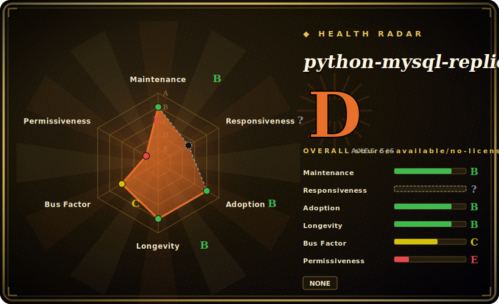

# python-mysql-replication

A pure-Python implementation of the MySQL replication protocol (built on PyMySQL): connect as a fake replica, stream the binlog, and get parsed row/query/rotate events as Python objects — the building block under most Python CDC tooling for MySQL.

## When to use

You're a Python engineer who needs to react to changes in a MySQL database as they happen — invalidate a cache, push updates to a search index, fan out to a message queue, or build an audit trail — and polling the tables is too slow and misses deletes. You want change-data-capture, but you don't want to stand up Debezium and a Kafka cluster for a focused job. You `pip install mysql-replication`, point a `BinLogStreamReader` at your MySQL with replica credentials, and iterate over the binlog: each event arrives as a typed Python object (`WriteRowsEvent`, `UpdateRowsEvent`, `DeleteRowsEvent`, with before/after values), so you write a plain Python loop that does whatever you need per row change.

You reach for it as a **library, not a turnkey tool** — it gives you the parsed stream and leaves the application logic (what to do with each event, checkpointing, delivery) to you. It's the right primitive when you're building a custom sync/CDC pipeline in Python and want full control rather than a heavyweight platform.

## When NOT to use

- **You want a finished pipeline, not a library.** This parses the binlog; *you* write the consumer, the checkpoint store, the retry/delivery logic, and the schema-change handling. If you want sink connectors and exactly-once out of the box, use Debezium/Flink CDC instead.
- **You need durable, exactly-once delivery.** It hands you an event stream; resume position (binlog file + pos / GTID) management and dedup are your responsibility, and a naive loop can lose or double-process on crash. Design checkpointing carefully.
- **High-throughput / very large schemas.** Pure-Python parsing is convenient but not the fastest path; for extreme event volumes a C/Java-based CDC (Debezium, Canal) may be more efficient. Benchmark for your load.
- **Non-MySQL or MySQL forks with protocol quirks.** It targets MySQL/MariaDB's binlog protocol; exotic forks, proxies, or unusual binlog settings (non-ROW format, missing privileges) can break it. Verify ROW-format binlog and replica privileges.
- **You're on a managed DB without binlog access.** Some managed MySQL offerings restrict the replication/binlog privileges this needs; confirm your provider exposes them.

## Comparison

| Alternative | In index | Our verdict | Tradeoff |
|---|---|---|---|
| Debezium | 未收录 | Use this page for its stated niche; choose Debezium when you need full CDC platform (Kafka Connect) with connectors, schema history, exactly-once-ish delivery. | Full CDC platform (Kafka Connect) with connectors, schema history, exactly-once-ish delivery; far heavier — this library is the lightweight, code-it-yourself counterpart. |
| Canal (Alibaba) | 未收录 | Use this page for its stated niche; choose Canal (Alibaba) when you need mature Java binlog CDC server. | Mature Java binlog CDC server; robust and active, but a server to operate, not a Python library you embed in your app. |
| Maxwell's Daemon | 未收录 | Use this page for its stated niche; choose Maxwell's Daemon when you need reads MySQL binlog and emits JSON to Kafka/Kinesis/etc. | Reads MySQL binlog and emits JSON to Kafka/Kinesis/etc.; a ready daemon rather than a library, narrower output model. |
| go-mysql (+ go-mysql-elasticsearch) | 未收录 | Use this page for its stated niche; choose go-mysql (+ go-mysql-elasticsearch) when you need the Go-ecosystem equivalent binlog library/tooling. | The Go-ecosystem equivalent binlog library/tooling; pick by language. |
| Polling (SQLAlchemy / cron) | 未收录 | Use this page for its stated niche; choose Polling (SQLAlchemy / cron) when you need no binlog privileges needed and trivially simple, but misses deletes, adds query load, and lags. | No binlog privileges needed and trivially simple, but misses deletes, adds query load, and lags — the limitation CDC removes. |

## Tech stack

- **Language:** Python (pure-Python protocol implementation).
- **Built on:** **PyMySQL** (`pymysql>=1.1.0`) for the wire connection; `packaging` for version handling.
- **Core API:** `BinLogStreamReader` yielding typed events (write/update/delete row events, query events, rotate/GTID events).
- **Targets:** MySQL and MariaDB binlog protocol, ROW-format binlog.

## Dependencies

- **Runtime libs:** `pymysql>=1.1.0` and `packaging` — that's the install footprint (a small, pure-Python dependency set).
- **MySQL/MariaDB:** with **binary logging in ROW format** and an account holding `REPLICATION SLAVE`/`REPLICATION CLIENT` privileges.
- **Python:** a supported CPython version per the package metadata you install.
- **No broker / no service** — it's an embeddable library; the only external system is the database itself.

## Ops difficulty

**Low as a library, medium for the pipeline you build around it.** Installing and reading events is trivial — `pip install`, a few lines, and you're streaming. The operational weight is in the application you wrap it in: durable **position/GTID checkpointing** so you resume correctly after a restart, handling MySQL failovers and binlog rotation/purging, dealing with schema (DDL) changes mid-stream, and back-pressure if your consumer is slower than the change rate. The library is reliable and well-trodden; the hard, undelegated parts are delivery semantics and resume correctness, which are inherent to CDC, not flaws in the library.

## Health & viability

- **Maintenance (2026-06).** **Active** — last push and release (v1.0.15) both 2026-02; reaching a 1.0.x line after years of 0.x signals a stabilized, maintained library. Not archived. [推断]
- **Governance / bus factor.** Owned by an individual (julien-duponchelle, `owner.type: User`) but with a **multi-contributor** history (sean-k1, dongwook-chan, et al.) — healthier than a true solo project, though the namesake owner is central. The User-owned + long-lived combination is worth noting but mitigated by the active contributor set. [推断]
- **Age & Lindy verdict.** Created 2012-09 (~14 years) and **still actively shipping** ⇒ a **strong Lindy** signal — one of the oldest, most-depended-on Python MySQL CDC primitives, not a newcomer. [推断]
- **Adoption.** 2.4k stars, ~690 forks; widely used as the foundation under bespoke Python CDC pipelines. The ~113 open issues are normal churn for a protocol library tracking MySQL/MariaDB changes. [未验证]
- **Risk flags.** Licensing is the one fuzzy spot: `setup.py` declares `license="Apache 2"` but the repo ships no standard `LICENSE` file (GitHub reports no detected license) — treat as Apache-2.0 per the package metadata, but the absence of a license file is a real ambiguity to confirm before redistribution. [未验证]

## Caveats (unverified)

- [未验证] **License is declared, not file-backed:** `setup.py` says `license="Apache 2"` but there is no `LICENSE` file in the repo and the GitHub API returns no license — recorded here as `Apache-2.0` on the strength of the package metadata; confirm directly before relying on it for redistribution.
- [未验证] Stars ~2.4k, forks ~690, ~113 open issues as of 2026-06 — volatile, indicative only.
- [未验证] v1.0.15 released 2026-02; the install name on PyPI is `mysql-replication` (not the repo slug) — verify the package name when installing.
- [推断] ROW-format binlog and `REPLICATION SLAVE`/`CLIENT` privilege requirements are inferred from how binlog replication clients generally work; confirm exact privileges against the project docs.
- [未验证] Supported Python and MariaDB-vs-MySQL protocol coverage depend on the installed version's metadata, not asserted here.
