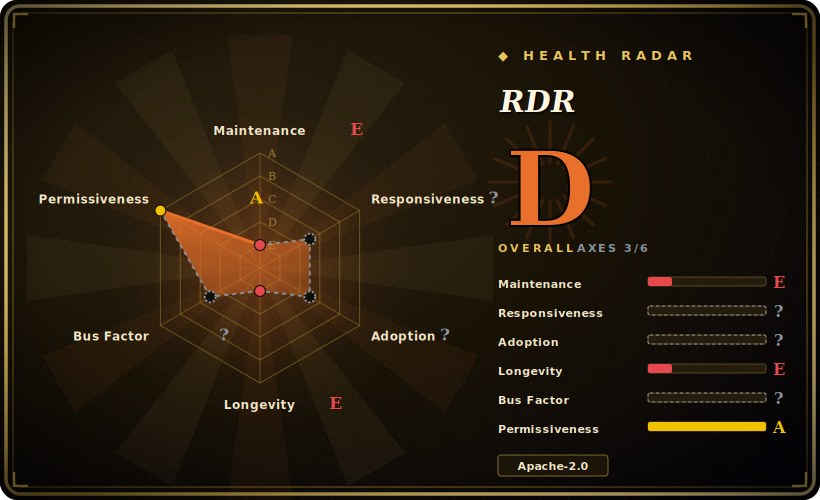

# RDR

A fast, offline Redis RDB-file parser (written in Go despite the repo's reported language tag) that reveals which keys and key-prefixes are eating your memory — `rdr show` serves an HTML memory report on a local port, `rdr keys` dumps every key.

## When to use

You're an on-call engineer for a Redis cluster that just tripped its `maxmemory` alarm at 2 a.m., and you need to know *which* keys are responsible before you decide whether to evict, shard, or page someone. You don't want to run `MEMORY USAGE` key-by-key against a hot production instance, and `redis-cli --bigkeys` only samples. Instead you grab the last RDB snapshot off disk (or `BGSAVE` a replica), copy it to a workstation, and run `rdr show dump.rdb`. It parses the file offline — no connection to the live server, no load on production — and opens a browser report breaking memory down by key prefix and data type, so you can see that `session:*` is 4 GB of orphaned hashes. For a one-off "what's in this RDB" audit, `rdr keys` streams the full key list to stdout.

You reach for it specifically when the analysis must be **offline and fast**: the author's pitch is that it chews through a multi-GB RDB in a couple of minutes, which matters when the alternative (the older Python `redis-rdb-tools`) is markedly slower on large dumps. [未验证]

## When NOT to use

- **You need live, continuous monitoring.** RDR analyzes a static RDB snapshot at a point in time. For ongoing memory dashboards you want Redis exporters + Prometheus/Grafana, not a one-shot file parser.
- **You can't produce an RDB file.** If persistence is disabled (`save ""`) and you can't `BGSAVE`, there's nothing for RDR to read. It does not talk to a live server.
- **You need exact byte-accurate accounting.** The README itself flags that the `show` memory figures are **approximate** — good for finding the fat keys, not for precise capacity billing.
- **You're on a bleeding-edge Redis/RDB version.** RDB is a versioned binary format; a parser written against older versions may not understand new encodings or types added in recent Redis releases — verify it parses your RDB version cleanly. [推断]
- **You want an actively-maintained, supported tool.** The only tagged release is v0.0.1 (2019) and the repo last saw a push in 2024; treat it as a useful-but-coasting utility, not a product with a support channel. [未验证]

## Comparison

| Alternative | In index | Our verdict | Tradeoff |
|---|---|---|---|
| redis-rdb-tools (sripathikrishnan) | 未收录 | Use this page for its stated niche; choose redis-rdb-tools (sripathikrishnan) when you need the original Python RDB parser/memory-profiler. | The original Python RDB parser/memory-profiler; broader output formats and CSV export, but much slower on large dumps and itself largely unmaintained. |
| `redis-cli --bigkeys` / `--memkeys` | 未收录 | Use this page for its stated niche; choose redis-cli --bigkeys / --memkeys when you need built into Redis, runs live and needs no file, but only *samples* and adds load to the server. | Built into Redis, runs live and needs no file, but only *samples* and adds load to the server; no per-prefix breakdown or report UI. |
| RedisInsight (Redis Ltd.) | 未收录 | Use this page for its stated niche; choose RedisInsight (Redis Ltd.) when you need full GUI with a live memory analysis tab. | Full GUI with a live memory analysis tab; far richer but a heavyweight desktop app talking to a live instance, not an offline file parser. |
| `MEMORY USAGE` / `MEMORY DOCTOR` | 未收录 | Use this page for its stated niche; choose MEMORY USAGE / MEMORY DOCTOR when you need native commands for per-key/instance memory introspection on a live server. | Native commands for per-key/instance memory introspection on a live server; precise per key but you must already know which keys to ask about. |

## Tech stack

- **Language:** Go — compiles to a standalone binary for Linux, macOS, and Windows (the GitHub "JavaScript" language tag appears to reflect bundled report assets, not the core; the README and binaries describe a Go program).
- **Input:** Redis RDB dump files (the on-disk binary snapshot format).
- **Output:** an embedded HTTP server rendering an HTML memory report (default `:8080`) for `rdr show`; plain key list to stdout for `rdr keys`.

## Dependencies

- **Runtime:** none beyond the prebuilt binary — no Redis connection, no language runtime, no external services.
- **Input artifact:** a Redis RDB file you supply (from disk, `BGSAVE`, or a replica's dump).
- **Build:** a Go toolchain if compiling from source rather than using a release binary.

## Ops difficulty

**Low.** It's a single binary you run on a workstation against a file — download, `chmod +x`, run, open `localhost:8080`. There's no service to deploy, no datastore, no config. The only operational care is procedural: produce the RDB safely (snapshot a replica rather than blocking the primary), copy a potentially large/ sensitive dump to where you run RDR, and remember the report port binds locally. Because it's offline, it adds zero load to production Redis — the main reason to prefer it over live `--bigkeys` scans during an incident.

## Health & viability

- **Maintenance (2026-06).** Last repo push 2024-04; the only tagged release is **v0.0.1 (2019)**. Not archived, but effectively **coasting / low-activity** — usable as-is, but don't expect fixes or new-RDB-version support promptly. [未验证]
- **Governance / bus factor.** Owned by the **Xueqiu** organization (a Chinese investment-community company) but contribution is concentrated in a couple of authors — a thin bus factor typical of an internal-tool-open-sourced. [推断]
- **Age & Lindy verdict.** Created 2017, ~9 years old but **not actively shipping** — age here is *not* a strong Lindy signal because Lindy requires old **and** still-active; this is old-and-quiet. [推断]
- **Adoption.** ~1.2k stars / 311 forks indicate real use in the Redis-ops community as an incident utility, but no release cadence or active issue triage to lean on. [未验证]
- **Risk flags.** Apache-2.0, permissive, no relicense history found. The real risk is staleness against evolving RDB format versions, not licensing. [推断]

## Caveats (unverified)

- [未验证] ~1.2k stars / 311 forks as of 2026-06 — star/fork counts are date-sensitive, treat as indicative.
- [未验证] The "5GB RDB in ~2 minutes" / "much faster than redis-rdb-tools" performance claim is the author's README framing, not independently benchmarked here.
- [推断] The implementation language is Go (binaries + README), even though GitHub reports "JavaScript" as the top language — likely an artifact of bundled web-report assets.
- [推断] RDB-format-version compatibility with recent Redis releases is unverified; a parser at v0.0.1/2019 vintage may not handle encodings added in newer Redis.
- [未验证] Whether `rdr` handles RDBs produced by Redis forks (KeyDB, Valkey, Dragonfly) is not confirmed.
