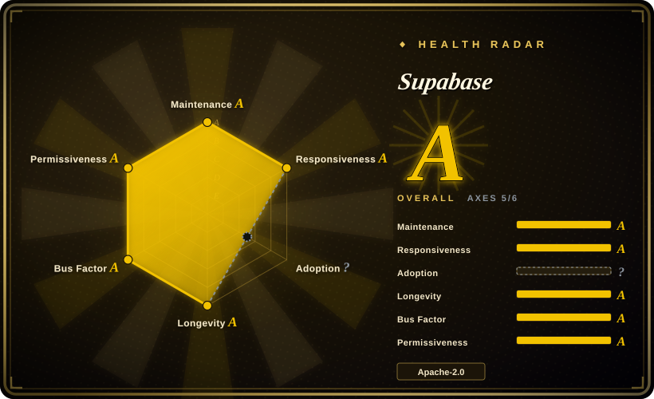

# Supabase

The open-source Firebase alternative built on Postgres. Provides a dedicated PostgreSQL database, authentication, auto-generated APIs (REST, GraphQL, Realtime), edge functions, file storage, and an AI/vector toolkit — all in one platform.

## When to use

You're building a web or mobile application and need a backend that handles auth, database, real-time subscriptions, and file storage without cobbling together multiple services. You consider Firebase, but you don't want to be locked into Google's proprietary NoSQL (Firestore) and you want the full power of SQL, relational integrity, and PostgreSQL extensions. You consider Hasura, but you need auth, file storage, and edge functions too — not just a GraphQL API. You choose Supabase because it gives you the power and familiarity of PostgreSQL (including extensions like `pgvector` and `postgis`) without managing the database, API layer, and auth system separately. You create a project and get an auto-generated REST API, a ready-to-use auth system with OAuth providers, and real-time WebSocket subscriptions straight from your Postgres tables. For AI features, you can store and query vector embeddings with `pgvector` without adding a separate vector database. You can self-host the entire stack or use the managed cloud with a generous free tier.

## When NOT to use

- **If you need heavy analytics or OLAP workloads, use BigQuery, ClickHouse, or Snowflake instead of Supabase, because** Supabase is built on PostgreSQL, which is optimized for OLTP. For large-scale data warehousing or complex analytics, a dedicated OLAP solution is the right tool.
- **If your architecture requires many independent databases with separate lifecycles, use self-hosted Postgres clusters or MongoDB instead of Supabase, because** Supabase is designed around a single Postgres instance per project. The platform model does not fit multi-database microservices.
- **If your team avoids SQL entirely, use Firebase or Appwrite instead of Supabase, because** while Supabase abstracts much of the database layer, you still write SQL for complex queries, migrations, and RLS policies. If your team avoids SQL, the learning curve is real.
- **If you need global sub-10ms writes, use CockroachDB or PlanetScale instead of Supabase, because** Supabase supports read replicas but the primary write node is in a single region. If your application needs sub-10ms writes globally, you need a distributed database architecture.
- **If you need MongoDB, Cassandra, or a graph database as your primary store, use MongoDB Atlas, ScyllaDB, or Neo4j instead of Supabase, because** Supabase is deeply tied to PostgreSQL. If your data model requires a non-relational or graph primary store, Supabase is not the right choice.

## Comparison

| Alternative | In index | Our verdict | Tradeoff |
| --- | --- | --- | --- |
| Firebase | 未收录 | Google's managed backend-as-a-service (BaaS). | Firebase is fully managed and has a broader mobile SDK ecosystem, but it locks you into proprietary NoSQL (Firestore) and Google's platform. Supabase gives you open-source Postgres and avoids vendor lock-in. |
| Appwrite | 未收录 | Open-source Firebase alternative with broader language support. | Appwrite is also open-source and supports more client languages out of the box; Supabase has deeper Postgres integration and a more mature ecosystem. |
| Hasura | 未收录 | Auto-generated GraphQL API over Postgres. | Hasura is excellent for GraphQL-only APIs but lacks the built-in auth, storage, and edge functions that Supabase bundles. |
| [Deno](../dev-utilities/deno.md) | ✅ | Supabase uses Deno for edge functions. | Not a direct competitor — Deno is the runtime for Supabase edge functions, showing Supabase's production reliance on Deno. |
| Self-hosted Postgres + PostgREST + Keycloak | 未收录 | DIY stack matching Supabase's components. | More flexible and fully self-managed, but requires significantly more setup and ongoing maintenance than Supabase's integrated platform. |

## Tech stack

- **PostgreSQL** — core database with extensions (`pgvector`, `postgis`, `pg_graphql`)
- **PostgREST** — auto-generated REST API layer
- **Go** — realtime server, auth service, and storage API
- **TypeScript** — dashboard frontend and edge functions runtime
- **Deno** — edge functions execution environment
- **Kong / Kong Gateway** — API gateway and routing layer
- **Redis** — caching and realtime subscription state

## Dependencies

- PostgreSQL (v14+ recommended; managed if using Supabase Cloud)
- For self-hosting: Docker and Docker Compose (the official self-hosting stack)
- For edge functions: Deno runtime
- For storage: an S3-compatible object store (MinIO in self-hosted mode, or cloud S3)
- For realtime: Elixir/Erlang VM for the realtime server (bundled in Docker)
- SMTP or email provider for auth emails (self-hosted mode)

## Ops difficulty

**Medium** (self-hosted) / **Low** (cloud). The managed cloud tier requires minimal ops — just project configuration and monitoring. Self-hosting the full stack involves managing PostgreSQL, Kong, Redis, Go services, Deno edge functions, and object storage across Docker containers. The official `docker-compose` stack simplifies initial setup, but production self-hosting requires backup strategies, monitoring, and scaling planning for PostgreSQL.

## Health & viability

- **Responsiveness**: Cannot be scored — no_traffic.
- **Maintenance**: Very active — pushed daily as of 2026-07, with a mature v2 platform and responsive core team (1,086 open issues).
- **Governance**: Owned by the `supabase` organization with a dedicated core team and clear product roadmap. The company has a strong open-source culture with Apache-2.0 licensing across the core stack. Bus factor is reasonable.
- **Backing**: Supabase Inc. is a venture-backed company with significant funding and a proven revenue model (managed cloud). The open-source core is strategically aligned with the commercial offering.
- **Adoption**: Strong adoption with 105.0k stars, created in 2019 (7-year track record). Widely used in production across startups and enterprises. The Firebase alternative positioning drives consistent demand.
- **Risk flags**: Apache-2.0 is permissive. The venture-backed model means some features may be cloud-only (e.g., certain advanced analytics or enterprise features), but the core database, auth, and storage stack remains fully open-source. Monitor for open-core gating over time.

## Caveats (unverified)

- [未验证] Supabase Inc. has raised venture funding; the exact funding details and burn rate are not verified from primary sources.
- [推断] The self-hosted stack is documented but the primary engineering investment goes to the managed cloud; self-hosted users may encounter edge cases or slower bug fixes for non-cloud paths.
- [未验证] The exact feature parity between self-hosted and cloud tiers is not continuously documented; some enterprise features (e.g., SSO, advanced backups) may be cloud-only.
- [未验证] `pgvector` performance at very large scale (billions of embeddings) in a shared PostgreSQL instance has not been independently benchmarked for Supabase specifically.
- [推断] The actual performance and latency characteristics of Supabase read replicas compared to a true multi-region distributed database have not been independently benchmarked.
