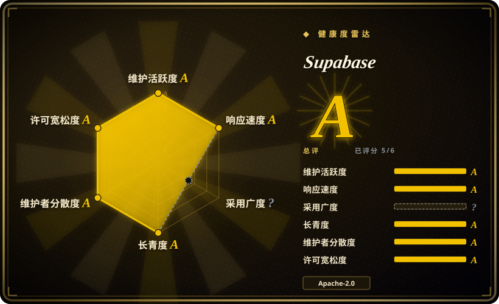

# Supabase

基于 Postgres 构建的开源 Firebase 替代方案。在一个平台中提供专用 PostgreSQL 数据库、身份认证、自动生成 API（REST、GraphQL、Realtime）、边缘函数、文件存储和 AI/向量工具包。

## 何时使用

你正在构建 Web 或移动应用，需要一个能处理身份认证、数据库、实时订阅和文件存储的后端，而无需拼凑多个服务。你考虑过 Firebase，但不想被锁定在 Google 的专有 NoSQL（Firestore）中，你想要 SQL 的完整能力、关系完整性以及 PostgreSQL 扩展。你考虑过 Hasura，但你需要的不只是 GraphQL API——你还需要身份认证、文件存储和边缘函数。你选择 Supabase，因为它给你 PostgreSQL 的强大和熟悉度（包括 `pgvector` 和 `postgis` 等扩展），却无需分别管理数据库、API 层和身份认证系统。你创建项目，即可获得自动生成的 REST API、开箱即用的 OAuth 身份认证系统，以及从 Postgres 表直接获取的实时 WebSocket 订阅。对于 AI 功能，你可以用 `pgvector` 存储和查询向量嵌入，无需添加单独的向量数据库。你可以完全自托管整个栈，也可以使用托管云服务并享有慷慨的免费层。

## 何时不用

- **如果你需要重度分析或 OLAP 负载，请用 BigQuery、ClickHouse 或 Snowflake，而不是 Supabase，因为** Supabase 基于 PostgreSQL，针对 OLTP 优化。对于大规模数据仓库或复杂分析，专用 OLAP 解决方案才是正确工具。
- **如果你的架构需要多个独立数据库和独立生命周期，请用自托管 Postgres 集群或 MongoDB，而不是 Supabase，因为** Supabase 围绕每个项目单个 Postgres 实例设计。平台模式不适合多数据库微服务。
- **如果你的团队完全回避 SQL，请用 Firebase 或 Appwrite，而不是 Supabase，因为** 虽然 Supabase 抽象了大量数据库层，但你仍需为复杂查询、迁移和 RLS 策略编写 SQL。如果你的团队完全回避 SQL，学习曲线确实存在。
- **如果你需要全球亚 10ms 写入，请用 CockroachDB 或 PlanetScale，而不是 Supabase，因为** Supabase 支持只读副本，但主写入节点位于单一区域。如果你的应用需要全球亚 10ms 写入，你需要分布式数据库架构。
- **如果你需要 MongoDB、Cassandra 或图数据库作为主存储，请用 MongoDB Atlas、ScyllaDB 或 Neo4j，而不是 Supabase，因为** Supabase 与 PostgreSQL 深度绑定。如果你的数据模型需要非关系型或图主存储，Supabase 不是正确选择。

## 横向对比

| 替代品 | 是否收录 | 我们的评价 | 取舍 |
| --- | --- | --- | --- |
| Firebase | 未收录 | Google 的托管后端即服务（BaaS）。 | Firebase 完全托管且拥有更广泛的移动端 SDK 生态，但将你锁定在专有 NoSQL（Firestore）和 Google 平台。Supabase 提供开源 Postgres 并避免厂商锁定。 |
| Appwrite | 未收录 | 开源 Firebase 替代方案，支持更广泛的客户端语言。 | Appwrite 也是开源的，且开箱支持更多客户端语言；Supabase 与 Postgres 集成更深，生态更成熟。 |
| Hasura | 未收录 | 基于 Postgres 的自动生成 GraphQL API。 | Hasura 非常适合纯 GraphQL API，但缺乏 Supabase 打包的内置身份认证、存储和边缘函数。 |
| [Deno](../dev-utilities/deno.zh.md) | ✅ | Supabase 使用 Deno 作为边缘函数运行时。 | 不是直接竞争对手——Deno 是 Supabase 边缘函数的运行时，展示了 Supabase 在生产中对 Deno 的依赖。 |
| 自托管 Postgres + PostgREST + Keycloak | 未收录 | DIY 堆栈，匹配 Supabase 的组件。 | 更灵活且完全自主管理，但相比 Supabase 集成平台，需要显著更多的搭建和持续维护。 |

## 技术栈

- **PostgreSQL**——核心数据库，带扩展（`pgvector`、`postgis`、`pg_graphql`）
- **PostgREST**——自动生成 REST API 层
- **Go**——实时服务器、身份认证服务和存储 API
- **TypeScript**——控制面板前端和边缘函数运行时
- **Deno**——边缘函数执行环境
- **Kong / Kong Gateway**——API 网关和路由层
- **Redis**——缓存和实时订阅状态

## 依赖

- PostgreSQL（推荐 v14+；使用 Supabase Cloud 时由平台管理）
- 自托管时：Docker 和 Docker Compose（官方自托管栈）
- 边缘函数：Deno 运行时
- 存储：S3 兼容对象存储（自托管模式下用 MinIO，或云 S3）
- 实时功能：实时服务器的 Elixir/Erlang VM（Docker 中捆绑）
- 身份认证邮件：SMTP 或邮件提供商（自托管模式）

## 运维难度

**中**（自托管）/ **低**（云端）。托管云 tier 需要极少运维——只需项目配置和监控。自托管完整栈涉及管理 PostgreSQL、Kong、Redis、Go 服务、Deno 边缘函数和跨 Docker 容器的对象存储。官方 `docker-compose` 栈简化了初始搭建，但生产级自托管需要备份策略、监控和 PostgreSQL 扩容规划。

## 健康度与可持续性
- **维护活跃度**：Grade A——最近 13 周中 13 周有提交；最后提交距今 0 天。
- **响应速度**：Grade A——中位首次响应时间 0.8 小时，基于 23 个 qualifying issues/PRs。
- **采用广度**：无法计算——unknown。
- **长青度**：Grade A——仓库已创建 2,456 天。
- **治理集中度**：Grade A——前三贡献者占比 26.8%（?）。
- **许可风险**：Grade A——Apache-2.0 许可证。
## 存疑（未验证）

- [未验证] Supabase Inc. 已获得风险投资；具体融资细节和烧钱速度尚未从一手来源核实。
- [推断] 自托管栈有文档，但主要工程投资投向托管云；自托管用户可能遇到非云端路径的边缘情况或较慢的 bug 修复。
- [未验证] 自托管与云端 tier 之间的确切功能对等性未持续记录；某些企业功能（如 SSO、高级备份）可能仅限云端。
- [未验证] 在共享 PostgreSQL 实例中，`pgvector` 在极大规模（数十亿嵌入）下的性能尚未针对 Supabase 进行独立基准测试。
- [推断] Supabase 只读副本相对于真正多区域分布式数据库的实际性能和延迟特性，尚未经独立基准测试。
