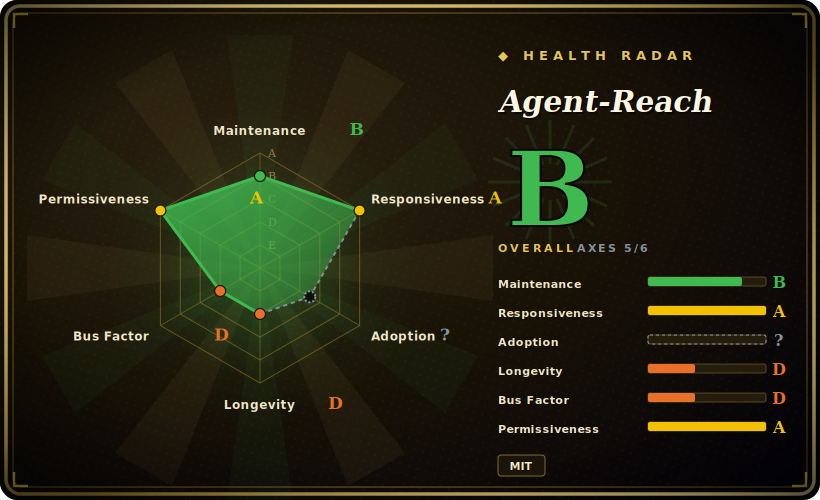

# Agent-Reach

An access/reach layer (not a research agent): a CLI that installs and routes a stack of upstream tools so your agent can read and search Twitter/X, Reddit, YouTube, GitHub, Bilibili, XiaoHongShu, RSS and the open web — "zero API fees".

## When to use

You're building a coding-agent or research-assistant workflow (Claude Code, Cursor, your own loop) and you keep hitting the same wall: the agent reasons fine, but it's blind to the live internet. You want it to pull a YouTube transcript, read a paywalled-ish blog cleanly, search Twitter/X for what people are saying about a library, grab a Reddit thread, or read a Bilibili / XiaoHongShu post — and you do **not** want to sign up for a dozen paid APIs, write a scraper per platform, or babysit which one broke this week. Agent-Reach resolves this by being the "eyes" layer: you run one install, it vets and installs the right upstream tool per platform (Jina Reader for web, yt-dlp for YouTube, `gh` for GitHub, twitter-cli/bili-cli/OpenCLI for the social platforms, Exa via MCP for semantic search), and your agent then calls those tools directly.

The part that earns its keep over a hand-rolled toolbox is **multi-backend routing**: each platform is "首选 + 备选的有序后端列表" (a primary plus an ordered fallback list), and `agent-reach doctor` health-checks each channel and reports the active backend. When an upstream method gets rate-limited or blocked — the README's example is yt-dlp getting fingerprint-blocked on Bilibili and the stack auto-falling back to bili-cli — your agent keeps working with zero changes on your side. It's a good fit when *breadth of reachable sources* and *staying alive against anti-bot churn* matter more than deep, structured analysis.

## When NOT to use

- **You actually want a deep-research agent.** Agent-Reach is a *fetch/access* layer; it does no iterative search→read→verify→synthesize loop and writes no cited report. If you want that pipeline, use a real research agent like [deep-research](deep-research.md) or [local-deep-research](local-deep-research.md) — and point *it* at sources Agent-Reach exposes if you want both.
- **You need legally/ToS-clean, account-safe access at scale.** Twitter/X, Reddit and XiaoHongShu require your own logged-in cookies; the README itself flags 封号风险 (account-suspension risk) for non-browser automation. This is scraping with your credentials — not a sanctioned API — so terms-of-service and ban exposure are on you.
- **You need browser *actions*, not reads.** Explicit non-goal: "读内容 vs 操作网页" — it's read-only. No form submission, post-login flows, CAPTCHA solving, or multi-account isolation. The README itself points you to BrowserAct for "动手" interaction.
- **You want a stable, self-contained dependency.** It orchestrates many third-party CLIs/MCP servers (yt-dlp, twitter-cli, bili-cli, rdt-cli, OpenCLI, mcporter, Exa) whose behavior, auth and anti-bot posture shift constantly. The whole value prop is *managing* that churn — but you inherit a wide, fragile dependency surface and frequent breakage between releases.
- **Production / unattended pipelines.** Cookie-auth scraping that depends on consumer anti-bot weather is fine for an interactive agent, risky as a load-bearing backend.

## Comparison

| Alternative | In index | Our verdict | Tradeoff |
|---|---|---|---|
| [deep-research](deep-research.md) | ✅ | Use this page for its stated niche; choose deep-research when you need a true iterative research *agent* (fan-out search → read → recursive deepening → report). | A true iterative research *agent* (fan-out search → read → recursive deepening → report). Agent-Reach is the access layer it lacks; different layer of the stack, not a substitute. |
| [local-deep-research](local-deep-research.md) | ✅ | Use this page for its stated niche; choose local-deep-research when you need privacy-first local research assistant with synthesis + citations and local-LLM support. | Privacy-first local research assistant with synthesis + citations and local-LLM support. Does the reasoning Agent-Reach skips; pair them rather than choose. |
| [Vane](vane.md) | ✅ | Use this page for its stated niche; choose Vane when you need research/search agent focused on synthesis. | Research/search agent focused on synthesis. Same "does the thinking" contrast — Agent-Reach is reach, not reasoning. |
| Firecrawl | 未收录 | Use this page for its stated niche; choose Firecrawl when you need hosted/OSS web-scrape-to-markdown + crawl API. | Hosted/OSS web-scrape-to-markdown + crawl API; cleaner single-source web extraction and a real API, but paid and web-only — no Twitter/Reddit/Bilibili/XiaoHongShu social reach. |
| Exa / Tavily / SearXNG | 未收录 | Use this page for its stated niche; choose Exa / Tavily / SearXNG when you need search backends (semantic / agent-search / self-hosted meta-search). | Search backends (semantic / agent-search / self-hosted meta-search). Agent-Reach actually wraps Exa via MCP; these give you search but not the per-platform social-scrape stack. |

## Tech stack

- **Language:** Python (3.10+).
- **Orchestrated upstream tools:** Jina Reader (web→markdown), yt-dlp (YouTube subtitles/search), feedparser (RSS/Atom), `gh` CLI (GitHub), twitter-cli (Twitter/X), bili-cli (Bilibili), OpenCLI + rdt-cli (Reddit), OpenCLI / xiaohongshu-mcp (XiaoHongShu), linkedin-mcp, native V2EX / 雪球 APIs, Whisper (小宇宙 podcast transcription).
- **Search:** Exa semantic search via `mcporter` (MCP), advertised as free / no key needed.
- **Integration model:** installs the CLIs/MCP servers, then the agent calls them directly — "实际的读取和搜索由 Agent 直接调用上游工具完成" (no single unified wrapper command for fetching).
- **Routing/health:** ordered primary+fallback backend list per platform; `agent-reach doctor` for per-channel status and repair guidance.

## Dependencies

- **Runtime:** Python ≥ 3.10; a shell with the upstream CLIs installed. Many backends shell out to external binaries (`gh`, yt-dlp, twitter-cli, bili-cli, OpenCLI), some to MCP servers via `mcporter`.
- **Auth / state:** cookies for logged-in platforms (Twitter/X, Reddit, XiaoHongShu) exported from a browser; stored locally at `~/.agent-reach/config.yaml` (mode 600), "不上传不外传" (stated: never uploaded). 小宇宙 transcription needs a free API key.
- **Install:** `pip install agent-reach`, then an agent-driven setup pointed at the project's `docs/install.md`.
- **External services:** Exa (via MCP) for semantic search; otherwise the public/social sites being read, subject to their rate-limits and anti-bot.

## Ops difficulty

**Medium.** First install plus per-platform auth (exporting cookies for each logged-in site) is more setup than a single hosted API, and zero-config only covers the public lane (web, YouTube, RSS, public GitHub, Exa search). The ongoing burden is the real cost: this is a thin layer over many fast-moving third-party scrapers and consumer anti-bot systems, so individual channels *will* break and need re-auth or a backend swap. `agent-reach doctor` and the fallback routing are explicitly there to make that survivable, but you're still operating a scraping stack, not consuming a stable API.

## Health & viability

- **Maintenance (as of 2026-06):** last pushed 2026-06, not archived, at v1.5.0 — active. For a tool whose whole job is *managing upstream churn*, recency of maintenance is load-bearing: a coasting fork of this would silently rot as scrapers break. [推断]
- **Governance & bus factor:** `User`-owned (Panniantong) with ~43k stars — a **bus-factor flag**: large adoption riding on a single maintainer, no foundation or vendor backstop. Higher stakes than usual here because the value *is* continuous upkeep, not a stable artifact. [推断]
- **Age & Lindy verdict:** created 2026-02, so age < 1 year — **young and hyped** (43k stars in months). Lindy is unproven, and this is a category where Lindy matters less than *current* upstream health: even a long-lived version would need constant re-vetting. [推断]
- **Risk flags:** the core risk is structural, not licensing (MIT is permissive). It orchestrates a wide, fragile surface of third-party scrapers/MCP servers (yt-dlp, twitter-cli, bili-cli, Exa, …) plus cookie-auth scraping that carries ToS/account-suspension risk — so "health" depends as much on *those upstreams* as on this repo. Treat as interactive tooling, not a load-bearing production backend. [推断]

## Caveats (unverified)

- [未验证] v1.5.0 published 2026-06-11; ~41.6k stars and `pushedAt` 2026-06-23 per `gh repo view` — GitHub stars are unreliable and date-sensitive; treat as indicative only.
- [未验证] The exact per-platform backend list, fallback ordering and zero-config matrix are taken from the README and may drift release-to-release; verify against `agent-reach doctor` and the current repo before relying on a specific channel.
- [推断] Reliability of any individual social channel depends on upstream tool health and the target site's anti-bot posture, which change continuously; "zero API fees" / "用户零操作" failover is the project's framing, not an independently measured guarantee.
- [推断] Account-suspension / ToS risk for cookie-auth scraping (Twitter/X, Reddit, XiaoHongShu) is acknowledged by the README but its severity is situational and unquantified here.
- [未验证] Exa-via-MCP being "free / no key needed" reflects the README's claim at time of writing; third-party service terms can change.
