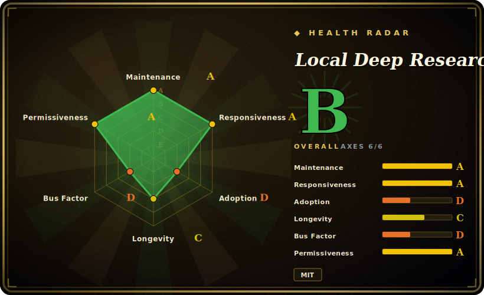

# Local Deep Research

A self-hostable deep-research assistant (web UI + API + CLI) that runs the whole iterative search-and-synthesize loop on your own machine, including with local LLMs and a local SearXNG meta-search, so nothing has to leave your network.

## When to use

You're an engineer or analyst at an org where research questions touch sensitive material — internal docs, patient or legal records, an unannounced product — and pasting any of it into a hosted "deep research" SaaS is a non-starter. You still want the real thing: an agent that fans out across many sources, reads them, and writes a cited report. Local Deep Research gives you that loop in a container you control. Point it at Ollama or LM Studio for the LLM and a bundled SearXNG for web search, and the entire pipeline — query planning, retrieval, synthesis, citations — runs on hardware you own, with per-user SQLCipher-encrypted storage so even the box's admin can't read your sessions.

You're also a good fit if your research is *academic or technical* rather than open-web trivia: LDR ships first-class connectors for arXiv, PubMed, Semantic Scholar, Wikipedia, GitHub and the Wayback Machine, plus a knowledge-base mode that downloads and indexes sources into a private searchable library. You pick a depth — Quick Summary (sub-minute) up to a full Report — and you can drive it from the web UI, a REST API, a CLI, or as an MCP server so Claude or another agent can call it as a research tool. When you want cloud models, the same interface speaks to OpenAI / Anthropic / Gemini; "local" is the default, not the only, mode.

## When NOT to use

- **You have no GPU and want fully-local quality.** The headline accuracy numbers assume a capable local model (e.g. a 27B on a 3090). On a CPU-only box, local-model research is slow and weak; you'd fall back to cloud APIs, which defeats the privacy premise.
- **You want a tiny embeddable library, not an app.** LDR is a full application (web server, queue/dispatcher, encrypted DB, JS frontend). If you just need a function that takes a query and returns a report inside your own service, a script-style tool like [deep-research](deep-research.md) is far lighter to vendor in.
- **You need a managed, zero-ops hosted product.** This is self-hosted by design — you run and maintain Ollama, SearXNG, the database and upgrades. There is no SaaS to sign up for.
- **Pre-1.0 surface-area churn.** It moved fast through v1.x with active feature and security changes (chat mode, credential-leak hardening landed as recently as v1.7.0); APIs, config keys and the DB schema can shift release-to-release. [推断] Treat config/schema as not-yet-frozen and pin a version.
- **Adversarial fact-checking is the whole job.** LDR searches and synthesizes with citations, but it's not a dedicated claim-by-claim verification harness; if your need is "prove or disprove these specific claims," a verification-first pipeline fits better.
- **You distrust self-reported benchmarks.** The ~95% SimpleQA / 77% xbench-DeepSearch figures are the project's own, on chosen hardware/models. [未验证] Don't treat them as independent or as predictive of your model choice.

## Comparison

| Alternative | In index | Our verdict | Tradeoff |
|---|---|---|---|
| [deep-research](deep-research.md) | ✅ | Use this page for its stated niche; choose deep-research when you need minimal TypeScript script you embed/own end-to-end. | Minimal TypeScript script you embed/own end-to-end; you wire your own LLM+search keys. Far lighter than LDR, but no UI, no local-LLM/privacy bundle, no academic-source connectors or encrypted multi-user store. |
| [Vane](vane.md) | ✅ | Use this page for its stated niche; choose Vane when you need another self-hosted research/search agent. | Another self-hosted research/search agent; overlapping "run it yourself" goal. Compare on source connectors, local-LLM support and report quality for your stack. |
| [Agent-Reach](agent-reach.md) | ✅ | Use this page for its stated niche; choose Agent-Reach when you need focuses on agent outreach/reach over web sources. | Focuses on agent outreach/reach over web sources; adjacent but a different deliverable than LDR's cited research reports. |
| GPT Researcher | 未收录 | Use this page for its stated niche; choose GPT Researcher when you need popular Python deep-research agent with web UI and report export. | Popular Python deep-research agent with web UI and report export; cloud-LLM-first by default. LDR leans harder into fully-local + encryption + academic connectors. |
| Perplexity / OpenAI Deep Research | 未收录 | Use this page for its stated niche; choose Perplexity / OpenAI Deep Research when you need hosted SaaS, strong quality and zero ops. | Hosted SaaS, strong quality and zero ops — but your queries and context leave your machine, the opposite of LDR's premise. |

## Tech stack

- **Language:** Python backend; JavaScript/Node frontend built with Vite.
- **Orchestration:** LangChain for LLM plumbing, LangGraph for the autonomous agent strategy that decides which engines to call and when to synthesize.
- **LLMs:** local via Ollama / LM Studio / llama.cpp; cloud via OpenAI / Anthropic / Google, or anything speaking the OpenAI chat-completions API.
- **Search:** SearXNG meta-search; dedicated connectors for arXiv, PubMed, Semantic Scholar, Wikipedia, GitHub, Wayback Machine; premium APIs (Google, Brave, Tavily, Serper).
- **Storage / retrieval:** SQLite with SQLCipher (AES-256) per-user encryption; vector stores via LangChain (FAISS, Chroma, Pinecone).
- **Interfaces:** web UI, REST API, CLI, and an MCP server so agents can call it as a research tool.

## Dependencies

- **Runtime:** Python (README states 3.8+; verify against current `pyproject`); an AVX-capable x86-64 or ARM64 CPU. A CUDA GPU is effectively required for usable fully-local LLM research.
- **External services you run:** an LLM backend (Ollama/LM Studio/llama.cpp, or a cloud API key) and a search backend (bundled SearXNG, or premium search API keys). Docker images orchestrate Ollama + SearXNG for you.
- **Optional:** SQLCipher for the encrypted database; vector-store backends (FAISS/Chroma/Pinecone) for the knowledge-base/RAG features.
- **Install:** `pip install local-deep-research` then `python -m local_deep_research.web.app`; or `docker run` / `docker-compose` (CPU-only or NVIDIA-GPU), plus an Unraid template.

## Ops difficulty

**Medium.** The Docker/compose path makes a first run reasonable — it can spin up Ollama and SearXNG alongside the app. The burden is everything that follows: you own model downloads and GPU drivers, a SearXNG instance that search engines will rate-limit or block, an encrypted SQLCipher database (with zero-knowledge / no-password-recovery semantics — lose the key, lose the data), and version upgrades across a fast-moving pre-1.0 app where config and schema can change. Cloud-LLM-only mode is easier to stand up but trades away the privacy reason to choose LDR in the first place.

## Health & viability

- **Maintenance (2026-06):** **active** — last pushed 2026-06, shipping a versioned v1.x line (security hardening landed as recently as v1.7.0). Release cadence is real, unlike a one-off demo. [推断]
- **Governance & bus factor:** `User`-owned (`LearningCircuit`) with ~8.6k stars — community-style project, no foundation or vendor backing. Lower bus-factor pressure than a viral solo repo, but still small-team. [推断]
- **Age & Lindy (~1yr, created 2025-02):** young, so no long Lindy track record yet; the mitigating signal is that it's *young **and** actively releasing*, not young-and-hyped-then-quiet. Pin a version — it's pre-1.0-style and config/schema/API still churn release-to-release.
- **Adoption/ecosystem:** broad surface (web UI + REST + CLI + MCP server, 20+ search connectors), but headline accuracy numbers are self-reported on chosen hardware — adoption breadth is real, the benchmarks are not independent. [未验证]

## Caveats (unverified)

- [未验证] Star count ~8.6k as of 2026-06; GitHub stars are unreliable and time-sensitive — indicative only.
- [未验证] Benchmark claims (~95% SimpleQA via Qwen3.6-27B on a 3090; 77% xbench-DeepSearch) are self-reported on chosen models/hardware, not independently reproduced here.
- [未验证] "20+ search engines" and the exact connector list are the project's own framing; verify a specific source's support against the current repo before relying on it.
- [推断] Python "3.8+" is from the README; the real floor may be higher in the current release — check `pyproject.toml` before pinning.
- [推断] Being pre-1.0-style fast-moving, config keys, REST API shape and DB schema may change between releases; pin a version for reproducibility.
- [未验证] License is reported MIT for the project; third-party dependencies are stated to be permissive (MIT/Apache-2.0/BSD) but were not individually audited.
