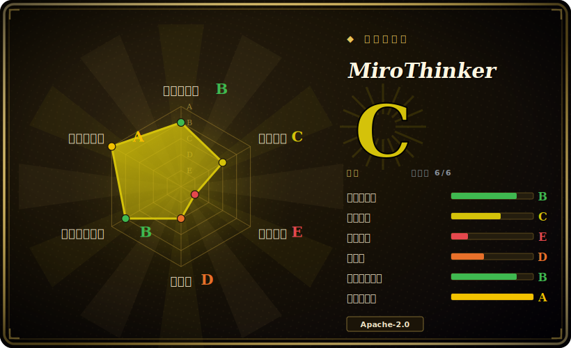

# MiroThinker

一个开源 deep-research agent：微调过的 LLM 加上一套 MCP 工具环境（网络搜索、抓取、代码执行），由 MiroFlow 框架编排，用来回答复杂的多步研究与预测问题。

## 何时使用

你是研究工具团队的 ML 工程师，想要一个自托管、开权重的“deep research”agent 答案——能上网浏览、读页面、跑代码、综合出多步答案，但你可以在自己的 GPU 上跑，而不必为每次查询给一个闭源 API 付费。你克隆 MiroThinker，把它某个微调模型（基于 Qwen，v1.7 规模 30B–235B）托管在 SGLang 或 vLLM 上，给工具层设好 API key（Serper 搜索、Jina 抓取、E2B 代码沙箱），选一个预置 agent 配置，端到端跑一个研究任务。因为 agent 的工具是以 MCP server 接线的、编排逻辑（上下文保留、每个任务最多数百次工具调用）放在 MiroFlow 框架里，你可以研究、修改或扩展 agent 循环，而不必把它当黑盒。它面向那些想*复现并在其上构建*一个有竞争力的开源 deep-research agent 的人——包括它报告的 BrowseComp/GAIA 基准成绩——而不只是调一个产品。

## 何时不用

- **你只想要一个能用的研究助手，而不是一套基础设施。** 这是你自托管的框架 + 模型权重，并接入了多个商业 API 依赖。如果你想要开箱即用的产品，托管的 deep-research 服务省事得多。
- **你拿不出像样的 GPU。** 30B–235B 模型需要 GPU 集群（通常多卡）外加一套服务栈（SGLang/vLLM）。没有这种硬件，它无法以完整能力运行。[推断]
- **你需要完全自包含 / 离线 / 不出网的 agent。** 完整功能依赖外部商业 API（Serper、Jina、E2B，以及部分预处理/基准用的 OpenAI）——数据会离开你的环境，且每次运行都产生费用。
- **你需要生产稳定性和 SLA。** 它是一个追踪基准的年轻（2025）研究项目；预期会有 churn、毛刺和可复现性注意事项，而非一个硬化的产品。[推断]
- **稳健的多模态或非英文至关重要。** README 提到文本-only 的 LLM 行为，部分多模态任务要用 GPT-4o 预处理，早期版本中文有限——请针对你的语言/模态核实当前版本的覆盖。[未验证]

## 横向对比

| 替代品 | 是否收录 | 我们的评价 | 取舍 |
|---|---|---|---|
| OpenAI / Gemini "Deep Research" | 未收录 | 当前页用于它的主场景；如果更看重“托管、开箱即用、质量强、无需自己跑 GPU”，再选 OpenAI / Gemini "Deep Research"。 | 托管、开箱即用、质量强、无需自己跑 GPU；但闭源、按用量付费、不能自托管或控制模型——与 MiroThinker 取舍相反。 |
| GPT-Researcher | 未收录 | 当前页用于它的主场景；如果更看重“轻量的开源研究 agent，编排一个冻结的 LLM API + 网络工具”，再选 GPT-Researcher。 | 轻量的开源研究 agent，编排一个冻结的 LLM API + 网络工具；跑起来便宜得多（无自托管权重），但没有自己的微调模型或基准调优框架。 |
| smolagents / LangGraph + 工具 | 未收录 | 当前页用于它的主场景；如果更看重“你在其上自行组装研究循环的通用 agent 框架”，再选 smolagents / LangGraph + 工具。 | 你在其上自行组装研究循环的通用 agent 框架；更灵活、模型无关，但研究管线和调优要你自己搭。 |
| Open Deep Research（HF） | 未收录 | 当前页用于它的主场景；如果更看重“在 API 模型上对 deep-research agent 的开源复现”，再选 Open Deep Research（HF）。 | 在 API 模型上对 deep-research agent 的开源复现；开源精神相近，但栈不同，且（通常）没有自托管的微调权重。 |

## 技术栈

- **语言：** Python（3.10+）。
- **编排：** **MiroFlow** agent 框架——管理 agent–环境循环、大上下文窗口，以及上下文保留策略（保留最近 K 条工具响应）。配置用 Hydra。
- **模型：** 基于 Qwen，经 SFT + DPO 微调；多种规模（v1.7：约 30B–235B）。用 **SGLang** 或 **vLLM** 服务。
- **工具：** 用于网络搜索、内容提取、代码执行、文档处理的 MCP server。
- **ML 依赖：** `transformers` 及常规 Python ML 生态。

## 依赖

- **模型：** 自托管的基于 Qwen 的权重（或兼容的 LLM 后端）——下载体量不小。
- **硬件：** GPU 集群（30B+ 通常多卡）；一套服务运行时（SGLang/vLLM）。
- **外部 API（完整功能所需）：** Serper（搜索）、Jina（抓取）、E2B（代码沙箱），外加一个 summary LLM 服务以及部分预处理/基准用的 OpenAI——经 `.env` 配置。每次运行都消耗 API 额度。
- **网络：** 需向这些服务出网；不是离线 agent。

## 运维难度

**高。** 这是本批里最吃力的部署：你要为一个大模型搭起 GPU 服务栈（SGLang/vLLM）、管理模型下载/落盘、接好几个第三方 API key，并调 agent 配置（上下文保留、工具调用预算）。要跑好它意味着自己掌握 GPU 容量、跨外部 API 监控成本，并接受一个快速演进研究代码库的可复现性注意事项。评测/基准复现还要另搭一套 harness。这是要运维的基础设施，不是拿来 import 的库。

## 健康度与可持续性

- **维护（2026-06）。** 最后 push 于 2026-04（最新提交约 2026-04）；v1.x 模型线显示持续迭代。**活跃**且**未归档**，但节奏与年轻代码库意味着 churn。[推断]
- **治理 / 背书。** 有组织背书（**MiroMindAI**，miromind.ai），多贡献者——bus factor 比单人仓库好，但它是一家公司的研究项目；寿命取决于这家公司的持续投入。[推断]
- **年龄与 Lindy 判断。** 2025-08 创建，**不到 1 年**——**尚无 Lindy**。一个很年轻的仓库上有高 star（约 8.3k）是热度/势能信号，而非耐久性证明；可持续性视为未经验证。[推断]
- **采用度。** 早期势头强（约 8.3k star、约 645 fork），由有竞争力的开源基准成绩（BrowseComp/GAIA）拉动；研究/评测之外的真实生产采用未经验证。[未验证]
- **风险标记。** Apache-2.0 代码（干净），但对外部 API 与 GPU 的重度依赖、年轻、单一公司主导，以及以基准为框架的叙事（数字随版本和 harness 变动）都是你下的赌注。[推断]

## 存疑（未验证）

- [未验证] 截至 2026-06 约 8.3k star / 约 645 fork；v1.7 模型线。计数和版本标签对时间敏感。
- [未验证] 报告的基准数字（BrowseComp 约 74–88、BrowseComp-ZH 约 75、GAIA 约 83、HLE-Text 约 43）是项目自报，且在 README 自身陈述与各版本间存在差异——此处未独立复现；请对照当前 model card 核实。
- [推断] GPU 集群 / 多卡需求与 30B–235B 规模是从 README 的模型尺寸和服务栈推断的，未实测。
- [未验证] Python 版本、Hydra 配置、transformers 用法以及确切的工具/API 清单是某一时间点从 README 读取的，可能随版本变动。
- [推断] “尚无 Lindy / 可持续性未经验证”直接源自 2025 年创建日期加单一公司背书。
