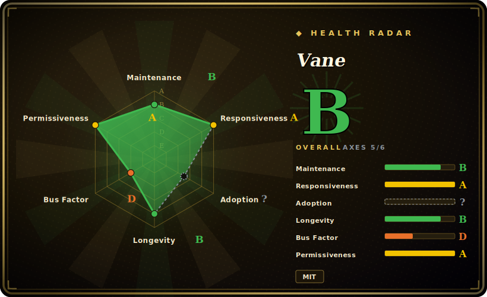

# Vane

A self-hosted, privacy-focused AI answering engine: SearxNG-backed web search + your choice of local or cloud LLM, returning cited answers — the successor/rebrand of Perplexica from the same author.

## When to use

You're a developer or a small team that wants a self-hosted "Perplexity-style" answer box you fully control — you type a question, it searches the live web, reads the top sources, and writes a cited answer instead of dumping ten blue links. Crucially, you don't want your queries leaving your machine or being tied to a single proprietary model: Vane runs as one Docker container, routes web search through your own SearxNG instance, and lets you point the LLM at local Ollama, an OpenAI-compatible endpoint, Claude, Gemini, or Groq. You pick a Speed / Balanced / Quality mode per query to trade latency for depth, scope sources to web vs. academic vs. discussions, and even upload a document to ask questions over it. The whole thing ships with a polished web UI, search history, and widgets — it's a product you deploy, not a library you wire up.

You're also a good fit if you previously ran Perplexica and want the maintained continuation: Vane is the same author's evolution of that project, so the mental model (SearxNG + RAG over results + an LLM that cites) carries over, with a refreshed UI, provider list, and the three-mode depth control on top.

## When NOT to use

- **You need a programmable research pipeline, not a chat app.** Vane is an end-user web product (Next.js UI + chat API). If you want to call deep-research from your own agent, embed it in a backend, or get structured JSON out, an SDK-first tool like [deep-research](deep-research.md) fits far better — Vane has no published "research-as-a-library" surface. [推断]
- **You can't or won't run SearxNG.** Web search depends on a working SearxNG instance with JSON output enabled; if you can't host one (or reach a public one reliably), the core loop breaks. This is real operational surface, not a config toggle.
- **You want true offline / fully-local "deep research."** Even with local Ollama models, Vane still reaches the live web via SearxNG; it is not designed for the air-gapped, local-corpus-only workflow that [local-deep-research](local-deep-research.md) targets.
- **You need exhaustive, long-horizon iterative research.** Vane's "Quality" mode is deeper than its Speed mode, but it's still an interactive answering engine tuned for a fast cited answer — not a long autonomous loop that fans out dozens of sub-queries and recursively drills down over minutes.
- **You need multi-user auth / SaaS hosting out of the box.** Authentication and accounts are on the stated roadmap, not shipped; today it's a single-tenant self-hosted app. [未验证] Treat any multi-tenant deployment as DIY.
- **You're allergic to a fast-moving single-maintainer rebrand.** Vane carries Perplexica's lineage and momentum, but it is effectively a recently-renamed project under primarily one author; API/UI churn and bus-factor risk apply.

## Comparison

| Alternative | In index | Our verdict | Tradeoff |
|---|---|---|---|
| [deep-research](deep-research.md) | ✅ | Use this page for its stated niche; choose deep-research when you need minimal TypeScript deep-research *engine/SDK* you call from code and tune (breadth/depth). | Minimal TypeScript deep-research *engine/SDK* you call from code and tune (breadth/depth); Vane is a full self-hosted UI product, not a library to embed. |
| [local-deep-research](local-deep-research.md) | ✅ | Use this page for its stated niche; choose local-deep-research when you need python, leans local-first and can research a local corpus offline. | Python, leans local-first and can research a local corpus offline; Vane always hits the live web via SearxNG and ships as a polished web app. |
| [Agent-Reach](agent-reach.md) | ✅ | Use this page for its stated niche; choose Agent-Reach when you need different niche (agent reach/outreach-style automation). | Different niche (agent reach/outreach-style automation); not a SearxNG answering engine. Compare only if you conflated the two. |
| Perplexica | 未收录 | Use this page for its stated niche; choose Perplexica when you need vane's direct predecessor by the same author. | Vane's direct predecessor by the same author; same SearxNG+RAG core. Choosing Vane = choosing the maintained continuation. |
| GPT Researcher | 未收录 | Use this page for its stated niche; choose GPT Researcher when you need python autonomous research agent that writes long reports. | Python autonomous research agent that writes long reports; more report-generation, less interactive cited-answer UX, no built-in chat product. |
| Morphic / Perplexity (hosted) | 未收录 | Use this page for its stated niche; choose Morphic / Perplexity (hosted) when you need hosted/proprietary answer engines. | Hosted/proprietary answer engines; no self-hosting or provider choice, opposite of Vane's privacy/self-host pitch. |

## Tech stack

- **Language:** TypeScript (~98%+ of the repo per GitHub language stats).
- **Framework:** Next.js (handles both UI and API routes — `/api/chat`, `/api/search`, `/api/providers`).
- **Search backend:** SearxNG (meta-search across many engines, queried for JSON results).
- **LLM integration:** pluggable providers — Ollama (local), OpenAI, Anthropic Claude, Google Gemini, Groq, and OpenAI-API-compatible servers (Lemonade also mentioned).
- **Retrieval:** RAG over fetched web results; embedding models used for semantic search over user-uploaded files.
- **Persistence:** local storage of chats/messages and uploaded files via a Docker volume; ORM is Drizzle. [推断] exact DB engine (SQLite vs. other) not explicitly confirmed in README.
- **Styling:** Tailwind CSS.

## Dependencies

- **Runtime:** Docker (recommended) — single image `itzcrazykns1337/vane:latest`, exposed on port 3000 with a persistent `-v vane-data:/home/vane/data` volume.
- **Non-Docker:** Node.js + npm (`npm i` → `npm run build` → `npm run start`), plus a self-installed SearxNG with JSON output enabled.
- **External service:** a reachable SearxNG instance is effectively required for web search.
- **Models:** at least one LLM provider configured — a local Ollama install, or an API key for OpenAI / Claude / Gemini / Groq / an OpenAI-compatible endpoint.
- **One-click hosts:** Sealos, RepoCloud, ClawCloud, Hostinger are listed as deploy targets.

## Ops difficulty

**Low-to-medium.** The Docker happy path is genuinely one command, and pointing it at a cloud LLM API key gets you a working answer engine in minutes. Difficulty rises to **medium** when you self-host the full stack: you must stand up and maintain a SearxNG instance (engines get rate-limited/blocked, JSON output must be enabled), and if you go fully local you also run and resource Ollama models (RAM/VRAM, model pulls). Upgrades follow a single fast-moving image, so pin versions if you need stability, and back up the data volume since search history/chats live there.

## Health & viability

- **Maintenance (2026-06):** **active** — last release v1.12.2 ~2026-04, pushed ~2026-04, a mature double-digit-minor versioned line. Steady, not coasting. [推断]
- **Governance & bus factor:** `User`-owned (`ItzCrazyKns`) with ~35k stars — a **bus-factor flag**: very high visibility riding on essentially **one maintainer**. This is a recently-renamed project, so API/UI churn under a single owner is a live risk. [推断]
- **Age & Lindy (~2yr, counting Perplexica lineage from 2024-04):** the *codebase* carries Perplexica's ~2yr history and momentum even though "Vane" is a fresh name — that lineage is the Lindy signal here, not the rebrand date. Old-enough-and-active leans favorable, tempered by the solo-maintainer flag. [推断]
- **Risk flags:** multi-user auth is roadmap-not-shipped (treat as single-tenant); a fast-moving single-image release means pin versions and back up the data volume. [未验证]

## Caveats (unverified)

- [未验证] Latest release v1.12.2 (published ~2026-04-10) and `pushedAt` ~2026-04-11; star count ~35.5k as of 2026-06 — GitHub stars are unreliable and date-sensitive, treat as indicative only.
- [未验证] Exact provider list (esp. "Lemonade" and the full set of OpenAI-compatible servers) and one-click host list come from the README; verify against the current repo before relying on a specific provider.
- [推断] The persistence layer uses Drizzle ORM, but the README does not explicitly name the underlying database engine (likely SQLite given the single-file data volume, unconfirmed).
- [未验证] Authentication / multi-user support is described as roadmap, not shipped; current deployments should be treated as single-tenant.
- [推断] Vane is the rebrand/successor of Perplexica by the same author (ItzCrazyKns); the README does not state the rename history in plain words, inferred from shared author, topics (`perplexica`), and architecture.
- [推断] "Quality mode does deeper research" vs Speed/Balanced is the project's framing of a latency/depth tradeoff; the precise number of sub-queries or iterations per mode is not documented.
