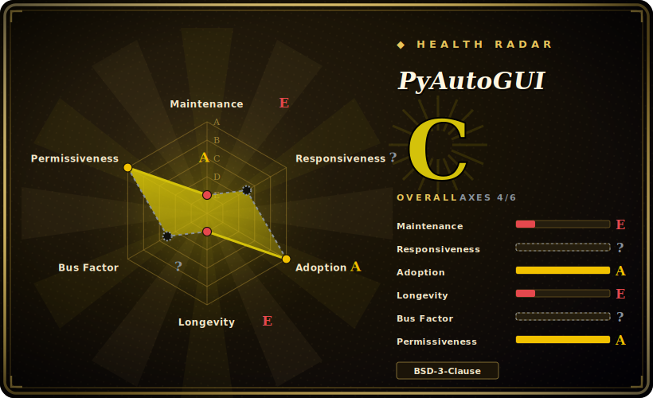

# PyAutoGUI

A cross-platform Python module that programmatically drives the mouse and keyboard and reads the screen — move/click, type/hotkey, screenshot, and locate-on-screen image matching, all from a tiny synchronous API.

## When to use

You're writing a quick automation in Python to drive a desktop app that has no API, no CLI, and no scripting hooks — a legacy ERP client, a vendor tool, a game, or some installer that only speaks GUI. You don't want to learn a heavyweight RPA platform or a per-OS accessibility framework; you just want to say "move to here, click, type this, press Enter," and have it work the same on Windows, macOS, and Linux. You `pip install pyautogui`, and in a dozen lines you've got `pyautogui.click(200, 220)`, `pyautogui.write('hello', interval=0.25)`, and `pyautogui.hotkey('ctrl', 'c')` running. When you need to find a button whose coordinates you don't know, `locateOnScreen('button.png')` does template matching against a screenshot and hands you the box to click.

It's also the natural reach when you want a *visible*, human-mimicking robot — keystrokes go to whatever window has focus, exactly as if a person typed them — for smoke-testing a UI, scripting repetitive data entry, or building a demo. The `pytweening` easing functions even let you move the cursor in human-looking arcs, and the built-in `alert`/`confirm`/`prompt` message boxes let a script pause for input.

## When NOT to use

- **Headless servers / CI without a display.** PyAutoGUI drives a real screen and focused window. No display server (X11/Wayland/Win desktop session) means no automation; it is not a headless tool.
- **Robust, unattended production RPA.** Coordinate- and pixel-matching automation is brittle: a theme change, DPI/scaling difference, resolution change, or a moved window breaks it silently. For durable enterprise RPA you want accessibility-tree drivers (UI Automation, AT-SPI) or a commercial RPA suite, not screen scraping.
- **Web automation.** For browsers, Selenium/Playwright/Puppeteer drive the DOM directly — far more reliable than clicking pixels on a rendered page.
- **Multi-monitor / background work.** It targets the primary monitor and the foreground window; it takes over the real cursor and keyboard, so the machine can't be used for anything else while a script runs. Second-monitor behavior is OS-dependent and unreliable per the docs.
- **You need element-level introspection.** It cannot read widget text, enumerate controls, or query state — it only sees pixels. Pair it with `pywinauto` (Windows) or platform accessibility APIs if you need that.
- **Maintenance-sensitive bets.** Development has largely coasted (last push 2024-08; see Health) — fine for scripts, weigh it for anything you must maintain against new OS releases for years.

## Comparison

| Alternative | In index | Tradeoff |
|---|---|---|
| pywinauto | 未收录 | Windows-only, drives the UI Automation / Win32 accessibility tree — element-aware and far more robust than pixels, but not cross-platform and a steeper API. |
| AutoHotkey | 未收录 | Windows-only scripting language purpose-built for hotkeys/macros and GUI automation; very mature, but its own language and no native cross-platform/Python story. |
| SikuliX | 未收录 | Java-based image-recognition automation (OCR + template match); cross-platform like PyAutoGUI but heavier (JVM) and IDE-centric. |
| Selenium / Playwright | 未收录 | DOM-level browser automation — the right tool when the target is a web page, not a native desktop app. |
| pynput | 未收录 | Lower-level cross-platform input control/monitoring (incl. global hotkey listeners); no screenshot/image-locate, smaller scope than PyAutoGUI. |

## Tech stack

- **Language:** Python (supports Python 3; legacy Python 2 mentioned in docs).
- **Per-OS backends:** Windows via Win32 (no extra deps); macOS via `pyobjc-core`/`pyobjc` (Quartz); Linux via `python3-xlib` (X11).
- **Companion libraries (same author):** `pyscreeze` (screenshot + `locateOnScreen` image matching), `pymsgbox` (alert/confirm/prompt dialogs), `pytweening` (easing functions), `mouseinfo`.
- **Imaging:** Pillow for screenshot and image-related features; OpenCV optional to speed up/relax image matching. [未验证]

## Dependencies

- **A graphical session is mandatory** — a real display and a focused window; this is the hard runtime requirement.
- **Linux:** `python3-xlib` (X11). Wayland support is limited/indirect. [未验证]
- **macOS:** `pyobjc-core` then `pyobjc` (install order matters per README); the OS will prompt for Accessibility permission.
- **Windows:** none beyond the wheel.
- **Pillow** for screenshots; on Linux you may need system image libraries for PNG/JPEG support.

## Ops difficulty

**Low to set up, medium to keep working.** Installation is `pip install pyautogui` plus the per-OS imaging/permission setup. There is no service, no datastore, nothing to deploy — it's a library you call. The real cost is *maintenance of the scripts*: because the automation keys off coordinates and pixels, it is sensitive to resolution, DPI/scaling, OS theme, and window placement, so scripts drift and need re-tuning. Running it also means dedicating a logged-in desktop session to the robot (or a VM/virtual display), since it commandeers the real cursor and keyboard. Build a small abstraction layer (named regions, `locateOnScreen` with confidence, retries) if you want any resilience.

## Health & viability

- **Maintenance (2026-06).** Last push 2024-08 (≈2 years stale at time of writing); the project reads as **stable but coasting**, not abandoned — the API is mature and the core problem is solved, but new development is minimal. Not archived. ~583 open issues is consistent with a popular library outpacing a thin maintenance budget. [推断]
- **Governance / bus factor.** `User`-owned (Al Sweigart) and effectively single-maintainer (the author is by far the top contributor across PyAutoGUI and its `pyscreeze`/`pymsgbox`/`pytweening` siblings). High stars on a one-person project is a **bus-factor flag** — direction and longevity depend on one person's continued interest. [推断]
- **Age × Lindy.** ~12 years old (created 2014-07) and still widely installed ⇒ a **strong Lindy** prior on the *library's* survival and API stability, even though active development has slowed. Old-and-coasting beats young-and-hyped, but verify it still works against your current OS. [推断]
- **Adoption.** Very high — a de-facto standard for simple desktop automation in Python (large stars/forks, ubiquitous in tutorials and scripts). Permissively BSD-3-Clause, no relicense history found. [推断]
- **Risk flags.** Coasting maintenance + single maintainer + OS-evolution sensitivity (Wayland, macOS permission/security changes) are the real risks; no CVE or relicense concern surfaced. [未验证]

## Caveats (unverified)

- [未验证] ~12.6k stars / 583 open issues / last push 2024-08 as of 2026-06 — star and issue counts are volatile and date-sensitive; re-check before relying on them.
- [未验证] OpenCV as an optional accelerator/relaxer for `locateOnScreen` is from the docs/ecosystem, not confirmed against the current code here.
- [未验证] Wayland support on modern Linux is limited/indirect; behavior depends on compositor and is not verified here.
- [推断] "Stable but coasting" is inferred from push recency + a mature single-maintainer library, not from a stated project status.
- [推断] Single-maintainer / bus-factor assessment is inferred from the contributor list, not a governance document.
